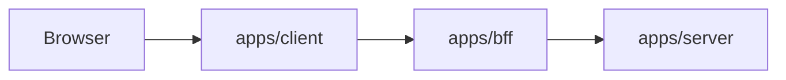

# Architecture

## 三层结构

项目按物理目录直接分三层，不抽共享代码包。

### 1. `apps/client`

- Next.js App Router 前端
- 放页面、布局、组件、样式、前端业务代码
- 当前目录中：
  - `app/`
  - `src/components/`
  - `src/features/`
  - `src/lib/`

### 2. `apps/bff`

- 中间层
- 后续负责：
  - 登录鉴权
  - 请求转发
  - header 注入
  - 响应解包
  - 错误转换

### 3. `apps/server`

- 后端层或 mock backend
- 后续负责：
  - 商品数据
  - 用户数据
  - 上传能力
  - 统一返回结构

## 请求链路

## 原则

- 目录按层划分，不按共享包划分
- 每层组件、工具、业务代码都放在自己的目录下
- 默认不做跨层共享代码
