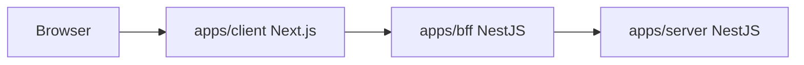
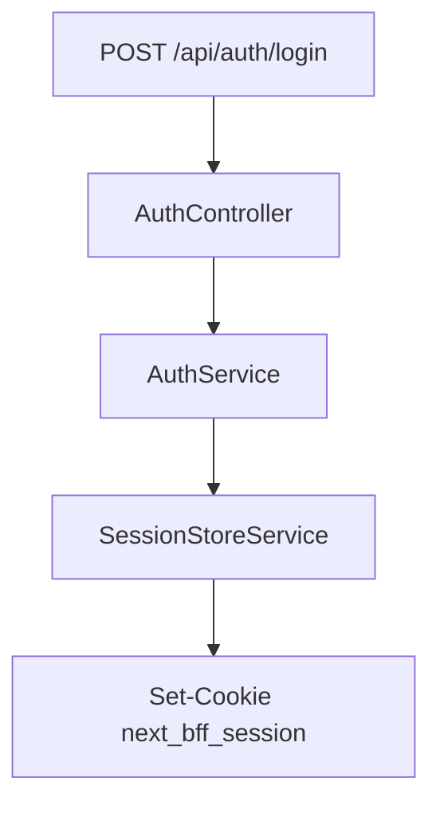

# Architecture

## 三层结构

项目按物理目录直接分三层，不抽共享代码包。

### 1. `apps/client`

- Next.js App Router 前端
- 放页面、布局、组件、样式、前端业务代码
- 当前目录中：
  - `app/`
  - `src/components/`
  - `src/features/`
  - `src/lib/`

### 2. `apps/bff`

- 基于 NestJS 的中间层
- 当前职责：
  - 登录鉴权
  - cookie 会话管理
  - `get-current-user`
  - `require-login`
  - 对前端暴露 `/api/auth/*`
- 当前目录中：
  - `src/main.ts`
  - `src/app.module.ts`
  - `src/auth/**`

### 3. `apps/server`

- 基于 NestJS 的 mock backend
- 当前职责：
  - 提供 mock backend 骨架
  - 对 BFF 暴露模拟接口
- 当前目录中：
  - `src/main.ts`
  - `src/app.module.ts`
  - `src/mock-backend/**`

## 请求链路

## 当前认证链路

## 原则

- 目录按层划分，不按共享包划分
- 每层组件、工具、业务代码都放在自己的目录下
- 默认不做跨层共享代码
- `apps/bff` 和 `apps/server` 统一使用 NestJS 组织模块、控制器和服务
