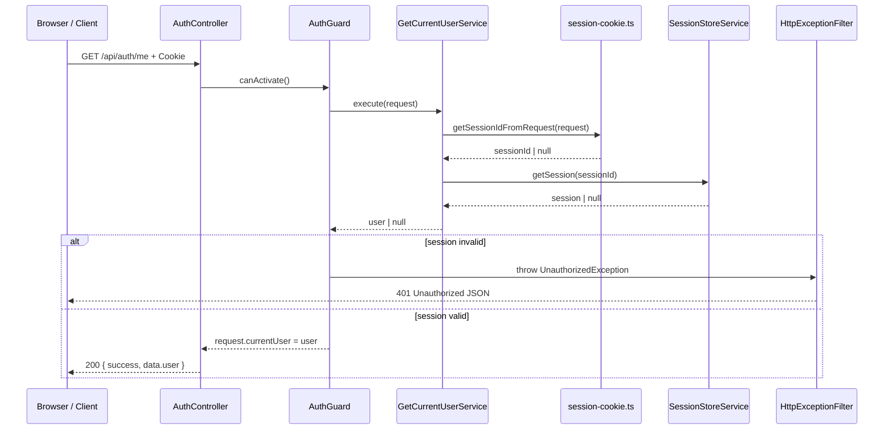
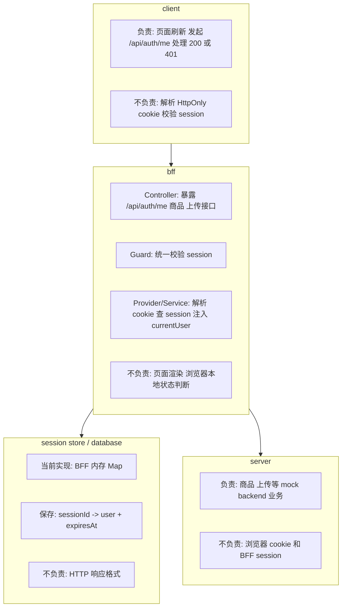
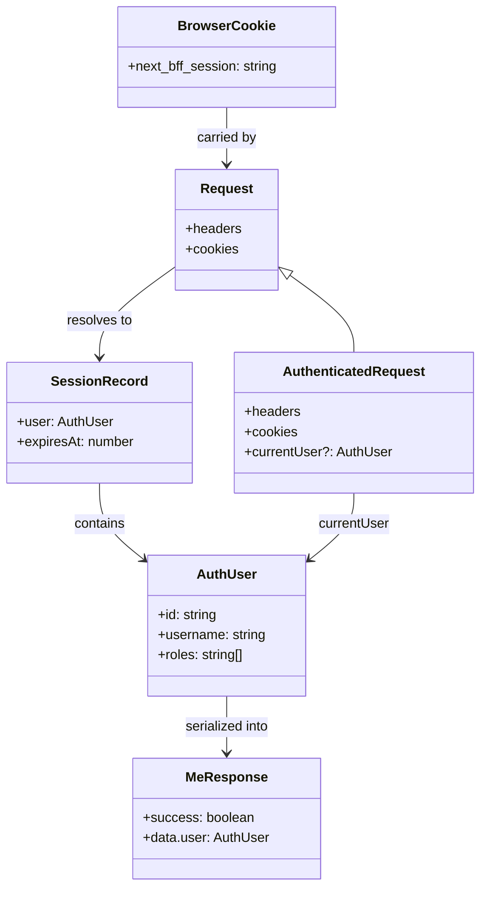
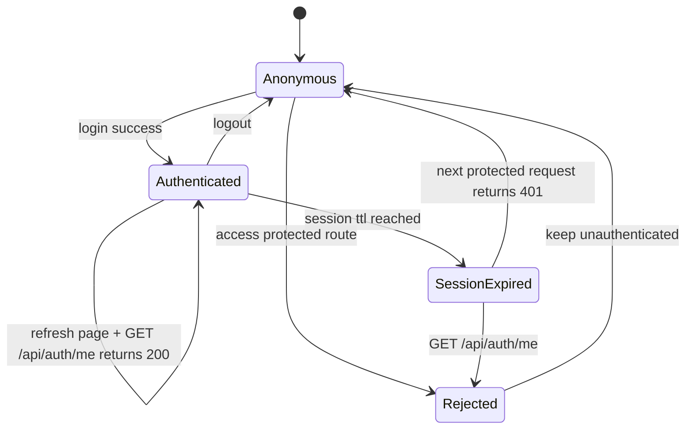

# F1002 BFF Current User Guard Scene

这份文档整理本次“用户刷新页面后系统能识别当前用户”的变更。  
重点不是只记录新增了哪些 API，而是把这个场景里的请求流、系统边界、数据结构、状态变化、规则兜底，以及实际落下来的 NestJS 能力梳理清楚。

---

## 1. 场景目标

用户在做什么：

- 用户已经登录过一次，浏览器里已有 `next_bff_session` cookie
- 用户刷新页面，或者前端重新请求当前用户信息
- 用户访问商品、上传这类需要登录的 BFF 接口

系统要完成什么：

- 前端可以通过 `GET /api/auth/me` 判断当前请求是否仍然登录
- 未登录或 session 失效时返回统一 `401 Unauthorized`
- 已登录时返回当前用户的 `id`、`username`、`roles`
- 商品、上传等多个受保护接口复用同一套登录判断，而不是每个接口自己解析 cookie

---

## 2. 请求流转图

### 2.1 获取当前用户流程图

```mermaid
flowchart TD
  A[Browser Refresh or App Boot] --> B[GET /api/auth/me]
  B --> C[AuthController.me]
  C --> D[AuthGuard]
  D --> E[GetCurrentUserService]
  E --> F[session-cookie.ts parse next_bff_session]
  F --> G[SessionStoreService.getSession]
  G --> H{session valid?}
  H -->|no| I[throw UnauthorizedException]
  H -->|yes| J[request.currentUser = user]
  J --> K[@CurrentUser()]
  K --> L[return success true + user]
  I --> M[HttpExceptionFilter]
  M --> N[401 JSON Response]
```

### 2.2 获取当前用户时序图



### 2.3 受保护业务接口流程图

```mermaid
flowchart TD
  A[Client Request] --> B{Which protected route?}

  B --> C[GET /api/commodity/list]
  B --> D[POST /api/commodity/create]
  B --> E[POST /api/upload]

  C --> F[CommodityController.listCommodities]
  D --> G[CommodityController.createCommodity]
  E --> H[UploadController.uploadFile]

  F --> I[AuthGuard]
  G --> I
  H --> I

  I --> J{session valid?}
  J -->|no| K[401 Unauthorized]
  J -->|yes| L[@CurrentUser() inject user]

  L --> M{Which service?}
  M --> N[CommodityService]
  M --> O[UploadService]

  N --> P[ApiClientService]
  O --> P
  P --> Q[apps/server mock backend]
  Q --> R[response back to client]
```

---

## 3. 系统分层图



---

## 4. 输入 / 输出

### 4.1 输入

页面输入：

- 页面刷新后，前端重新请求 `GET /api/auth/me`
- 浏览器自动携带 `next_bff_session` cookie

HTTP 请求结构：

```http
GET /api/auth/me
Cookie: next_bff_session=<sessionId>
```

受保护商品接口与上传接口的共同输入：

- 原始业务参数
- 浏览器自动携带的 session cookie

这个场景里没有新增请求 DTO。  
这里的核心输入不是 body，而是“当前请求是否附带有效 session”。

### 4.2 输出

成功响应结构：

```json
{
  "success": true,
  "data": {
    "user": {
      "id": "u_admin_001",
      "username": "admin",
      "roles": ["admin"]
    }
  }
}
```

失败响应结构：

```json
{
  "success": false,
  "message": "Unauthorized",
  "path": "/api/auth/me",
  "statusCode": 401,
  "timestamp": "2026-04-25T00:00:00.000Z"
}
```

页面最终状态变化：

- `200`：前端可恢复当前登录用户状态
- `401`：前端应视为未登录，后续可跳转登录页或清空本地登录态

---

## 5. 数据结构图



本次场景里实际出现的核心结构：

### 5.1 Session Store 结构

```ts
type SessionRecord = {
  user: AuthUser;
  expiresAt: number;
};
```

### 5.2 当前用户结构

```ts
type AuthUser = {
  id: string;
  username: string;
  roles: string[];
};
```

### 5.3 受保护请求结构

```ts
type AuthenticatedRequest = Request & {
  currentUser?: AuthUser;
};
```

这里最重要的边界是：

- cookie 不是用户对象
- session 不是 HTTP 响应结构
- `request.currentUser` 是 Guard 校验后的请求上下文
- controller 返回的是明确的 response shape，不直接暴露 session 结构

---

## 6. 状态变化图



这个场景里真正关心的状态不是页面按钮状态，而是“请求对应的登录态”：

- 初始状态：未登录，或浏览器没有有效 session
- 成功状态：存在有效 session，可以识别当前用户
- 失败状态：cookie 缺失、session 不存在、session 过期，统一返回 `401`
- 非法状态：未通过认证却直接进入受保护业务逻辑，或过期 session 仍返回 `200`

---

## 7. 规则兜底

参数校验在哪层：

- 这个场景的关键输入是 cookie，不是 body DTO
- cookie 解析统一放在 `session-cookie.ts`
- session 查询统一放在 `GetCurrentUserService`

权限校验在哪层：

- `AuthGuard` 负责判断当前请求是否有有效 session
- 未登录直接抛 `UnauthorizedException`
- 受保护接口通过 `@UseGuards(AuthGuard)` 复用这套校验

业务规则在哪层：

- `CommodityService`、`UploadService` 不再自己查 cookie
- 它们只消费已经校验好的 `user`
- BFF 统一把 `user.id` 转成转发给 backend 的 `x-user-id`

错误处理在哪层：

- `AuthGuard` 抛出的 `UnauthorizedException` 进入全局 `HttpExceptionFilter`
- 前端拿到统一错误结构，而不是各接口自己拼 `401`

审计记录在哪层：

- 当前项目还没有真正落数据库审计
- 但这次已经把“操作者是谁”稳定成 `@CurrentUser() -> user.id`
- 后续创建商品、上传文件、写审计字段都可以基于同一套用户注入机制扩展

本次必须由后端兜底的规则：

- 浏览器是否真的已登录，不能靠前端自己判断
- 受保护接口必须统一拒绝未登录请求
- controller 不能直接手写 cookie 解析，否则规则会分散

---

## 8. NestJS 能力映射

### 8.1 `@Module`

使用位置：

- [`AuthModule`](/Users/liuxing/Desktop/Space/beike-simulation/next-bff/apps/bff/src/auth/auth.module.ts)

解决的问题：

- 把 `AuthGuard`、`GetCurrentUserService`、`AuthService`、`SessionStoreService` 组织在同一能力边界内
- 对外导出可复用的登录校验能力

### 8.2 `@Controller` + 路由装饰器

使用位置：

- [`AuthController.me()`](/Users/liuxing/Desktop/Space/beike-simulation/next-bff/apps/bff/src/auth/auth.controller.ts:39)
- [`CommodityController`](/Users/liuxing/Desktop/Space/beike-simulation/next-bff/apps/bff/src/commodity/commodity.controller.ts:9)
- [`UploadController`](/Users/liuxing/Desktop/Space/beike-simulation/next-bff/apps/bff/src/upload/upload.controller.ts:13)

解决的问题：

- 提供明确的 `/api/auth/me` 和受保护业务接口入口
- 把 HTTP 请求接收和响应返回保留在 controller 层

### 8.3 `Guard`

使用位置：

- [`AuthGuard`](/Users/liuxing/Desktop/Space/beike-simulation/next-bff/apps/bff/src/auth/auth.guard.ts)

解决的问题：

- 在进入 controller handler 之前统一完成登录校验
- 避免每个业务 service 重复做“是否登录”的判断
- 让商品、上传、后续更多接口复用同一套认证门禁

### 8.4 自定义参数装饰器

使用位置：

- [`CurrentUser`](/Users/liuxing/Desktop/Space/beike-simulation/next-bff/apps/bff/src/auth/current-user.decorator.ts)

解决的问题：

- 把“如何从 request 取当前用户”从 controller 参数列表里抽出来
- 让 handler 直接拿到 `user`，而不是手动解析 request

### 8.5 `@Injectable` + Provider / DI

使用位置：

- [`GetCurrentUserService`](/Users/liuxing/Desktop/Space/beike-simulation/next-bff/apps/bff/src/auth/get-current-user.ts)
- [`SessionStoreService`](/Users/liuxing/Desktop/Space/beike-simulation/next-bff/apps/bff/src/auth/session-store.service.ts)

解决的问题：

- 把 cookie -> session -> user 的解析逻辑放到 provider
- 避免 controller 直接依赖底层 session 细节

### 8.6 Service 分层

使用位置：

- [`CommodityService`](/Users/liuxing/Desktop/Space/beike-simulation/next-bff/apps/bff/src/commodity/commodity.service.ts)
- [`UploadService`](/Users/liuxing/Desktop/Space/beike-simulation/next-bff/apps/bff/src/upload/upload.service.ts)

解决的问题：

- 业务 service 只处理已经认证过的用户和业务参数
- service 不再承担“解析 cookie / 判断是否登录”的基础认证职责

### 8.7 `UnauthorizedException` + 全局 `ExceptionFilter`

使用位置：

- [`AuthGuard`](/Users/liuxing/Desktop/Space/beike-simulation/next-bff/apps/bff/src/auth/auth.guard.ts:13)
- [`HttpExceptionFilter`](/Users/liuxing/Desktop/Space/beike-simulation/next-bff/apps/bff/src/common/filters/http-exception.filter.ts)

解决的问题：

- 未登录访问 `/api/auth/me` 和其他受保护接口时，都返回统一 `401`
- 保持错误结构稳定，减少前端分支复杂度

---

## 9. 本次变更对应的代码落点

- 当前用户接口改为 Guard + 装饰器模式：
  [`auth.controller.ts`](/Users/liuxing/Desktop/Space/beike-simulation/next-bff/apps/bff/src/auth/auth.controller.ts)
- 新增统一登录校验：
  [`auth.guard.ts`](/Users/liuxing/Desktop/Space/beike-simulation/next-bff/apps/bff/src/auth/auth.guard.ts)
- 新增当前用户参数装饰器：
  [`current-user.decorator.ts`](/Users/liuxing/Desktop/Space/beike-simulation/next-bff/apps/bff/src/auth/current-user.decorator.ts)
- 新增认证请求类型：
  [`auth-request.ts`](/Users/liuxing/Desktop/Space/beike-simulation/next-bff/apps/bff/src/auth/auth-request.ts)
- 商品接口复用同一 Guard：
  [`commodity.controller.ts`](/Users/liuxing/Desktop/Space/beike-simulation/next-bff/apps/bff/src/commodity/commodity.controller.ts)
- 上传接口复用同一 Guard：
  [`upload.controller.ts`](/Users/liuxing/Desktop/Space/beike-simulation/next-bff/apps/bff/src/upload/upload.controller.ts)
- 用户结构统一为 `id`、`username`、`roles`：
  [`mock-users.ts`](/Users/liuxing/Desktop/Space/beike-simulation/next-bff/apps/bff/src/auth/mock-users.ts)

---

## 10. 一句话总结

这次变更真正建立起来的不是“多了一个 `/api/auth/me` 接口”，而是：  
`Guard 统一做登录门禁，Provider 负责解析当前用户，@CurrentUser() 负责把用户注入 handler，多个受保护接口复用同一套认证边界。`
