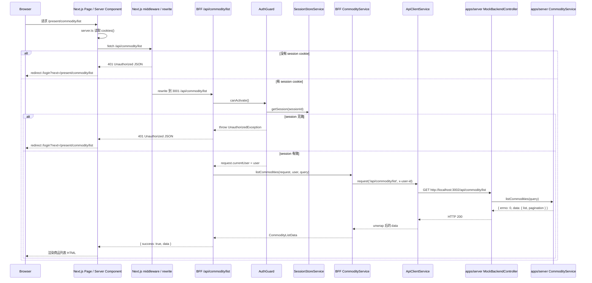
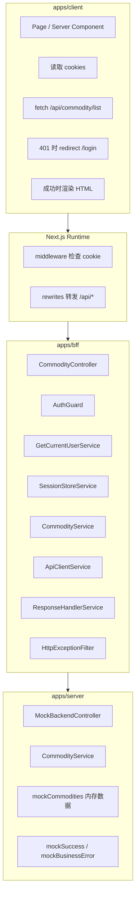
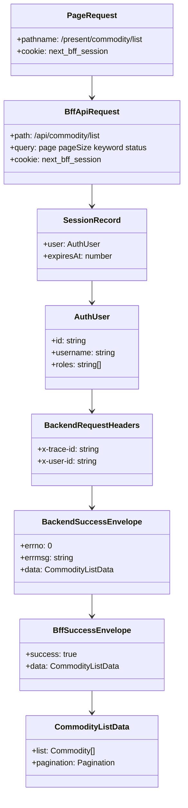
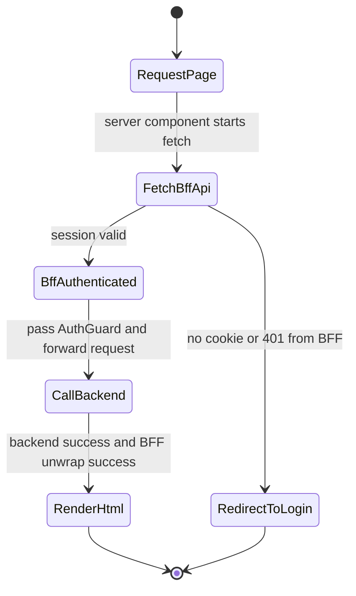

# F1003 BFF URL Full Flow

这份文档说明当前系统里，一个 BFF URL 从收到请求到最终返回数据的完整路径。  
这里选用当前最完整的真实链路 `GET /api/commodity/list` 作为例子，因为它会经过：

- 浏览器页面请求
- Next.js Server Component
- Next.js middleware / rewrite
- NestJS BFF
- BFF 认证与转发
- apps/server mock backend
- BFF 响应解包
- Next.js 渲染返回浏览器

---

## 1. 场景目标

用户在做什么：

- 用户访问商品列表页 `/present/commodity/list`
- 页面首屏需要服务端拿到商品列表数据

系统要完成什么：

- 在 Next.js 服务端拉取 `/api/commodity/list`
- 通过 BFF 统一做登录校验
- 通过 BFF 把请求转发到 mock backend
- 把 backend 返回的数据解包成前端可直接使用的结构
- 最终渲染成 HTML 返回给浏览器

---

## 2. 请求流转图

### 2.1 整体流程图

```mermaid
flowchart TD
  A[Browser 打开 /present/commodity/list] --> B[Next.js Page / Server Component]
  B --> C[apps/client/src/features/commodity/server.ts]
  C --> D[fetch http://127.0.0.1:3000/api/commodity/list]
  D --> E[Next.js middleware]
  E --> F{是否有 next_bff_session cookie}

  F -->|否| G[NextResponse 401 JSON]
  G --> H[client server.ts 检测 401]
  H --> I[redirect /login?next=/present/commodity/list]

  F -->|是| J[Next.js rewrite]
  J --> K[转发到 http://localhost:3001/api/commodity/list]
  K --> L[BFF CommodityController]
  L --> M[AuthGuard]
  M --> N[GetCurrentUserService]
  N --> O[session-cookie.ts 解析 cookie]
  O --> P[SessionStoreService.getSession]
  P --> Q{session 是否有效}

  Q -->|否| R[UnauthorizedException]
  R --> S[HttpExceptionFilter]
  S --> T[401 JSON 返回给 client]

  Q -->|是| U[@CurrentUser() 注入 user]
  U --> V[CommodityService.listCommodities]
  V --> W[构造 backendPath 和 x-user-id]
  W --> X[ApiClientService.request]
  X --> Y[RequestHeadersService 构造 x-trace-id / x-user-id]
  Y --> Z[fetch http://localhost:3002/api/commodity/list]

  Z --> A1[apps/server MockBackendController]
  A1 --> B1[apps/server CommodityService.listCommodities]
  B1 --> C1[内存 mockCommodities 过滤 / 分页]
  C1 --> D1[mockSuccess 返回 errno 结构]
  D1 --> E1[server HTTP Response]
  E1 --> F1[BFF ResponseHandlerService.handleFetchResponse]
  F1 --> G1[unwrap errno = 0 的 data]
  G1 --> H1[BFF Controller 返回 success envelope]
  H1 --> I1[Next.js /api 响应]
  I1 --> J1[client server.ts readApiResponse]
  J1 --> K1[Server Component 拿到 list / pagination]
  K1 --> L1[HTML 渲染回浏览器]
```

### 2.2 时序图



---

## 3. 系统分层图



---

## 4. 输入 / 输出

### 4.1 输入

浏览器页面请求：

```http
GET /present/commodity/list
Cookie: next_bff_session=<sessionId>
```

Next.js 服务端取数请求：

```http
GET /api/commodity/list?page=1&pageSize=10
Cookie: next_bff_session=<sessionId>
```

BFF 转发到 backend 的请求：

```http
GET /api/commodity/list?page=1&pageSize=10
x-trace-id: <uuid>
x-user-id: u_admin_001
```

### 4.2 输出

apps/server 返回给 BFF 的结构：

```json
{
  "errno": 0,
  "errmsg": "",
  "data": {
    "list": [],
    "pagination": {
      "page": 1,
      "pageSize": 10,
      "total": 3
    }
  }
}
```

BFF 返回给 client 的结构：

```json
{
  "success": true,
  "data": {
    "list": [],
    "pagination": {
      "page": 1,
      "pageSize": 10,
      "total": 3
    }
  }
}
```

最终返回给浏览器的不是 JSON，而是带商品列表数据的 HTML。

---

## 5. 数据结构图



---

## 6. 状态变化图



---

## 7. 规则兜底

- 页面是否能进入受保护数据链路，先由 Next.js middleware 按 cookie 做第一层拦截
- BFF 是否真正承认这个请求已登录，必须由 `AuthGuard + SessionStoreService` 再做一次后端兜底
- BFF 转发给 backend 时，不直接信任前端传来的用户身份，而是自己注入 `x-user-id`
- backend 返回的是 mock envelope，BFF 负责解包并决定如何转成前端能消费的结构
- 如果 BFF 返回 `401`，client server.ts 统一跳回 `/login?next=...`

---

## 8. NestJS 能力映射

### 8.1 Controller

- BFF 的 [`CommodityController`](/Users/liuxing/Desktop/Space/beike-simulation/next-bff/apps/bff/src/commodity/commodity.controller.ts)
- server 的 [`MockBackendController`](/Users/liuxing/Desktop/Space/beike-simulation/next-bff/apps/server/src/mock-backend/mock-backend.controller.ts)

作用：

- 提供明确 HTTP 入口
- 接住 query / path / body
- 负责把 service 结果变成 HTTP 响应

### 8.2 Guard

- BFF 的 [`AuthGuard`](/Users/liuxing/Desktop/Space/beike-simulation/next-bff/apps/bff/src/auth/auth.guard.ts)

作用：

- 在进入商品 handler 前统一做登录态校验
- 拒绝无效 session
- 把当前用户挂到 request 上

### 8.3 Provider / Service

- [`GetCurrentUserService`](/Users/liuxing/Desktop/Space/beike-simulation/next-bff/apps/bff/src/auth/get-current-user.ts)
- [`SessionStoreService`](/Users/liuxing/Desktop/Space/beike-simulation/next-bff/apps/bff/src/auth/session-store.service.ts)
- [`CommodityService`](/Users/liuxing/Desktop/Space/beike-simulation/next-bff/apps/bff/src/commodity/commodity.service.ts)
- [`ApiClientService`](/Users/liuxing/Desktop/Space/beike-simulation/next-bff/apps/bff/src/bff/api-client.service.ts)
- [`ResponseHandlerService`](/Users/liuxing/Desktop/Space/beike-simulation/next-bff/apps/bff/src/bff/response-handler.service.ts)

作用：

- 解析当前用户
- 管理 session
- 组织 BFF 业务逻辑
- 转发请求到 backend
- 解包 backend 响应

### 8.4 Filter

- [`HttpExceptionFilter`](/Users/liuxing/Desktop/Space/beike-simulation/next-bff/apps/bff/src/common/filters/http-exception.filter.ts)

作用：

- 把 BFF 里的异常统一转成前端可预测的错误结构

---

## 9. 一句话总结

当前系统里，一条完整的 BFF 数据链路是：

`Browser -> Next.js Page / Server Component -> Next.js middleware / rewrite -> NestJS BFF Controller -> AuthGuard -> BFF Service -> ApiClientService -> apps/server mock backend -> BFF 解包响应 -> Next.js 渲染 -> Browser`
