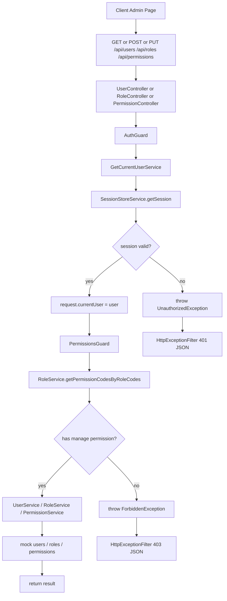
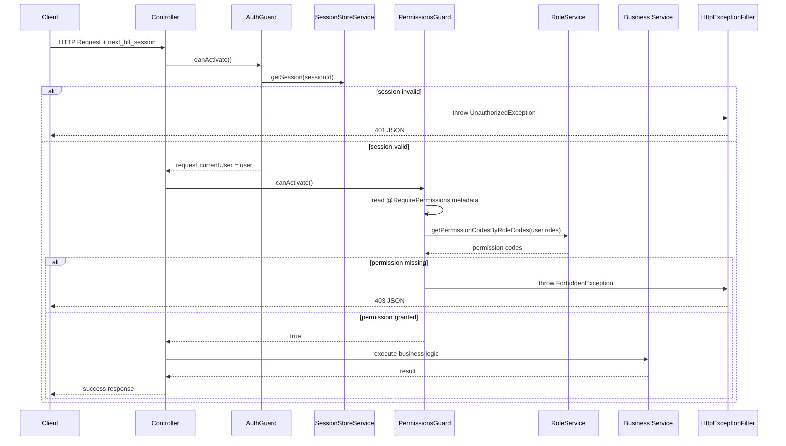
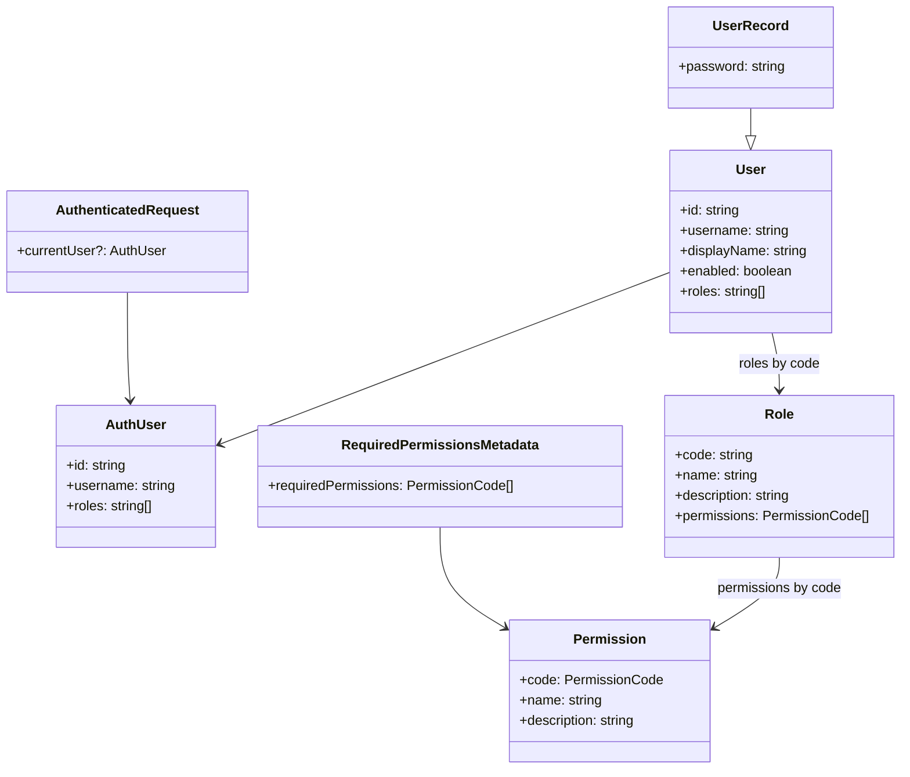
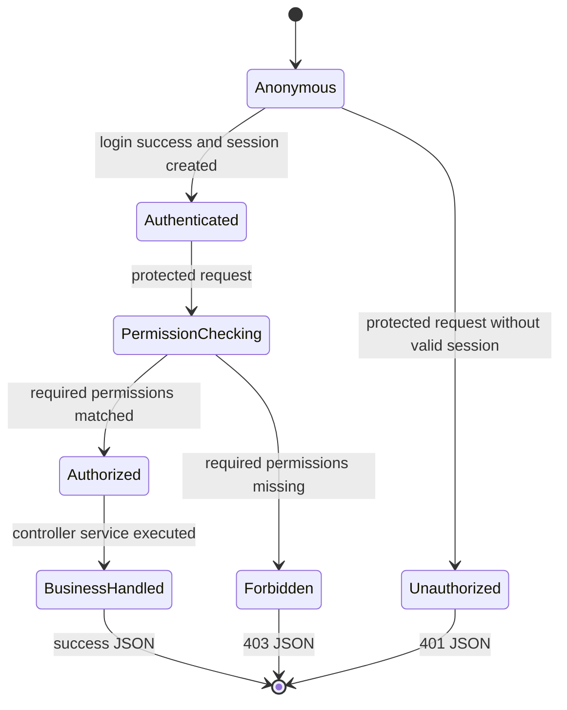
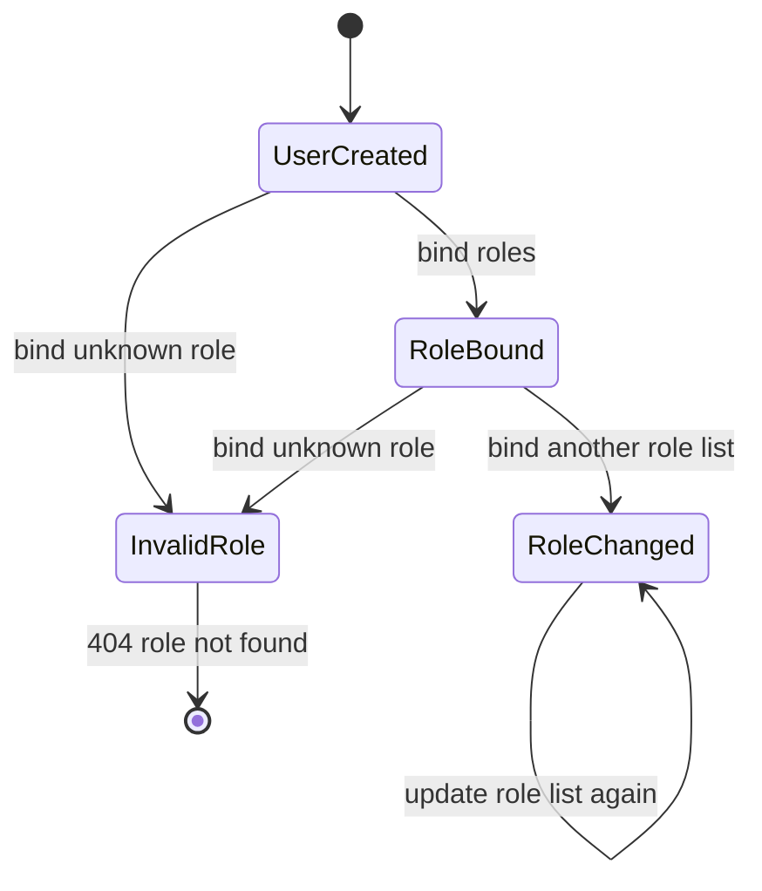
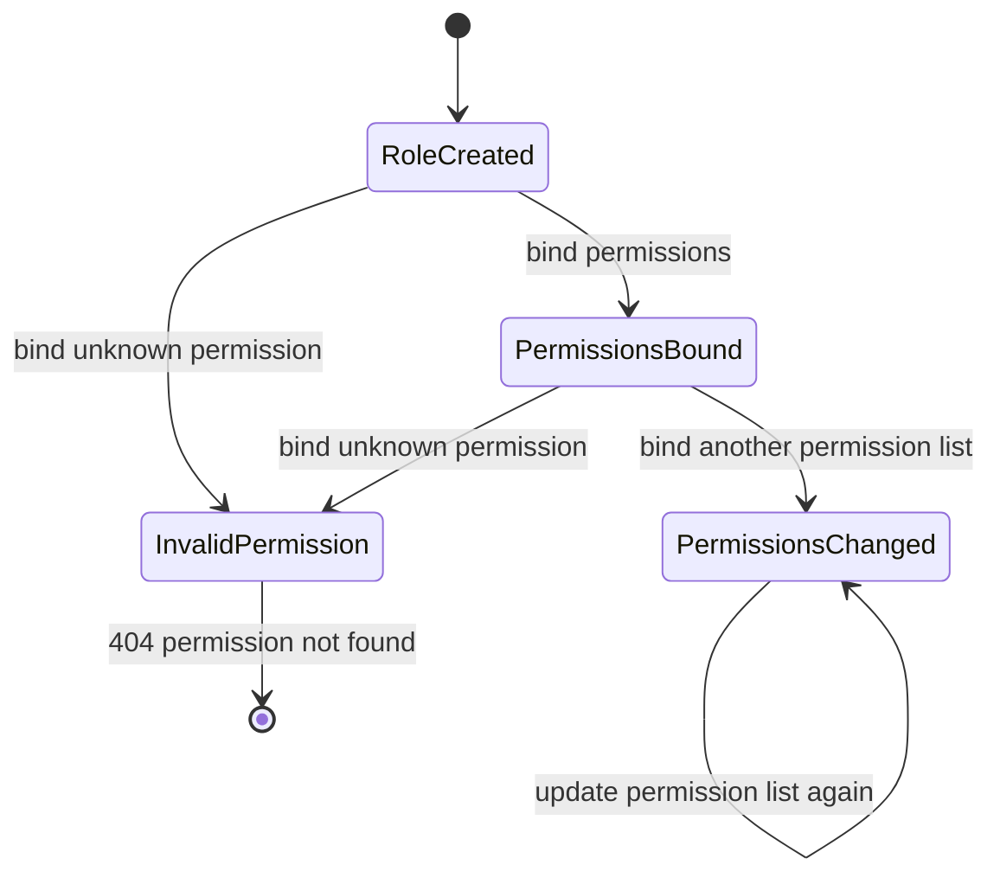

# F1005 BFF RBAC User Role Permission Scene

这份文档整理本次“用户、角色、权限拆分，并在商品接口接入权限校验”的变更。

重点不是只记录新增了哪些 NestJS 文件，而是把这个场景里的请求流、系统边界、数据结构、状态变化、规则兜底，以及实际用到的 NestJS 能力梳理清楚。

---

## 1. 场景目标

用户在做什么：

- 用户登录系统后，以 `admin`、`operator`、`viewer` 其中一种身份访问 BFF 接口
- 管理员维护用户、角色、权限基础信息
- 系统给用户绑定一个或多个角色
- 系统给角色绑定商品读取、创建、更新、删除等权限点
- 用户访问商品接口时，BFF 根据当前用户角色判断是否允许操作

系统要完成什么：

- 用户、角色、权限拆成独立模块，不能混在商品模块里
- 登录仍然通过 `AuthModule` 完成，但用户来源迁移到 `UserModule`
- 商品模块只消费权限能力，不维护用户、角色、权限数据
- `admin`、`operator`、`viewer` 三类用户拥有不同权限
- 无权限时返回统一 `403 Forbidden`

当前落地文件：

- [user.module.ts](/Users/liuxing/Desktop/Space/beike-simulation/next-bff/apps/bff/src/user/user.module.ts:1)
- [user.service.ts](/Users/liuxing/Desktop/Space/beike-simulation/next-bff/apps/bff/src/user/user.service.ts:1)
- [role.module.ts](/Users/liuxing/Desktop/Space/beike-simulation/next-bff/apps/bff/src/role/role.module.ts:1)
- [role.service.ts](/Users/liuxing/Desktop/Space/beike-simulation/next-bff/apps/bff/src/role/role.service.ts:1)
- [permission.module.ts](/Users/liuxing/Desktop/Space/beike-simulation/next-bff/apps/bff/src/permission/permission.module.ts:1)
- [permissions.guard.ts](/Users/liuxing/Desktop/Space/beike-simulation/next-bff/apps/bff/src/permission/permissions.guard.ts:1)
- [commodity.controller.ts](/Users/liuxing/Desktop/Space/beike-simulation/next-bff/apps/bff/src/commodity/commodity.controller.ts:1)

---

## 2. 请求流转图

### 2.1 管理用户 / 角色 / 权限流程图



### 2.2 商品接口权限校验流程图

```mermaid
flowchart TD
  A[Client Commodity Page] --> B[GET /api/commodity/list or POST /api/commodity/create]
  B --> C[CommodityController]
  C --> D[AuthGuard]
  D --> E{session valid?}

  E -->|no| F[401 Unauthorized]
  E -->|yes| G[@CurrentUser inject user]
  G --> H[PermissionsGuard]
  H --> I[@RequirePermissions metadata]
  I --> J[RoleService collect permissions by user.roles]
  J --> K{permission matched?}

  K -->|no| L[403 Forbidden]
  K -->|yes| M[CommodityService]
  M --> N[ApiClientService]
  N --> O[apps/server mock backend]
  O --> P[return commodity data]
```

### 2.3 权限校验时序图



---

## 3. 系统分层图

```text
apps/client
  负责:
    - 发起登录、商品、用户、角色、权限请求
    - 根据 401 / 403 更新页面状态

  不负责:
    - 解析 HttpOnly cookie
    - 判断用户是否真的登录
    - 做权限兜底

        |
        v

apps/bff/auth
  负责:
    - AuthController: login / logout / me
    - AuthGuard: 判断请求是否已登录
    - SessionStoreService: 保存 sessionId -> user

  不负责:
    - 判断用户是否拥有某个业务权限
    - 维护角色和权限点

        |
        v

apps/bff/user + role + permission
  负责:
    - UserModule: 用户基础信息、用户绑定角色
    - RoleModule: 角色基础信息、角色绑定权限
    - PermissionModule: 权限点基础信息
    - PermissionsGuard: 根据接口声明的权限点做访问控制

  不负责:
    - 商品业务转发
    - 浏览器页面渲染

        ^
        |

apps/bff/commodity
  负责:
    - CommodityController: 声明商品接口需要什么权限
    - CommodityService: 转发商品业务请求到 apps/server

  不负责:
    - 维护用户数据
    - 维护角色数据
    - 维护权限点数据

        |
        v

apps/server
  负责:
    - MockBackendController: 接收 BFF 转发请求
    - CommodityService: 商品 mock 业务处理

  不负责:
    - 浏览器 session
    - BFF 权限守卫
    - 用户、角色、权限维护
```

---

## 4. 输入 / 输出

### 4.1 输入

登录输入：

```json
{
  "username": "admin",
  "password": "admin123"
}
```

当前内置用户：

| username   | password      | roles          |
| ---------- | ------------- | -------------- |
| `admin`    | `admin123`    | `["admin"]`    |
| `operator` | `operator123` | `["operator"]` |
| `viewer`   | `viewer123`   | `["viewer"]`   |

用户绑定角色输入：

```http
PUT /api/users/u_operator_001/roles
Content-Type: application/json
Cookie: next_bff_session=<admin session>
```

```json
{
  "roles": ["operator", "viewer"]
}
```

角色绑定权限输入：

```http
PUT /api/roles/operator/permissions
Content-Type: application/json
Cookie: next_bff_session=<admin session>
```

```json
{
  "permissions": ["commodity:read", "commodity:create", "commodity:update"]
}
```

商品接口输入：

```http
GET /api/commodity/list
Cookie: next_bff_session=<sessionId>
```

```http
POST /api/commodity/create
Content-Type: application/json
Cookie: next_bff_session=<sessionId>
```

```json
{
  "name": "商品名称",
  "price": 100,
  "stock": 10,
  "status": "on_sale"
}
```

### 4.2 输出

成功响应结构由 `SuccessResponseInterceptor` 统一包装：

```json
{
  "success": true,
  "data": {}
}
```

未登录失败：

```json
{
  "success": false,
  "message": "Unauthorized",
  "path": "/api/users",
  "statusCode": 401,
  "timestamp": "2026-04-25T00:00:00.000Z"
}
```

无权限失败：

```json
{
  "success": false,
  "message": "permission denied",
  "path": "/api/commodity/create",
  "statusCode": 403,
  "timestamp": "2026-04-25T00:00:00.000Z"
}
```

---

## 5. 数据结构图



当前权限点：

| PermissionCode      | 用途                                                |
| ------------------- | --------------------------------------------------- |
| `commodity:read`    | 商品列表、商品详情读取                              |
| `commodity:create`  | 商品创建                                            |
| `commodity:update`  | 商品更新权限点，当前 BFF 先定义，后续接商品更新路由 |
| `commodity:delete`  | 商品删除权限点，当前 BFF 先定义，后续接商品删除路由 |
| `user:manage`       | 用户基础信息和用户角色绑定                          |
| `role:manage`       | 角色基础信息和角色权限绑定                          |
| `permission:manage` | 权限点基础信息维护                                  |

当前角色权限：

| Role       | Permissions                                              |
| ---------- | -------------------------------------------------------- |
| `admin`    | 全部权限                                                 |
| `operator` | `commodity:read`、`commodity:create`、`commodity:update` |
| `viewer`   | `commodity:read`                                         |

---

## 6. 状态变化图

### 6.1 请求鉴权状态



### 6.2 用户角色绑定状态



### 6.3 角色权限绑定状态



---

## 7. 规则兜底

参数校验在哪层：

- 当前用户、角色、权限维护接口主要由 Service 做存在性校验
- `UserService.bindRoles()` 会通过 `RoleService.assertRoleCodes()` 防止绑定不存在的角色
- `RoleService.bindPermissions()` 会校验权限点是否存在

登录校验在哪层：

- `AuthGuard` 负责登录兜底
- 它从 cookie 解析 `next_bff_session`
- 它从 `SessionStoreService` 查 session
- 它把当前用户写入 `request.currentUser`

权限校验在哪层：

- `PermissionsGuard` 负责权限兜底
- `@RequirePermissions(...)` 负责声明接口需要什么权限
- `RoleService.getPermissionCodesByRoleCodes()` 负责把用户角色展开成权限集合
- 商品模块不直接判断 `admin`、`operator`、`viewer`，只声明需要的权限点

业务规则在哪层：

- 用户维护规则在 `UserService`
- 角色维护规则在 `RoleService`
- 权限点维护规则在 `PermissionService`
- 商品业务仍在 `CommodityService` 转发到 `apps/server`

错误处理在哪层：

- 未登录抛 `UnauthorizedException`
- 无权限抛 `ForbiddenException`
- 角色或权限不存在抛 `NotFoundException`
- `HttpExceptionFilter` 统一输出失败响应结构

审计记录在哪层：

- 当前版本还没有落审计表
- 商品转发仍会带 `x-user-id` 给 backend，后续可以在 server 或数据库层落审计记录

---

## 8. NestJS 能力映射

Controller 解决什么问题：

- `UserController` 暴露用户维护接口
- `RoleController` 暴露角色维护和角色权限绑定接口
- `PermissionController` 暴露权限点维护接口
- `CommodityController` 声明商品接口需要的权限

Guard 解决什么问题：

- `AuthGuard` 解决“请求是否已登录”
- `PermissionsGuard` 解决“已登录用户是否拥有接口所需权限”
- 两个 Guard 顺序执行，先确认身份，再确认权限

Decorator / Metadata 解决什么问题：

- `@RequirePermissions("commodity:create")` 把权限要求声明在 controller handler 上
- `SetMetadata` 保存权限元数据
- `Reflector` 在 `PermissionsGuard` 里读取 handler 或 controller 上的权限要求

Service 解决什么问题：

- `UserService` 管用户数据、登录查用户、用户绑定角色
- `RoleService` 管角色数据、角色绑定权限、角色到权限的展开
- `PermissionService` 管权限点数据
- `CommodityService` 只处理商品请求转发，不混入 RBAC 数据维护

Module / imports / exports 解决什么问题：

- `UserModule` 导出 `UserService` 给 `AuthModule` 登录使用
- `RoleModule` 导出 `RoleService` 给 `PermissionsGuard` 展开权限使用
- `PermissionModule` 导出 `PermissionsGuard` 给商品模块复用
- `CommodityModule` 通过 imports 引入权限能力，但不拥有权限数据

Interceptor / Filter 解决什么问题：

- `SuccessResponseInterceptor` 统一成功响应结构
- `HttpExceptionFilter` 统一失败响应结构
- RBAC 只负责抛出明确异常，不负责拼装最终错误 JSON

---

## 9. 本次验收对应关系

- [x] 系统支持 `admin` / `operator` / `viewer` 三类用户
- [x] 系统能维护用户基础信息：`UserModule` + `UserController` + `UserService`
- [x] 系统能维护角色基础信息：`RoleModule` + `RoleController` + `RoleService`
- [x] 系统能维护权限点：`PermissionModule` + `PermissionController` + `PermissionService`
- [x] 用户能绑定一个或多个角色：`UserService.bindRoles()`
- [x] 角色能绑定商品读取、创建、更新、删除等权限：`RoleService.bindPermissions()`
- [x] admin / operator / viewer 权限不同
- [x] 用户、角色、权限没有混在商品模块里

---

## 10. 一句话总结

这次更新把“身份是谁”和“能做什么”拆开了：`AuthGuard` 只判断是否登录，`PermissionsGuard` 根据用户角色展开权限并判断是否允许访问，商品模块只声明自己需要什么权限，不再关心用户、角色、权限数据怎么维护。

---

## 11. 建立表征：不要只背文字

如果只看“用户、角色、权限”这几个词，很难在脑子里形成系统结构。  
这次改动可以用 5 个表征来记：代码地图、权限矩阵、数据关系、请求闸门、状态变化。

### 11.1 代码地图

先不要看细节，先看这次代码被拆成了哪几块：

```text
apps/bff/src
  auth
    auth.service.ts              登录时调用 UserService 查用户
    auth.guard.ts                第一层闸门: 有没有登录
    session-store.service.ts     sessionId -> AuthUser

  user
    mock-users.ts                admin / operator / viewer 用户数据
    user.types.ts                AuthUser / User / UserRecord
    user.service.ts              查用户、建用户、改用户、给用户绑角色
    user.controller.ts           /api/users
    user.module.ts               对外导出 UserService

  role
    mock-roles.ts                admin / operator / viewer 角色数据
    role.types.ts                Role
    role.service.ts              查角色、给角色绑权限、角色展开成权限
    role.controller.ts           /api/roles
    role.module.ts               对外导出 RoleService

  permission
    mock-permissions.ts          权限点数据
    permission.types.ts          PermissionCode / Permission
    permissions.decorator.ts     @RequirePermissions(...)
    permissions.guard.ts         第二层闸门: 有没有权限
    permission.service.ts        查权限、建权限、改权限
    permission.controller.ts     /api/permissions
    permission.module.ts         对外导出权限能力

  commodity
    commodity.controller.ts      商品接口声明需要什么权限
    commodity.service.ts         只转发商品请求，不维护 RBAC 数据
```

脑子里的第一层表征：

```text
auth 解决: 你是谁
user 解决: 有哪些用户，用户有什么角色
role 解决: 有哪些角色，角色有什么权限
permission 解决: 有哪些权限点，接口需要什么权限
commodity 解决: 商品业务入口和转发
```

### 11.2 权限矩阵

这个矩阵比文字更重要。看懂它，就看懂了 `admin` / `operator` / `viewer` 的差异。

| 能力              | PermissionCode      | admin | operator | viewer |
| ----------------- | ------------------- | ----- | -------- | ------ |
| 看商品列表 / 详情 | `commodity:read`    | yes   | yes      | yes    |
| 创建商品          | `commodity:create`  | yes   | yes      | no     |
| 更新商品          | `commodity:update`  | yes   | yes      | no     |
| 删除商品          | `commodity:delete`  | yes   | no       | no     |
| 维护用户          | `user:manage`       | yes   | no       | no     |
| 维护角色          | `role:manage`       | yes   | no       | no     |
| 维护权限点        | `permission:manage` | yes   | no       | no     |

所以你可以直接推导：

```text
viewer 访问 GET /api/commodity/list
  -> 需要 commodity:read
  -> viewer 有
  -> 放行

viewer 访问 POST /api/commodity/create
  -> 需要 commodity:create
  -> viewer 没有
  -> 403

operator 访问 /api/users
  -> 需要 user:manage
  -> operator 没有
  -> 403

admin 访问 /api/users
  -> 需要 user:manage
  -> admin 有
  -> 放行
```

### 11.3 数据关系

不要先想 NestJS。先想这 3 张“逻辑表”的关系：

```text
User
  id: u_operator_001
  username: operator
  roles: ["operator"]

        roles 通过 code 指向
        |
        v

Role
  code: operator
  permissions: ["commodity:read", "commodity:create", "commodity:update"]

        permissions 通过 code 指向
        |
        v

Permission
  code: commodity:create
  name: 商品创建
```

核心关系只有一条：

```text
User.roles[] -> Role.code
Role.permissions[] -> Permission.code
```

权限判断时做的事情就是把它展开：

```text
user.roles
  -> roles
  -> role.permissions
  -> userPermissionCodes
  -> compare with @RequirePermissions(...)
```

### 11.4 请求闸门

每个受保护接口前面都有两道门。

```text
HTTP Request
  |
  v
[Gate 1] AuthGuard
  问题: 你登录了吗?
  依据: next_bff_session -> SessionStoreService
  失败: 401 Unauthorized
  成功: request.currentUser = user
  |
  v
[Gate 2] PermissionsGuard
  问题: 你有这个接口要求的权限吗?
  依据: @RequirePermissions + RoleService
  失败: 403 permission denied
  成功: 进入 Controller handler
  |
  v
Controller -> Service -> Response
```

这也是读代码时最重要的顺序：

```text
先看 Controller 上的 @UseGuards
再看 handler 上的 @RequirePermissions
再看 PermissionsGuard 怎么读 metadata
再看 RoleService 怎么把 roles 展开成 permissions
```

### 11.5 商品创建的完整心智模型

以 `POST /api/commodity/create` 为例，把上面的结构串起来：

```text
1. 请求进来
   POST /api/commodity/create
   Cookie: next_bff_session=<sessionId>

2. AuthGuard 查 session
   sessionId -> AuthUser
   得到:
     {
       id: "u_viewer_001",
       username: "viewer",
       roles: ["viewer"]
     }

3. PermissionsGuard 读取接口要求
   @RequirePermissions("commodity:create")

4. RoleService 展开 viewer 的权限
   viewer -> ["commodity:read"]

5. 比较
   required: "commodity:create"
   actual: ["commodity:read"]

6. 不匹配
   throw ForbiddenException("permission denied")

7. HttpExceptionFilter 输出
   {
     "success": false,
     "message": "permission denied",
     "statusCode": 403
   }
```

如果换成 `operator`：

```text
operator -> ["commodity:read", "commodity:create", "commodity:update"]
required -> "commodity:create"
match -> 进入 CommodityService -> 转发 apps/server
```

### 11.6 状态机

这个场景不是一条直线，而是两个状态机叠加。

第一个状态机：登录状态。

```text
未登录
  |
  | login success
  v
已登录
  |
  | logout / session expired
  v
未登录
```

第二个状态机：权限判断状态。

```text
已登录用户发起请求
  |
  v
读取接口所需权限
  |
  v
展开用户角色权限
  |
  +-- 有权限 -> 执行业务 -> success
  |
  +-- 无权限 -> 403
```

把两个状态机合起来：

```text
请求进来
  |
  +-- 没登录 -> 401
  |
  +-- 已登录
        |
        +-- 没权限 -> 403
        |
        +-- 有权限 -> 执行业务 -> 200
```

### 11.7 最小记忆模型

最终只需要记住这个模型：

```text
User --has roles--> Role --has permissions--> Permission

Controller --declares required permissions--> PermissionsGuard

AuthGuard answers: who are you?
PermissionsGuard answers: can you do this?
Service answers: how to do the business action?
```

这就是这次未提交 RBAC 改动的核心表征。
