# F1006 面试表达验收：Next BFF 三层系统怎么讲清楚

目标：把当前系统的关键设计说清楚，而不是背 NestJS API。  
面试表达重点：先讲业务问题，再讲分层职责，最后讲 NestJS 能力如何落地。

---

## 1. 总览：这个系统在解决什么问题

当前项目是一个后台商品管理系统，核心链路包括：

- 登录与会话
- 用户、角色、权限判断
- 商品创建、查询、状态流转、软删除
- 商品图片上传
- 审计日志
- 统一成功响应、统一异常响应、traceId 追踪

一句话表达：

> 我把系统拆成 client、BFF、backend、database 四层。client 只负责页面和交互，BFF 负责面向前端的鉴权、权限、响应格式和 backend 聚合，backend 负责真实业务规则和数据持久化，database 只负责存储。这样每一层职责清楚，改 UI、改接口编排、改业务规则不会互相污染。

---

## 2. 系统分层图

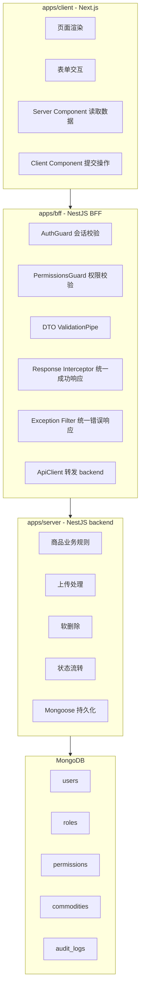

面试话术：

> BFF 和 backend 分层的关键不是多写一层代码，而是隔离变化。BFF 面向前端体验，处理 cookie 会话、权限拦截、统一响应、traceId 透传、接口聚合；backend 面向领域业务，处理商品状态、软删除、持久化、上传存储。前端页面变了，不应该影响 backend 领域规则；backend 存储换了，也不应该让前端感知。

---

## 3. BFF 和 backend 为什么分层

### 3.1 职责边界

| 层 | 负责 | 不负责 |
| --- | --- | --- |
| client | 页面、表单、跳转、展示 | 权限兜底、业务规则兜底、直接写数据库 |
| BFF | 登录态识别、权限拦截、DTO 校验、响应格式、traceId、转发 backend | 真正的数据持久化、领域状态机 |
| backend | 商品领域规则、上传存储、MongoDB 读写 | 浏览器 cookie 会话、页面结构 |
| MongoDB | 持久化数据 | HTTP 协议、权限策略 |

### 3.2 请求流转图

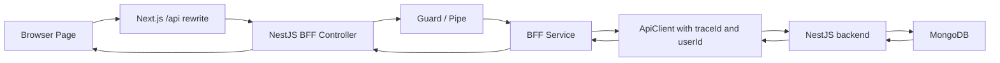

面试话术：

> 如果没有 BFF，前端会直接面对 backend 的多个接口、错误结构、鉴权细节和数据协议。BFF 把这些复杂度收口，前端只读稳定的 `success / data / message / traceId`。同时 BFF 可以把当前用户、traceId、权限检查统一做掉，backend 专注领域逻辑。

---

## 4. 登录链路为什么这样设计

### 4.1 当前登录链路

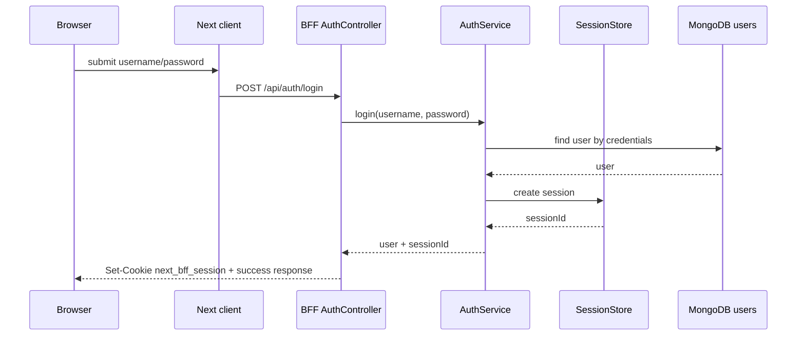

### 4.2 为什么用 cookie session

当前系统是后台管理应用，页面和 API 同域通过 Next rewrites 访问，cookie session 的好处是：

- 浏览器同源请求自动携带 cookie，前端不需要手动保存 token。
- BFF 可以统一解析 `next_bff_session`，再得到当前用户。
- `HttpOnly` cookie 可以降低 token 被前端脚本读取的风险。
- BFF 是会话边界，backend 不需要知道浏览器 cookie 细节。

### 4.3 Server Component 为什么要手动透传 cookie

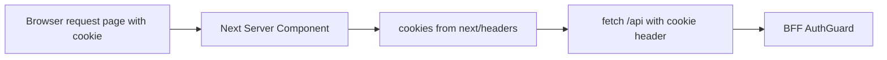

面试话术：

> 浏览器里的 client fetch 会自动带 cookie，但 Next Server Component 运行在 Node 服务端，它发起 fetch 时不会自动继承浏览器请求里的 cookie，所以需要用 `cookies()` 读出当前请求 cookie，再透传给 BFF。这个不是伪造 cookie，而是把用户请求上下文传到 BFF。

---

## 5. 权限为什么用 Guard + decorator

### 5.1 当前权限写法

Controller 上声明权限：

```ts
@Post("create")
@RequirePermissions("commodity:create")
async createCommodity(...) {}
```

Guard 统一读取权限元数据：

```ts
const requiredPermissions = reflector.getAllAndOverride(REQUIRED_PERMISSIONS_KEY, [
  context.getHandler(),
  context.getClass()
]);
```

### 5.2 为什么不是写在 Controller 里

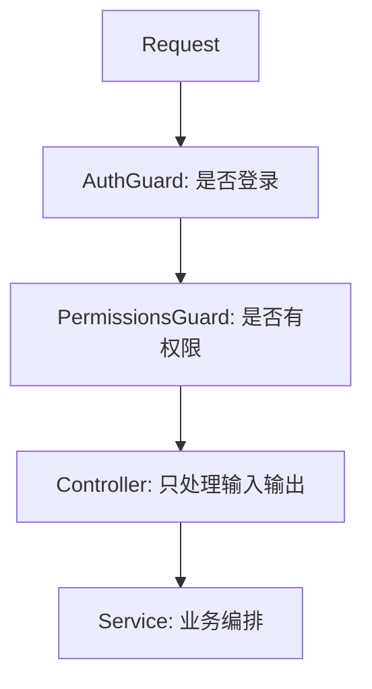

面试话术：

> 权限判断是横切关注点，不应该散落在每个 Controller 方法里。decorator 负责声明“这个接口需要什么权限”，Guard 负责执行“当前用户有没有这些权限”。这样接口权限清晰可读，权限逻辑集中可测试，后续换权限来源也只改 Guard 或 PermissionService。

---

## 6. 商品状态流转为什么放 Service

### 6.1 状态机

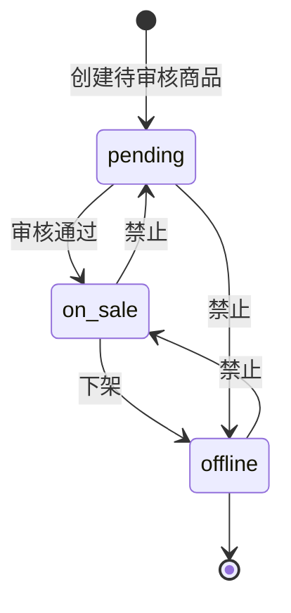

### 6.2 为什么不放 Controller

Controller 只应该做 HTTP 入口处理：

- 取 `id`
- 取 body
- 取 currentUser
- 调用 Service

Service 才应该表达业务规则：

- pending 只能变 on_sale
- on_sale 只能变 offline
- offline 不能直接变更
- 状态变更必须有 reason
- 状态变更后写审计日志

面试话术：

> 状态流转是领域规则，不是 HTTP 规则。放在 Service 里，未来无论是 HTTP Controller、定时任务、消息队列还是后台脚本触发状态变更，都能复用同一套规则。如果写在 Controller 里，就会导致业务规则和传输层耦合。

---

## 7. 统一响应为什么用 Interceptor

### 7.1 成功响应结构

```json
{
  "success": true,
  "data": {},
  "message": "ok",
  "traceId": "..."
}
```

### 7.2 Interceptor 的位置

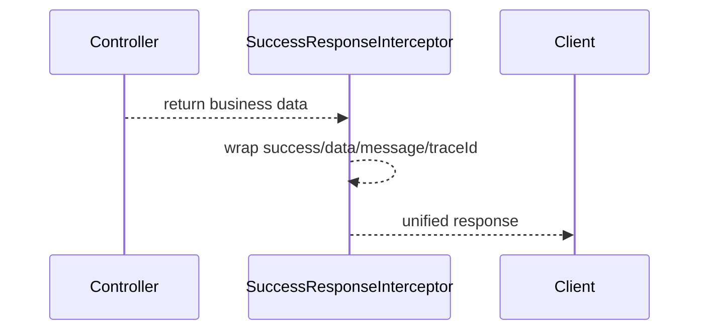

面试话术：

> Controller 应该直接返回业务数据，不应该每个方法手写 `{ success: true }`。统一成功响应是横切逻辑，适合放在 Interceptor。这样格式稳定，前端可以稳定读取 `data/message/traceId`，Controller 也保持干净。

---

## 8. 统一异常为什么用 Filter

### 8.1 错误响应结构

```json
{
  "success": false,
  "message": "permission denied",
  "path": "/api/commodity/create",
  "traceId": "...",
  "statusCode": 403,
  "timestamp": "2026-04-30T00:00:00.000Z"
}
```

### 8.2 Filter 的位置

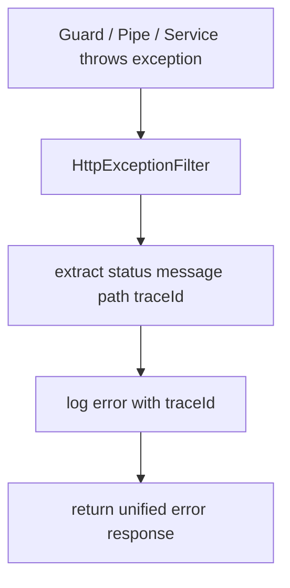

面试话术：

> 异常可能来自 Guard、Pipe、Controller、Service，不能靠每个 Controller try/catch。Exception Filter 是 NestJS 统一异常出口，适合把所有错误转成一致结构，同时把 traceId、path、statusCode 和日志都补齐。

---

## 9. DTO、Schema、业务规则为什么不能混在一起

### 9.1 三者职责

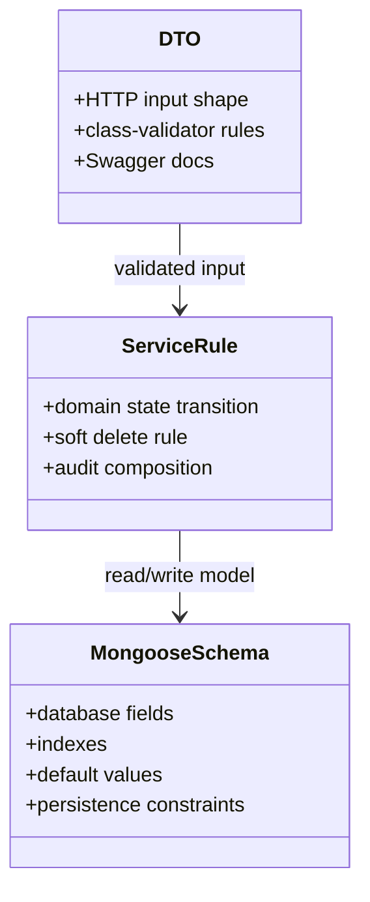

### 9.2 具体例子

| 类型 | 当前例子 | 说明 |
| --- | --- | --- |
| DTO | `CreateCommodityDto` | 校验 HTTP body，比如 name 不能为空，price 大于 0 |
| Service | `CommodityService.updateCommodityStatus` | 判断 pending/on_sale/offline 是否能流转 |
| Schema | `CommoditySchema` | 定义 MongoDB 字段、索引、默认值 |

面试话术：

> DTO 解决“外部输入是否合法”，Schema 解决“数据库怎么存”，Service 解决“业务上能不能做”。如果混在一起，最常见的问题是数据库字段变化影响 API，或者 HTTP 校验被误当成业务规则。分开以后，每一层变化范围更小，测试也更明确。

---

## 10. 核心链路怎么讲

### 10.1 登录成功链路

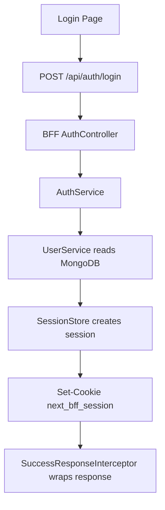

表达重点：

> 登录接口只负责建立会话。后续接口不再传用户名密码，而是通过 cookie session 找当前用户。

### 10.2 商品创建链路

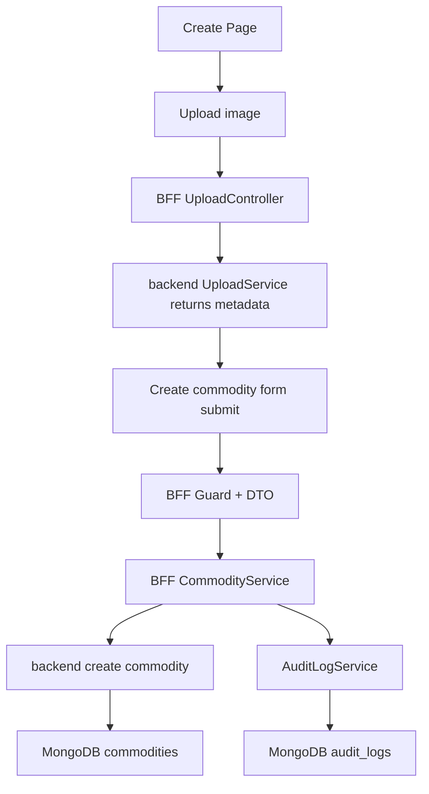

表达重点：

> 图片上传先拿文件元数据，创建商品时只保存图片元数据，不把文件二进制塞进商品表。

### 10.3 商品状态变更链路

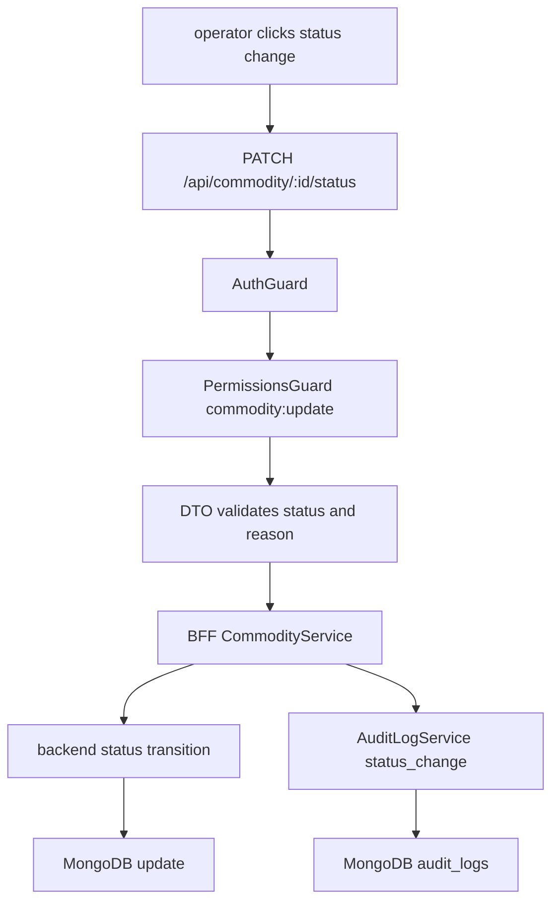

表达重点：

> operator 能改状态，但不能看审计日志；admin 能看审计日志。这是权限模型的结果，不是前端隐藏按钮的结果。

### 10.4 商品删除链路

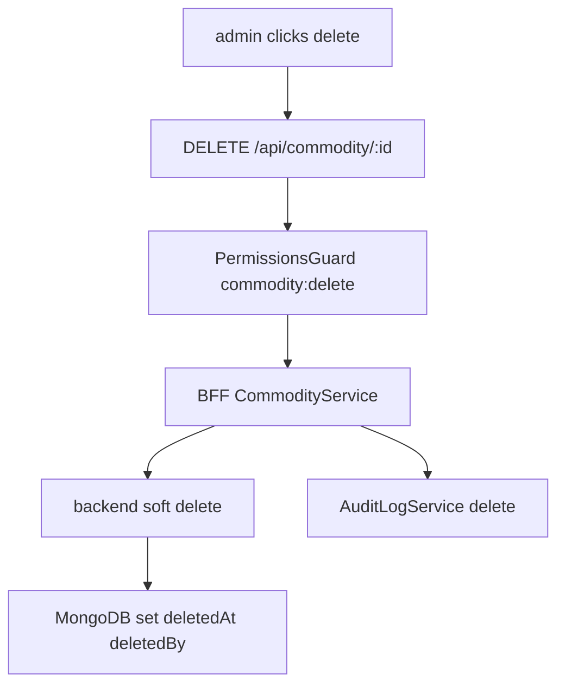

表达重点：

> 删除是软删除，列表查询默认过滤 `deletedAt != null` 的数据，所以删除后列表不可见，但审计和历史数据还在。

---

## 11. traceId 如何贯穿一次请求

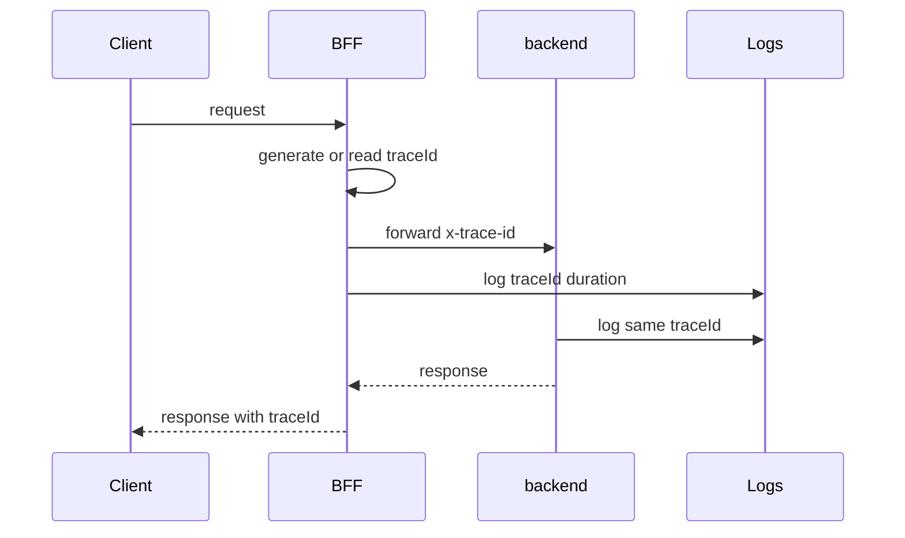

面试话术：

> traceId 的价值是把一次请求在 BFF 和 backend 的日志串起来。成功响应和错误响应都带 traceId，前端报错时可以直接拿 traceId 去查日志。

---

## 12. 当前系统距离生产级还差哪些能力

### 12.1 安全

- 密码需要 hash，例如 bcrypt/argon2，不能明文存储。
- session 需要持久化或接 Redis，当前内存 session 重启会丢。
- cookie 生产环境需要 `Secure`、更严格的 SameSite、CSRF 防护策略。
- 上传需要真实对象存储、病毒扫描、文件内容嗅探、私有读写策略。

### 12.2 工程可靠性

- BFF 到 backend 需要 timeout、retry、熔断、错误码映射规范。
- MongoDB 需要 migration 或 schema version 管理。
- 需要更完整的 e2e 测试覆盖真实数据库场景。
- 需要 CI 统一跑 lint、build、test。

### 12.3 可观测性

- 当前是日志中带 traceId，生产级还需要结构化日志。
- 需要 metrics，例如请求量、错误率、P95/P99 延迟。
- 需要链路追踪系统，例如 OpenTelemetry。

### 12.4 权限与审计

- 当前 RBAC 足够演示，但生产要支持权限变更审计、角色变更审计。
- 审计日志应防篡改，重要操作要记录 before/after 更完整字段。
- 高风险操作可以加二次确认或审批流。

### 12.5 数据与性能

- 当前 offset 分页可用，但大数据量要升级 cursor 分页。
- 索引需要结合真实查询日志持续调整。
- 图片字段现在存 URL，生产要考虑 CDN、鉴权 URL、缩略图、多尺寸图。

---

## 13. 面试时的回答顺序

建议按这个顺序讲：

1. 先讲系统分层：client / BFF / backend / MongoDB。
2. 再讲一条完整请求：登录或商品创建。
3. 然后讲横切能力：Guard、Pipe、Interceptor、Filter、traceId。
4. 再讲业务规则：状态流转、软删除、审计日志。
5. 最后讲生产差距：安全、可观测性、测试、性能。

一句收尾：

> 这个项目不是为了堆功能，而是为了证明我能把一个后台系统拆清楚：页面交互、接口边界、权限模型、业务规则、数据持久化、审计和可观测性各自放在正确的位置。
