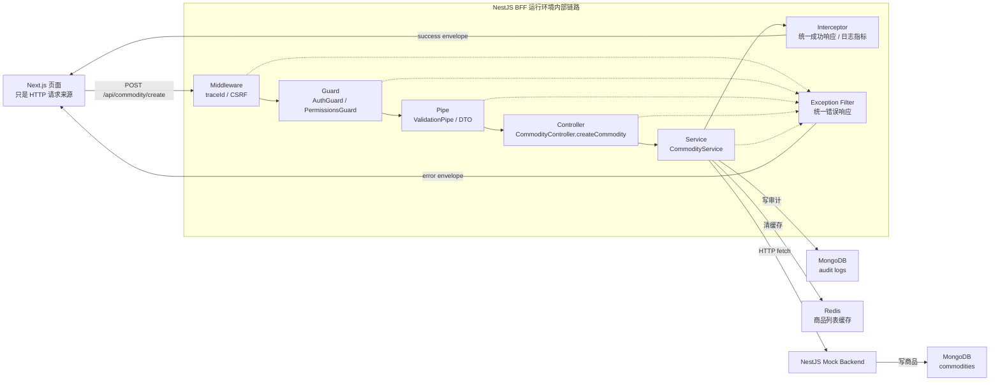
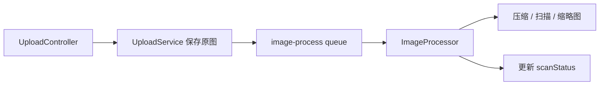

# F1007 当前系统 NestJS 能力地图

这份文档是一份**工程化学习笔记**。

它不是 NestJS API 百科，也不是单纯的架构设计文档。它的目标是用当前系统里的真实请求、真实代码路径和真实工程问题，反推 NestJS 在一个 MVP 后台系统里到底承担了什么角色。

当前系统可以粗略理解为：

```text
Next.js Client
  -> NestJS BFF
  -> NestJS Mock Backend
  -> MongoDB / Redis / 本地文件或对象存储
```

这份文档每个能力都尽量按同一个结构解释：

```text
真实场景
-> 当前系统怎么用
-> NestJS 能力在链路中的位置
-> 关键代码路径
-> 它解决的工程问题
-> 怎么观察/验证
-> 下一步真实诉求出现时，可以引入什么新 NestJS 能力
```

---

## 1. 先看一条真实请求

以“创建商品”为例，前端提交商品表单后，`Client` 只是 HTTP 请求来源，不属于 NestJS 生命周期本身。真正要学习的 NestJS 能力链路，是 BFF 运行环境收到请求以后，在 NestJS 应用内部发生的处理过程。



这张图要表达的重点是：客户端只是发起请求，NestJS 的能力主要发生在 BFF 进程内部。NestJS 的价值不是“写几个装饰器”，而是把一个真实后台请求拆成多个稳定边界：

- HTTP 入口由 Controller 负责。
- 认证和权限由 Guard 负责。
- 输入合法性由 DTO 和 Pipe 负责。
- 业务编排由 Service 负责。
- 成功响应、日志、指标由 Interceptor 负责。
- 异常响应由 Exception Filter 负责。
- 配置、数据库、缓存、存储等依赖由 Module 和 DI 管理。

---

## 2. 当前系统已使用的 NestJS 能力

### 2.1 Module：把业务能力组织成边界

真实场景：

商品系统不是一个函数能完成的。创建商品会涉及认证、权限、商品接口、BFF 转发、审计日志、缓存失效、数据库模型等能力。如果这些能力都堆在一个文件里，后续扩展会很快失控。

当前系统怎么用：

- `AppModule` 负责组装 BFF 的顶层能力。
- `AuthModule` 管登录、session、登录风控、登录日志。
- `CommodityModule` 管商品查询、创建、编辑、删除、恢复、审计。
- `UploadModule` 管上传和文件访问。
- `UserModule`、`RoleModule`、`PermissionModule` 管 RBAC 数据。
- `DatabaseModule` 负责 MongoDB 连接。
- `BffModule` 负责 BFF 到 backend 的通用转发能力。

NestJS 能力在链路中的位置：

Module 不直接处理某一次请求，它在应用启动时建立依赖图。请求进来以后，Controller、Service、Guard、Interceptor 能被正确创建和注入，靠的就是 Module。

关键代码路径：

- `apps/bff/src/app.module.ts`
- `apps/bff/src/auth/auth.module.ts`
- `apps/bff/src/commodity/commodity.module.ts`
- `apps/bff/src/upload/upload.module.ts`
- `apps/bff/src/bff/bff.module.ts`

它解决的工程问题：

- 明确每块能力的归属，避免所有东西都挤进 `main.ts`。
- 让 Nest 容器知道哪些 provider 可以被注入。
- 让跨模块复用有边界，例如 `AuthModule` 导出 `AuthGuard`，`BffModule` 导出 `ApiClientService`。

怎么观察/验证：

- 看 `AppModule.imports` 能看到当前 BFF 的能力边界。
- 看各模块的 `providers`、`controllers`、`exports` 能判断一个能力是内部使用还是对外复用。
- 如果某个 Service 没有被所在模块提供或导出，启动或测试时会出现 Nest 依赖解析错误。

下一步真实诉求出现时，可以引入什么新 NestJS 能力：

如果后续存储、缓存、第三方服务配置越来越复杂，可以把一些模块升级成动态模块，例如 `StorageModule.registerAsync()`，让本地、S3、OSS 等实现按配置动态装配，而不是散落在业务模块里。

---

### 2.2 Injectable + DI：让对象创建和业务逻辑分离

真实场景：

`AuthController` 只应该关心登录接口如何接收请求、如何写 cookie，不应该自己创建 `AuthService`、`SessionStoreService`、`UserService`。

当前系统怎么用：

Controller 和 Service 基本都通过构造函数注入依赖：

- `AuthController` 注入 `AuthService` 和 `ConfigService`。
- `CommodityService` 注入 `ApiClientService`、`AuditLogService`、`CommodityCacheService`。
- `UserService` 注入 Mongoose model 和 `RoleService`。
- `ApiClientService` 注入 `ConfigService`、`RequestHeadersService`、`ResponseHandlerService`。

NestJS 能力在链路中的位置：

DI 在应用启动和请求处理过程中都存在。Nest 容器负责创建 provider，并把依赖传给需要它们的类。

关键代码路径：

- `apps/bff/src/auth/auth.controller.ts`
- `apps/bff/src/auth/auth.service.ts`
- `apps/bff/src/commodity/commodity.service.ts`
- `apps/bff/src/user/user.service.ts`
- `apps/bff/src/bff/api-client.service.ts`

它解决的工程问题：

- Controller 不需要 `new AuthService()`。
- Service 之间的依赖关系可测试、可替换。
- 单测里可以用 mock provider 替换真实服务。

怎么观察/验证：

- 看构造函数参数就能看出一个类依赖什么。
- `apps/bff/src/test/app-test-utils.ts` 里用 `useValue` 替换真实 provider，这说明当前设计已经适合测试。

下一步真实诉求出现时，可以引入什么新 NestJS 能力：

如果某些依赖必须跟请求绑定，例如每个请求的 `tenantId`、`traceId`、`currentUser`，可以考虑 request-scoped provider。但它有性能成本，不应该为了省传参随便使用。

---

### 2.3 Controller：HTTP API 的入口边界

真实场景：

前端页面需要调用登录、退出、获取当前用户、商品列表、商品创建、商品编辑、上传图片等接口。BFF 必须给这些行为提供稳定入口。

当前系统怎么用：

- `AuthController` 暴露 `/api/auth/login`、`/api/auth/me`、`/api/auth/logout`。
- `CommodityController` 暴露 `/api/commodity/list`、`/api/commodity/create`、`/api/commodity/:id/status` 等商品接口。
- `UploadController` 暴露 `/api/upload`。
- `FileController` 暴露 `/api/files/:fileId`。
- mock backend 的 `MockBackendController` 暴露内部商品、上传、文件接口。

NestJS 能力在链路中的位置：

Controller 是请求通过 middleware、guard、pipe 后进入的 HTTP handler 层。它负责把 HTTP 概念转换成业务调用，但不应该塞入复杂业务规则。

关键代码路径：

- `apps/bff/src/auth/auth.controller.ts`
- `apps/bff/src/commodity/commodity.controller.ts`
- `apps/bff/src/upload/upload.controller.ts`
- `apps/bff/src/upload/file.controller.ts`
- `apps/server/src/mock-backend/mock-backend.controller.ts`

它解决的工程问题：

- 把路由、HTTP 方法、参数来源、响应状态码集中声明。
- 让业务逻辑可以下沉到 Service。
- 让 Swagger、测试、权限装饰器有明确挂载点。

怎么观察/验证：

- 在 Controller 上看 `@Controller("api/commodity")`。
- 在方法上看 `@Get("list")`、`@Post("create")`、`@Patch(":id/status")`。
- 用 e2e 测试访问接口时，实际命中的就是这些 handler。

下一步真实诉求出现时，可以引入什么新 NestJS 能力：

如果 API 需要兼容旧版本，比如旧前端仍然使用 offset 分页，新前端改成 cursor 分页，可以开启 NestJS API Versioning，把 `/api/v1/commodity/list` 和 `/api/v2/commodity/list` 分开演进。

---

### 2.4 DTO + ValidationPipe：把非法输入挡在业务逻辑前

真实场景：

商品列表接口支持分页、状态、价格区间、库存区间、排序字段。如果前端传 `page=0`、`status=unknown`、`pageSize=10000`，这些请求不应该进入商品业务逻辑。

当前系统怎么用：

- `main.ts` 全局启用 `ValidationPipe`。
- DTO 使用 `class-validator` 声明字段规则。
- `class-transformer` 把 query string 转成数字。
- `forbidNonWhitelisted` 拒绝 DTO 没声明的额外字段。

NestJS 能力在链路中的位置：

Pipe 在进入 Controller handler 前执行。也就是说，非法输入会在调用 Service 前被拦下。

关键代码路径：

- `apps/bff/src/main.ts`
- `apps/bff/src/auth/dto/login.dto.ts`
- `apps/bff/src/commodity/dto/create-commodity.dto.ts`
- `apps/bff/src/commodity/dto/query-commodity-list.dto.ts`
- `apps/bff/src/commodity/dto/update-commodity.dto.ts`
- `apps/bff/src/commodity/dto/update-commodity-status.dto.ts`

它解决的工程问题：

- 输入契约集中，不需要每个 Controller 手写一堆 `if`。
- 非法输入统一返回 400。
- 业务 Service 接收到的是已经过基础校验的数据。
- Swagger 可以复用 DTO 信息生成接口文档。

怎么观察/验证：

- e2e 测试里 `page=0`、`sortBy=deletedAt`、`status=unknown` 会返回 400，并且不会进入 `CommodityService`。
- 传入额外字段 `extra` 会被 `forbidNonWhitelisted` 拦下。

下一步真实诉求出现时，可以引入什么新 NestJS 能力：

如果 DTO 开始出现复杂组合规则，例如 `minPrice <= maxPrice`、`createdFrom <= createdTo`，可以用自定义 validator 或专门的业务 Pipe，把跨字段校验从 Controller 里移走。

---

### 2.5 自定义 Pipe：处理 DTO 不适合表达的输入规则

真实场景：

商品详情接口的 `id` 来自 URL 路径，不是 JSON body。上传接口的文件对象来自 multipart，不适合用普通 DTO 表达。

当前系统怎么用：

- `ParseCommodityIdPipe` 校验商品 ID 必须是正整数格式。
- `ParseProductImageFilePipe` 校验上传文件必须存在、类型必须是 jpg/png/webp、大小不能超过 2MB。

NestJS 能力在链路中的位置：

自定义 Pipe 通常挂在参数装饰器上，例如 `@Param("id", CommodityIdPipe)` 或 `@UploadedFile(ParseProductImageFilePipe)`。它只处理某个参数，不影响整个请求对象。

关键代码路径：

- `apps/bff/src/commodity/pipes/parse-commodity-id.pipe.ts`
- `apps/bff/src/upload/pipes/parse-product-image-file.pipe.ts`
- `apps/bff/src/commodity/commodity.controller.ts`
- `apps/bff/src/upload/upload.controller.ts`

它解决的工程问题：

- 把路径参数、文件参数这种特殊输入规则封装起来。
- Controller 只接收已经校验后的 `id` 或 `file`。
- 校验失败统一抛 `BadRequestException`，进入全局异常处理。

怎么观察/验证：

- 访问 `/api/commodity/abc` 应返回 400。
- 上传空文件、超大文件、非图片文件应返回 400。

下一步真实诉求出现时，可以引入什么新 NestJS 能力：

如果上传安全规则继续变复杂，比如需要检查图片真实 magic number、解码图片尺寸、识别动图，可以把文件校验 Pipe 扩展成专门的 `ImageValidationPipe`，或者配合队列异步扫描。

---

### 2.6 Middleware：在 Nest handler 前处理 HTTP 横切问题

真实场景：

每个请求都需要 traceId 方便排障。浏览器发起写操作时，需要 CSRF 防护，不能让恶意站点伪造用户请求。

当前系统怎么用：

- `traceIdMiddleware` 从 `x-trace-id` 读取 traceId，没有就生成新的。
- `createCsrfOriginMiddleware` 对非安全方法校验 Origin/Referer 和 CSRF token。
- BFF 在 `main.ts` 中用 `app.use(...)` 注册这些 middleware。

NestJS 能力在链路中的位置：

Middleware 是最靠前的 HTTP 层处理。它在 Guard、Pipe、Controller 之前执行。

关键代码路径：

- `apps/bff/src/main.ts`
- `apps/bff/src/common/http/trace-id.ts`
- `apps/bff/src/common/http/csrf-origin.ts`
- `apps/bff/src/common/http/csrf-token.ts`

它解决的工程问题：

- 每个请求都有稳定 traceId，后续日志、响应、backend 转发都能串起来。
- 写操作在进入认证和业务逻辑之前先过 CSRF 检查。
- Controller 不需要每个接口重复处理这些底层 HTTP 安全逻辑。

怎么观察/验证：

- 请求带 `x-trace-id`，响应也会带同一个 header。
- 不带 CSRF token 调用 `POST /api/auth/login` 或 `POST /api/commodity/create` 会返回 403。

下一步真实诉求出现时，可以引入什么新 NestJS 能力：

如果希望更标准地组织 middleware，可以从 `app.use(...)` 迁移到实现 `NestModule.configure()` 的模块级 middleware 配置，让哪些路径启用哪些 middleware 更清楚。

---

### 2.7 Guard + 自定义 Decorator：服务端权限边界

真实场景：

商品创建、商品删除、审计日志查看、用户角色管理都不是“登录就能做”。前端隐藏按钮不能作为权限边界，服务端必须拦。

当前系统怎么用：

- `AuthGuard` 判断用户是否登录。
- `PermissionsGuard` 判断用户角色是否拥有接口要求的权限点。
- `@RequirePermissions("commodity:create")` 在接口上声明需要什么权限。
- `@CurrentUser()` 让 Controller 直接拿到当前用户。

NestJS 能力在链路中的位置：

Guard 在 Controller handler 前执行。没有登录或没有权限时，请求不会进入业务方法。

关键代码路径：

- `apps/bff/src/auth/auth.guard.ts`
- `apps/bff/src/permission/permissions.guard.ts`
- `apps/bff/src/permission/permissions.decorator.ts`
- `apps/bff/src/auth/current-user.decorator.ts`
- `apps/bff/src/commodity/commodity.controller.ts`
- `apps/bff/src/user/user.controller.ts`
- `apps/bff/src/role/role.controller.ts`
- `apps/bff/src/permission/permission.controller.ts`

它解决的工程问题：

- 认证和授权不散落在 Controller 方法内部。
- 401 和 403 的边界清楚：未登录是 401，已登录但不能做是 403。
- 权限需求贴在接口上，阅读 Controller 时能直接看到安全边界。

怎么观察/验证：

- 未登录访问 `/api/commodity/list` 返回 401。
- operator 没有删除权限时调用删除接口返回 403。
- 有权限时才会进入 `CommodityService`。

下一步真实诉求出现时，可以引入什么新 NestJS 能力：

现在是很多 Controller 显式写 `@UseGuards(AuthGuard, PermissionsGuard)`。如果接口数量增加，建议改成全局 `APP_GUARD`，默认所有接口需要登录，再用 `@Public()` 显式放开登录、健康检查、CSRF token 等公开接口，降低漏加 Guard 的风险。

---

### 2.8 Interceptor：统一成功响应、日志和指标

真实场景：

前端不应该面对每个接口不同的成功响应结构。排障时也需要知道每次请求耗时、状态码、traceId、商品列表缓存命中状态。

当前系统怎么用：

- `SuccessResponseInterceptor` 把成功响应统一包装成 `{ success, data, message, traceId }`。
- `RequestLoggingInterceptor` 在请求完成或异常时记录结构化日志和指标。
- `@SkipResponseEnvelope()` 允许健康检查跳过统一响应包裹。
- `@SuccessResponseMessage()` 允许接口自定义成功消息。

NestJS 能力在链路中的位置：

Interceptor 包住 Controller handler。它可以在 handler 执行前后处理逻辑。当前系统主要使用后置处理：包装响应、记录日志指标。

关键代码路径：

- `apps/bff/src/common/interceptors/success-response.interceptor.ts`
- `apps/bff/src/common/interceptors/request-logging.interceptor.ts`
- `apps/bff/src/common/interceptors/response-envelope.decorator.ts`
- `apps/bff/src/main.ts`

它解决的工程问题：

- Controller 只返回业务数据，不需要关心统一响应格式。
- 成功响应和错误响应都有 traceId。
- 请求日志和指标不会散落在每个 Controller 中。

怎么观察/验证：

- 登录成功响应包含 `success: true`、`data`、`message`、`traceId`。
- 商品列表接口响应 header 和日志里能看到缓存排障字段。
- 健康检查因为跳过响应 envelope，适合给部署平台直接读取。

下一步真实诉求出现时，可以引入什么新 NestJS 能力：

如果需要接口级缓存，可以在只读接口上使用 `CacheInterceptor`。但当前商品列表已经有自定义 Redis stale cache，不能盲目叠加缓存，否则排障会变复杂。

---

### 2.9 Exception Filter：统一错误响应

真实场景：

参数错误、未登录、无权限、商品不存在、backend 不通、未知异常，都应该返回稳定格式。前端和排障系统需要统一读取 `statusCode`、`message`、`path`、`traceId`。

当前系统怎么用：

- `HttpExceptionFilter` 捕获 `HttpException` 和未知异常。
- 对业务异常保留原始状态码。
- 对未知错误统一返回 500。
- 写结构化错误日志。

NestJS 能力在链路中的位置：

Filter 负责异常出口。Guard、Pipe、Controller、Service、Interceptor 中抛出的异常，最终都可以进入全局 Filter。

关键代码路径：

- `apps/bff/src/common/filters/http-exception.filter.ts`
- `apps/server/src/common/filters/http-exception.filter.ts`
- `apps/bff/src/main.ts`
- `apps/server/src/main.ts`

它解决的工程问题：

- 前端不用适配多种错误响应结构。
- 错误日志能带上 traceId、path、method、duration。
- 后端未知异常不会把内部堆栈直接暴露给客户端。

怎么观察/验证：

- DTO 校验失败返回 `success: false`、`statusCode: 400`。
- 未登录返回 `statusCode: 401`。
- 权限不足返回 `statusCode: 403`。
- 商品不存在返回 `statusCode: 404`。

下一步真实诉求出现时，可以引入什么新 NestJS 能力：

如果错误码体系变复杂，可以建立业务异常基类和错误码枚举，让 Filter 同时输出 `code`、`message`、`traceId`，并和前端错误展示统一。

---

### 2.10 ConfigModule：把环境差异显式化

真实场景：

开发、测试、生产环境的 MongoDB、Redis、端口、cookie secure、文件签名密钥、release 信息都不同。如果这些配置散落在代码里，生产事故风险很高。

当前系统怎么用：

- `ConfigModule.forRoot(bffConfigModuleOptions)` 全局加载 BFF 配置。
- `validateBffEnv()` 校验必填项、URL、正整数、生产环境限制。
- `DatabaseModule`、`SessionStoreService`、`HealthService` 等通过 `ConfigService` 读取配置。

NestJS 能力在链路中的位置：

ConfigModule 在应用启动时加载配置。很多 provider 的构造函数会通过 `ConfigService` 读取配置，决定连接哪里、启用什么策略。

关键代码路径：

- `apps/bff/src/config/env.ts`
- `apps/server/src/config/env.ts`
- `apps/bff/src/app.module.ts`
- `apps/bff/src/database/database.module.ts`
- `apps/bff/src/auth/session-store.service.ts`

它解决的工程问题：

- 配置错误在启动时暴露，而不是等用户请求进来才失败。
- 生产环境不能误用 dev/test/mock 数据库。
- 生产环境必须提供 release 元信息和安全密钥。

怎么观察/验证：

- 缺少 `MONGODB_URI` 或 `BACKEND_BASE_URL` 时，应用启动应失败。
- `APP_ENV=production` 且使用默认 `FILE_URL_SIGNING_SECRET` 时，配置校验应失败。

下一步真实诉求出现时，可以引入什么新 NestJS 能力：

可以把配置拆成更细的配置命名空间，例如 `authConfig`、`cacheConfig`、`storageConfig`，配合 `registerAs()` 和类型化 config，减少到处手写字符串 key。

---

### 2.11 MongooseModule：把持久化模型接入 Nest 容器

真实场景：

系统需要保存用户、角色、权限、登录日志、商品审计日志、商品数据。Service 需要查询和写入 MongoDB，但不应该自己创建数据库连接。

当前系统怎么用：

- `DatabaseModule` 用 `MongooseModule.forRootAsync()` 连接 MongoDB。
- 各业务模块用 `MongooseModule.forFeature()` 注册集合模型。
- Service 用 `@InjectModel()` 注入 Mongoose model。
- Schema 用 `@Schema()` 和 `@Prop()` 声明字段。

NestJS 能力在链路中的位置：

数据库模型是 provider 的一部分。Service 在请求处理中调用 model，完成查询、创建、更新、分页、审计记录等操作。

关键代码路径：

- `apps/bff/src/database/database.module.ts`
- `apps/bff/src/user/schemas/user.schema.ts`
- `apps/bff/src/role/schemas/role.schema.ts`
- `apps/bff/src/permission/schemas/permission.schema.ts`
- `apps/bff/src/auth/schemas/login-audit-log.schema.ts`
- `apps/bff/src/commodity/schemas/audit-log.schema.ts`
- `apps/server/src/mock-backend/schemas/commodity.schema.ts`
- `apps/bff/src/user/user.service.ts`
- `apps/bff/src/commodity/audit-log.service.ts`

它解决的工程问题：

- 数据库连接统一管理。
- Schema 和 Service 分离，数据结构更清楚。
- Service 通过 DI 获取 model，方便测试和替换。
- mock backend 商品 Schema 里还能声明索引，模拟真实列表查询优化。

怎么观察/验证：

- 用户登录时会查询 `users` 集合。
- 商品变更时会写入商品审计日志集合。
- 商品列表由 mock backend 查询 `commodities` 集合并返回 query plan。

下一步真实诉求出现时，可以引入什么新 NestJS 能力：

如果写操作需要强一致，例如创建商品和写审计日志必须同成功同失败，可以引入 MongoDB transaction，并在 Service 层明确事务边界。NestJS 不会自动帮你做事务，需要你在业务服务中设计。

---

### 2.12 Custom Provider：按配置切换实现

真实场景：

上传文件在本地开发时可以落本地目录，但生产可能要接 S3 或 OSS。如果业务代码直接依赖 `LocalStorageService`，以后切换对象存储会牵一发动全身。

当前系统怎么用：

mock backend 定义了 `STORAGE_SERVICE` token。模块启动时根据 `STORAGE_DRIVER` 返回本地、S3 或 OSS 的实现。

NestJS 能力在链路中的位置：

Custom provider 在应用启动时被解析。业务里的 `UploadService` 只注入 `STORAGE_SERVICE`，不关心具体是哪个实现。

关键代码路径：

- `apps/server/src/mock-backend/mock-backend.module.ts`
- `apps/server/src/mock-backend/storage/storage.tokens.ts`
- `apps/server/src/mock-backend/storage/storage.types.ts`
- `apps/server/src/mock-backend/storage/local-storage.service.ts`
- `apps/server/src/mock-backend/storage/s3-storage.service.ts`
- `apps/server/src/mock-backend/storage/oss-storage.service.ts`
- `apps/server/src/mock-backend/upload.service.ts`

它解决的工程问题：

- 业务服务依赖接口，不依赖具体存储实现。
- 本地、S3、OSS 可以用同一套上传业务入口。
- 配置决定实现，减少业务代码里的 `if storageDriver`。

怎么观察/验证：

- 设置 `STORAGE_DRIVER=local` 时，上传文件走本地存储。
- 设置 `STORAGE_DRIVER=s3` 或 `oss` 时，模块工厂返回对应服务。

下一步真实诉求出现时，可以引入什么新 NestJS 能力：

可以把这套能力抽成独立 `StorageModule`，提供 `StorageModule.registerAsync()`，让 BFF 和 backend 都能复用同一个存储抽象。

---

### 2.13 FileInterceptor：处理 multipart 文件上传

真实场景：

商品创建前需要上传商品图片。浏览器提交的是 `multipart/form-data`，不是普通 JSON。

当前系统怎么用：

- BFF 的 `UploadController` 用 `FileInterceptor("file")` 接收文件。
- `@UploadedFile(ParseProductImageFilePipe)` 对文件做校验。
- BFF 再用 `FormData` 转发到 mock backend。
- mock backend 也用 `FileInterceptor("file")` 接收文件并保存。

NestJS 能力在链路中的位置：

FileInterceptor 是 NestJS 对 Express/Multer 的集成。它在 Controller handler 前解析 multipart，并把文件对象挂到参数上。

关键代码路径：

- `apps/bff/src/upload/upload.controller.ts`
- `apps/bff/src/upload/upload.service.ts`
- `apps/bff/src/upload/pipes/parse-product-image-file.pipe.ts`
- `apps/server/src/mock-backend/mock-backend.controller.ts`
- `apps/server/src/mock-backend/upload.service.ts`

它解决的工程问题：

- Controller 不需要手写 multipart 解析。
- 文件校验和业务上传逻辑分离。
- BFF 能控制对外返回的文件 URL，不直接暴露后端存储细节。

怎么观察/验证：

- 上传 jpg/png/webp 且小于 2MB 应成功。
- 上传非图片或超大文件应返回 400。
- 商品创建时可以使用上传返回的 `fileId` 或 `url`。

下一步真实诉求出现时，可以引入什么新 NestJS 能力：

如果图片需要压缩、扫毒、生成缩略图，上传接口不应该同步做完全部工作。可以引入 BullMQ 队列，把耗时处理放到后台 processor。

---

### 2.14 Lifecycle Hooks：启动初始化和优雅退出

真实场景：

MVP 练习需要启动时自动准备角色、权限、用户和商品种子数据。服务退出时，Redis 连接应该断开。部署平台发出关闭信号时，服务应该先进入 draining 状态，再退出。

当前系统怎么用：

- `RbacSeedService` 用 `OnModuleInit` 自动 seed RBAC 数据。
- mock backend 的 `CommodityService` 用 `OnModuleInit` seed 商品数据。
- `SessionStoreService`、`LoginRiskService`、`CommodityCacheService`、`HealthService` 用 `OnModuleDestroy` 断开 Redis。
- `HealthService` 用 `BeforeApplicationShutdown` 标记 draining 并等待一段时间。

NestJS 能力在链路中的位置：

Lifecycle hooks 不属于单个请求链路，而是应用生命周期的一部分：启动、运行、关闭。

关键代码路径：

- `apps/bff/src/auth/rbac-seed.service.ts`
- `apps/server/src/mock-backend/commodity.service.ts`
- `apps/bff/src/auth/session-store.service.ts`
- `apps/bff/src/auth/login-risk.service.ts`
- `apps/bff/src/commodity/commodity-cache.service.ts`
- `apps/bff/src/health/health.service.ts`
- `apps/bff/src/main.ts`
- `apps/server/src/main.ts`

它解决的工程问题：

- MVP 启动后有默认账号、角色、权限和商品数据。
- 资源连接关闭更干净。
- 服务下线时 readiness 能反映 draining 状态，减少请求打到正在退出的实例。

怎么观察/验证：

- 非生产环境启动后会自动 seed RBAC 数据。
- `/api/health/ready` 能看到 MongoDB、Redis、backend 依赖状态。
- 服务收到关闭信号后，health 状态会变成 draining 或 unready。

下一步真实诉求出现时，可以引入什么新 NestJS 能力：

如果健康检查要接 Kubernetes、Prometheus 或平台标准，可以引入 `@nestjs/terminus`，把 MongoDB、Redis、HTTP backend 检查改成标准 health indicator。

---

### 2.15 Swagger：让接口契约可读

真实场景：

当前系统有登录、商品、上传、审计等多组接口。学习和调试时，需要知道每个接口的参数、cookie 认证、返回状态和错误含义。

当前系统怎么用：

- BFF 启动时在 `/api/docs` 暴露 Swagger UI。
- Controller 使用 `@ApiTags` 分组。
- Handler 使用 `@ApiOperation`、`@ApiResponse`、`@ApiBody`、`@ApiCookieAuth`。
- DTO 字段使用 `@ApiProperty` 或 `@ApiPropertyOptional`。

NestJS 能力在链路中的位置：

Swagger 不参与实际请求处理，它根据 Controller 和 DTO 元数据生成 API 文档。

关键代码路径：

- `apps/bff/src/main.ts`
- `apps/bff/src/auth/auth.controller.ts`
- `apps/bff/src/commodity/commodity.controller.ts`
- `apps/bff/src/upload/upload.controller.ts`
- `apps/bff/src/common/swagger/error-response.dto.ts`

它解决的工程问题：

- API 契约可浏览、可调试。
- 新接口更容易被前端或学习者理解。
- DTO 和文档能复用同一份字段定义。

怎么观察/验证：

- 启动 BFF 后访问 `/api/docs`。
- 查看 Auth、Commodity、Upload 分组。
- 检查 cookie auth、body schema、错误响应是否符合当前接口。

下一步真实诉求出现时，可以引入什么新 NestJS 能力：

如果需要给前端生成类型或 SDK，可以基于 OpenAPI 文档生成客户端类型。但一旦这么做，接口字段变更就属于 API contract 变更，需要更严格的版本管理。

---

### 2.16 TestingModule：用 Nest 方式测试请求链路

真实场景：

登录、权限、DTO 校验、统一错误响应、CSRF 这些能力不是单测某个函数就能完全验证的。它们需要在 Nest 应用链路里一起跑。

当前系统怎么用：

- `createBffTestApp()` 使用 `Test.createTestingModule()` 创建测试应用。
- 用 mock provider 替换真实 `AuthService`、`CommodityService`、`PermissionService`。
- 测试应用注册和真实应用一致的 middleware、pipe、filter、interceptor。
- e2e 测试用 supertest 请求 Nest HTTP server。

NestJS 能力在链路中的位置：

TestingModule 是测试期的 Nest 容器。它让测试可以构造接近真实应用的模块图，又能替换外部依赖。

关键代码路径：

- `apps/bff/src/test/app-test-utils.ts`
- `apps/bff/src/auth/auth.e2e-spec.ts`
- `apps/bff/src/commodity/commodity.e2e-spec.ts`
- `apps/bff/src/auth/auth.service.spec.ts`
- `apps/bff/src/commodity/commodity.service.spec.ts`

它解决的工程问题：

- 可以验证 Guard、Pipe、Filter、Interceptor 的组合效果。
- 不需要真实 MongoDB 或 Redis 就能测 Controller 请求链路。
- 可以明确断言非法请求不会进入 Service。

怎么观察/验证：

- `pnpm test:bff` 运行 BFF 单测和 e2e。
- `pnpm test:bff:e2e` 只跑 BFF e2e。
- 测试里能看到 401、403、400、统一成功响应、CSRF 等行为。

下一步真实诉求出现时，可以引入什么新 NestJS 能力：

如果引入队列、WebSocket、定时任务，需要分别补 processor 测试、gateway 测试和 scheduler 测试，不能只依赖 HTTP e2e。

---

## 3. 当前系统尚未使用，但真实需求会自然引入的 NestJS 能力

这一节不是“为了学而学”。每个能力都从当前系统可能出现的真实诉求出发。

### 3.1 Queue / BullMQ：处理慢任务和可重试任务

真实场景：

当前上传图片只做同步校验和保存。如果下一步要求图片上传后进行病毒扫描、图片压缩、生成缩略图，或者商品要支持批量导入、审计日志导出，同步接口会变慢，也不适合失败重试。

当前系统怎么用：

当前还没有队列。图片上传、商品创建、审计记录、缓存失效都在同步链路里完成。

NestJS 能力在链路中的位置：

队列会把一部分工作从 HTTP 请求链路中拆出去：



可以在系统内怎么使用：

- 上传接口保存原图后投递 `scan-product-image` job。
- 后台 `ImageScanProcessor` 执行扫描、压缩、缩略图生成。
- 商品发布接口检查图片 `scanStatus`，未通过不允许上架。
- 审计日志导出也可以投递 `export-audit-log` job，前端轮询或 SSE 查看进度。

怎么实现：

- 引入 `@nestjs/bullmq` 和 Redis。
- 新建 `QueueModule` 或 `ImageProcessingModule`。
- Controller/Service 用 `@InjectQueue()` 投递任务。
- Processor 用 `@Processor()` 和 `@Process()` 消费任务。

它解决的工程问题：

- HTTP 请求更快返回。
- 慢任务可以重试。
- 失败可以记录 job 状态。
- 批量任务不会阻塞用户请求。

怎么观察/验证：

- 上传后立即返回 `scanStatus: pending`。
- worker 日志显示 job 被消费。
- 扫描完成后文件状态变为 `ready` 或 `rejected`。
- 失败 job 可以重试或进入 dead-letter 处理。

适合优先级：

高。它和当前上传、审计导出、批量商品导入都能自然结合，是下一阶段最值得练的 NestJS 能力之一。

---

### 3.2 Schedule / Cron：处理周期性后台任务

真实场景：

当前系统有上传文件、商品列表缓存、登录风控、session、审计日志。真实系统中经常需要定时清理临时文件、预热缓存、汇总审计报表、检查异常登录。

当前系统怎么用：

当前还没有 Nest schedule。缓存失效靠写操作主动触发，上传文件清理没有定时任务。

NestJS 能力在链路中的位置：

Schedule 不在 HTTP 请求链路里。它是应用内部按时间触发的后台任务。

可以在系统内怎么使用：

- 每天凌晨清理 7 天前未绑定商品的上传文件。
- 每 5 分钟预热热门商品列表缓存。
- 每天生成登录失败统计。
- 每小时检查 Redis session 数量和异常增长。

怎么实现：

- 引入 `@nestjs/schedule`。
- 在 `AppModule` 或专门模块中 `ScheduleModule.forRoot()`。
- 用 `@Cron()`、`@Interval()` 或 `@Timeout()` 标记任务。
- 把实际业务逻辑放在 Service 里，定时任务只负责触发。

它解决的工程问题：

- 不依赖用户请求也能执行后台维护。
- 把周期性任务从脚本迁回应用上下文，复用 Config、Logger、Model、Service。
- 让缓存预热、清理、统计这类任务可测试、可部署。

怎么观察/验证：

- 设置短周期 cron，在本地看日志是否按时触发。
- 写测试时把真实清理逻辑放 Service，单测 Service，避免等待真实时间。
- 检查任务是否有幂等保护，避免多实例重复执行造成问题。

适合优先级：

高。它和当前缓存、上传、审计、session 都相关，而且实现成本较低。

---

### 3.3 SSE / WebSocket Gateway：把后台状态实时推给前端

真实场景：

如果图片扫描、审计导出、批量导入变成异步任务，前端需要知道进度。轮询可以做，但体验差，接口压力也更高。

当前系统怎么用：

当前没有实时通信。前端只能通过普通 HTTP 请求拿结果。

NestJS 能力在链路中的位置：

SSE 和 WebSocket 是 HTTP 之外或 HTTP 长连接上的实时通道。它们通常和队列、事件、任务状态结合使用。

可以在系统内怎么使用：

- 图片扫描完成后推送给当前用户。
- 审计日志导出进度从 10%、50%、100% 实时推送。
- 商品审核状态变更后通知运营页面。
- 管理员修改用户角色后，通知用户刷新权限或重新登录。

怎么实现：

- 简单单向进度推送可以先用 `@Sse()`。
- 双向实时交互可以用 `@WebSocketGateway()`。
- 服务端按 `userId` 或 `tenantId` 维护连接分组。
- 队列 processor 或业务事件更新状态后推送消息。

它解决的工程问题：

- 前端不用频繁轮询。
- 长任务进度可观察。
- 管理后台的状态变化更及时。

怎么观察/验证：

- 开一个导出任务，浏览器能实时收到进度。
- 断开连接后任务仍继续执行。
- 用户只能收到自己或本租户的消息，不能串租户。

适合优先级：

中高。建议在队列之后做，因为实时推送最好有异步任务状态作为真实场景。

---

### 3.4 Throttler：统一限流

真实场景：

当前登录风控已经用 Redis 手写了失败次数和锁定逻辑。但真实系统里不只是登录要限流，上传、导出、创建用户、重置密码、发送验证码都需要限流。

当前系统怎么用：

当前只有 `LoginRiskService` 手写登录失败风控，没有全局 Nest 限流能力。

NestJS 能力在链路中的位置：

限流通常以 Guard 的形式在 Controller 前执行。请求超出限制时，不进入业务逻辑。

可以在系统内怎么使用：

- 登录接口按 IP 和用户名限流。
- 上传接口按用户和租户限流。
- 审计导出接口按用户限流，避免大量导出拖垮系统。
- 创建用户、绑定角色等高风险接口加更严格限流。

怎么实现：

- 引入 `@nestjs/throttler`。
- 全局注册 `ThrottlerGuard`。
- 对特殊接口使用 `@Throttle()` 自定义限制。
- 如果需要按用户、租户限流，可自定义 tracker。

它解决的工程问题：

- 限流规则统一，不用每个接口手写 Redis 计数。
- 高风险接口可以有不同限制。
- 请求在进入业务前被拒绝，节省后端资源。

怎么观察/验证：

- 短时间连续请求上传或登录接口，超过阈值返回 429。
- 不同用户、不同 IP 的限流边界符合预期。
- 429 响应仍走统一错误格式。

适合优先级：

中。当前已有登录风控，下一步可以把非登录接口的通用限流补起来。

---

### 3.5 Global APP_GUARD + Public Decorator：默认保护所有接口

真实场景：

当前多个 Controller 显式写 `@UseGuards(AuthGuard, PermissionsGuard)`。接口少时还好，接口多了以后，新增接口可能忘记加 Guard，导致未授权访问。

当前系统怎么用：

当前是局部或 Controller 级别使用 Guard。

NestJS 能力在链路中的位置：

全局 Guard 会默认参与所有请求，在 Controller 前执行。公开接口通过自定义 metadata 跳过。

可以在系统内怎么使用：

- 默认所有 `/api/**` 都需要登录。
- `login`、`csrf`、`health`、`test/reset` 等接口用 `@Public()` 标记公开。
- 权限点仍然用 `@RequirePermissions()` 声明。

怎么实现：

- 提供 `{ provide: APP_GUARD, useClass: AuthGuard }`。
- 再提供 `{ provide: APP_GUARD, useClass: PermissionsGuard }`。
- 新增 `@Public()` decorator。
- Guard 用 `Reflector` 判断是否跳过认证。

它解决的工程问题：

- 默认安全，降低忘记加 Guard 的风险。
- 公开接口是显式声明的。
- 新增业务 Controller 时不容易漏认证。

怎么观察/验证：

- 新增一个未写 `@UseGuards` 的测试 Controller，默认应要求登录。
- 标记 `@Public()` 后才允许匿名访问。
- 健康检查、登录、CSRF token 获取不应被误拦。

适合优先级：

中高。当前系统已经有 AuthGuard 和 PermissionsGuard，升级成全局 Guard 是自然演进。

---

### 3.6 EventEmitter / CQRS：解耦业务副作用

真实场景：

当前商品创建、编辑、删除后，`CommodityService` 同时负责转发 backend、写审计日志、清商品列表缓存。现在还能接受，但如果后续还要同步搜索索引、发送通知、记录风控事件，Service 会越来越重。

当前系统怎么用：

当前副作用主要在 Service 里串行调用。

NestJS 能力在链路中的位置：

事件通常在业务操作成功后发布，由多个 handler 订阅处理。CQRS 则进一步把命令、查询、事件分开。

可以在系统内怎么使用：

- 商品创建成功后发布 `CommodityCreatedEvent`。
- 审计 handler 负责写审计日志。
- 缓存 handler 负责清缓存。
- 搜索 handler 负责同步搜索索引。
- 通知 handler 负责通知运营或管理员。

怎么实现：

- 简单解耦可以先用 `@nestjs/event-emitter`。
- 更严格的命令/查询/事件分层可以用 `@nestjs/cqrs`。
- 事件 payload 必须包含 `commodityId`、`operatorId`、`traceId`、`tenantId`。

它解决的工程问题：

- Service 不再堆满各种副作用。
- 新增副作用时不必频繁改主业务流程。
- 审计、缓存、通知、搜索可以独立测试。

怎么观察/验证：

- 商品创建成功后，审计日志仍生成，缓存仍失效。
- 某个事件 handler 失败时，要明确是否影响主流程。
- 日志里能通过 traceId 串起主操作和事件处理。

适合优先级：

中。建议在队列之前先理解事件解耦，但不要过早把简单流程拆得太碎。

---

### 3.7 Terminus：标准化健康检查

真实场景：

当前系统已有 `/api/health/live` 和 `/api/health/ready`，会检查 MongoDB、Redis、backend。真实部署到 Kubernetes 或平台网关时，健康检查格式和语义最好标准化。

当前系统怎么用：

当前 health 是自写的 `HealthService`。

NestJS 能力在链路中的位置：

Health check 是运维入口，不是业务接口。它通常被容器平台、负载均衡、监控系统调用。

可以在系统内怎么使用：

- 用 Terminus 的 MongoDB indicator 检查数据库。
- 用自定义 indicator 检查 Redis。
- 用 HTTP indicator 检查 backend ready。
- 保留当前 release metadata、version、commitSha。

怎么实现：

- 引入 `@nestjs/terminus`。
- 使用 `HealthCheckService`。
- Controller 上使用 `@HealthCheck()`。
- 对 Redis 和 backend 写自定义 indicator。

它解决的工程问题：

- 健康检查结构更标准。
- 更容易接部署平台和监控。
- 依赖检查逻辑可以拆得更清楚。

怎么观察/验证：

- 依赖正常时 ready 返回 ok。
- MongoDB 或 Redis 挂掉时 ready 返回 503。
- live 不应该因为下游依赖短暂不可用而失败。

适合优先级：

中。当前自写 health 已经能工作，等部署治理继续深入时再引入。

---

### 3.8 Passport + JWT Strategy：支持非 Cookie 客户端

真实场景：

当前系统适合浏览器后台，用 HttpOnly Cookie + Redis session。 如果后续要支持移动端、小程序、第三方 API、CLI 调用，Cookie session 不一定适合。

当前系统怎么用：

当前使用自定义 `AuthGuard` 从 session cookie 解析用户。

NestJS 能力在链路中的位置：

Passport strategy 通常也通过 Guard 接入，在 Controller 前完成身份认证。

可以在系统内怎么使用：

- 浏览器后台继续用 session cookie。
- 移动端或第三方 API 用 Bearer access token。
- 不同入口使用不同 guard，例如 `SessionAuthGuard` 和 `JwtAuthGuard`。

怎么实现：

- 引入 `@nestjs/passport` 和 `@nestjs/jwt`。
- 实现 `JwtStrategy`。
- 登录接口签发 access token 和 refresh token。
- 受保护接口使用 `AuthGuard("jwt")` 或自定义组合 guard。

它解决的工程问题：

- 支持非浏览器客户端。
- access token 可以跨服务传递。
- refresh token 可以独立管理会话续期。

怎么观察/验证：

- 不带 token 返回 401。
- token 过期返回 401。
- token 有效时 `@CurrentUser()` 能拿到用户。
- refresh token 轮换后旧 token 不能继续使用。

适合优先级：

中低。当前系统以浏览器后台为主，Cookie session 是合理选择。只有出现移动端或开放 API 诉求时再引入。

---

### 3.9 Microservices：服务间消息和独立部署

真实场景：

当前 mock backend 只是模拟一个后端服务。真实系统继续扩大后，库存、订单、搜索、审计、通知可能会拆成不同服务。

当前系统怎么用：

当前 BFF 到 backend 是 HTTP fetch，没有使用 Nest microservices transport。

NestJS 能力在链路中的位置：

Microservices 用于服务间通信，不是浏览器到 BFF 的入口。它可以基于 Redis、RabbitMQ、Kafka、TCP 等 transport。

可以在系统内怎么使用：

- 商品服务发布 `commodity.created`。
- 搜索服务消费事件更新索引。
- 审计服务消费事件写审计日志。
- 通知服务消费事件发送站内信或邮件。

怎么实现：

- 引入 `@nestjs/microservices`。
- 发布方使用 ClientProxy 或消息 broker SDK。
- 消费方使用 `@MessagePattern()` 或 `@EventPattern()`。
- 设计消息 schema、重试、幂等和死信队列。

它解决的工程问题：

- 服务可以独立部署。
- 慢副作用不阻塞主请求。
- 多系统可以围绕事件协作。

怎么观察/验证：

- 商品创建后 broker 中出现事件。
- 消费服务重启后能继续消费未处理消息。
- 重复消息不会导致重复审计或重复通知。

适合优先级：

低。当前 MVP 不应该过早拆微服务。先用模块、事件、队列把单体内边界练清楚，再考虑服务拆分。

---

### 3.10 GraphQL：复杂聚合查询

真实场景：

如果某个后台详情页需要同时展示商品详情、审计记录、操作者信息、权限状态、相关图片信息，REST 可能需要多个接口组合。

当前系统怎么用：

当前系统全部是 REST API，没有 GraphQL。

NestJS 能力在链路中的位置：

GraphQL 通常是另一种 API 层，Resolver 代替 REST Controller，但底层 Service 可以复用。

可以在系统内怎么使用：

- 商品详情页一次查询商品、审计、操作者和权限。
- 前端按页面需要选择字段。
- 后端用 DataLoader 避免 N+1 查询。

怎么实现：

- 引入 `@nestjs/graphql`。
- 定义 ObjectType、InputType、Resolver。
- Resolver 调用现有 `CommodityService`、`UserService`、`AuditLogService`。

它解决的工程问题：

- 页面聚合查询更灵活。
- 前端可以减少不必要字段。
- 多实体详情页更容易表达。

怎么观察/验证：

- 同一个 query 能拿到商品和审计信息。
- 查询权限不足时仍然返回 403 或 GraphQL error。
- 不允许绕过现有 RBAC 边界。

适合优先级：

低。当前系统的 REST 接口已经足够支撑 MVP。GraphQL 应该等“复杂聚合查询真的痛了”再引入。

---

## 4. 推荐学习和改造路线

不要一次性把 NestJS 所有能力都加进来。当前系统更适合按真实需求分阶段扩展。

### 阶段 1：把当前请求链路讲透

目标：

- 能解释一条商品创建请求如何经过 Middleware、Guard、Pipe、Controller、Service、Interceptor、Filter。
- 能说清楚 400、401、403、404、500 分别从哪里来。
- 能说清楚 DTO、Schema、业务类型的区别。

重点能力：

- Module
- Injectable / DI
- Controller
- DTO / ValidationPipe
- Custom Pipe
- Guard
- Custom Decorator
- Interceptor
- Exception Filter
- ConfigModule
- MongooseModule
- TestingModule

建议验证：

```bash
pnpm test:bff
pnpm test:bff:e2e
pnpm lint:bff
```

### 阶段 2：补异步后台能力

目标：

- 让图片扫描、审计导出、批量导入从同步 HTTP 请求里拆出去。
- 理解“请求返回”和“后台任务完成”不是同一件事。

优先能力：

- BullMQ Queue
- Schedule / Cron

建议真实练习：

- 上传图片后进入 `pending`。
- 队列扫描完成后变成 `ready`。
- 定时清理 7 天前未绑定商品的临时图片。

### 阶段 3：补实时反馈和生产治理

目标：

- 前端能看到异步任务进度。
- 后端能统一限制高风险接口频率。
- health 能更标准地接部署平台。

优先能力：

- SSE 或 WebSocket Gateway
- Throttler
- Terminus
- Global APP_GUARD + `@Public()`

建议真实练习：

- 审计日志导出时，页面实时显示进度。
- 上传接口按用户限流。
- 默认所有接口需要登录，公开接口必须显式标记。

### 阶段 4：补架构解耦能力

目标：

- 商品变更后的审计、缓存、通知、搜索同步不再全部塞进主 Service。
- 明确什么时候应该保持单体模块化，什么时候才值得拆服务。

优先能力：

- EventEmitter
- CQRS
- Microservices

建议真实练习：

- `CommodityUpdatedEvent` 触发审计和缓存失效。
- 队列或事件 handler 失败时，主流程是否回滚要有明确设计。
- 暂不急着拆微服务，先把事件边界和幂等问题练清楚。

---

## 5. 工程化学习笔记的判断标准

这份文档后续继续扩展时，可以用下面的标准自查。

好的写法：

```text
用户创建商品
-> 请求先被 AuthGuard 和 PermissionsGuard 拦截
-> DTO 校验商品字段
-> Service 转发 backend 并写审计
-> Interceptor 包统一响应
-> Filter 兜底错误
```

不好的写法：

```text
Guard 是守卫。
Pipe 是管道。
Interceptor 是拦截器。
Filter 是过滤器。
```

前者能帮助你理解当前系统如何运行，后者只是名词解释。

以后新增任何 NestJS 能力，都应该先问：

1. 当前系统里哪个真实问题需要它？
2. 它在请求链路或应用生命周期的哪个位置？
3. 它替代了哪些重复代码或不稳定边界？
4. 它会不会让 MVP 变得过重？
5. 怎么用测试或运行结果证明它真的工作？

---

## 6. 当前 MVP 与生产系统的差距

当前系统已经覆盖了 NestJS 后台开发的主要骨架，但还不是生产完备系统。

已经比较接近真实工程的部分：

- BFF 和 backend 分层。
- Cookie session 和 Redis session store。
- CSRF 防护。
- RBAC 权限点。
- DTO 校验。
- 统一响应和统一错误。
- 审计日志。
- 商品状态流转。
- MongoDB schema 和索引模拟。
- Redis 缓存。
- health readiness/liveness。
- Swagger 和 e2e 测试。

还需要真实项目继续补齐的部分：

- 异步任务队列。
- 上传文件扫描、压缩、缩略图和生命周期管理。
- 更完整的限流和风控。
- 全局默认认证策略。
- 标准 health indicator。
- 生产级日志、指标、trace 聚合。
- API versioning 和兼容策略。
- 事件解耦、幂等、重试、死信。
- 多实例部署下的分布式锁和定时任务协调。

这也是下一阶段学习 NestJS 最合适的方向：不是换一个新 demo，而是在当前系统的真实链路上继续加能力。
