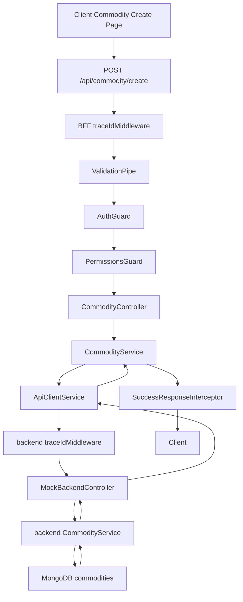
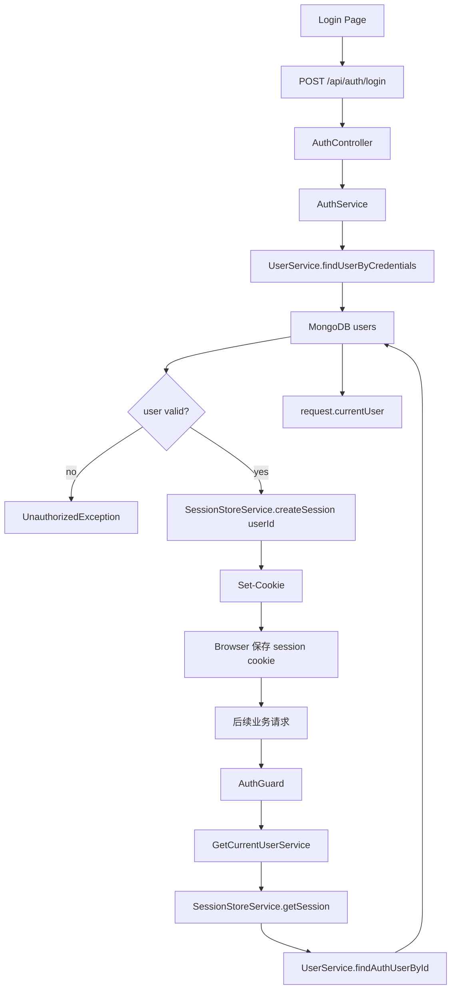
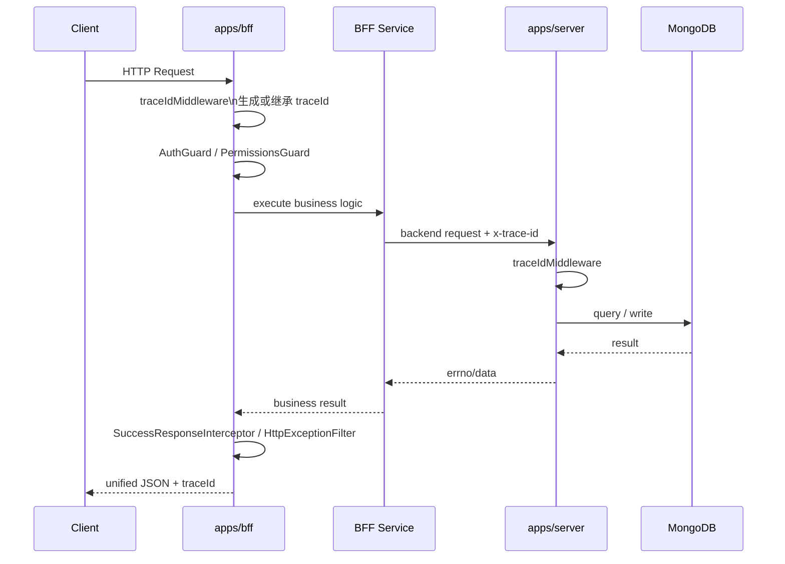
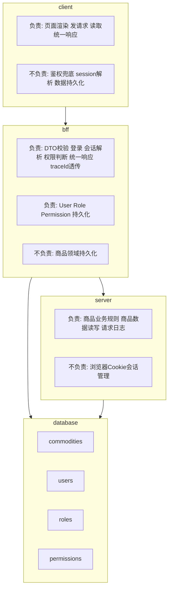
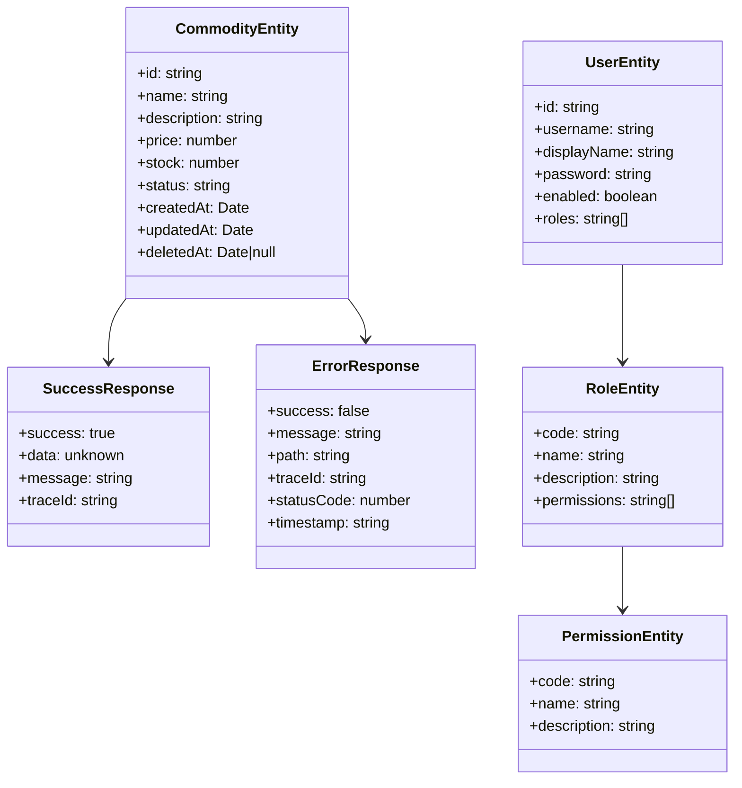
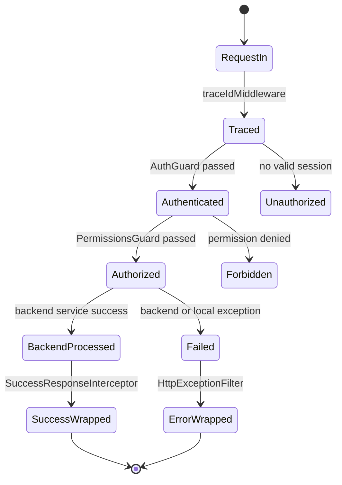
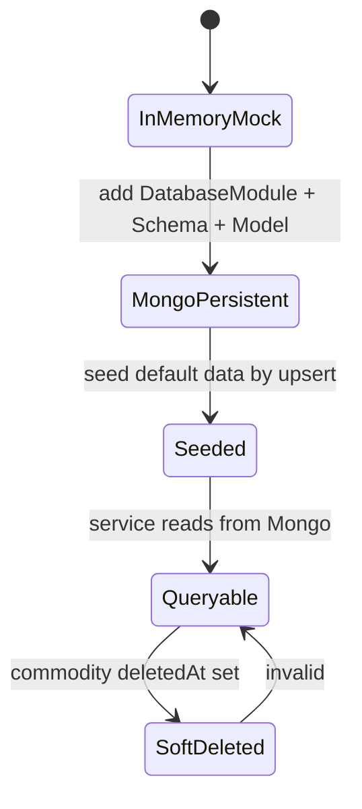

# F7-01 Unified Response Trace And Mongoose Persistence

这份文档整理本次一组连续改动：

- BFF 统一错误响应
- BFF 统一成功响应
- BFF / backend 一次请求全链路追踪
- backend 商品切到 MongoDB 持久化
- BFF 用户、角色、权限切到 MongoDB 持久化

重点不是只列“改了哪些文件”，而是按统一模板把这次提交里的数据流、系统边界、数据结构、状态变化、规则兜底，以及 NestJS 能力映射梳理清楚。

---

## 1. 场景目标

用户在做什么：

- 前端请求 BFF 登录、查商品、创建商品、维护用户角色权限
- BFF 把商品请求转发给 backend
- backend 读写商品数据
- BFF 自己维护登录、会话、用户、角色、权限

系统要完成什么：

- 所有成功响应统一为 `success / data / message / traceId`
- 所有错误响应统一为 `success / message / path / traceId / statusCode / timestamp`
- 一次请求进入系统后，在 BFF、backend、日志里都能用同一个 `traceId` 串起来
- backend 商品数据不再依赖进程内 mock 数组，改为 MongoDB 持久化
- BFF 用户、角色、权限不再依赖进程内 mock 数组，改为 MongoDB 持久化
- 登录和鉴权从真实持久化用户、角色、权限中读取
- 默认测试账号和 RBAC 基础数据可以重复初始化，不产生重复脏数据

当前关键落地文件：

- [apps/bff/src/common/filters/http-exception.filter.ts](/Users/liuxing/Desktop/Space/beike-simulation/next-bff/apps/bff/src/common/filters/http-exception.filter.ts:1)
- [apps/bff/src/common/interceptors/success-response.interceptor.ts](/Users/liuxing/Desktop/Space/beike-simulation/next-bff/apps/bff/src/common/interceptors/success-response.interceptor.ts:1)
- [apps/bff/src/common/interceptors/request-logging.interceptor.ts](/Users/liuxing/Desktop/Space/beike-simulation/next-bff/apps/bff/src/common/interceptors/request-logging.interceptor.ts:1)
- [apps/bff/src/database/database.module.ts](/Users/liuxing/Desktop/Space/beike-simulation/next-bff/apps/bff/src/database/database.module.ts:1)
- [apps/bff/src/auth/rbac-seed.service.ts](/Users/liuxing/Desktop/Space/beike-simulation/next-bff/apps/bff/src/auth/rbac-seed.service.ts:1)
- [apps/server/src/database/database.module.ts](/Users/liuxing/Desktop/Space/beike-simulation/next-bff/apps/server/src/database/database.module.ts:1)
- [apps/server/src/mock-backend/commodity.service.ts](/Users/liuxing/Desktop/Space/beike-simulation/next-bff/apps/server/src/mock-backend/commodity.service.ts:1)

---

## 2. 请求流转图

### 2.1 商品创建整体流程图



### 2.2 登录与鉴权流程图



### 2.3 请求追踪时序图



---

## 3. 系统分层图



分层职责展开：

- client
  - 负责发请求和根据统一响应更新页面状态
  - 不负责决定用户是否真的有权限
- bff
  - 负责 HTTP 入口统一、登录、鉴权、会话、响应包装、错误包装、trace 透传
  - 负责用户、角色、权限持久化
  - 不负责商品领域存储细节
- server
  - 负责商品业务规则和商品持久化
  - 负责 backend 侧请求日志和错误日志
  - 不负责浏览器 session
- database
  - 负责真正的数据持久化
  - 不负责 HTTP 协议和页面状态

---

## 4. 输入 / 输出

### 4.1 输入

登录输入：

```json
{
  "username": "admin",
  "password": "admin123"
}
```

商品创建输入：

```json
{
  "name": "新的商品",
  "description": "商品描述",
  "price": 199,
  "stock": 10,
  "status": "pending"
}
```

角色绑定权限输入：

```json
{
  "permissions": ["commodity:read", "commodity:create", "commodity:update"]
}
```

用户绑定角色输入：

```json
{
  "roles": ["operator", "viewer"]
}
```

追踪输入：

- 请求头可能带 `x-trace-id`
- 如果没带，BFF / backend 中间件自动生成

### 4.2 输出

BFF 成功响应：

```json
{
  "success": true,
  "data": {},
  "message": "ok",
  "traceId": "trace-xxx"
}
```

BFF 失败响应：

```json
{
  "success": false,
  "message": "permission denied",
  "path": "/api/commodity/create",
  "traceId": "trace-xxx",
  "statusCode": 403,
  "timestamp": "2026-04-28T00:00:00.000Z"
}
```

backend 内部响应：

```json
{
  "errno": 0,
  "errmsg": "",
  "data": {}
}
```

页面最终状态变化：

- 成功时页面拿到统一 `data/message/traceId`
- 失败时页面拿到统一 `message/traceId`
- 前端不再依赖每个接口自己拼不同错误结构

---

## 5. 数据结构图



实际落地结构：

- 用户持久化结构
  - [apps/bff/src/user/schemas/user.schema.ts](/Users/liuxing/Desktop/Space/beike-simulation/next-bff/apps/bff/src/user/schemas/user.schema.ts:1)
- 角色持久化结构
  - [apps/bff/src/role/schemas/role.schema.ts](/Users/liuxing/Desktop/Space/beike-simulation/next-bff/apps/bff/src/role/schemas/role.schema.ts:1)
- 权限持久化结构
  - [apps/bff/src/permission/schemas/permission.schema.ts](/Users/liuxing/Desktop/Space/beike-simulation/next-bff/apps/bff/src/permission/schemas/permission.schema.ts:1)
- 商品持久化结构
  - [apps/server/src/mock-backend/schemas/commodity.schema.ts](/Users/liuxing/Desktop/Space/beike-simulation/next-bff/apps/server/src/mock-backend/schemas/commodity.schema.ts:1)

---

## 6. 状态变化图

### 6.1 请求处理状态变化



### 6.2 数据持久化状态变化



这次提交里最重要的状态变化有：

- 响应从“每个 controller 自己拼”变成“全局统一包装”
- 请求从“日志难串联”变成“全链路带 traceId”
- 商品从“进程内数组”变成“MongoDB 文档”
- RBAC 从“进程内数组”变成“MongoDB 文档”
- session 从“存完整 user 快照”变成“只存 userId，再回库取最新角色”

---

## 7. 规则兜底

参数校验在哪层：

- BFF `ValidationPipe` 兜底 DTO 校验
- controller 不自己重复做字段合法性检查

权限校验在哪层：

- BFF `AuthGuard` 负责“是不是已登录”
- BFF `PermissionsGuard` 负责“有没有权限”
- 权限判断读取 Mongo 中真实 role permissions，而不是内存 mock

业务规则在哪层：

- 用户、角色、权限基础规则在 BFF service
- 商品业务规则在 backend `CommodityService`
- 例如商品状态变更合法性、软删除规则、重名检查都在 backend service

错误处理在哪层：

- BFF `HttpExceptionFilter` 统一对外错误结构
- backend `HttpExceptionFilter` 统一日志和 500 兜底

审计与追踪在哪层：

- `traceIdMiddleware` 保证每次请求有同一个 traceId
- `RequestLoggingInterceptor` 记录耗时、路径、状态码、traceId
- `ApiClientService` 透传 `x-trace-id` 到 backend

数据初始化在哪层：

- BFF `RbacSeedService` 用 upsert 重复初始化用户、角色、权限
- backend `CommodityService.onModuleInit()` 在商品集合为空时初始化演示数据

---

## 8. NestJS 能力映射

Controller 解决什么问题：

- 提供稳定 HTTP 入口
- 不直接做数据库读写
- 不直接拼统一成功/失败 envelope

DTO / Pipe 解决什么问题：

- 保证进入业务层之前，请求数据结构是合法的
- 把参数错误收口成统一 400 响应

Guard 解决什么问题：

- `AuthGuard` 解决“当前请求有没有登录”
- `PermissionsGuard` 解决“当前用户是否具备目标权限”

Service 解决什么问题：

- 聚合业务逻辑
- 组织数据库查询和更新
- 组织跨层调用，例如 BFF -> backend

Interceptor 解决什么问题：

- `SuccessResponseInterceptor` 统一成功响应结构
- `RequestLoggingInterceptor` 统一记录请求耗时和 traceId

Filter 解决什么问题：

- 统一错误响应结构
- 统一错误日志格式
- 把 traceId 带进错误日志和错误响应

Provider 解决什么问题：

- `ApiClientService` 解决 backend 调用和 trace 透传
- `SessionStoreService` 解决 sessionId 到 userId 的映射
- `RbacSeedService` 解决默认数据初始化

Module 解决什么问题：

- `DatabaseModule` 解决 Mongo 连接
- `MongooseModule.forFeature` 解决按模块注册模型
- 避免 controller 直接依赖 Mongoose Model

Mongoose 能力解决什么问题：

- `forRootAsync` 解决连接配置外置化
- `forFeature` 解决模型按模块管理
- schema 解决持久化结构显式化
- model injection 解决 service 层读写 MongoDB

---

## 9. 一句话总结

这次提交真正完成的，不是“又加了几层 NestJS 文件”，而是把系统从“能跑的 mock 演示”推进到“响应统一、日志可追踪、商品和 RBAC 有真实持久化边界”的状态。
