# next-bff-three-tier 功能设计架构

这是一个用于练习真实后台系统能力的三层 MVP。它的重点不是本地操作手册，而是用一个最小系统模拟后台产品常见的功能模块、系统边界和工程治理能力。

当前系统围绕一个后台商品管理场景展开：

```text
用户登录
-> 权限校验
-> 商品管理
-> 图片上传
-> 审计记录
-> 缓存治理
-> 统一响应、错误、日志、健康检查
```

---

## 1. 系统定位

当前系统模拟的是一个后台管理系统，而不是单纯的前端页面或单个 API 服务。

它包含三层：

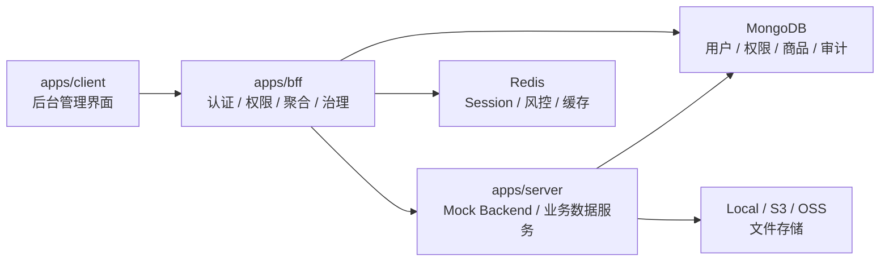

三层职责：

| 层 | 职责 | 不负责 |
|---|---|---|
| `apps/client` | 后台页面、表单、列表、错误展示、用户交互 | 不保存权限边界，不直接访问数据库 |
| `apps/bff` | 登录会话、RBAC、CSRF、接口聚合、协议转换、审计、缓存、统一响应和错误 | 不直接承载全部后端业务数据规则 |
| `apps/server` | 模拟后端商品数据、上传存储、查询计划、状态流转 | 不处理浏览器登录态和前端权限展示 |

---

## 2. 功能模块总览

| 模块 | 当前能力 | 设计目标 |
|---|---|---|
| 认证会话 | 登录、退出、当前用户、session 列表、登录风控 | 建立“你是谁”的服务端边界 |
| RBAC 权限 | 用户、角色、权限点、接口权限拦截 | 建立“你能做什么”的服务端边界 |
| 商品管理 | 列表、详情、创建、编辑、状态变更、删除、恢复 | 模拟后台核心业务资源管理 |
| 商品审计 | 记录创建、编辑、状态变更、删除、恢复的前后变化 | 模拟高风险操作可追溯能力 |
| 图片上传 | 文件上传、类型/大小校验、文件访问、缓存 header、存储驱动切换 | 模拟后台资源上传和对象存储边界 |
| BFF 协议转换 | 请求参数转换、header 注入、后端响应解包、错误映射 | 模拟前端友好协议与后端内部协议的隔离 |
| 缓存治理 | Redis session、登录风控计数、商品列表缓存、缓存排障 header | 模拟性能优化和缓存排障能力 |
| 可观测性 | traceId、结构化日志、metrics、OpenTelemetry、health ready/live | 模拟线上排障和服务运行治理 |

---

## 3. 认证会话模块

### 真实诉求

后台系统首先要解决的是“请求来自哪个用户”。浏览器不能自己声明用户身份，服务端必须通过可信会话识别当前用户。

### 当前设计

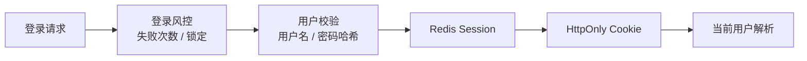

### 模块职责

- 校验用户名和密码。
- 登录失败时记录失败次数，并在超过阈值后锁定。
- 登录成功后创建 Redis session。
- 通过 HttpOnly cookie 保存 session id。
- 后续请求通过 cookie 解析当前用户。
- 记录登录成功、失败、被风控拦截的审计日志。

### 关键状态

| 状态 | 存储 | 用途 |
|---|---|---|
| session id | Cookie | 浏览器持有的会话凭证 |
| session record | Redis | 服务端会话记录 |
| 登录失败计数 | Redis | 登录风控 |
| 登录审计日志 | MongoDB | 追踪登录行为 |

### 设计边界

- Cookie 只保存 session id，不保存用户完整信息。
- 当前用户身份以服务端 Redis session 为准。
- 登录失败风控是认证模块内部能力，不放到前端。
- 登录日志是安全审计数据，不等同于业务操作审计。

### 后续扩展

- 多端设备管理。
- refresh token / access token。
- 单点登录 SSO。
- OAuth2 / OIDC。
- 设备指纹和异地登录提醒。

---

## 4. RBAC 权限模块

### 真实诉求

后台系统里“已登录”不代表“什么都能做”。商品运营、只读用户、管理员应该有不同能力。前端隐藏按钮只能改善体验，不能作为权限边界。

### 当前设计

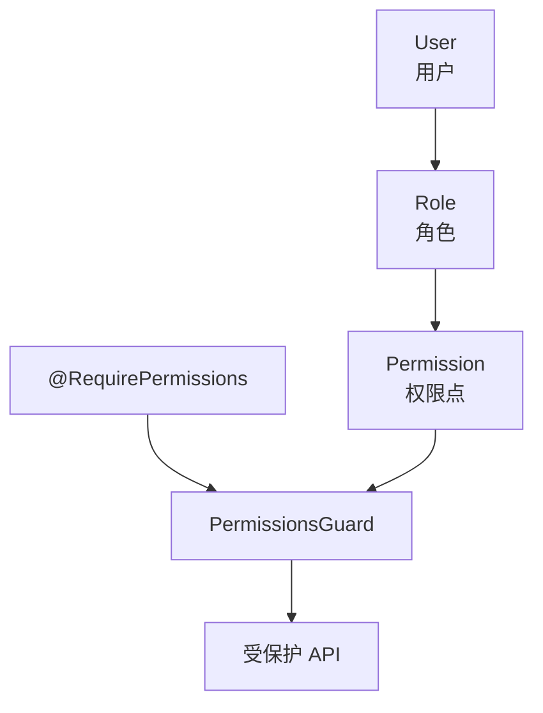

### 模块职责

- 维护用户、角色、权限点。
- 用户绑定角色。
- 角色绑定权限点。
- 接口声明所需权限。
- 请求进入业务前做权限判断。

### 当前角色

| 角色 | 能力 |
|---|---|
| `admin` | 用户、角色、权限、商品、审计全部能力 |
| `operator` | 商品读取、创建、更新 |
| `viewer` | 商品只读 |

### 当前权限点

| 权限点 | 能力 |
|---|---|
| `commodity:read` | 查看商品列表和详情 |
| `commodity:create` | 创建商品 |
| `commodity:update` | 编辑商品和变更状态 |
| `commodity:delete` | 删除和恢复商品 |
| `audit:read` | 查看审计日志 |
| `user:manage` | 管理用户 |
| `role:manage` | 管理角色 |
| `permission:manage` | 管理权限点 |

### 设计边界

- `AuthGuard` 解决“有没有登录”。
- `PermissionsGuard` 解决“有没有权限”。
- 401 表示未认证，403 表示已认证但无权限。
- 权限判断必须在 BFF 服务端执行，不能依赖前端隐藏入口。

### 后续扩展

- 全局默认鉴权：`APP_GUARD + @Public()`。
- 数据权限：按租户、部门、资源归属限制可见范围。
- 高风险操作二次确认。
- 权限变更审计。

---

## 5. 商品管理模块

### 真实诉求

商品是当前 MVP 的核心业务资源。它用于承载后台系统常见的列表查询、筛选排序、创建编辑、状态流转、删除恢复和审计链路。

### 当前设计

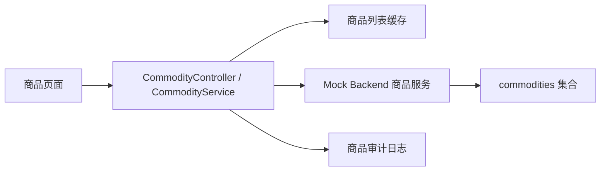

### 模块职责

- 提供商品列表、详情、创建、编辑、状态变更、删除、恢复。
- 将前端查询参数转换为后端查询协议。
- 将当前用户、租户、traceId 注入后端请求。
- 对写操作记录审计日志。
- 写操作后清理商品列表缓存。

### 商品能力

| 能力 | 当前设计 |
|---|---|
| 列表查询 | 支持分页、状态、关键字、价格、库存、创建时间筛选 |
| 排序 | 支持按创建时间、名称、价格、状态、库存排序 |
| 分页 | 支持 offset 和 cursor 分页模拟 |
| 创建 | 创建时记录创建人 |
| 编辑 | 记录修改前后快照 |
| 状态变更 | 通过状态流转规则校验 |
| 删除 | 软删除，不直接物理删除 |
| 恢复 | 恢复软删除商品 |

### 商品状态

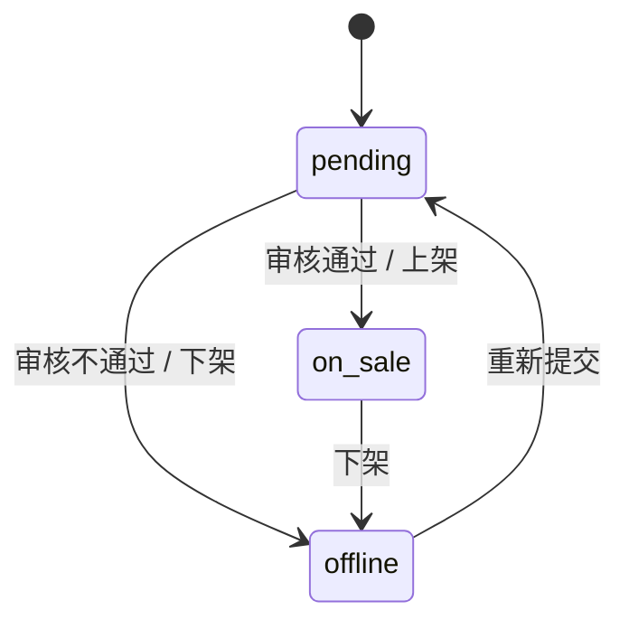

### 设计边界

- BFF 负责权限、协议转换、审计、缓存。
- mock backend 负责商品数据规则、状态流转和 MongoDB 查询。
- 商品删除是软删除，审计日志保留操作原因和前后变化。
- 商品列表缓存只缓存查询结果，不作为数据事实来源。

### 后续扩展

- 商品分类、品牌、SKU。
- 商品审核流。
- 批量导入商品。
- 商品变更事件同步搜索索引。
- 商品库存独立服务。

---

## 6. 商品审计模块

### 真实诉求

后台系统里的高风险操作必须可追溯。只知道“商品变了”不够，还要知道谁改的、什么时候改的、改前是什么、改后是什么、为什么改。

### 当前设计

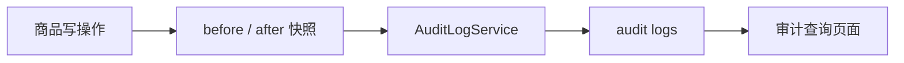

### 模块职责

- 商品创建时记录创建摘要。
- 商品编辑时记录可编辑字段前后变化。
- 商品状态变更时记录旧状态、新状态和原因。
- 商品删除和恢复时记录删除状态前后变化和原因。
- 支持按操作人、动作、对象、时间查询。

### 审计字段

| 字段 | 说明 |
|---|---|
| `operator` | 操作人 |
| `action` | 操作类型 |
| `target` | 操作对象 |
| `before` | 操作前快照 |
| `after` | 操作后快照 |
| `reason` | 操作原因 |
| `traceId` | 链路追踪标识 |
| `createdAt` | 操作时间 |

### 设计边界

- 审计日志不是普通业务日志，不能随意删除。
- 审计记录应由服务端生成，不能相信前端传入。
- 审计日志用于追责和排障，不用于商品当前状态展示。

### 后续扩展

- 审计日志导出。
- 高风险操作审批。
- 审计日志不可篡改存储。
- 审计告警，例如短时间大量删除商品。

---

## 7. 图片上传与文件访问模块

### 真实诉求

商品通常需要图片。上传能力不仅是“把文件传上去”，还涉及文件类型、大小、安全、存储位置、访问 URL、缓存策略和未来的 CDN。

### 当前设计

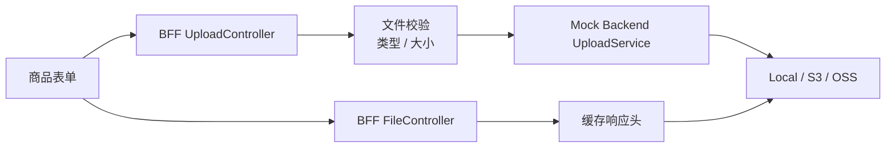

### 模块职责

- 接收商品图片。
- 校验文件存在、类型和大小。
- 转发上传到 mock backend。
- 根据存储驱动保存文件。
- 对前端返回 BFF 文件访问地址。
- 文件访问时设置缓存 header。
- 支持签名 URL。

### 存储抽象

当前 mock backend 用 `STORAGE_SERVICE` token 抽象存储实现：

| Driver | 用途 |
|---|---|
| `local` | 本地开发和 MVP 演示 |
| `s3` | 模拟 AWS S3 |
| `oss` | 模拟阿里云 OSS |

### 设计边界

- BFF 对前端隐藏真实存储地址。
- mock backend 负责保存文件。
- 文件访问可以走登录态或签名 URL。
- 当前只做类型和大小校验，未做病毒扫描、图片解码和缩略图。

### 后续扩展

- 图片病毒扫描。
- 图片压缩和缩略图生成。
- 上传异步任务队列。
- CDN 回源和缓存失效。
- 临时文件生命周期清理。

---

## 8. BFF 协议转换模块

### 真实诉求

前端希望使用适合页面的字段和接口，后端可能使用适合数据库或服务内部的协议。BFF 的价值是隔离这两种协议，而不是让前端直接适配后端细节。

### 当前设计

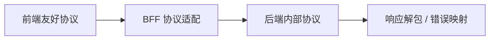

### 模块职责

- 将前端查询字段转成 backend 查询字段。
- 将分页参数转成 offset/limit 或 cursor 形式。
- 注入 `x-trace-id`、`x-user-id`、`x-tenant-id`。
- 解包 backend 的 `success` 或 `errno` 响应。
- 将 backend 业务错误映射成 BFF HTTP 异常。
- 将 backend 网络错误映射成 502。

### 设计边界

- 前端不直接知道 backend 内部协议。
- backend 不直接知道浏览器 cookie session。
- BFF 负责当前用户上下文注入。
- BFF 不是透明代理，它承担协议和治理边界。

### 后续扩展

- 多 backend 聚合。
- API versioning。
- SDK / OpenAPI 生成。
- backend 降级和熔断。
- 按租户路由到不同后端。

---

## 9. 缓存治理模块

### 真实诉求

后台系统会遇到性能问题，但缓存会引入一致性和排障问题。MVP 里通过商品列表缓存模拟“性能优化”和“缓存可观察性”的平衡。

### 当前设计

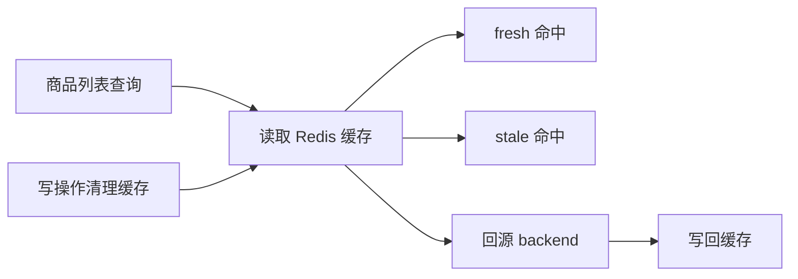

### 模块职责

- 登录 session 存 Redis。
- 登录失败风控计数存 Redis。
- 商品列表结果存 Redis。
- 支持 fresh/stale/miss 状态。
- stale 命中时返回旧数据并后台刷新。
- 商品写操作后清理商品列表缓存。
- 通过响应 header 暴露缓存状态。

### 缓存状态

| 状态 | 含义 |
|---|---|
| `fresh` | 缓存新鲜，直接返回 |
| `stale` | 缓存过期但可用，先返回再后台刷新 |
| `miss` | 缓存不存在或不可用，回源 backend |

### 设计边界

- 缓存不是事实数据源。
- 写操作必须触发缓存失效。
- 缓存 key 需要包含租户、角色和查询条件。
- 缓存排障信息必须能在响应 header 或日志中观察。

### 后续扩展

- 精确 key 失效。
- 热点缓存预热。
- 防缓存击穿。
- 多级缓存。
- 缓存一致性指标和告警。

---

## 10. 可观测性与运行治理模块

### 真实诉求

真实系统不能只看“页面有没有报错”。出问题时需要知道哪个请求、哪个用户、哪个接口、哪个后端依赖、耗时多少、失败在哪里。

### 当前设计

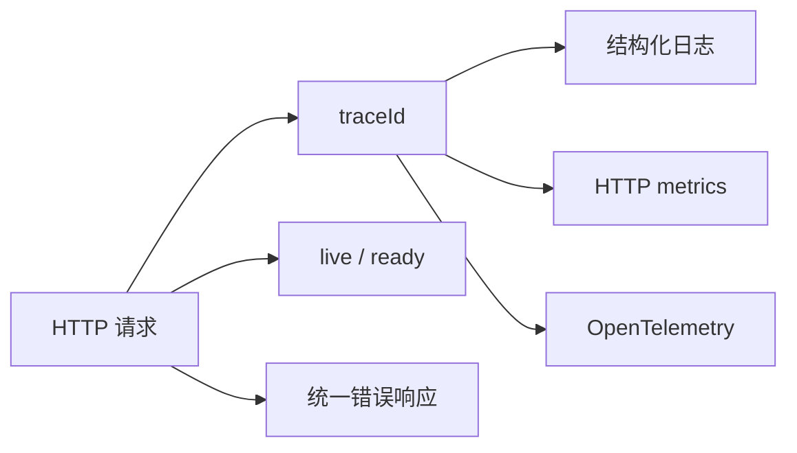

### 模块职责

- 每个请求生成或透传 traceId。
- 成功响应带 traceId。
- 错误响应带 traceId、path、statusCode。
- 请求完成后记录结构化日志。
- 记录 HTTP 指标。
- 初始化 OpenTelemetry。
- 提供 live/ready 健康检查。
- 启动时检查 MongoDB、Redis 等依赖。
- 关闭时进入 draining 状态。

### 设计边界

- traceId 用于排障，不用于认证。
- health live 表示进程活着，ready 表示是否可接流量。
- 结构化日志服务于机器检索，不只是给人看。
- 统一错误响应不能暴露内部敏感信息。

### 后续扩展

- 接入 Prometheus / Grafana。
- 接入 OpenTelemetry Collector。
- 错误告警。
- 按 traceId 查询完整链路。
- 业务指标，例如商品创建成功率、上传失败率、权限拒绝次数。

---

## 11. 模块之间的关键链路

### 11.1 创建商品链路

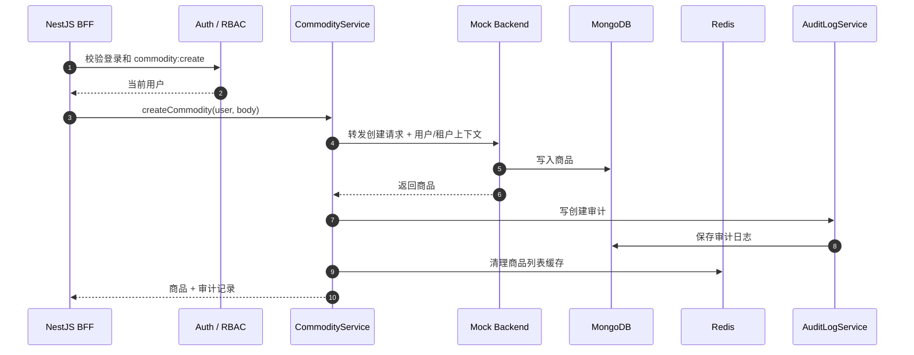

### 11.2 查看商品列表链路

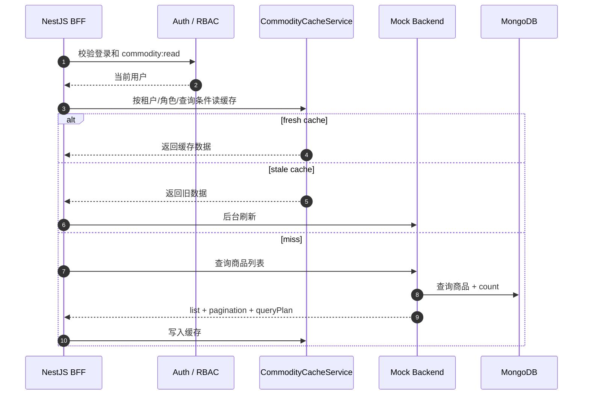

### 11.3 上传图片链路

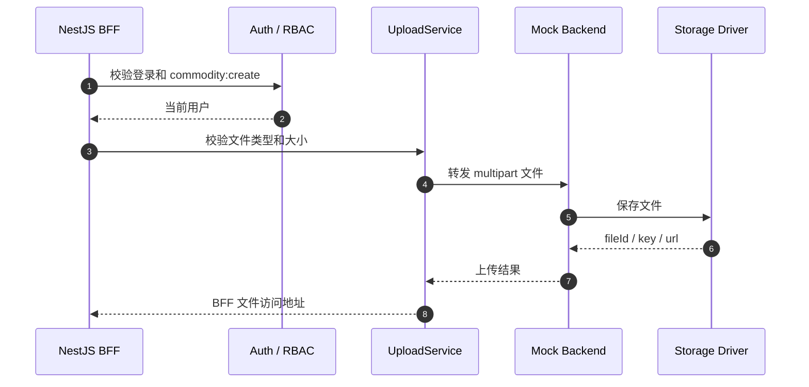

---

## 12. 当前 MVP 边界

### 已经具备的系统能力

- 认证、会话、CSRF、登录风控。
- RBAC 权限控制。
- 商品管理完整 CRUD 变体。
- 商品状态流转。
- 商品审计日志。
- 图片上传和存储抽象。
- BFF 协议转换和后端错误映射。
- Redis session、风控、商品列表缓存。
- Schedule/Cron 登录风控每日统计。
- BullMQ 商品批量导入异步任务。
- MongoDB schema、索引和查询计划模拟。
- 统一成功响应和统一错误响应。
- traceId、结构化日志、metrics、OpenTelemetry 初始化。
- health live/ready 和优雅关闭。

### 仍然是模拟或未覆盖的能力

- 图片扫描、压缩、缩略图生成。
- 审计导出异步任务。
- 临时文件清理、缓存预热、死信队列、任务告警。
- 更完整的多租户数据权限。
- API versioning。
- 生产级对象存储、CDN 和生命周期管理。
- 告警平台和 trace 后端。
- 微服务消息 broker。
- 生产级密钥管理和发布流水线。

---

## 13. 后续功能演进方向

按当前系统的真实诉求，后续可以这样演进：

| 真实诉求 | 建议能力 |
|---|---|
| 商品批量导入进度、失败重试和状态查询 | Queue / BullMQ |
| 图片扫描、缩略图、审计导出 | 后续按需再接 Queue / BullMQ |
| 临时文件清理、缓存预热 | Schedule / Cron |
| 导出进度、扫描进度、审核提醒 | SSE / WebSocket |
| 上传、登录、导出等高风险接口统一限流 | Throttler |
| 新增接口默认需要登录，公开接口显式声明 | Global Guard + `@Public()` |
| 商品变更后审计、清缓存、通知、搜索同步解耦 | EventEmitter / CQRS |
| 部署平台标准健康检查 | Terminus |
| 移动端或开放 API | Passport + JWT Strategy |
| 搜索、库存、通知拆成独立服务 | Microservices |

---

## 14. 设计阅读入口

如果要继续理解这个系统的设计，可以按功能读：

| 主题 | 文档 |
|---|---|
| NestJS 能力地图 | `F1007-当前系统NestJS能力地图.md` |
| RBAC 权限场景 | `F1005-BFF-RBAC用户角色权限场景.md` |
| 当前用户守卫 | `F1002-BFF当前用户守卫场景.md` |
| 拦截器、管道、过滤器顺序 | `F1004-拦截器管道过滤器顺序.md` |
| 登录会话 | `docs/03-登录会话.md` |
| BFF 和 Backend 分层 | `docs/33-BFF与Backend为什么分层.md` |
| 权限为什么用 Guard 和 Decorator | `docs/35-权限为什么用Guard和Decorator.md` |
| DTO、Schema、业务规则边界 | `docs/39-DTO-Schema-业务规则为什么不能混在一起.md` |
| 商品状态流转 | `docs/37-商品状态流转为什么放Service.md` |
| 登录风控每日统计 Cron | `docs/46-登录风控每日统计Cron图解.md` |
| 请求层与错误治理 | `docs/13-请求层与错误治理.md` |
| 可观测性与排障 | `docs/21-可观测性与排障体系.md` |
| 上线潜在问题 | `docs/31-当前系统上线潜在问题清单.md` |
