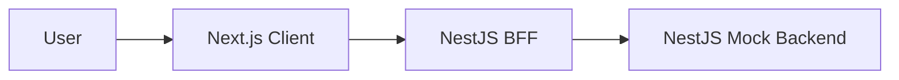
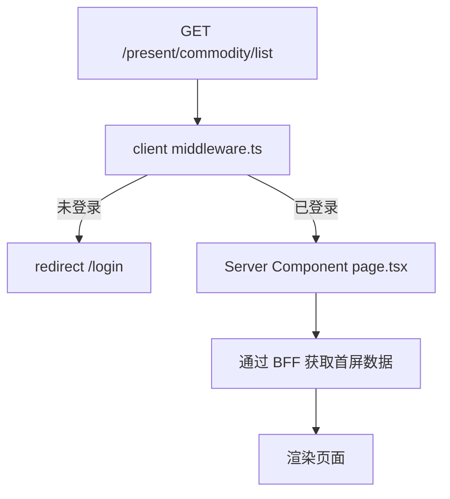
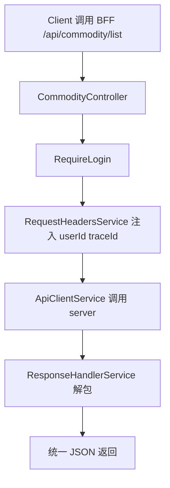
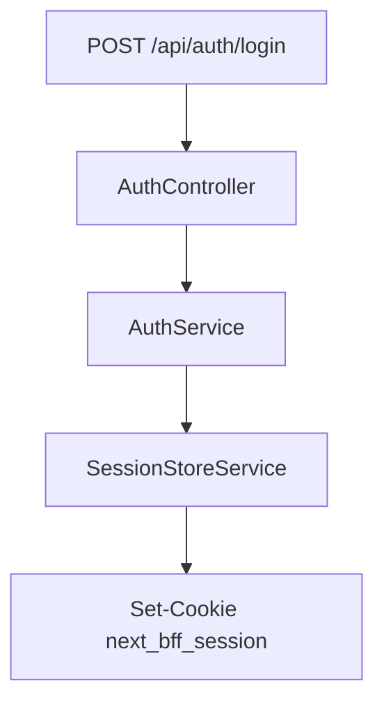

# Next.js + NestJS 三层面试型 MVP 方案

这份文档的目标很直接：

- 目标 1：熟悉 Next.js App Router 的页面组织方式
- 目标 2：掌握从 0 到 1 搭建一个 `client / bff / server` 三层应用
- 目标 3：后端保持简单，但项目结构、链路和讲解深度足够面试

结论先说：

```text
不要继续做“模拟 Hobber 框架”。
直接做一个 Next.js + NestJS BFF + NestJS mock backend 的小型后台。
```

推荐项目名：

```text
next-bff
```

---

## 1. 项目定位

这是一个小型运营后台，不追求业务复杂，追求“结构完整、链路清晰、讲得漂亮”。

MVP 业务建议用“商品管理”：

- 好理解
- 有列表、详情、创建、上传
- 同时覆盖页面、表单、BFF、鉴权、错误处理

一句话介绍：

```text
一个基于 Next.js App Router 的前端项目，配套一个 NestJS BFF 和一个 NestJS mock backend。
项目包含登录、页面壳、商品列表、商品详情、创建商品、文件上传，以及完整的三层职责拆分。
```

---

## 2. 最小且完整的 MVP 功能点

## 2.1 必做功能

### Client 页面

- `/login`：登录页
- `/`：重定向到 `/present/commodity/list`
- `/present/commodity/list`：商品列表页
- `/present/commodity/[id]`：商品详情页
- `/present/commodity/create`：创建商品页

### BFF API

- `POST /api/auth/login`
- `POST /api/auth/logout`
- `GET /api/auth/me`
- `GET /api/commodity/list`
- `GET /api/commodity/:id`
- `POST /api/commodity/create`
- `POST /api/upload`

### Backend API

- `GET /api/health`
- `GET /api/users`
- `GET /api/commodity/list`
- `GET /api/commodity/:id`
- `POST /api/commodity/create`
- `POST /api/upload`

### 框架能力

- `apps/client/middleware.ts`：保护 `/present/**`
- Server Component 做首屏数据获取
- Client Component 做筛选、分页、表单交互
- NestJS Controller 作为 BFF API 入口
- 统一登录校验
- 统一 header 注入
- 统一响应解包
- 统一错误语义
- `loading.tsx` 和 `error.tsx`

### 工程能力

- 清晰目录结构
- `README.md`
- `ARCHITECTURE.md`
- 基础测试
- 面试讲解稿

## 2.2 可选增强

- 商品编辑
- 商品删除
- 角色权限
- traceId 展示
- 操作日志
- e2e 测试

## 2.3 明确不做

- 真实数据库
- 真实 SSO / CAS
- 微服务网关
- 复杂 RBAC
- 真正的文件存储
- 大而全后台系统

---

## 3. 为什么这个 MVP 最合适

因为它刚好覆盖了两个方向的关键点。

### 3.1 Next.js 方向

- `app/` 文件路由
- `layout.tsx` 的页面壳
- Server Component / Client Component 分工
- redirect / 动态路由 / 错误边界 / 上传

### 3.2 NestJS 方向

- `main.ts` 启动流程
- `module / controller / service` 分层
- 鉴权与会话逻辑
- BFF 转发与聚合
- mock backend 模块化组织

同时又保留了传统后台项目最值得讲的部分：

- 登录态
- 页面层与 BFF 层解耦
- BFF 与 backend 解耦
- 统一错误处理
- 工程目录设计

---

## 4. 推荐目录结构

```text
next-bff/
  apps/
    client/
      app/
        layout.tsx
        page.tsx
        login/
          page.tsx
        present/
          layout.tsx
          commodity/
            list/
              page.tsx
              loading.tsx
              error.tsx
            [id]/
              page.tsx
            create/
              page.tsx
      src/
        components/
          app-shell.tsx
          side-nav.tsx
          top-bar.tsx
        features/
          commodity/
            components/
            services/
            types.ts
        lib/
          routes.ts
      middleware.ts
    bff/
      src/
        main.ts
        app.module.ts
        auth/
          auth.module.ts
          auth.controller.ts
          auth.service.ts
          get-current-user.ts
          require-login.ts
          session-cookie.ts
          session-store.service.ts
        commodity/
          commodity.module.ts
          commodity.controller.ts
          commodity.service.ts
        common/
          api-client.service.ts
          request-headers.service.ts
          response-handler.service.ts
          errors.ts
    server/
      src/
        main.ts
        app.module.ts
        mock-backend/
          mock-backend.module.ts
          commodity.service.ts
          users.service.ts
          upload.service.ts
  README.md
  ARCHITECTURE.md
```

---

## 5. 架构图

## 5.1 总体结构图



## 5.2 页面访问链路



## 5.3 BFF 请求链路



## 5.4 登录链路



---

## 6. 面试里最值得讲的设计点

## 6.1 页面层

位置：

```text
apps/client/**
```

职责：

- 路由承接
- 页面布局
- 首屏数据获取
- 组合业务组件

不负责：

- 直接处理登录会话
- 直接拼后端 header
- 直接处理后端协议

## 6.2 BFF 层

位置：

```text
apps/bff/src/**
```

职责：

- 统一登录校验
- 统一 header 注入
- 统一调用后端
- 统一响应解包
- 统一错误转换

这是最适合面试展开讲的部分。

## 6.3 Backend 层

位置：

```text
apps/server/src/**
```

职责：

- 模拟真实后端协议
- 返回统一结构
- 故意制造业务错误，验证 BFF 处理能力

这样后端很简单，但 BFF 价值仍然成立。

## 6.4 Feature 层

位置：

```text
apps/client/src/features/commodity/**
```

职责：

- 业务组件
- 表格和表单
- 前端类型
- 页面交互

---

## 7. 最小 MVP TODO List

## 7.1 Phase 1：先跑起来

- 初始化 Next.js App Router 项目
- 初始化 NestJS BFF
- 初始化 NestJS server
- 建立三层目录骨架
- 完成 `/` 跳转
- 完成 `/login`
- 完成 `/present/commodity/list`
- 完成基础 layout
- 写第一版 `README.md`

验收：

```text
能运行，能访问页面，能解释三层目录和文件入口。
```

## 7.2 Phase 2：补登录链路

- BFF 实现登录接口
- 登录成功写 cookie
- 登出清 cookie
- `get-current-user`
- `require-login`
- client 登录页接入真实 BFF

验收：

```text
能完成登录，能解释会话是如何通过 BFF 管理的。
```

## 7.3 Phase 3：补 BFF 基础设施

- `ApiClientService`
- `RequestHeadersService`
- `ResponseHandlerService`
- `errors.ts`
- 统一调用 server
- mock backend 统一返回结构

验收：

```text
能讲清楚为什么要把协议处理收敛到 BFF。
```

## 7.4 Phase 4：补商品链路

- 商品列表
- 商品详情
- 创建商品
- 上传接口
- 错误态与空态

验收：

```text
能完整演示一个从 client 到 bff 再到 server 的业务链路。
```

---

## 8. 面试表达建议

这个项目不要讲成“我写了几个页面”。

要讲成：

```text
我把一个后台应用拆成了前端层、BFF 层、mock backend 层。
前端使用 Next.js App Router，BFF 和 backend 都使用 NestJS。
这样我既能展示页面能力，也能展示中间层和服务端分层能力。
```

面试里最值得强调的点：

- 为什么前端不直接调 backend
- 为什么 BFF 需要统一处理鉴权和协议
- 为什么 mock backend 仍然有价值
- 为什么 Next.js 和 NestJS 组合适合演示完整链路

---

## 9. 当前项目和本方案的对应关系

当前仓库已经落下这些内容：

- `apps/client`：Next.js 页面骨架
- `apps/bff`：NestJS 登录与会话
- `apps/server`：NestJS mock backend 基础骨架
- `README.md`
- `ARCHITECTURE.md`
- `CHANGELOG.md`

接下来最该继续补的是：

1. `apps/client/middleware.ts`
2. `apps/bff` 的 commodity / upload 模块
3. `apps/server` 的 commodity / upload mock 服务
4. client 登录页调用真实 BFF

---

## 10. 一句话总结

```text
这个项目的核心不是“页面多复杂”，而是通过 Next.js + NestJS 的三层结构，把页面、BFF、backend 的职责边界讲清楚。
```
