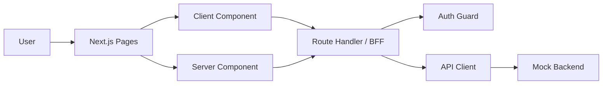
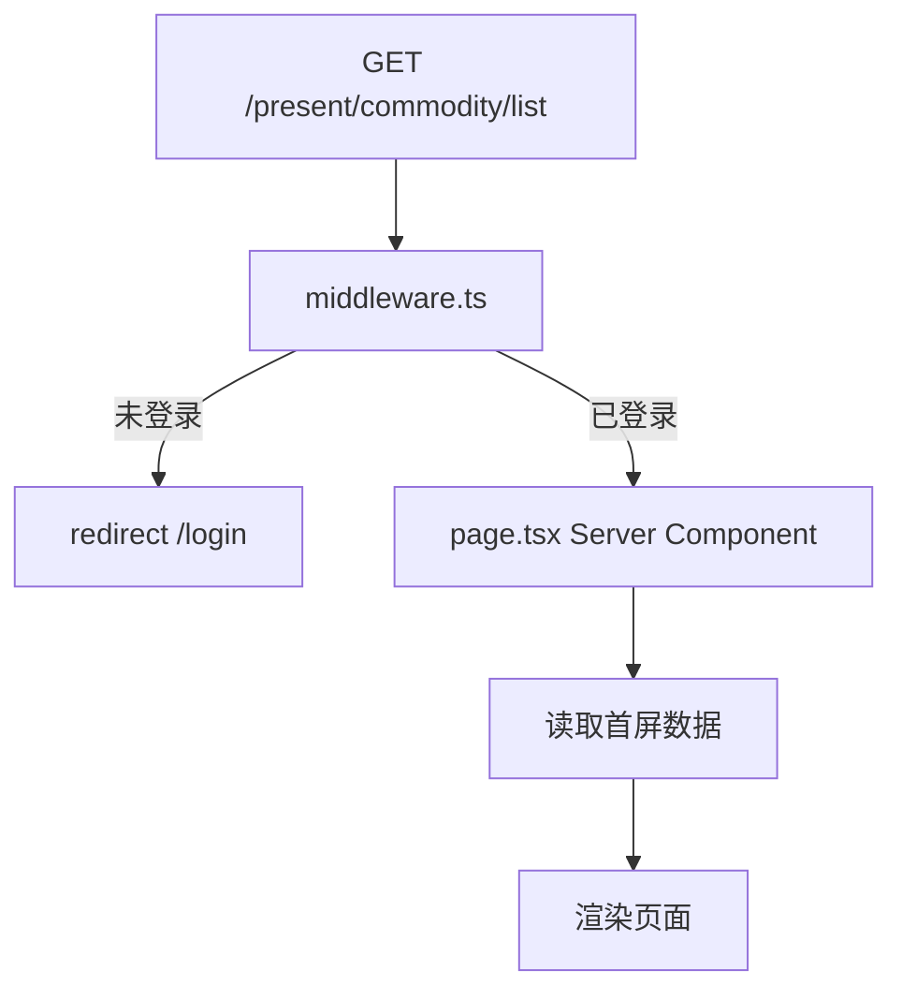
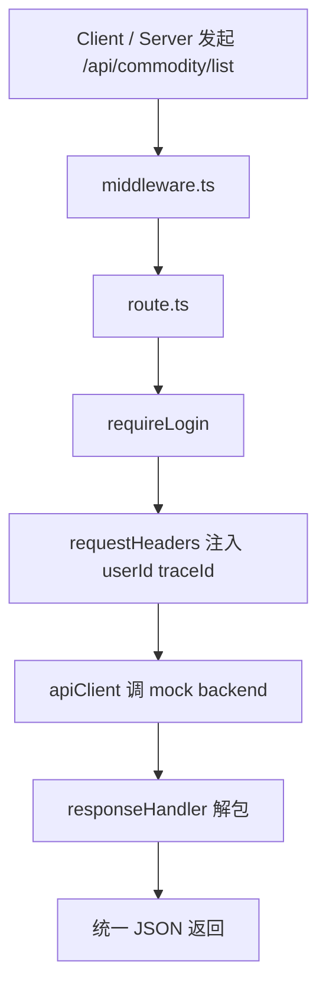
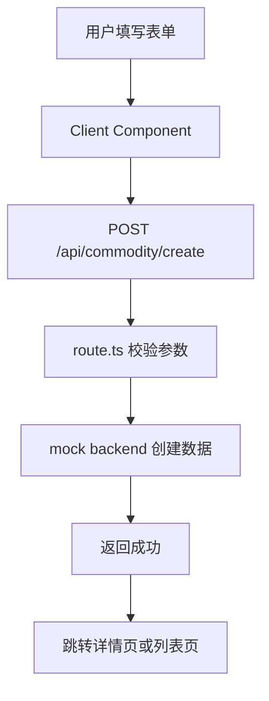
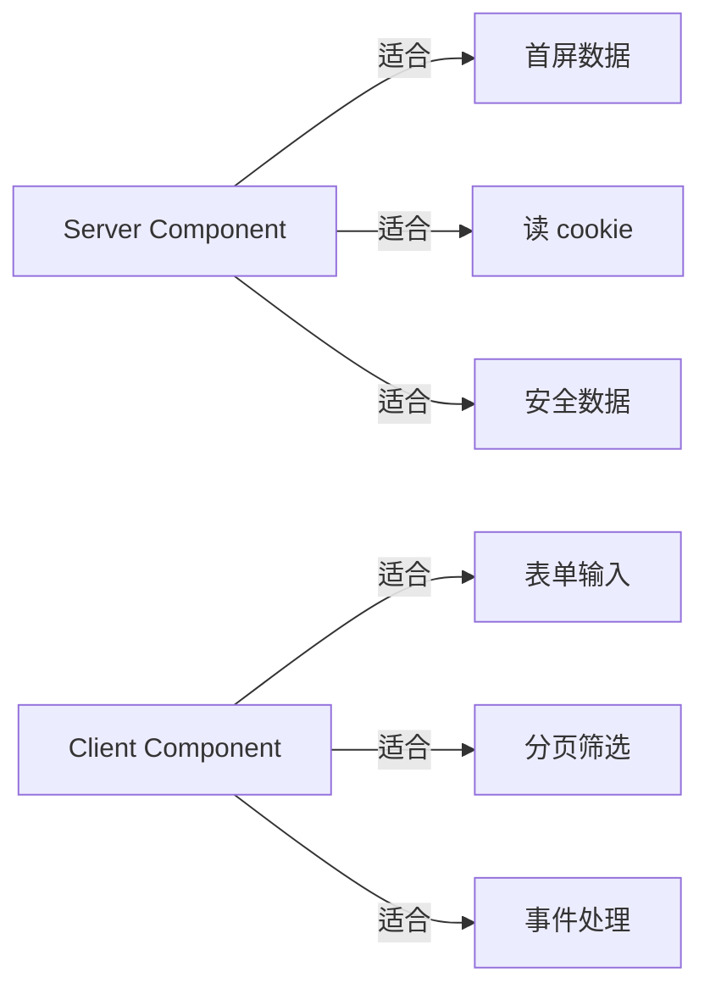

# Next.js + BFF 面试型 MVP 方案

这份文档的目标很直接：

- 目标 1：熟悉 Next.js 的框架设计
- 目标 2：掌握从 0 到 1 搭建一个结合客户端和 BFF 的应用
- 目标 3：后端保持简单，但项目结构、链路和讲解深度足够面试

结论先说：

```text
不要继续做“模拟 Hobber 框架”。
直接做一个 Next.js App Router + BFF 的小型后台。
```

推荐项目名：

```text
next-bff-admin
```

---

## 1. 项目定位

这是一个小型运营后台，不追求业务复杂，追求“结构完整、链路清晰、讲得漂亮”。

MVP 业务建议用“商品管理”：

- 好理解
- 有列表、详情、创建、上传
- 同时覆盖页面、表单、BFF、鉴权、错误处理

一句话介绍：

```text
一个基于 Next.js App Router 的后台项目，包含登录、页面壳、商品列表、商品详情、创建商品、文件上传，以及一层统一的 BFF。
后端使用 mock，但保留真实项目中的鉴权、header 注入、响应解包、错误转换和项目分层。
```

---

## 2. 最小且完整的 MVP 功能点

## 2.1 必做功能

### 页面

- `/login`：登录页
- `/`：重定向到 `/present/commodity/list`
- `/present/commodity/list`：商品列表页
- `/present/commodity/[id]`：商品详情页
- `/present/commodity/create`：创建商品页

### BFF API

- `/api/auth/login`
- `/api/auth/logout`
- `/api/auth/me`
- `/api/commodity/list`
- `/api/commodity/[id]`
- `/api/commodity/create`
- `/api/upload`

### 框架能力

- `middleware.ts`：保护 `/present/**` 和 `/api/**`
- Server Component 做首屏数据获取
- Client Component 做筛选、分页、表单交互
- Route Handler 作为 BFF
- 统一登录校验
- 统一 header 注入
- 统一响应解包
- 统一错误语义
- `loading.tsx` 和 `error.tsx`

### 工程能力

- 清晰目录结构
- `README.md`
- `ARCHITECTURE.md`
- 基础测试
- 面试讲解稿

## 2.2 可选增强

- 商品编辑
- 商品删除
- 角色权限
- traceId 展示
- 操作日志
- e2e 测试

## 2.3 明确不做

- 真实数据库
- 真实 SSO / CAS
- 微服务网关
- 复杂 RBAC
- 真正的文件存储
- 大而全后台系统

---

## 3. 为什么这个 MVP 最合适

因为它刚好覆盖了 Next.js 的关键设计点：

- `app/` 文件路由
- `layout.tsx` 的页面壳
- Server Component / Client Component 分工
- Route Handler 作为 BFF
- `middleware.ts` 作为请求前拦截
- redirect / 动态路由 / 错误边界 / 上传

同时又保留了传统后台项目最值得讲的部分：

- 登录态
- 页面层与 BFF 层解耦
- 后端协议解包
- 统一错误处理
- 工程目录设计

这比“只做纯前端页面”更像真实项目，也比“搞复杂后端”更适合当前目标。

---

## 4. 推荐目录结构

```text
next-bff-admin/
  app/
    layout.tsx
    page.tsx
    login/
      page.tsx
    present/
      layout.tsx
      commodity/
        list/
          page.tsx
          loading.tsx
          error.tsx
        [id]/
          page.tsx
        create/
          page.tsx
    api/
      auth/
        login/route.ts
        logout/route.ts
        me/route.ts
      commodity/
        list/route.ts
        [id]/route.ts
        create/route.ts
      upload/
        route.ts
  src/
    server/
      auth/
        session-cookie.ts
        get-current-user.ts
        require-login.ts
      bff/
        api-client.ts
        request-headers.ts
        response-handler.ts
        errors.ts
      mock-backend/
        users.ts
        commodity.ts
        upload.ts
    features/
      commodity/
        components/
          commodity-table.tsx
          commodity-filter.tsx
          commodity-form.tsx
        services/
          commodity-client.ts
        types.ts
    components/
      app-shell.tsx
      side-nav.tsx
      top-bar.tsx
    lib/
      routes.ts
      result.ts
  middleware.ts
  README.md
  ARCHITECTURE.md
```

---

## 5. 架构图

## 5.1 总体结构图



## 5.2 页面访问链路



## 5.3 BFF 请求链路



## 5.4 创建商品链路



## 5.5 组件分工图



---

## 6. 面试里最值得讲的设计点

## 6.1 页面层

位置：

```text
app/present/**
```

职责：

- 路由承接
- 页面布局
- 首屏数据获取
- 组合业务组件

不负责：

- 直接拼后端 header
- 直接处理后端协议
- 直接管理 session 规则

## 6.2 BFF 层

位置：

```text
app/api/**
src/server/bff/**
```

职责：

- 统一登录校验
- 统一 header 注入
- 统一调用后端
- 统一响应解包
- 统一错误转换

这是最适合面试展开讲的部分。

## 6.3 Mock Backend 层

位置：

```text
src/server/mock-backend/**
```

职责：

- 模拟真实后端协议
- 返回 `errno / errmsg / data`
- 故意制造业务错误，验证 BFF 处理能力

这样后端很简单，但 BFF 价值仍然成立。

## 6.4 Feature 层

位置：

```text
src/features/commodity/**
```

职责：

- 业务组件
- 表格和表单
- 前端类型
- 页面交互

---

## 7. 最小 MVP TODO List

## 7.1 Phase 1：先跑起来

- 初始化 Next.js App Router 项目
- 建立 `app/` 路由骨架
- 完成 `/` 跳转
- 完成 `/login`
- 完成 `/present/commodity/list`
- 完成基础 layout
- 写第一版 `README.md`

验收：

```text
能运行，能访问页面，能解释文件路由。
```

## 7.2 Phase 2：补登录链路

- mock 登录接口
- 登录成功写 cookie
- 登出清 cookie
- `middleware.ts` 保护页面
- `middleware.ts` 保护 API
- `require-login.ts` 作为 route 内二次校验

验收：

```text
未登录访问页面跳 /login，未登录调 API 返回 401。
```

## 7.3 Phase 3：补 BFF 基础设施

- `api-client.ts`
- `request-headers.ts`
- `response-handler.ts`
- `errors.ts`
- `get-current-user.ts`
- mock backend 统一返回结构

验收：

```text
页面层和组件层不直接处理 errno/errmsg/data。
```

## 7.4 Phase 4：商品业务

- 商品列表接口
- 商品详情接口
- 商品创建接口
- 列表页
- 详情页
- 创建页
- 筛选和分页

验收：

```text
至少能完整演示一次“登录 -> 列表 -> 详情 -> 创建 -> 返回列表”。
```

## 7.5 Phase 5：补全体验

- `loading.tsx`
- `error.tsx`
- 上传接口
- 上传表单
- 业务错误提示
- 空态和异常态

验收：

```text
页面链路完整，异常链路也完整。
```

## 7.6 Phase 6：面试化收尾

- 写 `ARCHITECTURE.md`
- 画链路图
- 补核心测试
- 写 3 分钟讲解稿
- 写 10 分钟深入讲解稿

验收：

```text
可以脱稿讲清楚页面层、BFF 层、mock backend 层的职责边界。
```

---

## 8. 最高效的掌握方式

核心原则只有一句：

```text
不要先通读 Next.js 源码。
先做项目，再带着问题回看设计。
```

推荐顺序：

## 8.1 第一步：先搭最小骨架

先做这几个文件：

- `app/page.tsx`
- `app/login/page.tsx`
- `app/present/commodity/list/page.tsx`
- `app/api/commodity/list/route.ts`
- `middleware.ts`

你会立刻理解：

- 文件路由怎么映射 URL
- 页面和 API 为什么都在 `app/`
- `page.tsx` 和 `route.ts` 的边界
- middleware 在请求链路里的位置

## 8.2 第二步：只学 4 个最关键主题

按顺序掌握：

1. 文件系统路由
2. Server Component / Client Component
3. Route Handler
4. Middleware

把这 4 个点真正跑通，比泛读一堆概念有用得多。

## 8.3 第三步：每做一个功能，就回答 3 个问题

每次做完一个点，都写下：

1. 这个能力属于页面层、BFF 层，还是后端层？
2. 如果不用 Next.js，我原来要自己做什么？
3. 这个边界为什么不能乱放？

这个习惯非常适合面试。

## 8.4 第四步：每周产出一张图

至少画这 4 张图：

- 页面访问链路图
- 登录链路图
- BFF 请求链路图
- 创建商品链路图

图会逼你把设计讲清楚。

## 8.5 第五步：文档和项目同步长

推荐做法：

- 做完一个模块，就更新 `ARCHITECTURE.md`
- 每周写一次“我这周真正理解了什么”
- 每个功能只保留一个最简实现，不做炫技

---

## 9. 学习节奏建议

## 9.1 10 天压缩版

### Day 1-2

- 起项目
- 做路由
- 做 layout
- 写首页跳转

### Day 3-4

- 做登录
- 做 cookie session
- 做 middleware

### Day 5-6

- 做 BFF 基础设施
- 做统一错误和响应解包

### Day 7-8

- 做商品列表和详情
- 做筛选和分页

### Day 9

- 做创建商品
- 做上传

### Day 10

- 写架构文档
- 画图
- 做面试讲解

## 9.2 4 周稳妥版

### 第 1 周

- 路由、layout、登录页、列表页骨架

### 第 2 周

- 登录态、middleware、BFF 基础设施

### 第 3 周

- 列表、详情、创建、上传

### 第 4 周

- 文档、测试、面试讲稿

---

## 10. 面试讲法模板

## 10.1 30 秒版本

```text
我做了一个基于 Next.js App Router 的小型后台项目。
页面层负责路由和首屏渲染，Route Handler 承担 BFF，统一处理登录校验、header 注入、后端响应解包和错误转换。
业务上实现了登录、商品列表、详情、创建和上传。
后端是 mock，但我保留了真实项目里最关键的分层和请求链路。
```

## 10.2 3 分钟版本

顺序建议：

1. 为什么选 Next.js
2. 页面层怎么组织
3. BFF 为什么单独抽层
4. Server Component 和 Client Component 如何分工
5. middleware 和 route handler 如何配合
6. 为什么后端虽然简单，但项目仍然有面试价值

## 10.3 高频追问

### 为什么不让浏览器直接请求后端？

回答：

```text
因为鉴权 header、后端域名、协议细节不应该暴露给浏览器。
BFF 可以统一登录校验、header 注入、响应解包和错误转换。
页面层会更干净，也更接近真实后台架构。
```

### 为什么需要 Server Component？

回答：

```text
它适合做首屏数据获取、读取 cookie、处理安全数据，减少前端首屏等待。
交互部分再拆成 Client Component。
```

### middleware 和 Route Handler 的区别？

回答：

```text
middleware 负责请求进入应用前的轻量拦截，比如登录粗校验和重定向。
Route Handler 负责具体 API 逻辑，比如参数校验、调用后端和返回统一响应。
```

### mock backend 会不会显得太假？

回答：

```text
不会。这个项目要展示的是前端和 BFF 的边界设计，不是复杂后端业务。
我故意保留了真实后端常见的协议格式和错误语义，所以 BFF 的价值仍然完整。
```

---

## 11. 你真正要掌握的知识点

做完这个项目后，至少要能清楚回答：

- `page.tsx`、`layout.tsx`、`route.ts` 各负责什么
- 为什么 App Router 适合做这类项目
- 为什么首屏数据更适合放到 Server Component
- 为什么交互逻辑要拆到 Client Component
- middleware 能做什么，不能做什么
- 为什么 BFF 不该散落在各页面中
- 为什么统一响应解包和错误转换很重要
- mock backend 为什么足够支撑面试讲解

---

## 12. 当前建议

当前直接做这个版本：

```text
Next.js App Router
+ Route Handler 做 BFF
+ middleware 做登录粗校验
+ mock backend 返回统一协议
+ 原生简洁 UI
+ 商品管理作为业务域
```

原因：

- 学习主线最短
- 技术点覆盖最完整
- 最容易讲清楚
- 不会被后端细节拖住

---

## 13. 我对你当前需求的理解

你现在最需要的，不是一份长篇 Next.js 知识总结，而是一份：

- 范围足够小
- 结构足够完整
- 能直接照着做
- 做完就能讲

的项目蓝图。

这份文档就是按这个标准改写的。
