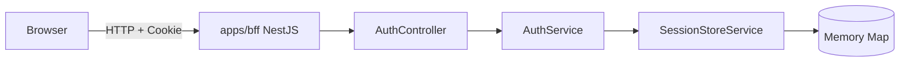
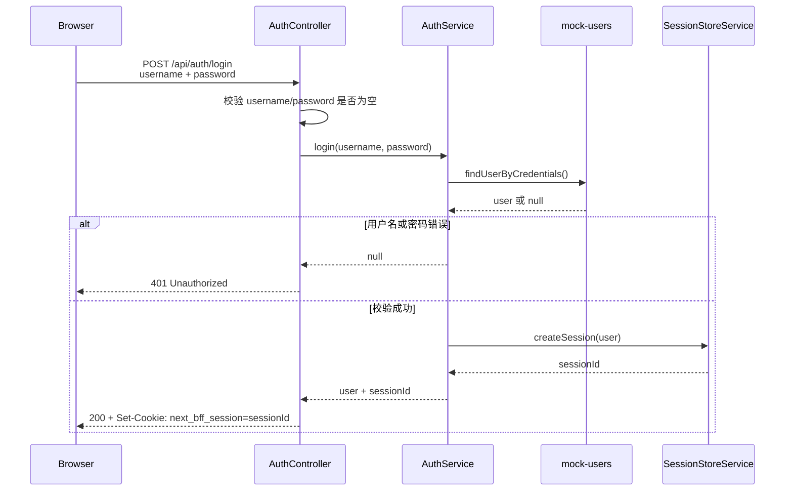
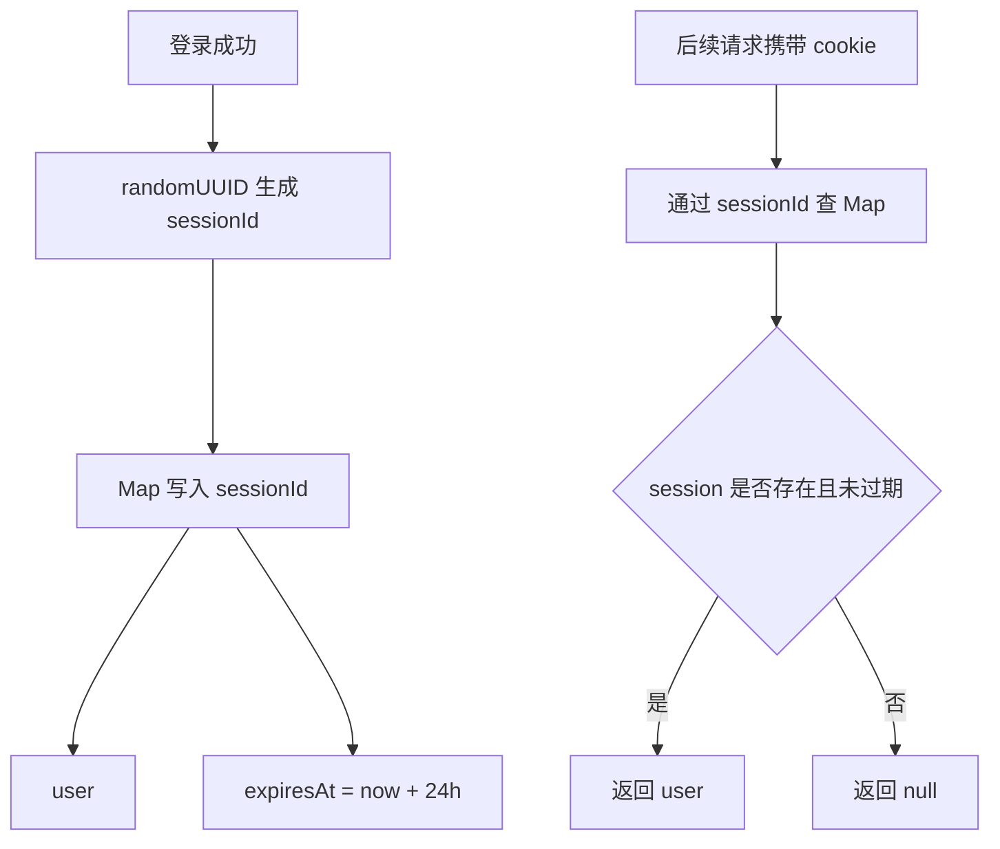
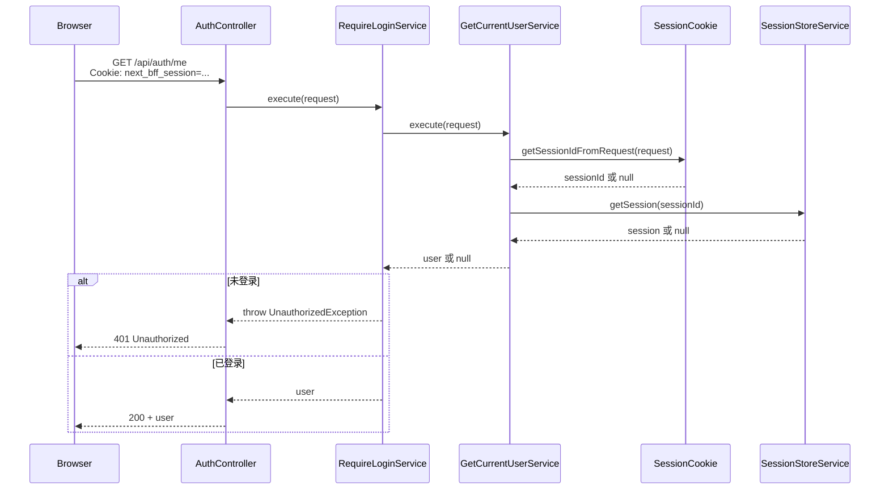

# 3. 登录与会话

本文说明仓库内 BFF 登录与会话逻辑的实现思路，覆盖：

- `POST /api/auth/login`
- `POST /api/auth/logout`
- `GET /api/auth/me`
- 登录成功后写入 cookie
- 登出后清除 cookie
- `get-current-user`
- `require-login`

相关代码集中在：

```text
apps/bff/src/auth/
  auth.controller.ts
  auth.service.ts
  get-current-user.ts
  require-login.ts
  session-cookie.ts
  session-store.service.ts
  mock-users.ts
```

## 3.1 整体分层

登录与会话只放在 `apps/bff`，前端不直接保存用户信息，后端业务服务也不处理浏览器 cookie。



职责拆分：

- `AuthController`：承接 HTTP 路由，负责参数校验、响应状态、设置或清除 `Set-Cookie`。
- `AuthService`：编排登录、登出、获取当前用户等业务动作。
- `SessionStoreService`：用内存 `Map` 保存 `sessionId -> user + expiresAt`。
- `session-cookie.ts`：统一 cookie 名称、解析、创建和清除规则。
- `GetCurrentUserService`：从 request cookie 读取 session，再换取当前用户。
- `RequireLoginService`：基于 `GetCurrentUserService` 做强制登录校验，未登录直接抛 `401 Unauthorized`。

## 3.2 登录流程

入口是 `POST /api/auth/login`，由 `AuthController.login()` 处理。



核心思路：

- 请求体中的 `username` 会先 `trim()`，`password` 保留原始字符串。
- 缺少用户名或密码时返回 `400 Bad Request`。
- 用户凭证暂时通过 `mock-users.ts` 校验。
- 校验成功后，`SessionStoreService.createSession(user)` 生成随机 `sessionId`。
- BFF 通过 `Set-Cookie` 把 `next_bff_session` 写回浏览器。

cookie 规则来自 `session-cookie.ts`：

```text
next_bff_session=<sessionId>; Path=/; HttpOnly; SameSite=Lax; Max-Age=86400
```

这里使用 `HttpOnly`，目的是让浏览器自动携带 cookie，但不允许前端 JavaScript 直接读取 session id。

## 3.3 会话保存方式

当前项目使用内存 `Map` 存 session，适合本地开发和 MVP 演示。



当前会话记录结构：

```ts
type SessionRecord = {
  user: AuthUser;
  expiresAt: number;
};
```

注意点：

- 服务重启后，内存 session 会丢失，用户需要重新登录。
- 多实例部署时，每个实例的内存 Map 不共享，生产环境应替换为 Redis、数据库或其他集中式 session 存储。
- 过期 session 在读取时被惰性清理：如果 `expiresAt <= Date.now()`，会删除这条记录并返回未登录。

## 3.4 获取当前用户

`GET /api/auth/me` 用于判断当前请求是否已经登录。



`get-current-user` 只负责“尽力获取”：

```text
request -> cookie -> sessionId -> session store -> user | null
```

它不关心 HTTP 状态码，也不抛未登录异常。这样后续如果存在“登录可选”的接口，可以直接复用它。

`require-login` 负责“必须登录”：

```text
user 存在 -> 返回 user
user 不存在 -> 抛 401 Unauthorized
```

因此，`GET /api/auth/me` 当前使用 `RequireLoginService`，未登录访问会返回 `401 Unauthorized`。

## 3.5 登出流程

入口是 `POST /api/auth/logout`。

```mermaid
sequenceDiagram
  participant U as Browser
  participant C as AuthController
  participant S as AuthService
  participant Cookie as SessionCookie
  participant Store as SessionStoreService

  U->>C: POST /api/auth/logout<br/>Cookie: next_bff_session=...
  C->>S: logout(request)
  S->>Cookie: getSessionIdFromRequest(request)
  Cookie-->>S: sessionId 或 null
  S->>Store: deleteSession(sessionId)
  C-->>U: 200 + Set-Cookie: next_bff_session=; Max-Age=0
```

登出做两件事：

- BFF 删除服务端 session：`SessionStoreService.deleteSession(sessionId)`。
- 浏览器清除 cookie：响应 `Set-Cookie`，同名 cookie 设置为空并使用 `Max-Age=0`。

清 cookie 规则：

```text
next_bff_session=; Path=/; HttpOnly; SameSite=Lax; Max-Age=0
```

即使请求里没有 cookie，登出接口也会返回成功并下发清 cookie 响应。这样前端可以把登出当成幂等动作处理。

## 3.6 三个接口的行为

| 接口                    | 已登录状态要求 | 主要动作                              | 成功响应                 | 失败响应                       |
| ----------------------- | -------------- | ------------------------------------- | ------------------------ | ------------------------------ |
| `POST /api/auth/login`  | 不要求         | 校验账号密码，创建 session，写 cookie | `200` + `user`           | `400` 参数缺失，`401` 凭证错误 |
| `POST /api/auth/logout` | 不强制         | 删除 session，清 cookie               | `200` + `logout success` | 当前实现不因未登录失败         |
| `GET /api/auth/me`      | 要求           | 读取 cookie，查 session，返回 user    | `200` + `user`           | `401` 未登录或 session 过期    |

## 3.7 设计取舍

当前实现优先保证链路清晰：

- 浏览器只持有不透明的 `sessionId`。
- 用户信息保存在 BFF 的 session store 中。
- `get-current-user` 与 `require-login` 分开，避免把“获取用户”和“强制拦截”混在一起。
- cookie 的创建和清除集中在 `session-cookie.ts`，避免多个接口手写不一致的 cookie 属性。

后续如果要接入真实生产能力，建议优先处理：

- 将内存 `Map` 替换为 Redis 或数据库。
- 增加 `Secure` 配置，在 HTTPS 环境下只允许安全传输。
- 增加自动化测试覆盖登录成功、登录失败、未登录访问 `/me`、登出后访问 `/me`。
