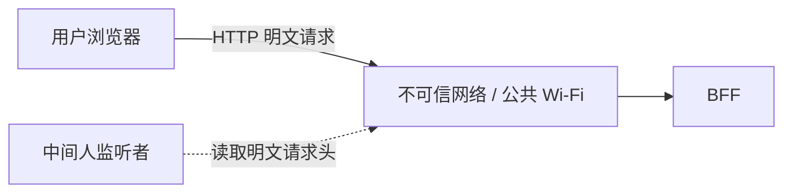
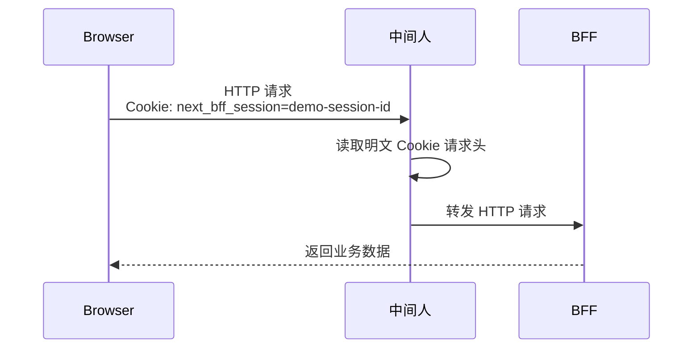
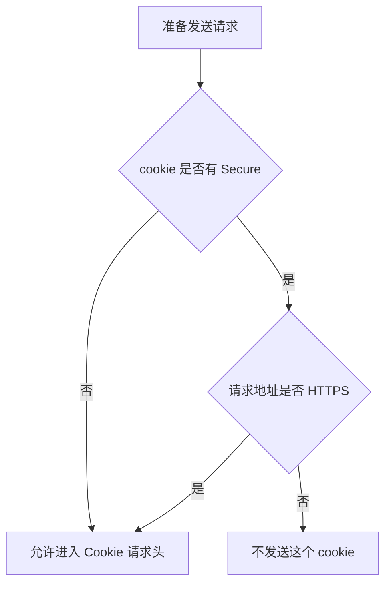
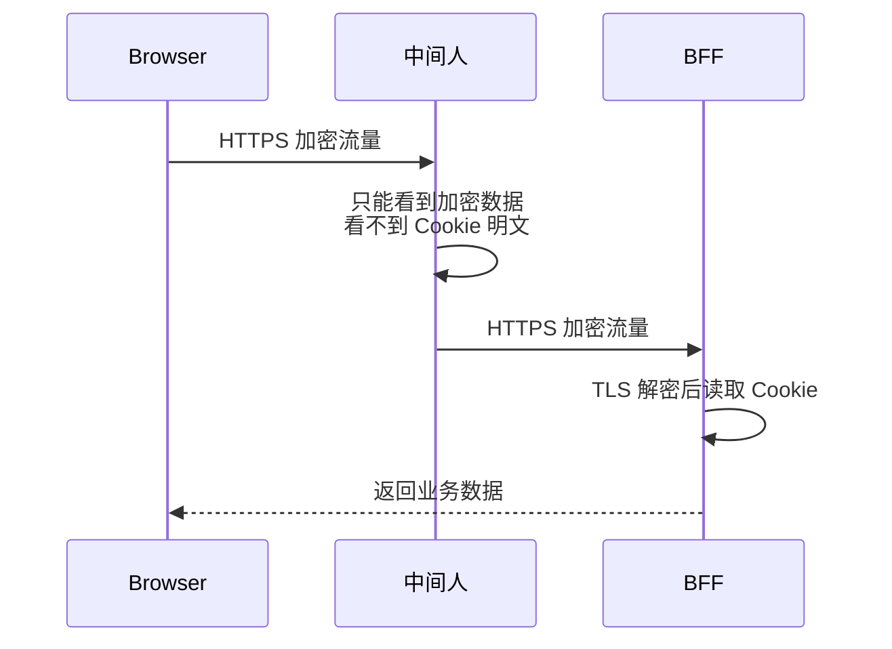
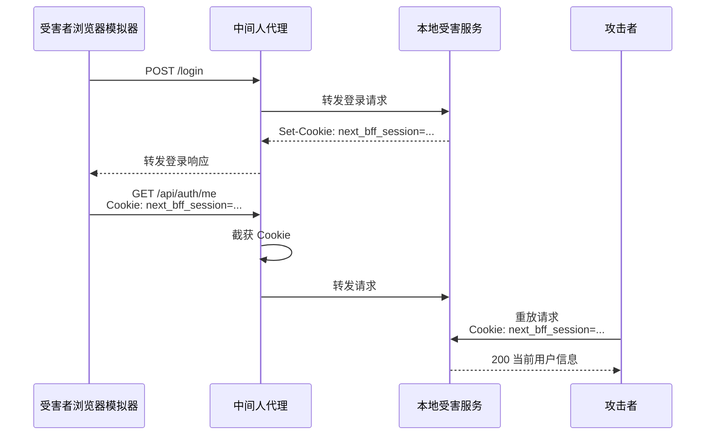
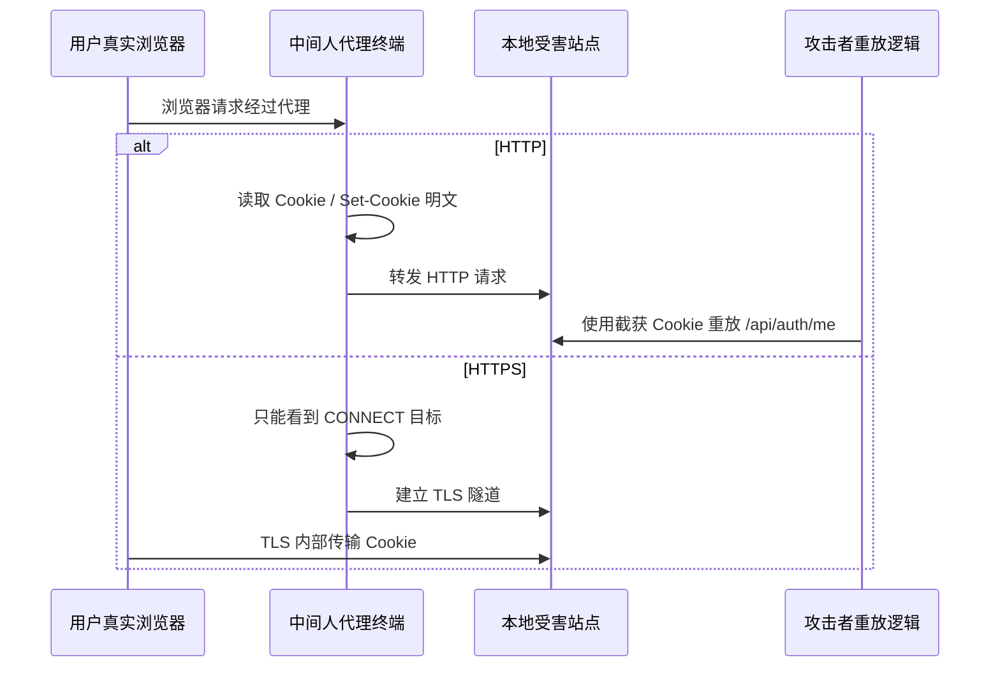

# 4. Secure Cookie 与 session 劫持模拟

本文单独说明一个问题：

```text
Secure 的作用不是加密 cookie 内容。
Secure 的作用是：阻止浏览器把这个 cookie 发送到 HTTP 明文链路上。
```

当前项目的 session cookie 名称是：

```text
next_bff_session
```

登录成功后，浏览器保存的是一个不透明的 session id。后续请求只要带上这个 cookie，BFF 就能识别当前用户。

## 4.1 劫持模型

假设用户连接了一个不可信网络，例如公共 Wi-Fi。攻击者不能直接进入服务器，但可以监听用户设备和网站之间的明文 HTTP 流量。



如果 HTTP 请求头里有 session cookie：

```http
GET /present/commodity/list HTTP/1.1
Host: localhost:3000
Cookie: next_bff_session=demo-session-id
```

攻击者就能看到：

```text
next_bff_session=demo-session-id
```

这个值一旦泄露，攻击者可以伪造请求：

```http
GET /api/auth/me HTTP/1.1
Host: target.example.com
Cookie: next_bff_session=demo-session-id
```

服务端只看到一个合法 session id，无法天然区分这是用户本人还是攻击者伪造的请求。

## 4.2 没有 Secure 时为什么危险

没有 `Secure` 时，浏览器在 HTTP 和 HTTPS 请求里都可能携带 cookie。



关键点：

- `HttpOnly` 只能阻止浏览器里的 JavaScript 读取 cookie。
- `HttpOnly` 不能阻止浏览器把 cookie 放进 HTTP 请求头。
- HTTP 请求头是明文传输，中间人可以看到。
- 所以 `HttpOnly` 防 XSS 直接读 cookie，不防 HTTP 链路监听。

示例 cookie：

```http
Set-Cookie: next_bff_session=demo-session-id; Path=/; HttpOnly; SameSite=Lax; Max-Age=86400
```

访问 HTTP 页面时，浏览器会发送：

```http
Cookie: next_bff_session=demo-session-id
```

此时 session 有泄露风险。

## 4.3 有 Secure 时发生了什么

有 `Secure` 时，浏览器会先判断请求目标是不是 HTTPS。



示例 cookie：

```http
Set-Cookie: next_bff_session=demo-session-id; Path=/; HttpOnly; SameSite=Lax; Secure; Max-Age=86400
```

访问 HTTP 页面：

```text
http://localhost:3000/present/commodity/list
```

浏览器不会发送这个 cookie：

```http
Cookie:
```

也就是：

```text
HTTP 明文链路里没有 next_bff_session
中间人没有东西可截
```

## 4.4 HTTPS 下为什么又可以发送

有 `Secure` 时访问 HTTPS，浏览器会发送 cookie。



这时有两个事实要分清：

- 业务服务端能收到 `next_bff_session`。
- 网络监听者看不到明文 `Cookie` 请求头。

所以 `Secure` 和 HTTPS 是配合关系：

```text
Secure: 控制 cookie 只走 HTTPS
HTTPS: 加密请求头和请求体
```

## 4.5 四个场景对比

| 场景 | 请求地址      | Cookie 有 Secure | 浏览器是否发送 session | 中间人是否能读到 |
| ---- | ------------- | ---------------- | ---------------------- | ---------------- |
| A    | `http://...`  | 否               | 是                     | 是               |
| B    | `https://...` | 否               | 是                     | 否               |
| C    | `http://...`  | 是               | 否                     | 否               |
| D    | `https://...` | 是               | 是                     | 否               |

场景 A 最危险，因为 session 明文进入 HTTP 请求头。

场景 B 当前这一次 HTTPS 请求不泄露，因为 HTTPS 会加密请求头。但它的问题是 cookie 本身没有限制只能走 HTTPS。只要后续用户访问了同域 HTTP 地址，或者系统里出现 HTTP 降级链路，这个 cookie 仍然会被浏览器发送到明文链路。

场景 C 会导致 HTTP 下登录态不可用，但安全上是正确的：宁可不发送，也不把 session 暴露到明文链路。

场景 D 是生产推荐：浏览器发送 session，服务端能识别用户，中间人看不到明文 cookie，并且 cookie 不会被误发到 HTTP。

## 4.6 本项目怎么模拟

项目里提供了两个本地脚本。

第一个脚本只模拟浏览器发送规则：

```bash
pnpm simulate:cookie-hijack
```

脚本位置：

```text
scripts/simulate-cookie-hijack.js
```

它不发真实网络请求，只模拟浏览器规则：

```text
cookie + requestUrl -> 浏览器是否组装 Cookie 请求头
```

核心判断是：

```js
if (cookie.secure && url.protocol !== "https:") {
  return false;
}
```

这句代表：

```text
只要 cookie 有 Secure，并且当前请求不是 HTTPS，浏览器就不发送这个 cookie。
```

脚本输出会看到：

```text
场景 A：没有 Secure，访问 HTTP
浏览器实际发出的 Cookie 请求头: next_bff_session=demo-session-id
中间人能否从明文链路读到 session: 能

场景 B：没有 Secure，访问 HTTPS
浏览器实际发出的 Cookie 请求头: next_bff_session=demo-session-id
中间人能否从明文链路读到 session: 不能

场景 C：有 Secure，访问 HTTP
浏览器实际发出的 Cookie 请求头: (空)
中间人能否从明文链路读到 session: 不能

场景 D：有 Secure，访问 HTTPS
浏览器实际发出的 Cookie 请求头: next_bff_session=demo-session-id
中间人能否从明文链路读到 session: 不能
```

第二个脚本会真的启动“受害服务”和“中间人代理”，受害者的请求全部经过中间人代理。中间人如果截获到 cookie，就会让攻击者拿这个 cookie 再请求一次受保护接口：

```bash
pnpm simulate:cookie-replay
```

这个脚本包含四类角色：



四种场景都经过同一个中间人代理模型：

| 场景 | 受害者请求协议 | Cookie 有 Secure | 中间人能否看到 Cookie | 攻击者能否重放 |
| ---- | -------------- | ---------------- | --------------------- | -------------- |
| A    | HTTP           | 否               | 能                    | 能             |
| B    | HTTPS          | 否               | 不能                  | 不能           |
| C    | HTTP           | 是               | 不能                  | 不能           |
| D    | HTTPS          | 是               | 不能                  | 不能           |

场景 A 中，HTTP 是明文，中间人输出会看到攻击者重放成功：

```text
中间人最终截获 Cookie: next_bff_session=...
攻击者重放 Cookie 请求 /api/auth/me: 200 {"user":{"id":"user-001","name":"victim-user"}}
```

场景 B 和 D 中，受害者请求走 HTTPS。中间人只能看到 CONNECT 目标，看不到 TLS 内部的 Cookie：

```text
HTTPS CONNECT 隧道: 只看到目标 localhost:57594，看不到 TLS 内部 Cookie
中间人最终截获 Cookie: (空)
攻击者无法重放：中间人没有拿到 session cookie。
```

场景 C 中，虽然是 HTTP 明文，但因为 cookie 有 `Secure`，浏览器不会把 session 放进 HTTP 请求头：

```text
受害者请求 Cookie: (空)
中间人最终截获 Cookie: (空)
攻击者无法重放：中间人没有拿到 session cookie。
```

注意：这个脚本只在本机启动临时服务和代理，目的是演示“监听 -> 截获 -> 重放”的攻击链路，不做真实网络嗅探。

第三个脚本用于真实浏览器操作：

```bash
pnpm simulate:browser-mitm
```

它会启动：

- 受害 HTTP 站点，例如 `http://mitm.test:60633`
- 受害 HTTPS 站点，例如 `https://mitm.test:60634`
- 中间人代理，例如 `http://127.0.0.1:60635`

脚本会打印一个独立 Chrome 启动命令，类似：

```bash
open -na "Google Chrome" --args --user-data-dir=/tmp/next-bff-browser-mitm-chrome --proxy-server=http://127.0.0.1:60635 --host-resolver-rules="MAP mitm.test 127.0.0.1" --ignore-certificate-errors http://mitm.test:60633
```

这个 Chrome 使用临时 profile，并且强制本地流量也走中间人代理。打开后在页面里依次点击：

```text
场景 A：无 Secure + HTTP
场景 B：无 Secure + HTTPS
场景 C：有 Secure + HTTP
场景 D：有 Secure + HTTPS
```

注意：不要直接用普通浏览器打开 `http://mitm.test:60633` 或 `http://localhost:60633`。普通浏览器没有配置这个中间人代理，终端不会看到请求日志。必须使用脚本打印的 Chrome 命令。

终端会实时打印中间人能看到的内容。

HTTP 场景下，中间人能看到明文请求：

```text
[mitm] HTTP GET http://mitm.test:60633/protected
[mitm] HTTP Cookie: next_bff_session=...
[mitm] 截获请求 Cookie: next_bff_session=...
[attacker] 重放 http://mitm.test:60633/api/auth/me -> 200 {"user":{"id":"user-001","name":"victim-user"}}
```

HTTPS 场景下，中间人只能看到 CONNECT 隧道目标：

```text
[mitm] HTTPS CONNECT mitm.test:60634
[mitm] HTTPS 隧道内的 Cookie / Set-Cookie 被 TLS 加密，中间人看不到
```

这个脚本更接近真实链路：



## 4.7 和当前系统的关系

当前 BFF 统一在 `session-cookie.ts` 里创建 cookie：

```text
apps/bff/src/auth/session-cookie.ts
```

本地 HTTP 开发默认不强制 `Secure`，否则 `http://localhost:3000` 下登录后 cookie 不会被发送，表现为刷新后未登录。

生产或本地 HTTPS 验证时应开启：

```bash
COOKIE_SECURE=true pnpm start:bff
```

或者使用本项目的 HTTPS 开发脚本：

```bash
pnpm dev:https
```

## 4.8 面试表达

可以这样讲：

```text
session cookie 本质是登录凭证。
如果它在 HTTP 明文请求头里传输，中间人可以直接看到并复用它。
HttpOnly 只能防止前端 JS 读取 cookie，不能防网络层监听。
Secure 会让浏览器只在 HTTPS 请求里发送这个 cookie。
所以生产环境必须配合 HTTPS 开启 Secure，避免 session 误走明文 HTTP 链路。
```

一句话结论：

```text
Secure 不负责加密，HTTPS 负责加密；Secure 负责禁止 cookie 走 HTTP。
```
