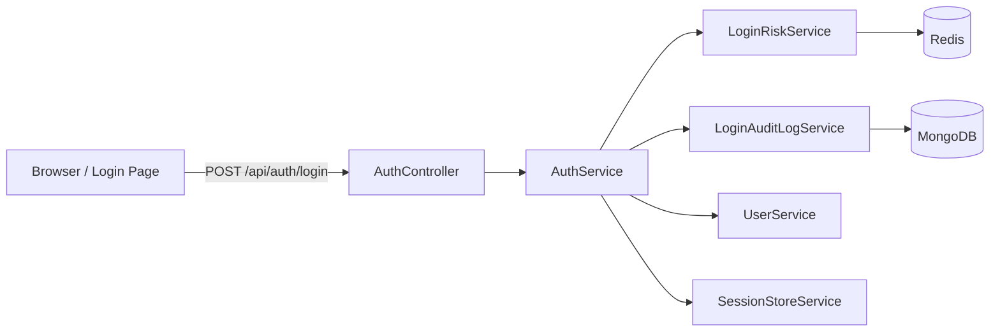
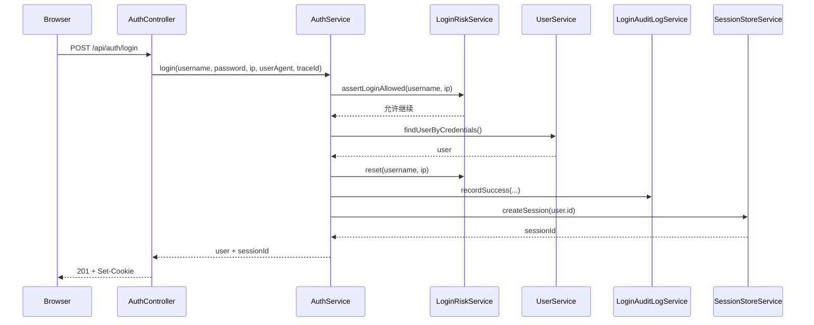
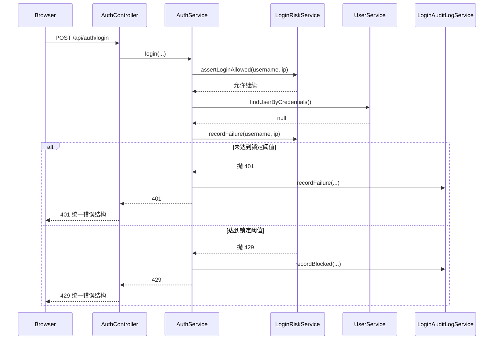
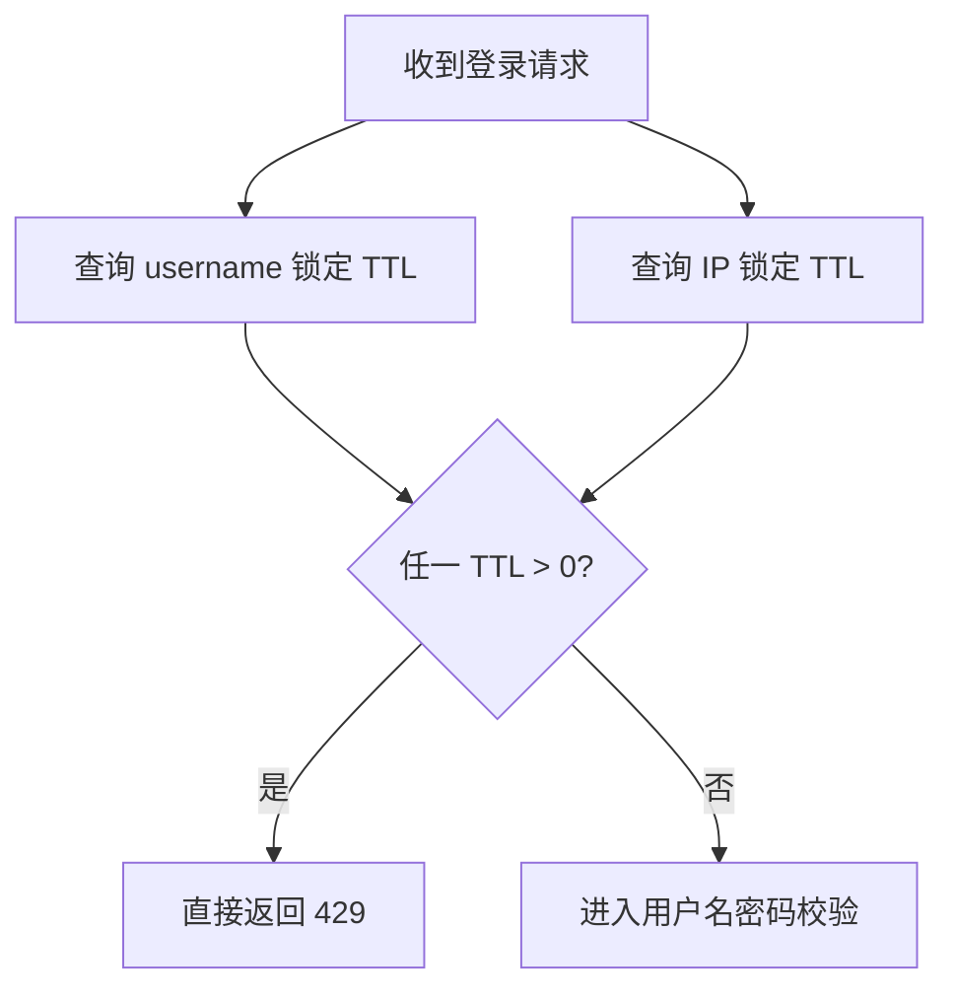

# 5. 登录风控基础

本文说明仓库内登录风控的基础能力，覆盖：

- 登录失败次数限制
- 账号维度与 IP 维度计数
- 短时间锁定
- 登录审计日志
- 前端统一失败提示

相关代码集中在：

```text
apps/bff/src/auth/
  auth.controller.ts
  auth.service.ts
  login-risk.service.ts
  login-audit-log.service.ts
  dto/query-login-audit-log.dto.ts
  schemas/login-audit-log.schema.ts

apps/client/app/login/
  page.tsx
```

## 5.1 要解决的问题

如果登录接口只有“用户名 + 密码校验”，没有额外防护，会有三个直接风险：

- 攻击者可以对单个账号持续撞库或暴力尝试密码。
- 攻击者可以从错误提示里判断“账号存在”还是“密码错误”，形成账号枚举。
- 安全事件发生后，缺少可按时间和用户回溯的登录审计记录。

当前实现的目标不是做完整安全平台，而是先把最基本、最容易落地的一层防线补上。

## 5.2 整体结构



职责拆分：

- `AuthController`：接 HTTP 请求，提取 `ip / user-agent / traceId`，返回统一响应。
- `AuthService`：编排整个登录流程。
- `LoginRiskService`：负责失败计数、阈值判断、锁定和解锁。
- `LoginAuditLogService`：记录登录成功、失败、被锁定的审计日志。
- `UserService`：校验账号密码。
- `SessionStoreService`：只在登录成功后创建 session，不负责风控。

## 5.3 图例

下文图里的节点含义如下：

| 图例                   | 含义                                               |
| ---------------------- | -------------------------------------------------- |
| `Browser / Login Page` | 浏览器登录页，负责提交用户名和密码，并展示统一提示 |
| `AuthController`       | BFF 登录入口，承接 HTTP 请求                       |
| `AuthService`          | 登录流程编排层                                     |
| `LoginRiskService`     | 风控服务，处理失败计数和锁定                       |
| `LoginAuditLogService` | 登录安全审计日志服务                               |
| `UserService`          | 用户凭证校验                                       |
| `SessionStoreService`  | 创建服务端 session                                 |
| `Redis`                | 存失败次数和锁定状态                               |
| `MongoDB`              | 存登录日志，支持按用户和时间查询                   |

图里的线条含义：

- 实线箭头：同步调用
- 指向 `Redis`：说明是风控状态读写
- 指向 `MongoDB`：说明是审计日志持久化

## 5.4 登录成功流程



关键点：

- 先查锁定，再校验密码。
- 登录成功后，清掉该账号和该 IP 的失败计数。
- 只有成功登录才创建 session。
- 审计日志会记录 `username / userId / IP / User-Agent / traceId / outcome=success`。

## 5.5 登录失败流程



这里有两个层次的失败：

- 普通失败：还没到阈值，返回 `401 invalid username or password`
- 锁定失败：达到阈值，返回 `429 too many login attempts...`

前端不会把这两种失败原样暴露成“账号不存在”之类的细粒度提示。

## 5.6 已被锁定时的流程



这一步的意义是：

- 已经被锁的账号或 IP，不再继续查密码。
- 减少无意义的数据库压力。
- 让锁定状态在 Redis TTL 到期前保持稳定。

## 5.7 Redis 中存什么

当前风控状态不放 Mongo，原因很简单：它是短期状态，不是长期业务数据。

```text
next-bff:login-fail:user:<username>   -> 失败次数
next-bff:login-fail:ip:<ip>           -> 失败次数
next-bff:login-lock:user:<username>   -> 锁定标记 + TTL
next-bff:login-lock:ip:<ip>           -> 锁定标记 + TTL
```

默认策略：

```text
LOGIN_MAX_FAILURES_PER_USER=5
LOGIN_MAX_FAILURES_PER_IP=20
LOGIN_FAILURE_WINDOW_SECONDS=900
LOGIN_LOCK_SECONDS=600
```

含义：

- 单个用户名 15 分钟内失败 5 次，触发锁定
- 单个 IP 15 分钟内失败 20 次，触发锁定
- 锁定持续 10 分钟

这些值都可以通过环境变量调整。

## 5.8 Mongo 中存什么

登录日志放在 `login_audit_logs` 集合，核心字段如下：

```ts
type LoginAuditLog = {
  username: string;
  userId: string | null;
  outcome: "success" | "failure" | "blocked";
  ip: string;
  userAgent: string;
  traceId: string;
  createdAt: Date;
  reason: string | null;
};
```

三个 `outcome` 的含义：

- `success`：登录成功
- `failure`：用户名或密码错误，但还没被锁
- `blocked`：请求被风控直接拦截，或在本次失败中达到锁定阈值

当前已建索引：

- `username + createdAt`
- `userId + createdAt`
- `outcome + createdAt`
- `createdAt`
- `traceId`

所以可以支持这些查询：

- 查某个用户名最近失败记录
- 查某个用户在一个时间段内的登录行为
- 查最近一段时间的所有 `blocked` 事件
- 通过 `traceId` 对齐应用日志

## 5.9 查询接口

登录日志查询接口：

```http
GET /api/auth/login-logs
```

参数：

```text
username
userId
outcome=success|failure|blocked
createdFrom
createdTo
page
pageSize
```

示例：

```http
GET /api/auth/login-logs?username=admin&createdFrom=2026-05-04T00:00:00.000Z&createdTo=2026-05-04T23:59:59.999Z
```

权限要求：

- 需要登录
- 需要 `audit:read`

这保证了登录日志不是所有后台用户都能随便看。

## 5.10 前端为什么要统一提示

登录页当前只区分两类提示：

- `401`：`用户名或密码错误`
- `429`：`登录失败次数过多，请稍后再试`

原因：

### 1. 防账号枚举

如果前端提示：

- “账号不存在”
- “密码错误”

那攻击者就可以先批量探测哪些账号真实存在，再只针对这些账号撞密码。

### 2. 保持用户体验可预期

普通用户真正关心的是：

- 我现在能不能登录
- 需不需要稍后再试

而不是后端到底是哪一条校验没过。

### 3. 与后端错误结构对齐

当前后端无论 `401` 还是 `429`，都返回统一结构：

```json
{
  "success": false,
  "message": "....",
  "path": "/api/auth/login",
  "traceId": "....",
  "statusCode": 401,
  "timestamp": "...."
}
```

这让前端可以稳定处理，不需要分散写很多特殊分支。

## 5.11 一个具体例子

假设攻击者从 `127.0.0.1` 持续尝试登录 `admin`：

```text
第 1 次失败 -> 401
第 2 次失败 -> 401
第 3 次失败 -> 401
第 4 次失败 -> 401
第 5 次失败 -> 429，并写入锁定 key
第 6 次请求 -> 直接 429，不再走密码校验
```

同时会出现这些日志：

```text
failure
failure
failure
failure
blocked
blocked
```

这比只有一条应用日志更容易解释现场。

## 5.12 设计取舍

当前实现有意保持在“基础风控”范围内：

- 有账号维度和 IP 维度
- 有短时锁定
- 有统一 429
- 有可查询登录日志

但还没有做：

- 图形验证码
- 设备指纹
- 风险分级
- 异地登录检测
- 管理员解锁接口
- 更精细的组织级策略

这是刻意的。先把最基础、最稳定、最容易验证的一层建起来，后续再加更重的能力。

## 5.13 如何验证

### 连续失败触发锁定

连续错误登录多次，预期会出现：

```text
前几次 401
达到阈值后 429
锁定期内继续请求仍然 429
```

### 前端不提示账号不存在

无论输入不存在的账号，还是存在账号但密码错误，前端都只显示：

```text
用户名或密码错误
```

### 登录日志可查

用管理员登录后调用：

```http
GET /api/auth/login-logs?username=admin
```

应能看到该用户的 `success / failure / blocked` 记录。

### 响应结构统一

无论 `401` 还是 `429`，返回都应具备：

```text
success
message
path
traceId
statusCode
timestamp
```

## 5.14 结论

这套实现的核心不是“让登录一定成功”，而是把登录失败也当成正式的系统行为去管理：

- 失败要计数
- 达阈值要锁定
- 锁定要可恢复
- 每次关键结果都要留日志
- 前端提示要克制，不能泄露额外情报

这样登录链路才算开始接近真实项目的安全基线。
