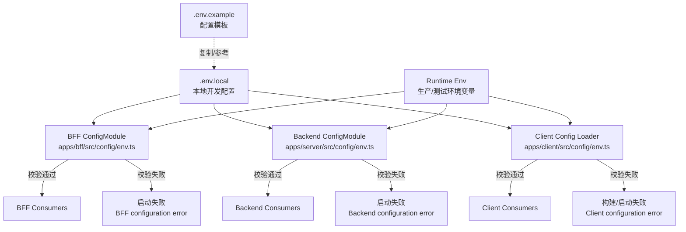
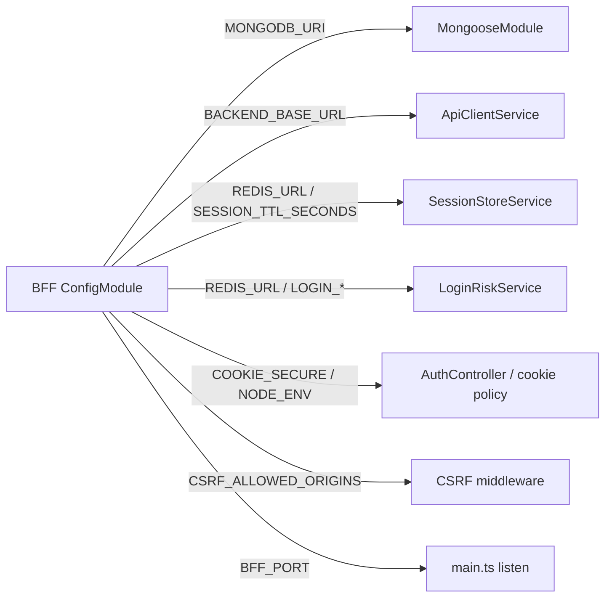
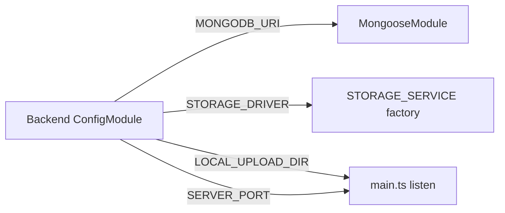
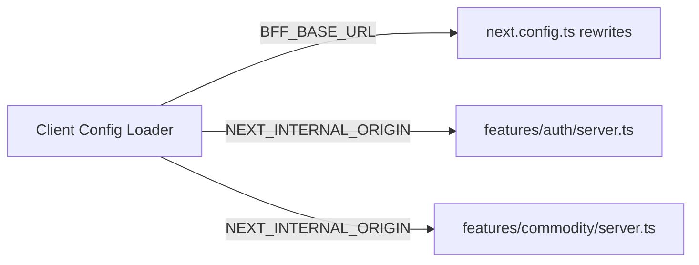
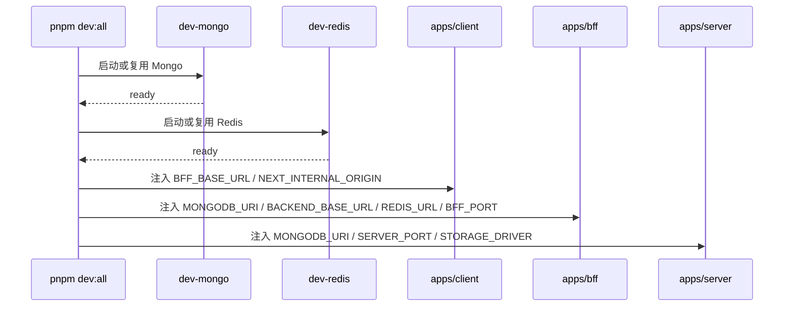
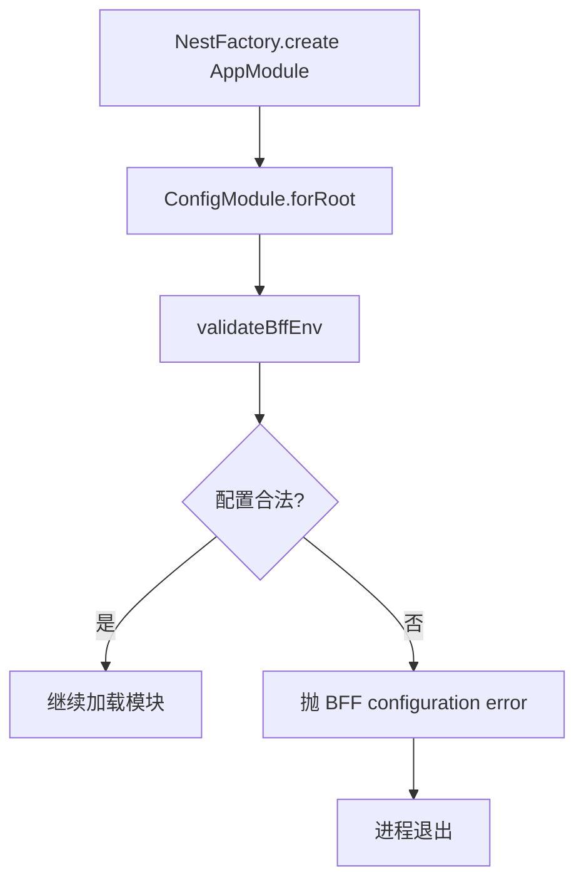

# 6. ConfigModule 统一配置入口

本文说明当前项目的配置设计，重点回答两个问题：

- 配置是怎么进入系统的
- 这些配置最后被谁消费

相关代码：

```text
.env.example
.env.local

apps/bff/src/config/env.ts
apps/server/src/config/env.ts
apps/client/src/config/env.ts

apps/bff/src/app.module.ts
apps/server/src/app.module.ts
apps/client/next.config.ts
```

## 6.1 设计目标

配置统一入口要解决的是“环境差异”和“启动失败不可解释”的问题。

之前的典型问题是：

- `MONGODB_URI` 没配时，服务先启动，再由 Mongoose 报连接失败。
- `BACKEND_BASE_URL` 写错时，只有业务请求失败，定位慢。
- client rewrites 写死 `localhost:3001`，换环境时容易漏改。
- BFF、backend、client 各自读 `process.env`，没有统一边界。

现在的原则是：

- BFF 配置由 BFF 自己的 schema 校验。
- backend 配置由 backend 自己的 schema 校验。
- client 配置由 client loader 校验。
- 缺关键配置时 fail fast，启动阶段直接给出明确原因。
- `.env.example` 记录团队应该知道的变量，`.env.local` 只服务本地开发。

## 6.2 整体图



## 6.3 图例

| 图例                   | 含义                                 | 谁消费                                         |
| ---------------------- | ------------------------------------ | ---------------------------------------------- |
| `.env.example`         | 配置模板，说明必须配置什么           | 开发者、部署人员                               |
| `.env.local`           | 本机开发配置，已被 `.gitignore` 忽略 | 本地 `pnpm dev:*`                              |
| `Runtime Env`          | 测试、生产环境注入的真实变量         | 部署平台、容器、CI                             |
| `BFF ConfigModule`     | BFF 的配置入口和校验 schema          | `apps/bff`                                     |
| `Backend ConfigModule` | backend 的配置入口和校验 schema      | `apps/server`                                  |
| `Client Config Loader` | Next.js 侧配置 loader                | `apps/client`                                  |
| `BFF Consumers`        | BFF 内部真正用配置的模块             | DB、Redis、BFF HTTP client、cookie、CSRF、端口 |
| `Backend Consumers`    | backend 内部真正用配置的模块         | DB、上传存储、端口                             |
| `Client Consumers`     | client 内部真正用配置的位置          | Next rewrites、server component API fetch      |
| `configuration error`  | schema 校验失败，服务不继续启动      | 运维、开发者                                   |

线条含义：

- 实线箭头：配置实际流入某个 loader 或 consumer。
- 虚线箭头：模板关系，不代表运行时读取。
- `校验失败`：启动或构建阶段直接失败，不进入业务逻辑。

## 6.4 BFF 配置怎么设计

BFF 入口是：

```text
apps/bff/src/config/env.ts
```

它被 `AppModule` 统一加载：

```ts
ConfigModule.forRoot(bffConfigModuleOptions);
```

BFF 必填配置：

```text
MONGODB_URI
BACKEND_BASE_URL
```

BFF 有默认值的配置：

```text
BFF_PORT=3001
REDIS_URL=redis://127.0.0.1:6379
SESSION_TTL_SECONDS=86400
COOKIE_SECURE=<未显式配置时按 NODE_ENV 判断>
CSRF_ALLOWED_ORIGINS=http://localhost:3000
LOGIN_MAX_FAILURES_PER_USER=5
LOGIN_MAX_FAILURES_PER_IP=20
LOGIN_FAILURE_WINDOW_SECONDS=900
LOGIN_LOCK_SECONDS=600
LOG_LEVEL=log,warn,error
```

BFF 消费关系：



### 谁消费 `MONGODB_URI`

`apps/bff/src/database/database.module.ts`

用途：

```text
BFF 自己的 Mongo 数据：用户、角色、权限、审计日志等。
```

如果缺失：

```text
BFF configuration error:
- MONGODB_URI is required
```

### 谁消费 `BACKEND_BASE_URL`

`apps/bff/src/bff/api-client.service.ts`

用途：

```text
BFF 转发商品、上传等请求到 backend mock service。
```

如果不是合法 URL：

```text
BFF configuration error:
- BACKEND_BASE_URL must be a valid URL
```

如果 URL 合法但服务不可达：

```text
返回 502，并提示 Check BACKEND_BASE_URL=...
日志里带 baseUrl / path / traceId
```

这就是“配错时能快速定位”的关键。

## 6.5 Backend 配置怎么设计

backend 入口是：

```text
apps/server/src/config/env.ts
```

它被 `AppModule` 统一加载：

```ts
ConfigModule.forRoot(serverConfigModuleOptions);
```

backend 必填配置：

```text
MONGODB_URI
```

backend 有默认值的配置：

```text
SERVER_PORT=3002
STORAGE_DRIVER=local
LOCAL_UPLOAD_DIR=.dev/uploads
LOCAL_UPLOAD_PUBLIC_BASE_URL=http://localhost:3002/uploads
LOG_LEVEL=log,warn,error
```

backend 消费关系：



### 谁消费 `STORAGE_DRIVER`

`apps/server/src/mock-backend/mock-backend.module.ts`

可选值：

```text
local
s3
oss
```

用途：

```text
决定上传服务写入本地静态目录、S3 bucket，还是 OSS bucket。
```

配置错误时：

```text
Backend configuration error:
- STORAGE_DRIVER must be one of "local", "s3", "oss"
- S3_BUCKET is required
- S3_ACCESS_KEY_ID is required
- OSS_BUCKET is required
- OSS_ACCESS_KEY_ID is required
```

## 6.6 Client 配置怎么设计

client 没有 Nest `ConfigModule`，所以用轻量 loader：

```text
apps/client/src/config/env.ts
```

client 配置分两类：

```text
BFF_BASE_URL
NEXT_INTERNAL_ORIGIN
```

消费关系：



### 谁消费 `BFF_BASE_URL`

`apps/client/next.config.ts`

用途：

```text
Next rewrites 把浏览器同源 /api/* 请求转发到 BFF。
```

例子：

```text
/api/auth/:path*      -> <BFF_BASE_URL>/api/auth/:path*
/api/commodity/:path* -> <BFF_BASE_URL>/api/commodity/:path*
/api/upload           -> <BFF_BASE_URL>/api/upload
/api/users/:path*     -> <BFF_BASE_URL>/api/users/:path*
```

### 谁消费 `NEXT_INTERNAL_ORIGIN`

这些 server-side fetch 会消费它：

```text
apps/client/src/features/auth/server.ts
apps/client/src/features/commodity/server.ts
```

用途：

```text
Next server component 里请求自己的同源 API。
```

为什么不是直接请求 BFF？

```text
因为同源 API 会走 Next rewrites，cookie、登录跳转和前端路径保持一致。
```

## 6.7 三端启动链路



`dev:all` 会显式注入本地配置，保证本地一键开发不依赖你手动导出环境变量。

单独启动时：

```bash
pnpm dev:bff
pnpm dev:server
pnpm dev:client
```

它们会读取根目录 `.env.local`。

## 6.8 本地、测试、生产差异

| 环境 | 配置来源                       | 特点                                                |
| ---- | ------------------------------ | --------------------------------------------------- |
| 本地 | `.env.local` 或 `dev:all` 注入 | 使用 `localhost`、本地 Mongo、Redis                 |
| 测试 | CI 注入 env 或测试 mock        | 可以使用专用测试库和短 TTL                          |
| 生产 | 部署平台注入 env               | 不依赖 `.env.local`，必须提供真实连接串和 HTTPS URL |

生产建议：

```text
NODE_ENV=production
COOKIE_SECURE=true
MONGODB_URI=mongodb+srv://...
BACKEND_BASE_URL=https://backend.example.com
BFF_BASE_URL=https://bff.example.com
NEXT_INTERNAL_ORIGIN=https://admin.example.com
```

## 6.9 Fail Fast 是怎么触发的

BFF 启动时：



backend 同理，只是执行的是 `validateServerEnv`。

client 在 `next.config.ts` 和 server-side fetch 模块加载时执行 `loadClientConfig()`，配置非法会让构建或启动直接失败。

## 6.10 常见定位方式

### 缺少 Mongo

现象：

```text
BFF configuration error:
- MONGODB_URI is required
```

说明：

```text
BFF 配置校验阶段失败，还没有开始连接 Mongo。
```

处理：

```text
确认 .env.local 或运行环境里有 MONGODB_URI。
```

### BFF 到 backend 不通

现象：

```text
502 Backend request failed. Check BACKEND_BASE_URL=http://...
```

说明：

```text
BACKEND_BASE_URL 是合法 URL，但目标服务不可达，或者端口不对。
```

处理：

```text
确认 backend 是否启动，确认 BACKEND_BASE_URL 是否指向正确 host/port。
```

### Client API 转发不对

现象：

```text
/api/auth/me 或 /api/commodity/list 请求失败
```

优先检查：

```text
BFF_BASE_URL
NEXT_INTERNAL_ORIGIN
```

其中：

- `BFF_BASE_URL` 决定 rewrites 转发到哪里。
- `NEXT_INTERNAL_ORIGIN` 决定 server component 请求哪个同源入口。

## 6.11 总结

这套配置设计的核心是：

```text
模板说明配置
本地文件服务开发
运行环境服务部署
schema 负责校验
业务模块只消费已校验配置
```

谁消费配置不是靠约定猜，而是通过 loader 和图例明确下来。这样一旦启动失败或链路不通，可以直接判断问题发生在配置加载、配置校验，还是某个具体 consumer。
