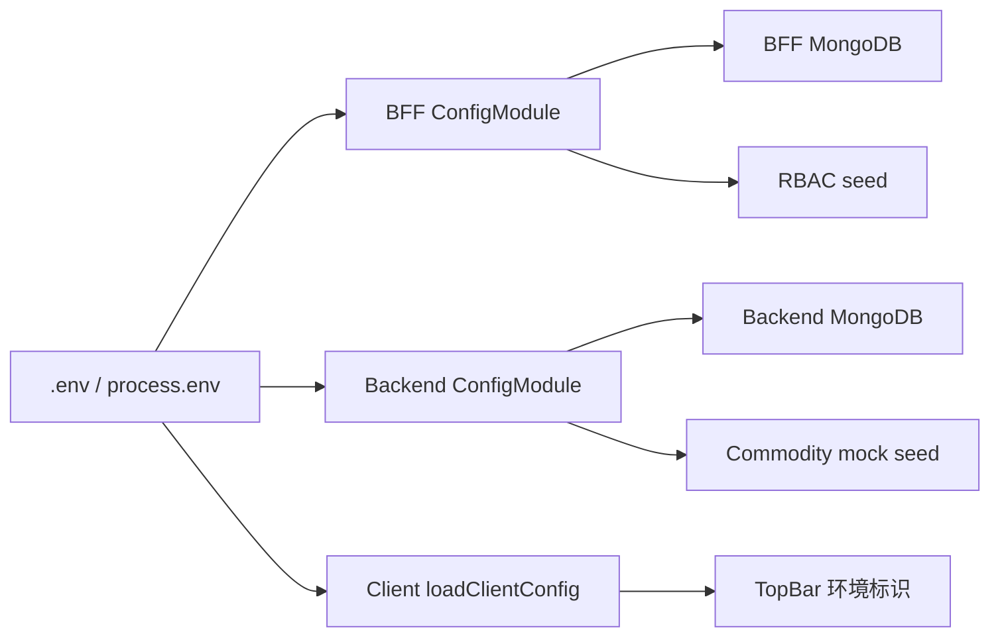

# 环境隔离

## 目标

开发、测试、生产必须使用不同数据库。测试 seed 可以反复初始化测试库，生产环境不能执行 mock seed，也不能误连 `dev/test/mock` 命名的库。

## 配置流向



## 核心规则

| 环境 | `APP_ENV`     | MongoDB 库名规则                  | mock seed                                     |
| ---- | ------------- | --------------------------------- | --------------------------------------------- |
| 开发 | `development` | 必须以 `-dev` 结尾                | 默认允许，可用 `MOCK_SEED_ENABLED=false` 关闭 |
| 测试 | `test`        | 必须以 `-test` 结尾               | 默认允许，用于 fixtures/幂等初始化            |
| 生产 | `production`  | 不能包含 `dev/test/mock` 环境标记 | 永远禁止                                      |

本地默认值：

```env
APP_ENV=development
MONGODB_URI=mongodb://127.0.0.1:27017/next-bff-dev
MOCK_SEED_ENABLED=true
NEXT_PUBLIC_APP_ENV=development
NEXT_PUBLIC_SHOW_ENV_BADGE=true
```

## 谁消费这些配置

- `apps/bff/src/config/env.ts`：启动时校验 `APP_ENV`、`MONGODB_URI`、`MOCK_SEED_ENABLED`。
- `apps/server/src/config/env.ts`：用同一套规则校验 backend 数据库和 mock seed 开关。
- `apps/bff/src/auth/rbac-seed.service.ts`：非生产且 seed 开启时，初始化角色、权限、测试账号。
- `apps/server/src/mock-backend/commodity.service.ts`：非生产且 seed 开启时，初始化商品 mock 数据。
- `apps/client/src/config/env.ts`：读取 `NEXT_PUBLIC_APP_ENV` 和 `NEXT_PUBLIC_SHOW_ENV_BADGE`。
- `apps/client/src/components/top-bar.tsx`：按配置显示当前环境标识，生产默认隐藏。

## 失败示例

`APP_ENV=test` 配到了开发库：

```text
APP_ENV=test requires MONGODB_URI database name to end with "-test"
```

生产环境打开 mock seed：

```text
MOCK_SEED_ENABLED=true is not allowed when APP_ENV=production
```

生产环境误连开发库：

```text
APP_ENV=production must not use a dev/test/mock database name
```

## 验收方式

```bash
APP_ENV=test MONGODB_URI=mongodb://127.0.0.1:27017/next-bff-test pnpm dev:bff
```

测试库可以 seed，不会写入 `next-bff-dev`。

```bash
APP_ENV=production MOCK_SEED_ENABLED=true MONGODB_URI=mongodb://127.0.0.1:27017/next-bff pnpm dev:bff
```

BFF 应启动失败，并打印 mock seed 禁止错误。
