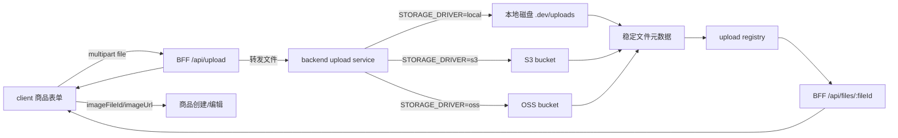

# 对象存储接入

## 目标

上传链路返回稳定文件元数据，商品只保存 `imageFileId` 和 `imageUrl`，文件内容由 storage driver 管理。

## Driver

| driver | 用途 | 必要配置 |
| --- | --- | --- |
| `local` | 本地开发、测试 | `LOCAL_UPLOAD_DIR`、`LOCAL_UPLOAD_PUBLIC_BASE_URL`、`UPLOAD_REGISTRY_PATH` |
| `s3` | S3 风格对象存储 | `S3_BUCKET`、`S3_REGION`、`S3_ACCESS_KEY_ID`、`S3_SECRET_ACCESS_KEY`，可选 `S3_PUBLIC_BASE_URL`、`S3_UPLOAD_BASE_URL`、`S3_KEY_PREFIX` |
| `oss` | OSS 风格对象存储 | `OSS_BUCKET`、`OSS_REGION`、`OSS_ACCESS_KEY_ID`、`OSS_ACCESS_KEY_SECRET`，可选 `OSS_PUBLIC_BASE_URL`、`OSS_UPLOAD_BASE_URL`、`OSS_KEY_PREFIX` |

生产环境禁止 `STORAGE_DRIVER=local`，避免真实上传落到本地磁盘。

## 本地上传

本地上传会写入：

```text
.dev/uploads/<scene>/<fileId>-<filename>
```

文件元数据会记录到：

```text
.dev/upload-registry.json
```

## S3 / OSS 上传

`STORAGE_DRIVER=s3` 时，backend 使用 AWS Signature V4 发起 `PUT Object`，默认上传地址为：

```text
https://<S3_BUCKET>.s3.<S3_REGION>.amazonaws.com/<key>
```

`STORAGE_DRIVER=oss` 时，backend 使用 OSS 签名请求发起 `PUT Object`，默认上传地址为：

```text
https://<OSS_BUCKET>.<OSS_REGION>.aliyuncs.com/<key>
```

如果上传域名和访问域名不同，可以用 `S3_UPLOAD_BASE_URL` / `OSS_UPLOAD_BASE_URL` 指定写入地址，用 `S3_PUBLIC_BASE_URL` / `OSS_PUBLIC_BASE_URL` 指定返回给前端的访问地址。配置缺失或 URL 非法时服务会启动失败。

## 返回元数据

backend 上传接口返回：

```json
{
  "fileId": "local_xxx",
  "url": "http://localhost:3002/uploads/commodity/local_xxx.png",
  "mimeType": "image/png",
  "size": 12345,
  "scene": "commodity",
  "key": "commodity/local_xxx.png",
  "driver": "local"
}
```

BFF 对前端暴露稳定字段：

```json
{
  "fileId": "local_xxx",
  "url": "/api/files/local_xxx",
  "mimeType": "image/png",
  "size": 12345,
  "scene": "commodity"
}
```

商品创建和编辑只保存 `imageFileId`、`imageUrl`，不保存图片二进制。`imageUrl` 统一指向 BFF 的 `/api/files/:fileId`，访问时必须带登录态。

## 图例



商品列表和详情只读取商品上的 `imageUrl` 展示图片，未登录请求会被 BFF 拒绝，文件二进制不进入商品表。
