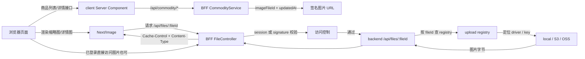

# 图片展示性能设计

## 目标

本次 4.3 改动要解决四个问题：

- 列表页不能再直接加载原始大图
- 详情页要有稳定尺寸，避免布局抖动和 LCP 恶化
- 私有图片仍然要支持图片优化和 CDN 缓存
- 商品换图后，旧缓存不能长期残留

## 图例

## 设计拆解

### 1. 商品接口不再返回裸图地址

backend 仍然保存商品的 `imageFileId` 和 `imageUrl`，但 BFF 在对外返回商品数据时，会重新计算展示用图片 URL，而不是直接透传底层存储地址。

这样做的目的：

- 隐藏对象存储或本地文件的真实路径
- 给图片访问加上权限边界
- 给图片 URL 挂上尺寸语义和缓存版本

对应实现：

- `apps/bff/src/commodity/commodity.service.ts`
- `apps/bff/src/upload/file-url.service.ts`

### 2. 同一张图拆成不同展示语义

这次没有把“列表图”和“详情图”做成两套独立文件表，而是先用 URL 语义把场景分开：

- `thumb`：列表缩略图
- `detail`：详情大图
- `preview`：上传后的表单预览

前端再把这些 URL 交给 `Next/Image`，由它根据组件尺寸输出合适的请求和缓存策略。

这样列表页的 56px 图片不会再按“原始大图直接展示”的方式加载。

对应实现：

- `apps/client/app/present/commodity/list/commodity-list-content.tsx`
- `apps/client/app/present/commodity/[id]/page.tsx`
- `apps/client/src/components/commodity-image.tsx`

### 3. 私有访问和图片优化同时成立

如果图片只允许带登录 cookie 访问，`Next/Image` 在服务端抓图时会遇到权限问题。因为图片优化请求不一定天然携带当前用户 cookie。

所以这里采用双通道放行：

- 浏览器用户自己访问图片：靠 session
- `Next/Image` 或 CDN 拉取图片：靠签名 URL

`FileController` 会校验：

- `fileId`
- `variant`
- `v`
- `expires`
- `signature`

只要登录态有效，或者签名合法且未过期，请求就能继续代理到 backend 文件接口。

对应实现：

- `apps/bff/src/upload/file.controller.ts`
- `apps/bff/src/upload/file-url.service.ts`

### 4. 缓存失效依赖版本参数

图片 URL 里会带 `v` 参数，当前实现使用商品 `updatedAt` 作为版本值。

这意味着：

- 商品图片没变时，签名 URL 稳定，可被浏览器和 CDN 缓存
- 商品换图后，`updatedAt` 变化，URL 也变化
- 浏览器和 CDN 会把它当成一张新图，不会长期命中旧缓存

这是本次“图片更新后不会长期显示旧图”的核心手段。

### 5. 缓存响应头按真实生产思路拆分

当前 BFF 文件代理不是只返回一个 `Cache-Control`，而是按访问方式拆分：

- 登录态直连图片：
  - `Cache-Control: private, no-store`
  - `Pragma: no-cache`
  - `Vary: Cookie, Accept`
- 签名 URL 访问图片：
  - `Cache-Control: public, max-age=..., stale-while-revalidate=..., immutable`
  - `CDN-Cache-Control: public, max-age=..., stale-while-revalidate=..., immutable`
  - `Surrogate-Control: public, max-age=..., stale-while-revalidate=..., immutable`
  - `ETag`
  - `Last-Modified`
  - `Vary: Accept`

并且支持条件请求：

- 浏览器或 CDN 带 `If-None-Match`
- 浏览器或 CDN 带 `If-Modified-Since`
- BFF 命中后直接返回 `304 Not Modified`

这部分逻辑在：

- `apps/bff/src/upload/file.controller.ts`

### 6. 不同图片语义使用不同 TTL

当前策略不是一把梭：

- `thumb`
  - 长期公共缓存
  - 适合列表页和 CDN 命中
- `detail`
  - 长期公共缓存
  - 适合详情页大图
- `preview`
  - 短期缓存
  - 适合上传后的临时预览

对应环境变量：

- `FILE_URL_TTL_SECONDS`
- `FILE_PREVIEW_URL_TTL_SECONDS`
- `FILE_CACHE_THUMB_MAX_AGE_SECONDS`
- `FILE_CACHE_THUMB_STALE_WHILE_REVALIDATE_SECONDS`
- `FILE_CACHE_DETAIL_MAX_AGE_SECONDS`
- `FILE_CACHE_DETAIL_STALE_WHILE_REVALIDATE_SECONDS`
- `FILE_CACHE_PREVIEW_MAX_AGE_SECONDS`
- `FILE_CACHE_PREVIEW_STALE_WHILE_REVALIDATE_SECONDS`

### 7. 列表、详情、失败态分别处理

前端统一使用 `CommodityImage` 组件：

- 列表页固定 `56x56` 缩略图
- 详情页固定宽高比，减少布局抖动
- 图片缺失或加载失败时显示占位

这样可以保证：

- 列表滚动时不会因为图片尺寸不稳定导致跳动
- 详情页首屏图片区不会在图片返回后突然挤压文本
- 图片异常时不会出现空白块

## 和 4.2 的关系

4.2 解决的是“图片能不能安全上传和私有访问”，4.3 解决的是“图片怎么高效展示”。

两者的连接点在于 `/api/files/:fileId`：

- 4.2 让它成为私有图片代理入口
- 4.3 在这个入口之上增加签名 URL、尺寸语义和缓存版本

所以 4.3 不是单纯的前端样式优化，而是在已有上传安全链路上继续补齐媒体分发层。

## 当前边界

这版已经满足：

- 列表不直接吃原始大图展示链路
- 图片失败有 fallback
- 图片 URL 可挂 CDN
- 图片更新能通过版本参数失效缓存

还没有做的事情：

- 真正离线生成多份物理缩略图文件
- 图片格式自动转 WebP / AVIF
- 实测 Lighthouse / Web Vitals 报表

当前方案更适合这个项目阶段：先把权限、缓存、展示语义和前端体验搭稳，再决定是否引入更重的图片处理流水线。
