# 登录为什么使用 HttpOnly Cookie Session

当前系统是 `Next.js Admin + NestJS BFF + NestJS Backend + MongoDB + Redis` 的后台系统。登录态选择 `HttpOnly Cookie Session`，核心目标不是“传统”，而是把身份判断放回服务端控制：浏览器只保存一个随机 `sessionId`，真实用户、角色、权限、过期时间、风控状态都由 BFF 结合 Redis 和 MongoDB 还原。

先把最容易混淆的一点说清楚：

```text
JWT：一种 token 格式，里面可以带 userId、roles、exp 等声明。
Cookie：浏览器保存和自动携带数据的一种 HTTP 机制。
Session：服务端保存登录态的一条记录。
```

所以准确对比不是“JWT vs Cookie”，而是：

```text
JWT token vs 不透明 sessionId
Authorization header vs Cookie transport
客户端自带身份声明 vs 服务端集中还原身份
```

## 1. 当前系统保存了什么

浏览器只保存：

```http
Set-Cookie: next_bff_session=<sessionId>; Path=/; HttpOnly; SameSite=Lax; Max-Age=86400
Set-Cookie: next_bff_csrf=<csrfToken>; Path=/; SameSite=Lax; Max-Age=86400
```

Redis 保存短期会话和短期安全状态：

```text
next-bff:session:<sessionId>
  -> {
       sessionId,
       userId,
       device: { ip, userAgent },
       createdAt,
       expiresAt
     }

next-bff:user-sessions:<userId>
  -> Set<sessionId>

login-risk:ip:<ip>
login-risk:user:<username>
```

MongoDB 保存长期账号事实：

```text
users
  id
  username
  passwordHash
  enabled
  roles
  tenantId

roles
  code
  permissions

login_audit_logs
  username
  userId
  result
  ip
  userAgent
  traceId
  createdAt
```

Backend 不直接接收浏览器 cookie。BFF 还原当前用户后，把可信的内部上下文转发给 Backend：

```http
x-user-id: u_admin_001
x-tenant-id: default
x-trace-id: <traceId>
```

## 2. Cookie 到底存在哪里

真实例子：

你登录成功后，打开浏览器 DevTools：

- `Application -> Cookies -> http://localhost:3000` 能看到 `next_bff_session`。
- `localStorage` 里看不到这个值。
- 控制台执行 `document.cookie`，也看不到 `next_bff_session`。

原因是 `next_bff_session` 是浏览器 Cookie Jar 里的 cookie，不是 localStorage 里的字符串。它带了 `HttpOnly`，所以 JS 不能直接读取。

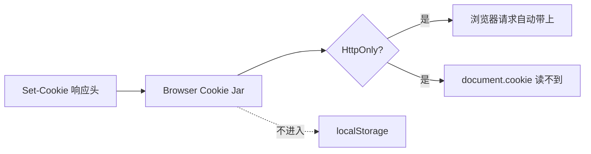

## 3. Cookie 会存多久，什么时候失效

当前系统里 cookie 的生命周期由两层共同决定：

- 浏览器 cookie 的 `Max-Age`。
- Redis session 的 TTL 和 `expiresAt`。

只有两边都有效，登录态才有效。

```text
cookie 未过期 + Redis session 存在且未过期 => 已登录
cookie 未过期 + Redis session 不存在 => 401
cookie 已过期 + Redis session 还存在 => 浏览器不会再带 cookie，仍然等于未登录
退出登录 => BFF 删除 Redis session，并返回 Max-Age=0 清 cookie
```

流程：

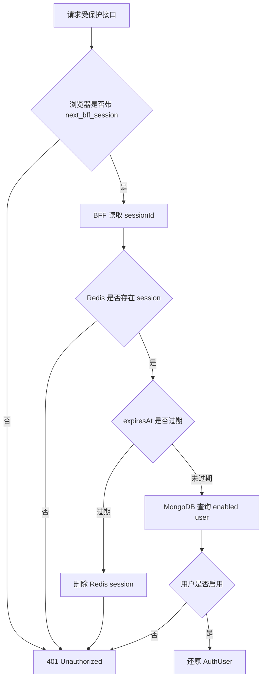

## 4. JWT 是什么

JWT 是一种“服务端签名过的声明”。常见内容长这样：

```json
{
  "sub": "u_admin_001",
  "exp": 1770000000,
  "scope": ["commodity.read", "commodity.write"],
  "tenantId": "default"
}
```

它不是加密的保险箱，而是签名后的声明。服务端可以验签确认“这个 token 是我签发的，内容没有被改过”。但如果 JWT 泄露，在过期前通常可以被继续使用，除非系统额外做黑名单、版本号或短 TTL。

JWT 登录的签名算法、是否非对称、token 内容、权限变更和 TTL 详见：[登录-JWT 登录方案](./30-登录-JWT登录方案.md)。

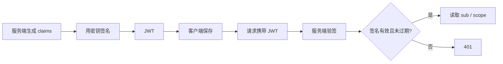

## 5. 登录态写在 token 里和只放 sessionId 的区别

“登录态主要写在 token 里”指的是：客户端拿到的 token 本身就携带足够的身份声明，服务端通过验签就能相信这些声明。

例如 JWT payload 里可能有：

```json
{
  "sub": "u_admin_001",
  "roles": ["admin"],
  "tenantId": "default",
  "exp": 1770000000
}
```

这个 token 表达的是：

```text
我是 u_admin_001；
我的角色是 admin；
我属于 default 租户；
我在 exp 之前有效；
这些内容由服务端签名保护，不能被客户端随便改。
```

而 `sessionId` 不是身份声明，它只是一个随机索引：

```text
next_bff_session=sid_abc_123
```

它本身不表达用户是谁、不表达角色、不表达租户，也不表达权限。BFF 必须拿它去 Redis 查：

```text
sid_abc_123 -> userId -> MongoDB users/roles -> AuthUser
```

两者的本质区别可以画成这样：

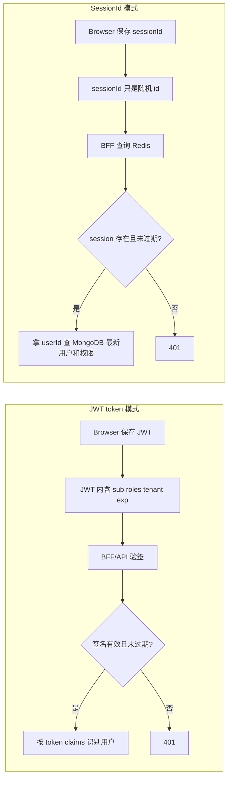

### 5.1 token 像“带签名的通行证”

JWT 更像一张带签名的通行证：

```text
通行证上直接写着：用户是谁、有效期、可访问范围。
门卫只要验签和看有效期，就能决定是否放行。
```

优点是：

- 不一定每次都查 Redis session。
- 多个服务只要共享公钥或签名配置，就可以独立验签。
- 适合 API、移动端、服务间调用、短期 access token。

代价是：

- token 一旦签发，里面的声明在过期前天然不会自己变。
- 用户角色被改掉后，旧 JWT 可能还带着旧角色。
- 退出登录、封禁、踢下线需要额外做黑名单、`tokenVersion`、短 TTL 或 refresh token 轮换。

### 5.2 sessionId 像“票号”

`sessionId` 更像一张票号：

```text
票号本身不写用户是谁。
每次进门都拿票号去服务端查：这张票现在还有效吗？对应哪个用户？
```

优点是：

- 服务端删除 Redis session 后，旧 cookie 再带回来也立刻无效。
- 用户禁用、角色变化、权限变化可以下次请求立即生效。
- session 里可以只存 `userId`，敏感事实放在 MongoDB。
- 适合后台管理、运营系统、权限敏感系统。

代价是：

- BFF 每次需要查 Redis session。
- 多实例部署必须保证所有 BFF 共用同一个 session store。
- Redis 不可用会影响登录态判断。

### 5.3 对比表

| 维度                     | JWT token 写登录态               | Cookie + sessionId                         |
| ------------------------ | -------------------------------- | ------------------------------------------ |
| 客户端保存什么           | 带声明的 token                   | 随机、不透明的 sessionId                   |
| 客户端能否知道用户信息   | 如果能解码 JWT，就能看到 payload | 不能，仅凭 sessionId 看不出用户是谁        |
| 服务端如何判断登录       | 验签 + 检查 `exp`                | 查 Redis session + 查用户                  |
| 登录态主要在哪里         | token 自身                       | 服务端 Redis / DB                          |
| 是否容易立即登出         | 不容易，需要黑名单或版本号       | 容易，删除 session 即可                    |
| 权限变化是否立即生效     | 不一定，旧 token 可能有旧权限    | 容易，下次查 MongoDB 最新权限              |
| 多服务验证               | 方便，共享签名配置即可           | 需要共享 session store 或通过 BFF 统一鉴权 |
| 泄露后的风险             | 到期前可能继续有效               | 可以服务端删除 session 立即失效            |
| 当前后台系统是否优先选择 | 不是首选                         | 是当前选择                                 |

一句话：

```text
JWT 是“令牌自己证明你是谁”；
sessionId 是“拿着随机 id 去服务端查你是谁”。
```

再放回当前项目：

```text
next_bff_session 只证明“浏览器带来了一个 sessionId”；
Redis 决定“这个 sessionId 现在是否有效”；
MongoDB 决定“这个 userId 当前是谁、是否启用、有什么权限”；
BFF 决定“是否允许这个请求进入业务 Backend”。
```

## 6. 为什么退出登录后旧 cookie 再带来也没用

`next_bff_session` 只是一个随机 id，不是完整身份。BFF 每次都要拿它去 Redis 查真实会话。

退出登录时：

```text
Browser -> BFF: POST /api/auth/logout
BFF -> Redis: DEL next-bff:session:<sessionId>
BFF -> Browser: Set-Cookie next_bff_session=; Max-Age=0
```

如果有人复制了旧 cookie，再带回来：

```text
Cookie: next_bff_session=abc
BFF -> Redis GET next-bff:session:abc
Redis -> null
BFF -> 401
```

所以“删除 Redis session”才是真正的服务端失效点；清 cookie 是让浏览器本地也同步清掉。

## 7. Next App Router 在这里做什么

当前系统是 Next.js App Router。它的关键作用是：页面服务端渲染时可以通过 `cookies()` 读取浏览器请求带来的 cookie，然后在服务端请求 BFF。

```mermaid
flowchart LR
  A[Browser 打开 /present/commodity/list] --> B[Next App Router Server Component]
  B --> C[cookies() 读取 next_bff_session]
  C --> D[服务端 fetch BFF /api/auth/me]
  D --> E[BFF 查 Redis + MongoDB]
  E --> F[返回当前用户]
  F --> G[Next 渲染后台页面]
```

这也是为什么 `HttpOnly cookie + session` 对 App Router 友好：不需要在浏览器 JS 里读取 token，服务端组件也能完成鉴权和取数。

## 8. SameSite=Lax 到底什么时候带 cookie

`SameSite=Lax` 解决的是“跨站请求默认自动带 cookie”的风险，但它不是完整 CSRF 防护。

会带 cookie 的典型情况：

- 用户在地址栏输入 `http://localhost:3000/present`。
- 用户从别的网站点击链接跳到本站，属于顶级 GET 导航。
- 本站页面内请求同站 `/api/...`。

通常不会带 cookie 的典型情况：

- `evil.com` 里放 `` 这种跨站子资源。
- `evil.com` 用表单跨站 POST 到本站。
- `evil.com` 用 `fetch` 跨站调用本站 API。

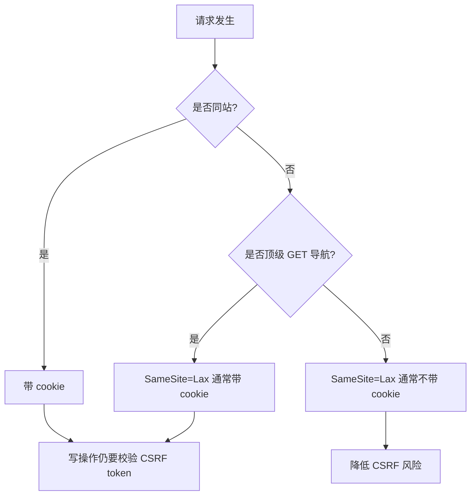

结论：`SameSite=Lax` 能降低跨站自动带 cookie 的范围，但后台写操作仍然必须校验 `Origin` 和 `x-csrf-token`。

## 9. 为什么 session 里不存角色

当前 Redis session 只存：

```text
sessionId
userId
device
createdAt
expiresAt
```

不把 `roles`、`permissions` 放进 Redis session，是为了让权限变化实时生效。

真实例子：

1. `admin` 把用户 `operator` 的角色改成 `viewer`。
2. 如果 Redis session 里缓存了旧角色，`operator` 可能在 session 过期前仍有写权限。
3. 当前设计每次从 session 拿到 `userId` 后，再查 MongoDB 的 `users.roles` 和 `roles.permissions`。
4. 下一次请求立即按新权限判断。

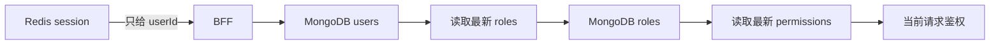

什么时候可以把角色放进 session？

- 权限很少变化。
- 可以接受权限延迟生效。
- 有 `permissionVersion` 或 `tokenVersion`，角色变化时能强制 session 失效。

当前后台系统更看重权限实时性，所以 session 不存角色。

## 10. 主流登录方式流程图

下面每一种方式都是独立流程图。图里重点看五类对象：客户端、中间层、Redis、MongoDB、Backend。

### 10.1 HttpOnly Cookie Session

这是当前系统采用的方式。

```mermaid
flowchart LR
  subgraph C[客户端 / Next]
    C1([打开登录页])
    C2[提交 username/password + x-csrf-token]
    C3[浏览器保存 HttpOnly cookie: next_bff_session]
    C4[后续请求自动带 cookie]
  end

  subgraph B[BFF 中间层]
    B1[AuthController.login]
    B2[LoginRiskService 校验 IP/账号失败次数]
    B3[UserService bcrypt compare]
    B4[SessionStoreService 生成 sessionId]
    B5[AuthGuard 读取 cookie 中的 sessionId]
    B6[还原 AuthUser: userId/roles/permissions/tenantId]
    B7[转发 Backend: x-user-id/x-tenant-id/x-trace-id]
    B8[logout 删除 session + 清 cookie]
  end

  subgraph R[Redis]
    R1[login-risk:ip / login-risk:user]
    R2[session:{sessionId} -> userId/device/expiresAt]
    R3[user-sessions:{userId} -> Set sessionId]
  end

  subgraph M[MongoDB]
    M1[users.username/enabled/passwordHash]
    M2[users.roles + roles.permissions]
    M3[login_audit_logs]
  end

  subgraph S[Backend 服务端]
    S1[接收内部 header]
    S2[读写商品/上传/审计业务数据]
  end

  C1 --> C2 --> B1 --> B2 --> R1
  B2 --> B3 --> M1
  B3 --> B4 --> R2
  B4 --> R3
  B4 --> M3
  B4 --> C3 --> C4 --> B5 --> R2
  B5 --> B6 --> M2
  B6 --> B7 --> S1 --> S2
  C4 --> B8 --> R2
  B8 --> C3
```

优势：

- 服务端可以立即撤销登录态，退出和封禁都可靠。
- BFF 重启后，只要 Redis 还在，登录态不丢。
- 权限从 MongoDB 实时读取，角色变更下一次请求生效。
- 适合 Next App Router 服务端取数。

劣势：

- 依赖 Redis，Redis 不可用会影响登录态。
- Cookie 自动携带，所以写操作必须补 CSRF 防护。
- 多服务部署时必须共享 session store。

适合：

- 后台管理系统。
- 权限变化敏感的业务。
- 需要强退出、封禁、多端会话列表的系统。

### 10.2 localStorage JWT

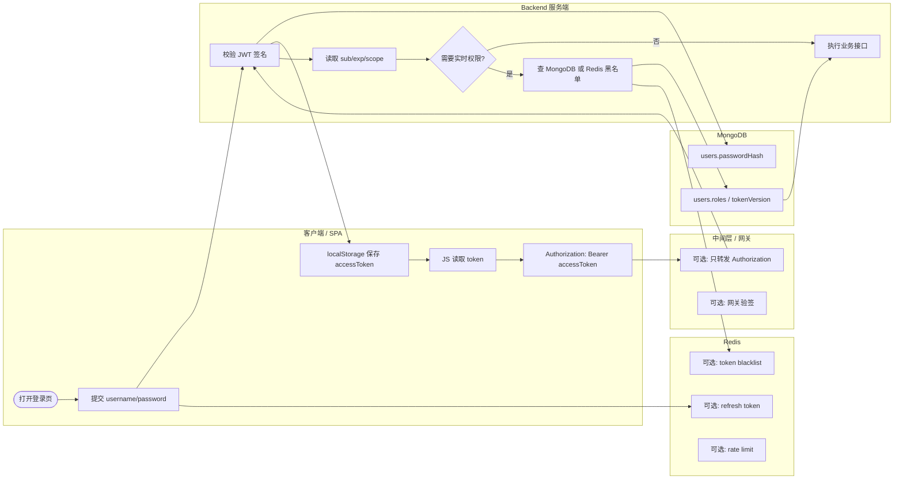

优势：

- 前后端解耦明显，`Authorization` header 很直观。
- 移动端、开放 API、跨域 API 使用方便。
- 服务端可以无状态验签，减少 session 查询。

劣势：

- XSS 一旦发生，JS 可以直接读走 localStorage 里的 token。
- token 在过期前天然难撤销。
- 角色和权限写在 JWT payload 里会有延迟生效问题。

适合：

- 移动端 App。
- 第三方开放 API。
- 纯 SPA，但必须配短 access token、refresh token 轮换、XSS 防护和撤销策略。

### 10.3 HttpOnly Cookie JWT

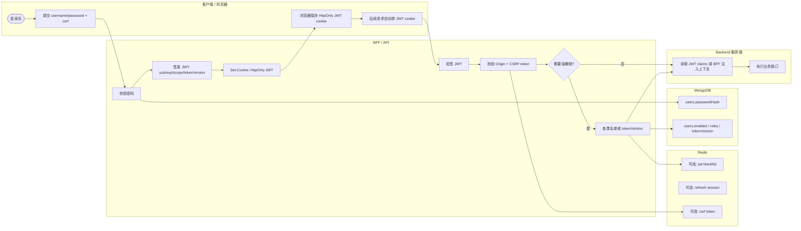

优势：

- JS 读不到 JWT，比 localStorage JWT 更抗 XSS 直接窃取。
- 服务端可以验签，不一定每次查 Redis session。
- 浏览器自动携带，Web 使用方便。

劣势：

- Cookie 自动携带，仍然有 CSRF 风险。
- JWT payload 可能变旧，权限变化不一定实时。
- 要强撤销必须引入黑名单、tokenVersion 或很短 TTL。

适合：

- 同站 Web 应用。
- 想降低 Redis session 查询，但能接受短 TTL 和 CSRF 防护成本。
- 权限实时性要求没有后台管理系统那么高的业务。

### 10.4 OAuth / OIDC

```mermaid
flowchart LR
  subgraph C[客户端 / 浏览器]
    C1([点击企业登录])
    C2[跳转 IdP authorize]
    C3[带 code 回到 /callback]
    C4[保存本地 session cookie]
    C5[访问业务页面]
  end

  subgraph I[外部身份提供方 IdP]
    I1[登录/MFA/SSO]
    I2[签发 authorization code]
    I3[token endpoint 返回 id_token/access_token]
  end

  subgraph B[BFF 中间层]
    B1[生成 state/nonce]
    B2[校验 state/nonce]
    B3[后端用 code 换 token]
    B4[解析 id_token: sub/email]
    B5[映射本地 userId]
    B6[建立本地 session]
  end

  subgraph R[Redis]
    R1[state/nonce]
    R2[本地 session:{sessionId}]
    R3[可选: token cache]
  end

  subgraph M[MongoDB]
    M1[externalSub -> userId]
    M2[users.roles / permissions]
  end

  subgraph S[Backend 服务端]
    S1[接收 BFF 内部用户上下文]
    S2[执行业务接口]
  end

  C1 --> B1 --> R1
  B1 --> C2 --> I1 --> I2 --> C3
  C3 --> B2 --> R1
  B2 --> B3 --> I3 --> B4
  B4 --> B5 --> M1
  B5 --> M2
  B5 --> B6 --> R2 --> C4
  C5 --> B6 --> S1 --> S2
  B3 --> R3
```

优势：

- 密码、MFA、企业 SSO 交给专业身份系统。
- 多系统可以统一登录。
- 适合接入企业身份、社交登录、统一账号治理。

劣势：

- 回调、`state/nonce`、token 换取、刷新、退出都更复杂。
- 外部 IdP 故障会影响登录。
- 业务系统仍要做本地账号、角色和权限映射。

适合：

- 企业后台。
- 多系统统一登录。
- 需要 MFA、SSO、外部身份治理的场景。

### 10.5 API Key / 机器账号

这不是普通用户登录方式，但是真实系统里很常见，适合服务间调用、CI、Webhook 和开放平台。

```mermaid
flowchart LR
  subgraph C[调用方服务 / 脚本]
    C1([创建 API Key])
    C2[保存一次性展示的 key]
    C3[请求携带 x-api-key 或签名 header]
  end

  subgraph B[网关 / BFF]
    B1[只保存 key hash]
    B2[校验 key hash]
    B3[校验 scopes / IP allowlist]
    B4[限流和审计]
    B5{key 是否有效?}
  end

  subgraph R[Redis]
    R1[rate-limit:{keyId}]
    R2[短期 key 状态缓存]
  end

  subgraph M[MongoDB]
    M1[apiKeys.hash / owner / scopes]
    M2[revokedAt / expiresAt]
    M3[audit logs]
  end

  subgraph S[Backend 服务端]
    S1[按 scopes 执行业务接口]
    S2[拒绝 401/403]
  end

  C1 --> B1 --> M1
  C2 --> C3 --> B2 --> M1
  B2 --> B3 --> M2
  B3 --> B4 --> R1
  B4 --> M3
  B4 --> B5
  B5 -->|有效| S1
  B5 -->|无效| S2
  B2 --> R2
```

优势：

- 对机器调用简单稳定。
- 容易做按 key 的限流、审计、配额和权限范围。
- 不依赖浏览器 cookie。

劣势：

- 不适合普通用户登录。
- key 泄露后风险高。
- 必须设计轮换、过期、撤销、最小权限和审计。

适合：

- CI/CD。
- Webhook。
- 内部服务调用。
- 开放平台 API。

## 11. 当前系统里的三种并行模拟入口

为了对比三种登录方案，当前 BFF 保留原有 `/api/auth/*`，并新增两套隔离模块。

JWT 登录已经拆到独立文档：[登录-JWT 登录方案](./30-登录-JWT登录方案.md)。本节只保留入口和隔离关系总览。

```text
apps/bff/src/auth/
  HttpOnly Cookie + Redis Session

apps/bff/src/auth-jwt-local/
  localStorage JWT 模拟

apps/bff/src/auth-jwt-cookie/
  HttpOnly Cookie JWT 模拟

apps/bff/src/auth-jwt-common/
  仅放共享 JWT HS256 编解码工具
```

三种方案的客户端入口和 BFF 入口互不覆盖：

| 方案                    | 客户端入口          | BFF 模块              | 登录入口                          | 当前用户入口                  | 凭证放在哪里                                         |
| ----------------------- | ------------------- | --------------------- | --------------------------------- | ----------------------------- | ---------------------------------------------------- |
| HttpOnly Cookie Session | `/login`            | `AuthModule`          | `POST /api/auth/login`            | `GET /api/auth/me`            | `next_bff_session` cookie + Redis session            |
| localStorage JWT        | `/login/jwt-local`  | `AuthJwtLocalModule`  | `POST /api/auth-jwt-local/login`  | `GET /api/auth-jwt-local/me`  | 响应体 `accessToken`，客户端自行放入 `Authorization` |
| HttpOnly Cookie JWT     | `/login/jwt-cookie` | `AuthJwtCookieModule` | `POST /api/auth-jwt-cookie/login` | `GET /api/auth-jwt-cookie/me` | `next_bff_jwt` HttpOnly cookie                       |

隔离关系：

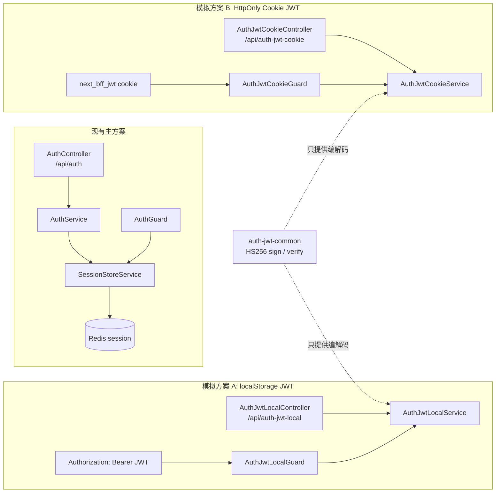

### 11.1 localStorage JWT 模拟流程

登录：

```text
POST /api/auth-jwt-local/login
body: { username, password }
```

响应体会返回：

```json
{
  "accessToken": "<jwt>",
  "tokenType": "Bearer",
  "expiresIn": 900,
  "user": {
    "id": "u_admin_001",
    "username": "admin",
    "roles": ["admin"],
    "permissions": ["commodity:read"],
    "tenantId": "tenant_demo"
  }
}
```

后续请求由客户端主动携带：

```http
Authorization: Bearer <jwt>
```

流程图：

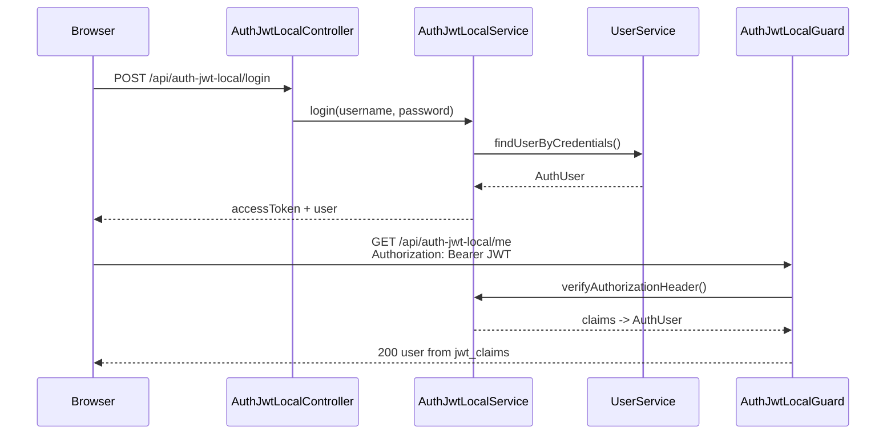

这里模拟的是“登录态主要写在 token 里”：`sub`、`roles`、`permissions`、`tenantId`、`exp` 都在 JWT claims 中。`/me` 不查 Redis session。

### 11.2 HttpOnly Cookie JWT 模拟流程

登录：

```text
POST /api/auth-jwt-cookie/login
body: { username, password }
```

BFF 返回：

```http
Set-Cookie: next_bff_jwt=<jwt>; Path=/; HttpOnly; SameSite=Lax; Max-Age=900
```

响应体不会返回 `accessToken`，因为这个方案的目标是让浏览器保存 JWT，但不让前端 JS 直接读取。

流程图：

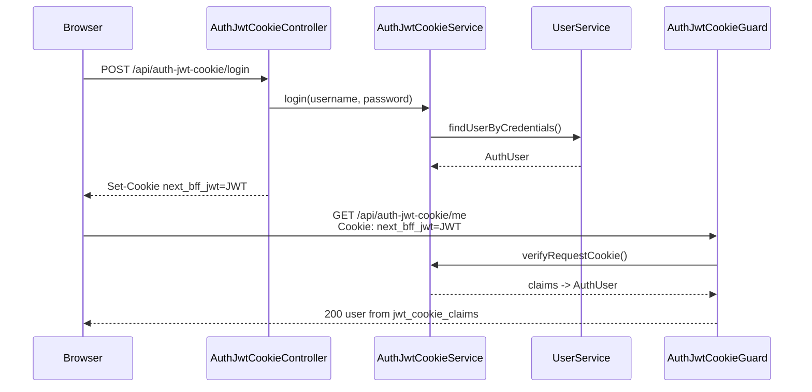

这个方案减少了 Redis session 查询，但没有天然解决强撤销。当前模拟里的 `logout` 只清浏览器 cookie：

```text
POST /api/auth-jwt-cookie/logout
-> Set-Cookie next_bff_jwt=; Max-Age=0
```

如果旧 JWT 被复制走，在 `exp` 到期前仍可能可用，除非再加 blacklist、`tokenVersion` 或非常短的 TTL。

### 11.3 两种 JWT 方案图解对比

这两种方案都把登录态主要写在 JWT claims 里，差异主要在“JWT 存在哪里、谁能读取、请求时如何携带”。

#### 凭证存储位置

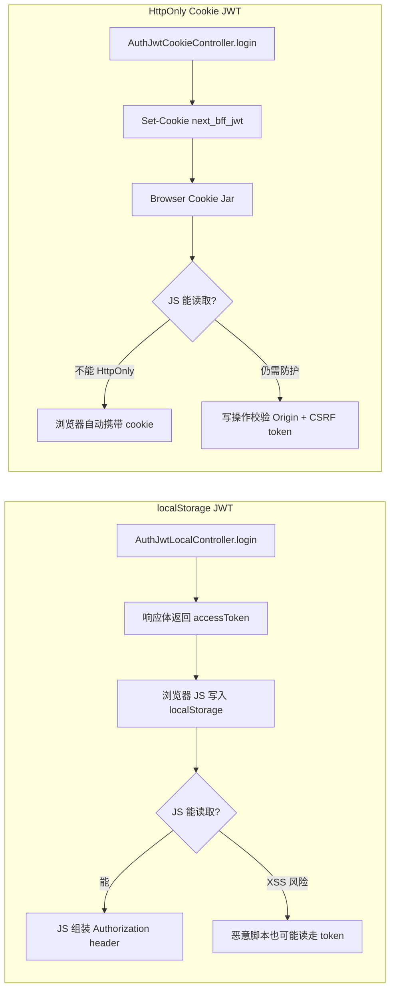

核心区别：

```text
localStorage JWT：客户端 JS 主动管理 token。
HttpOnly Cookie JWT：浏览器 Cookie Jar 管理 token，JS 读不到。
```

#### 请求携带方式

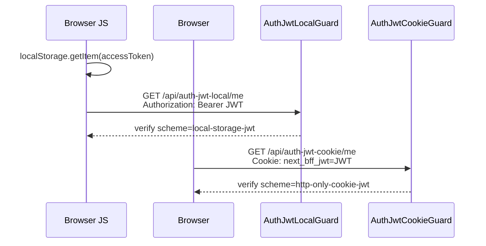

在当前代码里，两个 guard 都只接受自己的 scheme：

```text
local-storage-jwt 只能访问 /api/auth-jwt-local/*
http-only-cookie-jwt 只能访问 /api/auth-jwt-cookie/*
```

这样做是为了让两个模拟方案隔离，避免“同一个 JWT 到处都能用”，导致教学对比不清楚。

#### 登录态还原方式

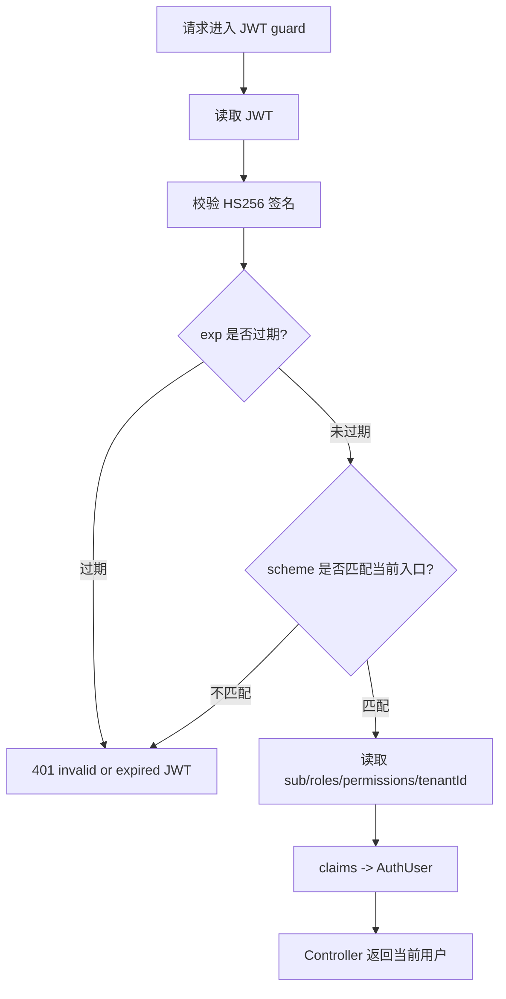

这和 Redis Session 方案不同。JWT 模拟方案的 `/me` 不查 `SessionStoreService`，所以它展示的是：

```text
token 自己携带身份声明；
BFF 通过验签相信 claims；
权限变化不会天然实时生效。
```

#### 登出和强撤销差异

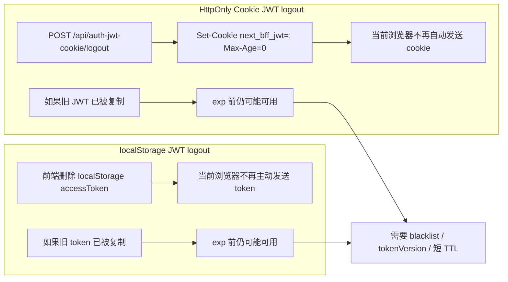

这就是 JWT 和 sessionId 的关键差异：

```text
删除浏览器里的 JWT，只能阻止当前浏览器继续发送。
删除 Redis session，可以让同一个 sessionId 在服务端立即失效。
```

#### 风险对比

| 维度                | localStorage JWT                         | HttpOnly Cookie JWT           |
| ------------------- | ---------------------------------------- | ----------------------------- |
| JS 能否读取 token   | 能                                       | 不能                          |
| XSS 直接偷 token    | 风险更高                                 | 风险较低，但 XSS 仍可代发请求 |
| CSRF 风险           | 通常较低，因为不会自动带 Authorization   | 存在，因为 cookie 自动携带    |
| 客户端控制 header   | 强，需要 JS 主动设置                     | 弱，浏览器自动携带            |
| 服务端 session 查询 | 不需要                                   | 不需要                        |
| 强制登出            | 都需要 blacklist / tokenVersion / 短 TTL |
| 当前模拟入口        | `/api/auth-jwt-local/*`                  | `/api/auth-jwt-cookie/*`      |

### 11.4 当前模拟的边界

这两套 JWT 方案是为了对比机制，不替换主方案：

- 不改 `/api/auth/login`、`/api/auth/me`、`/api/auth/logout`。
- 不让 JWT 方案复用 `SessionStoreService`，否则看不出 token 和 sessionId 的差异。
- 两套 JWT guard 只接受自己 scheme 的 token，`local-storage-jwt` 不能拿去访问 cookie JWT 入口。
- JWT 使用 `JWT_SIMULATION_SECRET` 和 `JWT_ACCESS_TOKEN_TTL_SECONDS`。
- 当前实现没有 refresh token、blacklist、`tokenVersion`，所以不宣称是完整生产 JWT 体系。
- 当前 BFF 全局 CSRF middleware 对非安全方法生效，浏览器调用这些 `POST` 模拟入口时仍应先走 `/api/auth/csrf` 获取 CSRF token。

## 12. 什么时候选择哪种方式

选 `HttpOnly Cookie Session`：

- 你做的是后台系统、管理端、财务系统、运营系统。
- 需要退出、封禁、权限变化立即生效。
- 页面由 Next App Router 服务端取数。
- 能接受 Redis 作为登录态基础设施。

选 `localStorage JWT`：

- 你做的是移动端、开放 API、跨域 API。
- 客户端必须主动控制 `Authorization` header。
- 你能接受并处理 XSS、refresh token、短 TTL、黑名单或 token version。

选 `HttpOnly Cookie JWT`：

- 你想减少 Redis session 查询。
- 你仍然是 Web 应用，希望 JS 读不到 token。
- 权限变化不要求完全实时，或者你有 token version / blacklist。

选 `OAuth / OIDC`：

- 你要企业 SSO、MFA、统一登录。
- 本系统不想保存用户密码。
- 有多个业务系统需要共享身份入口。

选 `API Key`：

- 调用方不是人，而是服务、脚本、CI、Webhook。
- 你需要按 key 做 scopes、配额、审计和轮换。
- 不要把它当普通浏览器用户登录方案。

## 13. 当前系统的结论

当前后台系统选择 `HttpOnly cookie + Redis session`，因为它最贴合后台系统的风险模型：

- 浏览器不保存明文密码、不保存 `passwordHash`、不保存角色权限。
- `next_bff_session` 是随机 `sessionId`，JS 读不到。
- Redis 保存短期会话，支持 TTL、BFF 重启恢复、多端 session。
- MongoDB 保存长期账号事实，角色和权限能实时变化。
- BFF 负责把浏览器凭证转换成可信内部上下文。
- Backend 不直接相信浏览器 cookie，而是接收 BFF 注入的 `x-user-id`、`x-tenant-id`、`x-trace-id`。
- 写操作同时依赖 `SameSite=Lax`、Origin 校验和 CSRF token。

一句话：

```text
Cookie 只证明“浏览器带来了一个 sessionId”；
Redis 决定“这个 sessionId 现在是否有效”；
MongoDB 决定“这个 userId 当前是谁、是否启用、有什么权限”；
BFF 决定“是否允许这个请求进入业务 Backend”。
```
