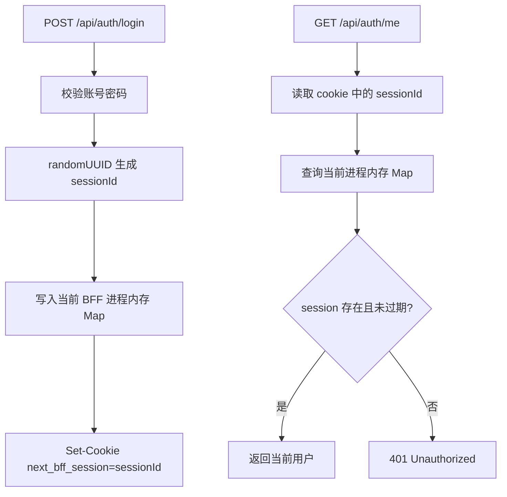
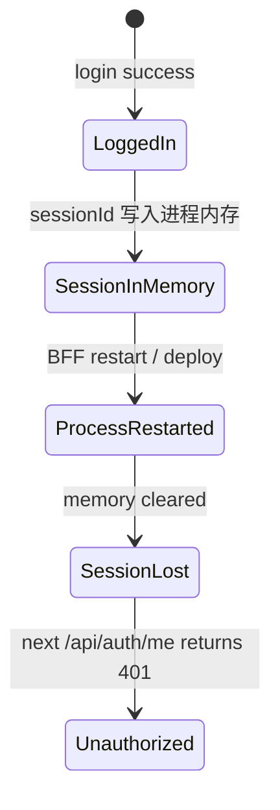
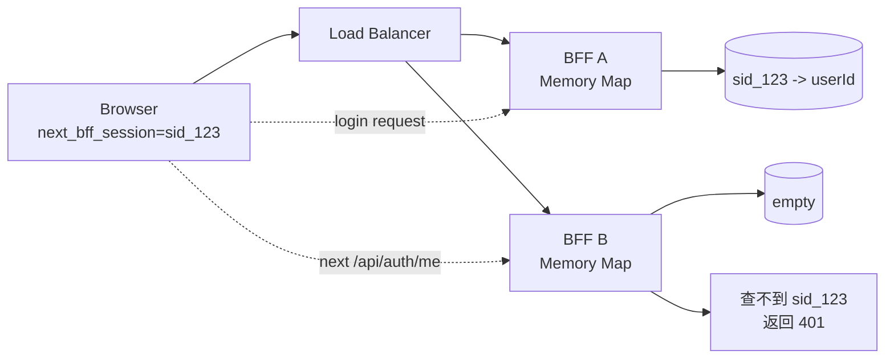
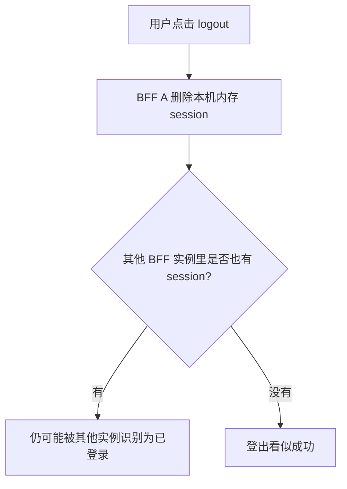
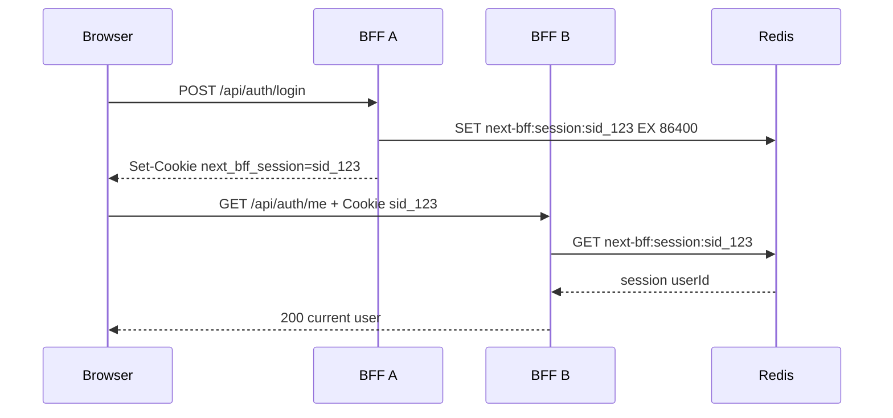

# Session 为什么要从内存升级到 Redis

本文用当前 `next-bff` 的登录链路说明：为什么 MVP 阶段可以把 session 放在内存里，但真实 BFF 服务通常要升级到 Redis。

相关代码：

- `apps/bff/src/auth/auth.controller.ts`
- `apps/bff/src/auth/auth.service.ts`
- `apps/bff/src/auth/auth.guard.ts`
- `apps/bff/src/auth/get-current-user.ts`
- `apps/bff/src/auth/session-store.service.ts`
- `.env.example`

## 真实场景背景

用户登录后台管理系统后，浏览器拿到一个 `HttpOnly` cookie：

```text
next_bff_session=<sessionId>
```

浏览器后续访问 `GET /api/auth/me`、商品列表、上传接口时，会自动带上这个 cookie。BFF 要做的事情是：

```text
cookie 里的 sessionId -> 服务端 session store -> userId -> 当前用户
```

所以 cookie 本身不是登录状态的全部。真正决定用户是否登录的是服务端能不能用 `sessionId` 查到有效 session。

## MVP 内存版能解决什么

内存版 session store 通常是一个进程内的 `Map`：



这个方案适合本地开发和教学 MVP：

- 不需要启动额外基础设施。
- 代码路径清晰，容易理解 cookie、session、guard 的关系。
- 单进程运行时可以跑通登录、刷新、登出。

但它只证明了“登录机制能跑通”，没有解决真实部署环境里的稳定性问题。

## 内存 session 的核心问题

### 问题一：服务重启后用户全部掉线

内存属于当前 Node.js 进程。进程一重启，`Map` 就清空。



真实例子：

```text
用户 10:00 登录成功
10:05 BFF 发布新版本并重启
10:06 用户刷新页面
BFF 查不到内存里的 session
用户被迫重新登录
```

这在本地开发可以接受，但在线上发布、扩容、异常重启时会变成明显的用户体验问题。

### 问题二：多实例部署时 session 不共享

生产 BFF 通常不止一个实例。负载均衡可能把登录请求打到 BFF A，把下一次刷新请求打到 BFF B。



这个问题的本质是：

```text
内存 session 解决的是“这个进程知道你是谁”；
真实集群需要的是“所有 BFF 实例都知道你是谁”。
```

### 问题三：登出和封禁不容易全局生效

如果 session 分散在不同进程内存里，登出、踢下线、禁用账号、清理多端登录都会变复杂。



真实系统里，登出应该是一个全局状态变化，而不是只对某个进程生效。

## Redis 解决了什么

Redis 把 session 从“某个进程的私有内存”移动到“所有 BFF 共享的集中式存储”。

```mermaid
flowchart LR
  Browser[Browser<br/>cookie: sessionId] --> LB[Load Balancer]

  LB --> BFFA[BFF A]
  LB --> BFFB[BFF B]
  LB --> BFFC[BFF C]

  BFFA --> Redis[(Redis<br/>next-bff:session:{sid} -> session)]
  BFFB --> Redis
  BFFC --> Redis

  Redis --> TTL[EX TTL 自动过期]
  Redis --> Logout[DEL 立即登出]
  Redis --> UserSessions[SADD user sessions<br/>支持多端列表]
```

升级后，请求打到哪个 BFF 实例都可以查同一个 Redis：



## 当前项目里的实现

当前 `SessionStoreService` 已经使用 Redis 保存 session。

登录成功时：

```text
AuthService.login()
-> SessionStoreService.createSession(userId, device)
-> Redis SET next-bff:session:{sessionId} EX SESSION_TTL_SECONDS
-> Redis SADD next-bff:user-sessions:{userId} {sessionId}
-> AuthController Set-Cookie next_bff_session={sessionId}
```

读取当前用户时：

```text
AuthGuard
-> GetCurrentUserService.execute(request)
-> getSessionIdFromRequest(request)
-> SessionStoreService.getSession(sessionId)
-> UserService.findAuthUserById(session.userId)
-> request.currentUser = user
```

登出时：

```text
AuthService.logout(request)
-> getSessionIdFromRequest(request)
-> SessionStoreService.deleteSession(sessionId)
-> Redis DEL next-bff:session:{sessionId}
-> Redis SREM next-bff:user-sessions:{userId} {sessionId}
-> AuthController 清理 cookie
```

`.env.example` 中的关键配置：

```text
REDIS_URL=redis://127.0.0.1:6379
SESSION_TTL_SECONDS=86400
```

## 数据结构对比

| 维度 | 内存 Map | Redis |
| --- | --- | --- |
| 存储位置 | 单个 Node.js 进程内 | 独立 Redis 服务 |
| 服务重启 | session 丢失 | session 可保留到 TTL 到期 |
| 多实例共享 | 不支持 | 支持 |
| TTL 过期 | 需要应用自己处理 | Redis `EX` 原生支持 |
| logout | 只影响当前进程 | 所有实例立即失效 |
| 多端 session 列表 | 需要额外维护 | 可以用 Set 维护 |
| 运维复杂度 | 低 | 需要 Redis 连接、监控、高可用 |

## 什么时候必须升级 Redis

只要出现下面任意一个条件，就不应该继续依赖内存 session：

- BFF 会部署多个实例。
- BFF 会滚动发布或频繁重启。
- 用户登录态不能因为发布而全部丢失。
- 需要支持多端登录列表、踢下线、全局登出。
- 需要在多个服务或多个进程之间共享登录态。
- 需要更明确的 TTL、过期清理和运维观测。

## Redis 不解决什么

Redis 解决的是 session 存储和共享问题，不等于完整的登录安全方案。

仍然需要继续处理：

- cookie 必须使用 `HttpOnly`，避免前端 JavaScript 读取 sessionId。
- 生产 HTTPS 下应启用 `Secure`。
- `SameSite=Lax` 或更严格策略用于降低 CSRF 风险。
- 高风险写接口仍应配合 CSRF token。
- Redis 自身需要高可用、监控、连接失败处理和容量控制。
- session 中不应保存敏感明文数据，当前项目只保存 `userId`、设备信息和过期时间是更稳妥的选择。

## 最小验证路径

可以用当前项目里的测试验证 Redis session store 的关键行为：

```text
pnpm --filter @next-bff/bff exec jest --config ./jest.config.js --runInBand apps/bff/src/auth/session-store.service.spec.ts
```

测试覆盖的核心行为包括：

- session 写入 Redis 后，新的 `SessionStoreService` 实例仍能读到。
- logout 后 session 立即删除。
- TTL 到期后返回未登录。
- 同一用户支持多个 session。

## 结论

内存 session 是学习和本地 MVP 的最短路径；Redis session 是 BFF 进入真实部署后的必要基础设施。

```text
内存 session：证明登录链路能跑通。
Redis session：让登录态跨实例、跨重启、跨发布稳定存在，并支持全局失效。
```
