# 一个服务、一个进程、一个线程的区别

本文用当前 `next-bff` 项目里的 Client、BFF、Backend、Redis 举例，说明“服务、进程、线程”这三个概念的边界。

一句话先区分：

```text
服务：对外提供某种能力的系统角色。
进程：操作系统正在运行的一个程序实例。
线程：进程内部真正被 CPU 调度执行的执行流。
```

## 当前项目里的真实例子

本项目本地开发时可能会启动这些服务：

```text
pnpm dev:client
pnpm dev:bff
pnpm dev:server
pnpm dev:redis
pnpm dev:mongo
```

它们在系统里大致是这样的关系：

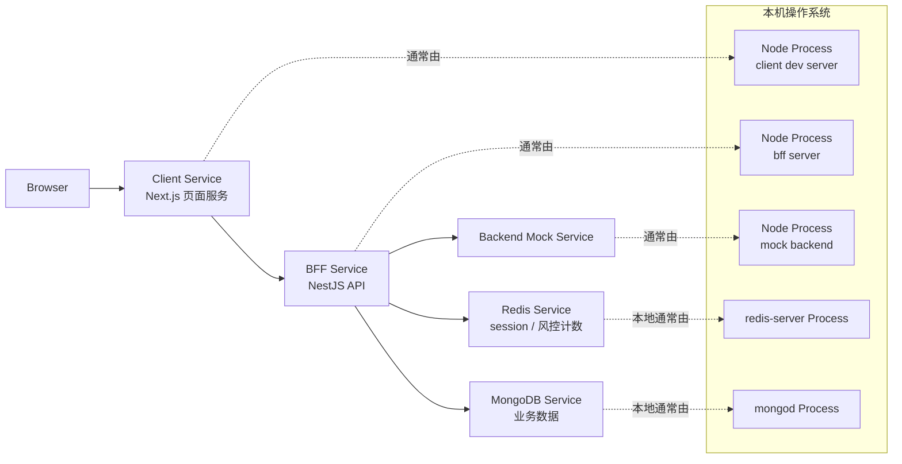

这里的重点是：

- `BFF Service` 是一个系统能力，负责认证、会话、转发和接口治理。
- `BffProcess` 是操作系统里实际跑起来的 Node.js 进程。
- 一个服务在本地可能只有一个进程；在线上可能有多个进程共同承载。

## 服务是什么

服务不是操作系统里的基础单位，而是工程架构里的角色。

例如当前项目里的 BFF 服务，对外表现为：

```text
http://localhost:3001/api/auth/login
http://localhost:3001/api/auth/me
http://localhost:3001/api/commodities
```

从调用方视角看，它关心的是：

- 这个服务有没有地址和端口。
- API contract 是否稳定。
- 请求失败时返回什么错误。
- 是否能横向扩容。
- 是否有健康检查、日志、指标和告警。

调用方通常不关心这个服务背后到底是一个进程、三个进程，还是一个容器集群。

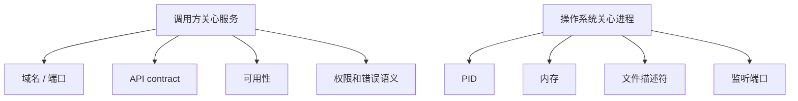

抽象概念：

```text
服务 = 对外提供稳定能力的逻辑单元。
```

当前项目例子：

```text
BFF 服务负责登录、session、权限、请求转发。
它可以由一个 Node.js 进程承载，也可以在线上由多个 Node.js 进程共同承载。
```

## 进程是什么

进程是操作系统运行程序时创建的资源容器。

一个进程通常有：

- PID。
- 独立内存空间。
- 环境变量。
- 当前工作目录。
- 打开的文件。
- 网络 socket。
- 一个或多个线程。

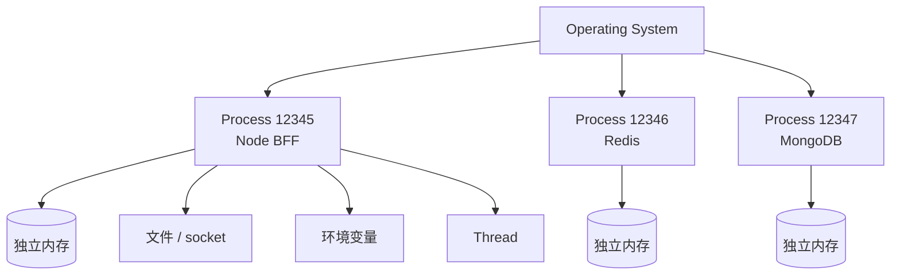

进程之间默认不共享内存。

这也是前一篇 session 文档里“内存 session 不适合多实例”的根本原因：

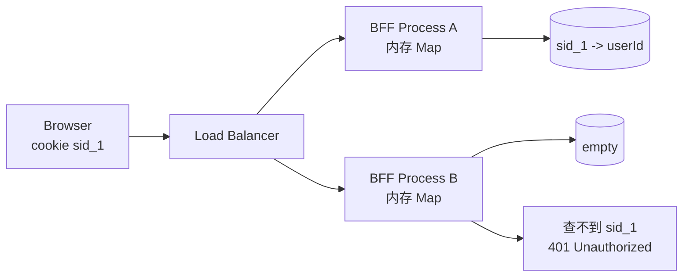

这里不是“BFF 服务忘了用户”，而是：

```text
session 存在 BFF Process A 的内存里；
请求打到 BFF Process B；
BFF Process B 的内存里没有这条 session。
```

抽象概念：

```text
进程 = 操作系统分配资源和隔离内存的运行实例。
```

当前项目例子：

```text
启动一次 pnpm dev:bff，背后会运行一个 Node.js 进程。
这个进程内存里如果保存 Map，只对这个进程自己有效。
```

## 线程是什么

线程是进程内部的执行流，是 CPU 调度执行代码的基本单位。

一个进程可以有多个线程，同一个进程里的线程共享这个进程的内存。

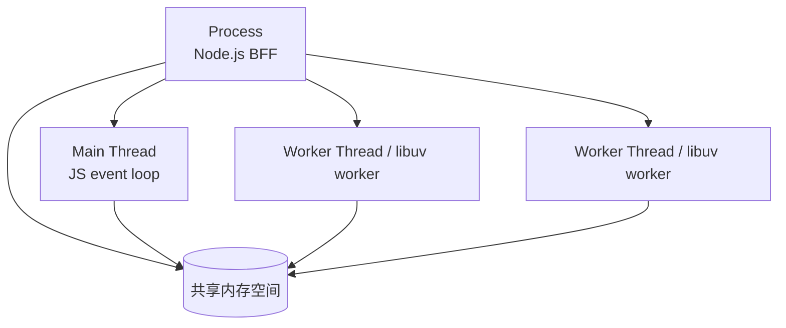

在 Node.js 里，常见理解是：

- 业务 JavaScript 主要跑在主线程的事件循环里。
- 一些底层异步任务可能交给 libuv 线程池。
- 如果显式使用 `worker_threads`，可以创建额外线程执行 CPU 密集任务。

线程和进程最大的区别是内存边界：

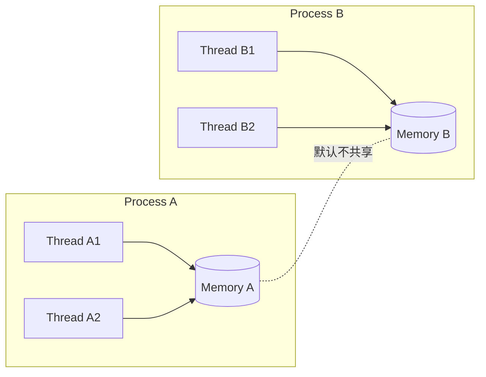

抽象概念：

```text
线程 = 进程内部的一条执行路径。
```

当前项目例子：

```text
BFF 的 Node.js 进程里可以有主线程和底层工作线程。
这些线程属于同一个进程，共享这个进程的资源。
但它们不会自动共享到另一个 BFF 进程。
```

## 三者关系

可以按这个层级理解：

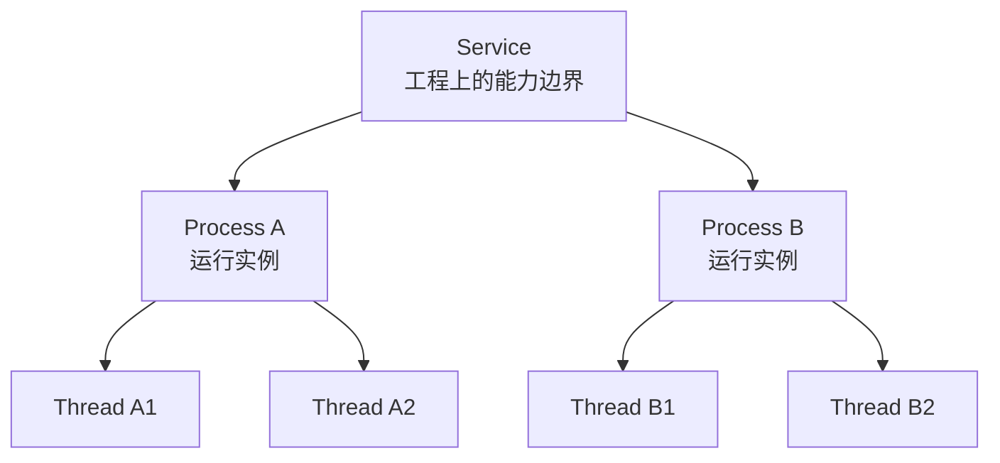

更准确地说：

- 一个服务可以由一个进程承载。
- 一个服务也可以由多个进程共同承载。
- 一个进程可以包含一个或多个线程。
- 一个线程只能属于一个进程。
- 进程是操作系统概念，服务是架构概念。

## 常见对应关系

| 问题 | 更接近哪个概念 | 当前项目例子 |
| --- | --- | --- |
| `/api/auth/me` 是谁提供的？ | 服务 | BFF Service |
| `localhost:3001` 是谁监听的？ | 进程 | BFF Node.js 进程监听端口 |
| `pid=12345` 是什么？ | 进程 | 某个正在运行的 Node.js 或 Redis 实例 |
| 一个请求被哪段代码处理？ | 线程 / 事件循环 | Node.js 主线程事件循环处理 JS 回调 |
| 为什么重启后内存数据没了？ | 进程 | 进程退出，内存释放 |
| 为什么多实例读不到彼此内存？ | 进程 | 进程之间默认内存隔离 |
| 为什么 Redis 能共享 session？ | 服务 + 进程 | Redis 服务由独立进程提供集中存储 |
| CPU 密集任务为什么会卡接口？ | 线程 | Node.js 主线程被阻塞 |

## 一个服务不等于一个进程

本地开发时，经常看起来像：

```text
一个 BFF 服务 = 一个 Node.js 进程
```

但生产环境更常见的是：

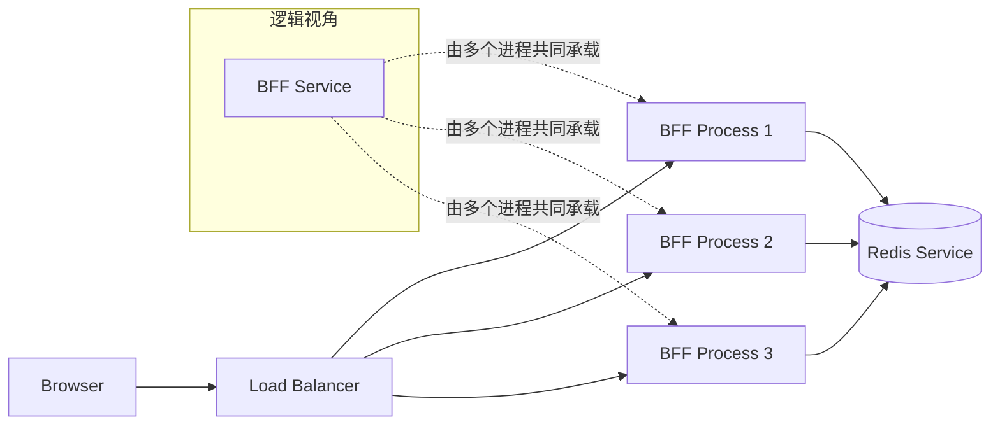

所以工程里说“BFF 服务挂了”，可能有几种不同含义：

- 所有 BFF 进程都退出了。
- 进程还在，但端口不响应。
- 进程还在，但依赖 Redis 或 MongoDB 失败。
- 单个实例失败，但负载均衡还可以转发到其他实例。

这就是为什么真实系统需要健康检查、日志、指标和链路追踪，而不是只看“进程还在不在”。

## 一个进程也不等于一个线程

一个进程至少有一个线程，但可以有多个线程。

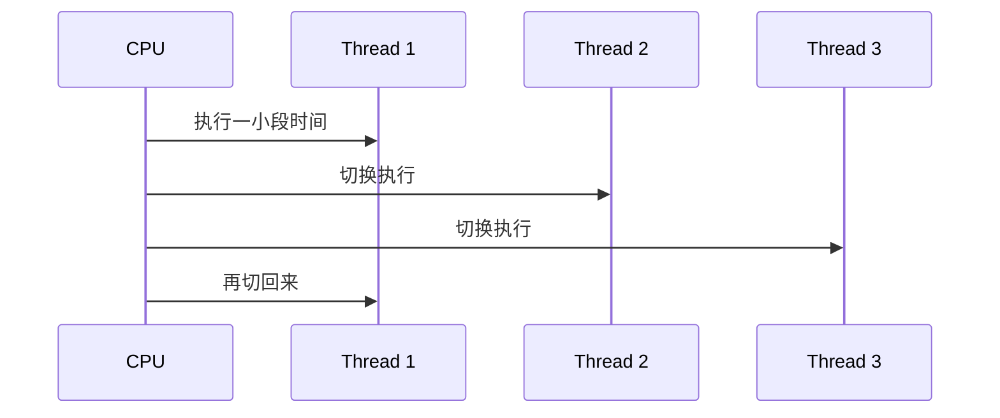

线程共享进程内存，所以通信成本低，但也带来并发风险，例如：

- 同时修改同一份数据。
- 锁竞争。
- 死锁。
- CPU 密集任务抢占执行时间。

Node.js 应用平时不一定直接写线程代码，但仍然要理解：

```text
如果主线程被同步 CPU 任务卡住，整个 BFF 进程的请求处理都会变慢。
```

## 和 session 升级 Redis 的关系

理解这三个概念后，就能解释为什么 session 不能只放内存。

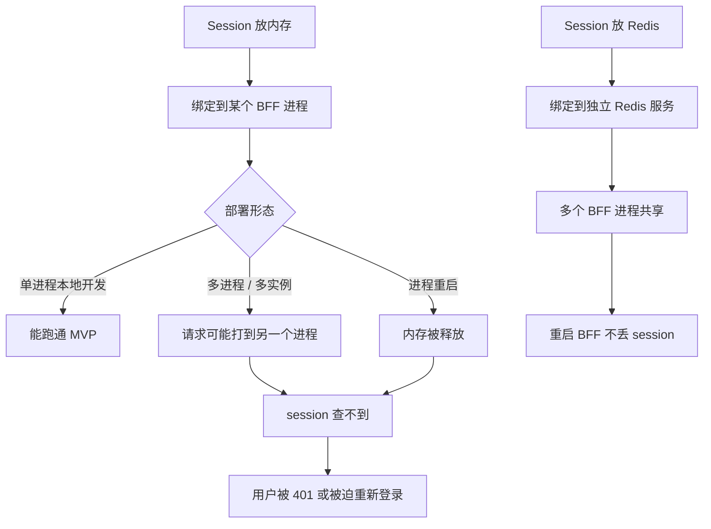

结论是：

```text
内存属于进程。
服务可以有多个进程。
线程只在进程内部执行。

所以只要服务需要多实例或可重启，登录态就不应该只依赖某个进程的内存。
```

## 如何观察

在本地排障时，可以按层次观察。

看服务是否可用：

```text
curl -i http://127.0.0.1:3001/api/health
curl -i http://127.0.0.1:3000
```

看哪个进程在监听端口：

```text
lsof -i :3001
lsof -i :3000
```

看相关进程：

```text
ps -ef | rg "node|redis|mongod|next-bff"
```

排障顺序可以这样走：

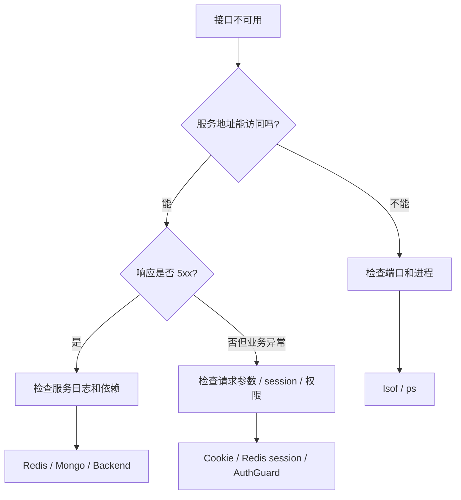

## 最终记忆方式

```text
服务：别人怎么调用你。
进程：操作系统怎么运行你。
线程：CPU 怎么执行你。
```

放回当前项目：

```text
BFF 是服务。
启动后的 Node.js 是进程。
进程里的事件循环和工作线程是线程层面的执行机制。
Redis 是独立服务，本地通常由 redis-server 进程承载。
session 放 Redis，是为了让多个 BFF 进程共享登录态。
```
