# 登录-JWT 真实系统方案

本文不把 JWT 当成语法点讲，而是按真实系统里的登录链路说明：

- JWT 到底是签名还是加密。
- 加签和验签过程是什么。
- 加密 JWT、签名 JWT、hash 的本质区别是什么。
- `secret`、私钥、公钥分别应该放在哪里。
- refresh token 服务端可撤销到底怎么做到。
- localStorage JWT 和 Cookie JWT 怎么选。
- token 里应该存什么，不应该存什么。
- 用户权限发生变更时怎么处理。
- TTL 到底是什么，以及真实系统如何设置。
- 当前项目里的 JWT 模拟和真实系统的对应关系。

## 1. 先给结论

JWT 常见用法是 `JWS`，也就是“签名过的 JSON 声明”，不是加密。

```text
JWT 常见形态 = header.payload.signature
payload 可以被解码看到
signature 用来证明 header + payload 没被篡改
```

如果你需要隐藏 payload 内容，那是 `JWE`，属于加密型 token。大多数 Web 登录里的 JWT 是 JWS，不是 JWE。

真实系统里更推荐：

```text
认证中心 / Auth Server 负责签发 JWT
BFF / API Gateway / Backend 负责验签和鉴权
私钥或签名 secret 不写进代码，不提交仓库，不放前端
```

## 2. 真实系统中的角色

JWT 登录通常不是“某个接口随手生成 token”，而是几个角色协作。

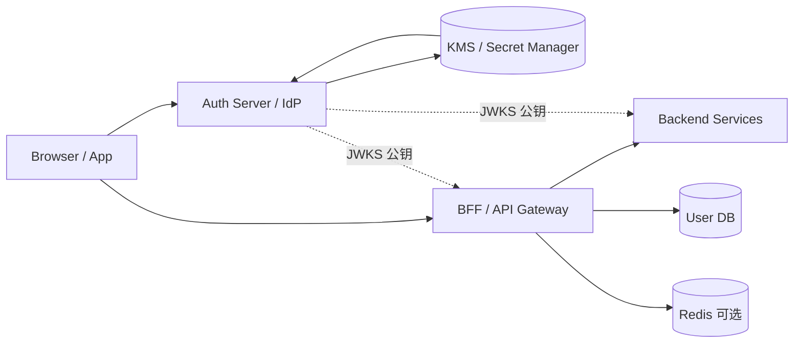

职责拆分：

| 角色                 | 负责什么                         | 不应该做什么                      |
| -------------------- | -------------------------------- | --------------------------------- |
| Browser / App        | 保存 token，发起请求             | 不保存 secret、私钥、密码         |
| Auth Server / IdP    | 校验账号、MFA、签发 token        | 不把私钥暴露给业务前端            |
| BFF / API Gateway    | 验签、鉴权、转发用户上下文       | 不信任未验签 token                |
| Backend              | 执行业务逻辑，可二次鉴权         | 不直接相信浏览器传来的任意 header |
| KMS / Secret Manager | 托管 secret 或私钥               | 不把密钥散落到代码仓库            |
| Redis                | blacklist、refresh session、限流 | 不保存明文密码                    |

## 3. 从第一性原理看 JWT 为什么这么设计

JWT 不是为了“时髦地登录”，它是为了解决 HTTP 和分布式系统里的一个基础问题：

```text
每个 HTTP 请求都是独立的。
服务端收到请求时，必须判断：
1. 这个请求是谁发的？
2. 身份声明有没有被伪造？
3. 凭证是否还在有效期内？
4. 当前服务能不能不每次都查登录中心？
```

### 3.1 第一性问题：HTTP 请求本身没有记忆

用户登录成功后，下一次请求只是：

```http
GET /api/commodity/list
```

这个请求不会天然告诉 BFF “我是 admin”。所以系统必须让客户端每次携带一个凭证。

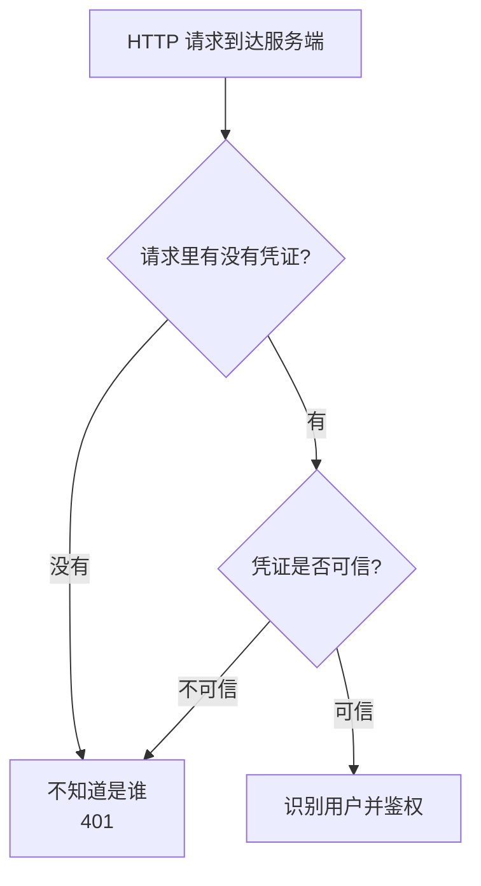

从第一性原理看，登录凭证只有两条基本路线。

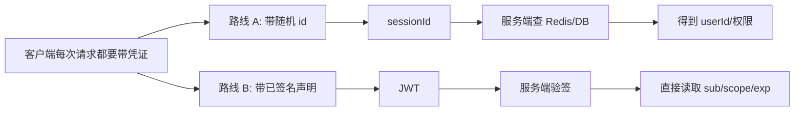

Session 走的是路线 A：

```text
客户端带 sessionId
服务端查 session store
```

JWT 走的是路线 B：

```text
客户端带 signed claims
服务端验签后读取 claims
```

### 3.2 为什么 JWT 要有 payload

如果每个服务都要知道用户是谁，就必须有某种“身份声明”。

最小声明可能是：

```json
{
  "sub": "u_admin_001",
  "tenantId": "tenant_demo",
  "scope": "commodity:read",
  "exp": 1778668182
}
```

这回答了：

```text
sub：是谁
tenantId：属于哪个租户
scope：大致能做什么
exp：什么时候过期
```

所以 JWT 需要 `payload`：

```text
payload = 这张凭证携带的身份声明
```

### 3.3 为什么 JWT 要有 signature

如果只有 payload，没有签名，攻击者可以直接改内容。

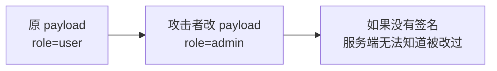

所以 JWT 必须加签：

```text
signature = sign(base64url(header) + "." + base64url(payload), key)
```

签名的本质是：

```text
客户端可以携带声明；
客户端不能伪造声明。
```

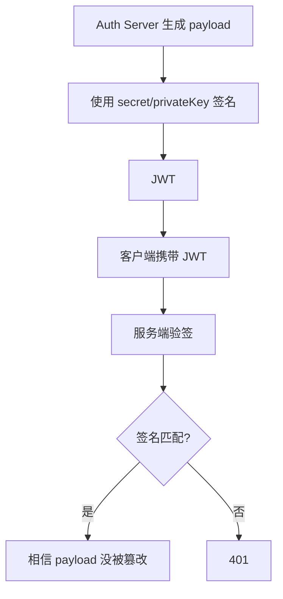

### 3.4 为什么 JWT 要有 header

服务端验签前要知道：

```text
这个 token 用什么算法签的？
该用哪把密钥验签？
```

所以需要 `header`：

```json
{
  "alg": "RS256",
  "typ": "JWT",
  "kid": "key-2026-05"
}
```

`kid` 很重要。真实系统会轮换密钥：

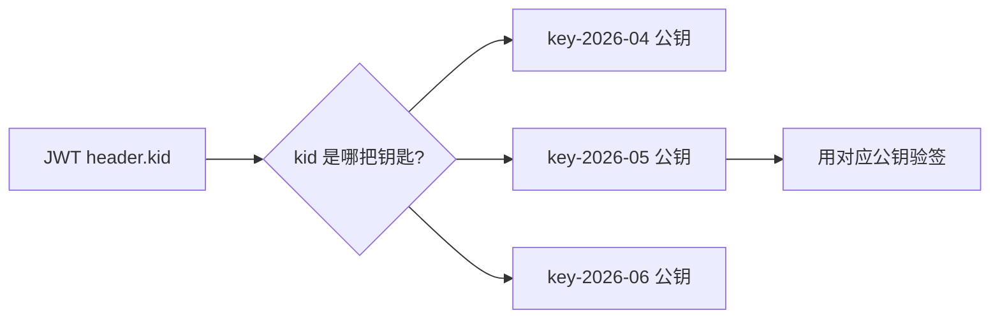

所以 JWT 最终长这样：

```text
header.payload.signature
```

对应第一性需求：

| JWT 部分    | 解决的问题                           |
| ----------- | ------------------------------------ |
| `header`    | 告诉服务端用什么算法、哪把密钥验签   |
| `payload`   | 携带身份、租户、范围、过期时间等声明 |
| `signature` | 证明 header + payload 没被篡改       |

### 3.5 为什么不每次都查 session store

Session 的控制力更强，但每次请求需要查服务端状态。

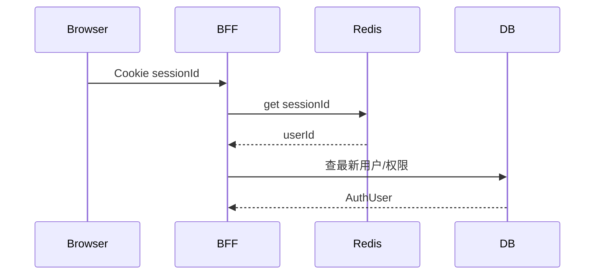

JWT 的设计目标是让多个服务只靠验签就能完成基础身份识别。

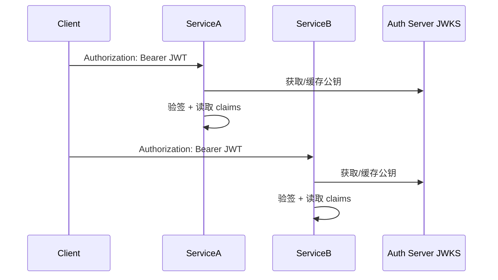

这就是 JWT 的核心价值：

```text
把“查中心化 session”的成本，换成“本地验签”的能力。
```

但代价也很明确：

```text
JWT 发出去后，在 exp 前通常难以天然撤回。
权限变化不会自动更新到已经签发的 token。
```

所以真实系统才需要短 TTL、refresh token、blacklist、`tokenVersion`、实时权限查询。

### 3.6 真实例子：开放 API 为什么喜欢 Authorization Bearer JWT

假设你有三个 API 服务：

```text
商品服务 commodity-api
订单服务 order-api
文件服务 file-api
```

如果都用 session，每个服务都要访问同一个 session store，或者必须统一经过 BFF。

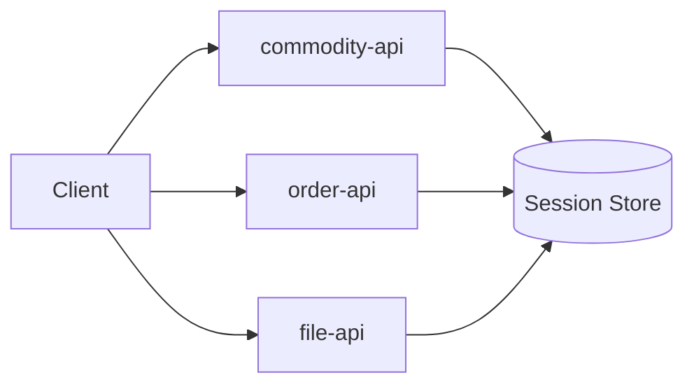

如果使用 `RS256 JWT`，认证中心签发 token，各服务拿公钥验签。

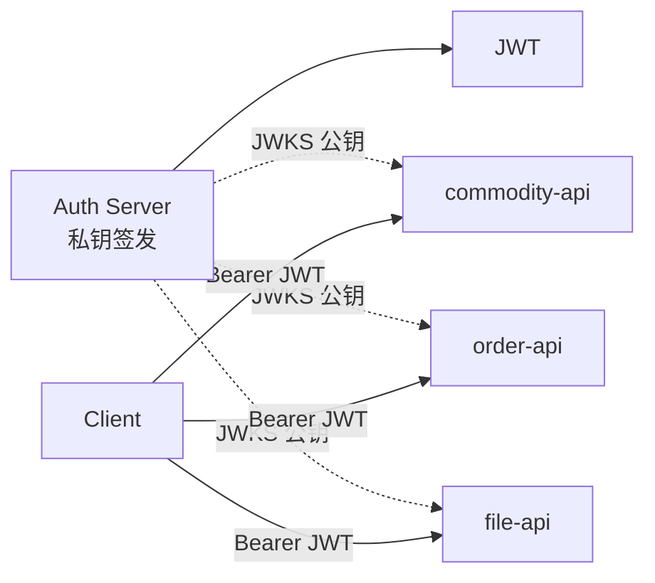

这时 JWT 的设计就很自然：

```text
客户端带同一张可验证通行证；
每个服务用公钥验签；
不必每次回认证中心查“这个人是谁”。
```

### 3.7 放回当前 next-bff

当前 `next-bff` 是后台 BFF 系统，主方案仍然是 `HttpOnly Cookie + Redis Session`，因为它更需要强控制：

```text
退出登录立即失效
封禁立即生效
权限变化下一次请求生效
Backend 不直接相信浏览器凭证
```

JWT 在当前项目里作为并行模拟方案，用来理解另一种取舍：

```text
JWT 用“可验证的客户端声明”换取分布式验证便利；
Session 用“服务端集中状态”换取更强控制力。
```

## 4. JWT 加签过程到底是什么

以登录成功后签发 access token 为例。

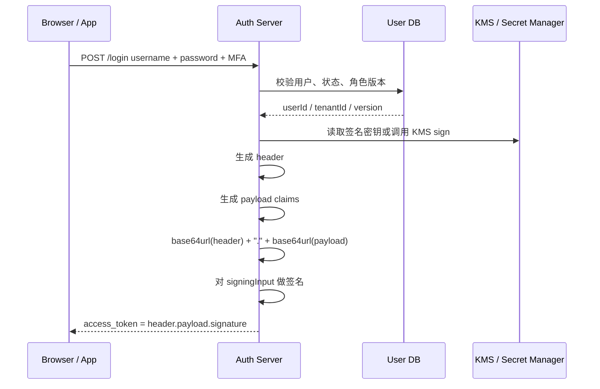

签名输入是：

```text
signingInput = base64url(header) + "." + base64url(payload)
signature = sign(signingInput, signingKey)
JWT = signingInput + "." + signature
```

举例：

```json
{
  "alg": "RS256",
  "typ": "JWT",
  "kid": "key-2026-05"
}
```

```json
{
  "iss": "https://auth.example.com",
  "aud": "next-bff-admin",
  "sub": "u_admin_001",
  "tenantId": "tenant_demo",
  "scope": "commodity:read commodity:update",
  "tokenVersion": 7,
  "iat": 1778667282,
  "exp": 1778668182,
  "jti": "01HX..."
}
```

注意：`payload` 只是 base64url 编码，不是加密。拿到 token 的人可以把 payload 解码出来。

## 5. JWT 验签过程到底是什么

服务端收到请求后，不是“解密 JWT”，而是验签。

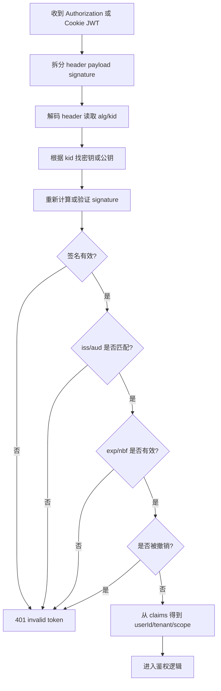

真实系统验签至少要检查：

| 检查项         | 作用                         |
| -------------- | ---------------------------- |
| `signature`    | 确认 token 没被篡改          |
| `alg`          | 防止算法降级或错误算法       |
| `kid`          | 找到对应密钥，支持密钥轮换   |
| `iss`          | 确认签发方是可信 Auth Server |
| `aud`          | 确认 token 是发给当前系统的  |
| `exp`          | 确认 token 未过期            |
| `nbf`          | 确认 token 已到可用时间      |
| `jti`          | 可用于 blacklist / 审计      |
| `tokenVersion` | 可用于强制旧 token 失效      |

## 6. 加密 JWT、签名 JWT、hash 的本质区别

你提到的“加密 JWT”和“不加密只 hash”，真实系统里通常对应三个概念：

```text
JWS：签名 JWT，payload 可见，signature 防篡改。
JWE：加密 JWT，payload 不可见，需要解密才能读。
Hash：摘要，不等于签名；普通 hash 不能防伪造，HMAC 才是带密钥的 MAC。
```

### 6.1 签名 JWT：JWS

大多数登录 JWT 是 JWS。

```text
token = base64url(header) + "." + base64url(payload) + "." + signature
```

它解决的是：

```text
这个 token 是不是可信签发方签的？
中途有没有被改过？
```

它不解决：

```text
payload 里的内容是否对持有者保密？
```

所以 JWS 里不要放敏感信息。

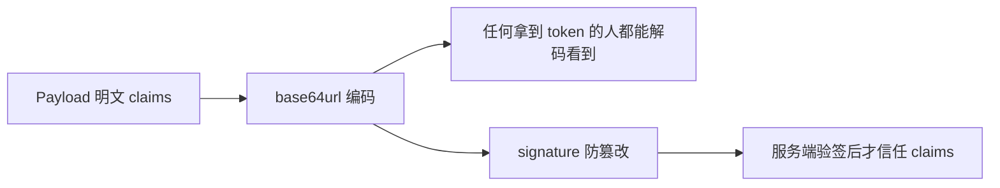

### 6.2 加密 JWT：JWE

JWE 才是“加密 JWT”。

它解决的是：

```text
payload 只有能解密的一方才能看到。
```

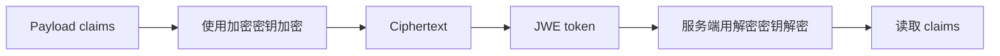

JWE 的代价：

- token 更大。
- 实现和密钥管理更复杂。
- 中间层、网关、日志排查看不到 claims。
- 所有需要读取 claims 的服务都要有解密能力，或者必须统一走一个解密服务。

真实系统通常优先选择：

```text
不要把敏感数据放进 JWT
用 JWS 签名保证防篡改
传输层用 HTTPS
敏感用户信息回库或查内部服务
```

只有当 token 必须经过不可信中间方，并且 payload 不能被它看到时，才考虑 JWE。

### 6.3 普通 hash 不是签名

如果只是：

```text
signature = sha256(header.payload)
```

这没有安全意义。攻击者改了 payload 后，也能自己重新算一个 `sha256`。

安全签名必须有“攻击者不知道的东西”：

```text
HS256: HMAC-SHA256(header.payload, secret)
RS256: RSA-SHA256(header.payload, privateKey)
ES256: ECDSA-SHA256(header.payload, privateKey)
```

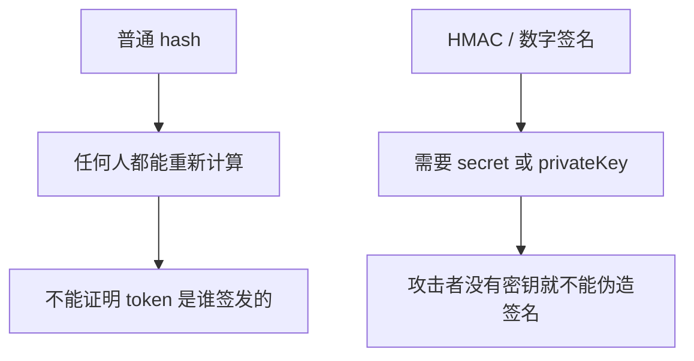

所以准确说法是：

```text
JWT 不是“不加密只 hash”。
常见 JWT 是“不加密，但带密钥签名”。
```

## 7. secret 是不是存储在 BFF

这取决于系统规模和签名算法。

### 7.1 小系统：BFF 自己签发，自己验签

如果系统很小，没有独立认证中心，BFF 可能同时负责登录和业务 API。

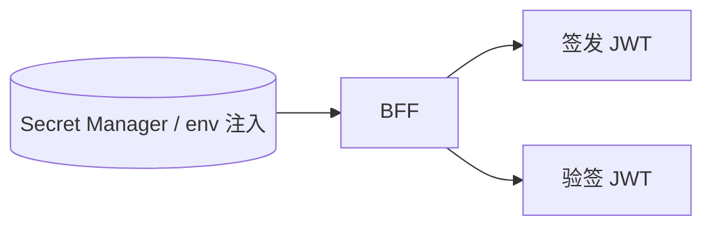

这种情况下，BFF 需要拿到签名 secret 或私钥。

但注意：

```text
secret 可以注入给 BFF 进程使用
secret 不应该写在代码里
secret 不应该提交到 Git
secret 不应该暴露给浏览器
```

常见来源：

- Kubernetes Secret。
- AWS Secrets Manager / Parameter Store。
- GCP Secret Manager。
- Vault。
- CI/CD 在部署时注入的环境变量。
- KMS 签名接口，服务本身不直接拿私钥明文。

### 7.2 中大型系统：Auth Server 签发，BFF 只验签

更常见的真实架构是：认证中心签发 token，业务服务只验签。

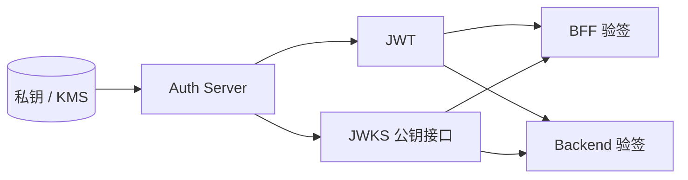

这种架构下：

- 私钥只在 Auth Server 或 KMS。
- BFF 不应该存私钥。
- BFF 只缓存公钥或从 JWKS 拉公钥。
- Backend 如果需要自验，也只需要公钥。

这也是 `RS256` / `ES256` 的主要价值：验签方不能伪造 token。

## 8. HS256、RS256、ES256 怎么选

| 算法    | 类型       | 谁能签发           | 谁能验签                 | 适合场景                   |
| ------- | ---------- | ------------------ | ------------------------ | -------------------------- |
| `HS256` | 对称签名   | 拿到 secret 的服务 | 拿到同一个 secret 的服务 | 单体、小系统、内部模拟     |
| `RS256` | 非对称签名 | 持有私钥的签发方   | 持有公钥的服务           | 多服务、OIDC、企业 SSO     |
| `ES256` | 非对称签名 | 持有私钥的签发方   | 持有公钥的服务           | 多服务、短签名、高安全要求 |

当前项目模拟使用 `HS256`：

```text
JWT_SIMULATION_SECRET=next-bff-dev-jwt-simulation-secret
```

这适合本地学习签名机制，但真实多服务系统更常见的是 `RS256` / `ES256`。

## 9. token 里应该存什么

真实系统里，JWT 不应该存“用户所有信息”，只放请求鉴权所需的最小声明。

推荐放：

| 字段           | 含义            |
| -------------- | --------------- |
| `iss`          | 签发方          |
| `aud`          | 接收方          |
| `sub`          | 用户 ID         |
| `tenantId`     | 租户 ID         |
| `scope`        | 粗粒度权限范围  |
| `tokenVersion` | 用户 token 版本 |
| `iat`          | 签发时间        |
| `exp`          | 过期时间        |
| `jti`          | token 唯一 ID   |

谨慎放：

- `roles`。
- `permissions`。
- 用户名。
- 邮箱。
- 部门、组织路径。

不要放：

- 密码。
- `passwordHash`。
- 身份证、手机号、地址等隐私数据。
- 内部密钥。
- 第三方 access token。
- 完整用户档案。

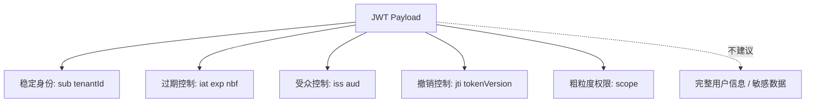

## 10. 权限发生变更怎么办

JWT 最大的问题是：签发后的 payload 不会自动变。

真实例子：

```text
10:00 用户登录，JWT 里有 scope=commodity:write
10:05 管理员撤销该用户写权限
10:06 用户继续拿旧 JWT 请求写接口
```

如果服务端只看 JWT 中旧的 `scope`，可能错误放行。

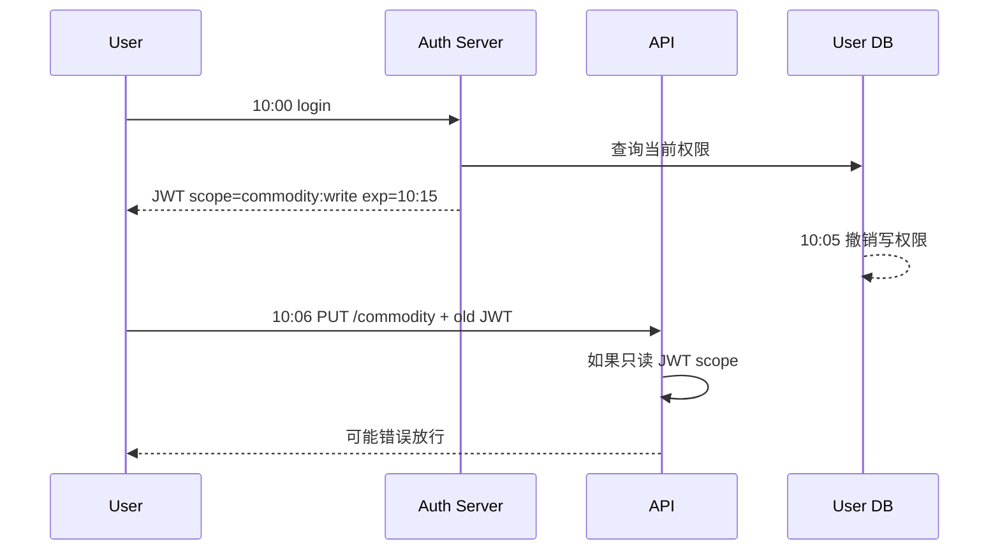

真实系统一般组合使用下面几种方案。

### 10.1 短 access token TTL

access token 设置较短有效期，例如 5 到 15 分钟。

```text
优点：简单，降低旧权限和泄露 token 的影响窗口。
缺点：不能做到立即失效，需要 refresh token 或重新登录。
```

### 10.2 tokenVersion

用户表维护一个版本号。

```text
users.tokenVersion = 7
JWT.tokenVersion = 7
```

权限变化、改密码、封禁、强制下线时：

```text
users.tokenVersion += 1
```

请求时：

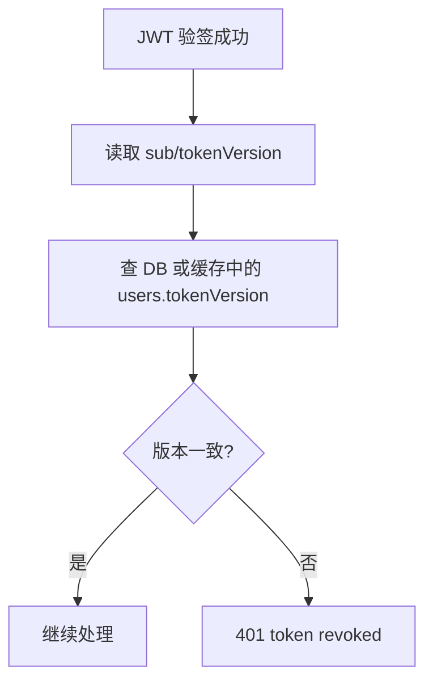

这会让 JWT 不再完全无状态，但能解决强撤销问题。

### 10.3 permissionVersion

如果系统权限模型复杂，可以在角色或权限配置上维护版本。

```text
role.permissionVersion = 12
JWT.permissionVersion = 12
```

权限配置变更时版本增加。请求时检查版本，不一致就拒绝或重新签发。

### 10.4 blacklist / denylist

JWT 里放 `jti`，撤销时把 `jti` 放入 Redis。

```text
Redis SET revoked:jti:<jti> 1 EX <token 剩余秒数>
```

请求时：

```text
验签 -> 读取 jti -> 查 Redis -> 如果命中则 401
```

适合：

- 单个 token 精确撤销。
- 登出后让某个 access token 立即失效。
- 处理 token 泄露事件。

### 10.5 每次查实时权限

JWT 只放 `sub`、`tenantId`、`exp`，不放完整权限。

```mermaid
flowchart TD
  A[JWT 验签成功] --> B[读取 sub]
  B --> C[查 User DB / Permission Cache]
  C --> D[拿最新 roles/permissions]
  D --> E[按最新权限鉴权]
```

这更接近 Session 方案：JWT 证明“用户 ID 是可信的”，数据库或权限缓存决定“现在能做什么”。

后台管理系统通常更偏向这种保守方案。

## 11. refresh token 服务端可撤销怎么做到

真实系统一般不会让 access token 很长。常见组合是：

```text
access token: 5-15 分钟
refresh token: 7-30 天，服务端可撤销
```

```mermaid
sequenceDiagram
  participant Browser
  participant Auth as Auth Server
  participant Redis

  Browser->>Auth: login
  Auth-->>Browser: access token 短 TTL + refresh token 长 TTL
  Auth->>Redis: 保存 refresh session / token family

  Browser->>Auth: access token 过期后 refresh
  Auth->>Redis: 校验 refresh token 是否有效/被撤销
  Auth-->>Browser: 新 access token
```

refresh token 可撤销的关键是：它不是完全无状态的。

真实系统通常会在服务端保存 refresh session。推荐不要直接保存 refresh token 明文，而是保存 hash。

```text
refresh token 明文：只返回给客户端
refresh token hash：保存到 Redis / DB
```

一条 refresh session 记录通常长这样：

```ts
type RefreshSession = {
  id: string;
  userId: string;
  tokenHash: string;
  familyId: string;
  deviceId: string;
  userAgent: string;
  ip: string;
  createdAt: Date;
  expiresAt: Date;
  revokedAt?: Date;
  revokedReason?:
    | "logout"
    | "password_changed"
    | "admin_blocked"
    | "reuse_detected";
  replacedBySessionId?: string;
};
```

登录时：

```mermaid
sequenceDiagram
  participant Browser
  participant Auth as Auth Server
  participant Store as Redis / DB

  Browser->>Auth: login
  Auth->>Auth: 生成随机 refreshToken
  Auth->>Auth: tokenHash = sha256(refreshToken)
  Auth->>Store: 保存 refresh session: tokenHash/userId/expiresAt/revokedAt=null
  Auth-->>Browser: accessToken + refreshToken
```

刷新 access token 时：

```mermaid
sequenceDiagram
  participant Browser
  participant Auth as Auth Server
  participant Store as Redis / DB

  Browser->>Auth: POST /token/refresh refreshToken
  Auth->>Auth: tokenHash = sha256(refreshToken)
  Auth->>Store: 查 refresh session
  Store-->>Auth: session
  Auth->>Auth: 检查 expiresAt / revokedAt / 用户状态
  Auth->>Store: revokedAt=now 撤销旧 refresh session
  Auth->>Store: 创建新 refresh session
  Auth-->>Browser: 新 accessToken + 新 refreshToken
```

这叫 refresh token rotation：每次刷新都换一个新的 refresh token。

服务端撤销就是改服务端状态：

| 场景            | 服务端动作                                                          | 结果                            |
| --------------- | ------------------------------------------------------------------- | ------------------------------- |
| 用户退出登录    | 当前 refresh session 设置 `revokedAt`                               | 不能再换新 access token         |
| 所有设备退出    | 该用户所有 refresh session 设置 `revokedAt`                         | 所有设备失效                    |
| 修改密码        | 该用户所有 refresh session 设置 `revokedAt`，或 `tokenVersion += 1` | 旧会话失效                      |
| 管理员封禁      | 用户禁用 + 所有 refresh session 撤销                                | 不能刷新也不能访问              |
| 发现 token 复用 | 撤销整个 `familyId`                                                 | 防止被盗 refresh token 继续轮换 |

```mermaid
flowchart TD
  A[客户端提交 refresh token] --> B[服务端计算 tokenHash]
  B --> C[查 refresh session]
  C --> D{存在且未过期?}
  D -->|否| X[401]
  D -->|是| E{revokedAt 是否为空?}
  E -->|否| Y[401 reuse/revoked]
  E -->|是| F{用户是否启用?}
  F -->|否| X
  F -->|是| G[撤销旧 refresh session]
  G --> H[创建新 refresh session]
  H --> I[签发新 access token]
```

为什么保存 hash？

```text
如果 Redis/DB 泄露，攻击者只能看到 tokenHash，不能直接拿它刷新 token。
这和数据库里存 passwordHash、不存明文密码是同一个思路。
```

### 11.1 refresh token 用 hash，和加密 JWT 有什么区别

真实系统里 refresh token 更常见的做法是“随机 opaque token + 服务端保存 hash”，而不是把一堆信息塞进 refresh JWT。

```text
opaque refresh token = 随机字符串，本身没有业务含义
tokenHash = sha256(refreshToken)，服务端用来查 refresh session
```

这和加密 JWT 的区别：

| 维度                          | Opaque refresh token + hash    | 加密 JWT refresh token              |
| ----------------------------- | ------------------------------ | ----------------------------------- |
| token 自身是否带 claims       | 不带                           | 带，但被加密                        |
| 服务端如何识别                | hash 后查 DB/Redis             | 解密后读 claims                     |
| 服务端能否只靠 token 判断有效 | 不能，必须查状态               | 可以读内容，但撤销仍要查状态        |
| DB 泄露风险                   | 只有 hash，不能直接当 token 用 | 如果密钥也泄露，可解密/伪造风险更大 |
| 撤销能力                      | 天然依赖服务端状态，容易撤销   | 如果不查状态，难撤销                |

关键点：

```text
加密 JWT 解决“别人看不到 payload”。
保存 hash 解决“服务端不保存 refresh token 明文”。
服务端可撤销依赖的是“服务端状态”，不是依赖加密本身。
```

所以 refresh token 的真实工程重点通常不是“要不要加密成 JWT”，而是：

- token 是否足够随机。
- 服务端是否只保存 hash。
- 是否有 `revokedAt`。
- 是否 rotation。
- 是否能检测旧 refresh token 复用。
- 是否能按用户、设备、token family 批量撤销。

注意：access token 如果已经签发，通常仍会在短 TTL 内有效。refresh token 被撤销后，用户不能再换新 access token，等旧 access token 过期后就彻底失效。如果要 access token 也立即失效，需要 blacklist、`tokenVersion` 或实时查用户状态。

## 12. localStorage JWT 和 Cookie JWT 怎么选

你说“看起来肯定是放 cookie 好”，对浏览器后台系统通常是对的，但不是所有场景都绝对。

### 12.1 Cookie JWT 的优势

如果是 Web 后台、BFF、同站应用，`HttpOnly Cookie JWT` 通常更稳。

优势：

- `HttpOnly` 下，前端 JS 读不到 token，XSS 直接偷 token 的风险更低。
- 浏览器自动携带 cookie，Next App Router / SSR 更容易使用。
- 可以通过 `Secure`、`SameSite`、`Path`、`Domain` 收窄发送范围。
- 对后台管理系统更符合“凭证由浏览器和服务端控制”的模型。

劣势：

- Cookie 会自动携带，所以要处理 CSRF。
- 跨域 API、开放 API、移动端 App 使用不如 Authorization header 直观。
- 多域名、子域名、第三方上下文会遇到 Cookie 策略限制。
- JS 读不到 token，也意味着客户端不能自己灵活组装 `Authorization`。
- XSS 虽然读不到 token，但仍然可以在当前页面里代发请求，所以 XSS 仍然要防。

### 12.2 localStorage JWT 的优势

`localStorage JWT` 最大优势不是安全，而是“客户端控制简单”。

优势：

- 前端可以明确控制 `Authorization: Bearer <token>`。
- 跨域 API、开放 API、移动端 App、CLI 更容易复用同一套 header 模型。
- 不会因为浏览器自动带 cookie 产生传统 CSRF 问题。
- 不依赖 Cookie 的 SameSite、第三方 Cookie、子域策略。

劣势：

- XSS 一旦发生，恶意脚本可以直接读取 token 并带走。
- token 被复制后，可以离开浏览器环境重放。
- SSR / Server Component 不能天然读取 localStorage。
- 需要自己处理 token 存取、刷新、清理和多标签页同步。

```mermaid
flowchart LR
  A[Web 后台 / BFF / SSR] --> B[优先 HttpOnly Cookie]
  C[移动端 App / CLI / 开放 API] --> D[优先 Authorization Bearer]
  E[跨域复杂 API] --> D
  F[权限敏感后台] --> B
```

### 12.3 对比表

| 维度                   | localStorage JWT | HttpOnly Cookie JWT                  |
| ---------------------- | ---------------- | ------------------------------------ |
| JS 能否读取 token      | 能               | 不能                                 |
| XSS 直接盗 token       | 风险高           | 风险低一些                           |
| XSS 代发请求           | 可以             | 可以                                 |
| CSRF                   | 通常较低         | 必须处理                             |
| SSR / Server Component | 不方便           | 方便                                 |
| 跨域 API               | 方便             | 需要处理 CORS credentials / SameSite |
| 移动端 / CLI           | 方便             | 不适合                               |
| 浏览器后台系统         | 不优先           | 通常优先                             |

结论：

```text
如果是当前 next-bff 这种 Web 后台系统，HttpOnly Cookie 通常比 localStorage 更合适。
但如果是移动端、CLI、开放 API、多客户端 SDK，Authorization Bearer 更自然。
```

## 13. TTL 到底是什么

TTL 是 `Time To Live`，意思是“还能活多久”。

JWT 里通常用 `iat` 和 `exp` 表达：

```text
iat = issued at = 签发时间
ttl = 900 秒
exp = iat + ttl = 过期时间
```

```mermaid
stateDiagram-v2
  [*] --> Issued: login success
  Issued --> Valid: now < exp
  Valid --> Expired: now >= exp
  Expired --> Rejected: next request returns 401
```

真实系统常见 TTL：

| token          | 常见 TTL         | 原因                         |
| -------------- | ---------------- | ---------------------------- |
| access token   | 5-15 分钟        | 降低泄露和权限变更风险       |
| refresh token  | 7-30 天          | 保持登录体验，但服务端可撤销 |
| blacklist 记录 | token 剩余有效期 | 到期后无需继续保存           |
| JWKS cache     | 几分钟到几小时   | 平衡性能和密钥轮换           |

TTL 越短：

- 泄露窗口越小。
- 权限变化延迟越小。
- 刷新频率越高。

TTL 越长：

- 用户体验更平滑。
- 泄露风险窗口更长。
- 权限变更延迟更明显。

## 14. 推荐真实系统方案

如果是企业后台、BFF、权限敏感系统，推荐优先使用下面的设计。

```mermaid
flowchart TD
  A[Auth Server] --> B[RS256/ES256 签发 access token]
  A --> C[refresh session 存 Redis/DB]
  B --> D[Browser / App]
  D --> E[BFF]
  E --> F[验签 iss/aud/exp]
  F --> G[查 tokenVersion 或实时权限缓存]
  G --> H[注入内部 x-user-id / x-tenant-id]
  H --> I[Backend]
```

关键规则：

- access token 短 TTL。
- refresh token 服务端可撤销。
- 私钥只在 Auth Server 或 KMS。
- BFF 和 Backend 用公钥验签。
- token 只放最小 claims。
- 高敏权限不要完全依赖 JWT 里的旧权限快照。
- 权限变更、封禁、改密码时更新 `tokenVersion` 或撤销 refresh session。

## 15. 当前项目和真实系统的对应关系

当前项目是教学模拟，不是完整生产 JWT 体系。

当前实现：

```text
算法：HS256
签发方：BFF 模拟模块
验签方：BFF 模拟 guard
密钥：JWT_SIMULATION_SECRET
TTL：JWT_ACCESS_TOKEN_TTL_SECONDS=900
refresh token：未实现
blacklist：未实现
tokenVersion：未实现
```

对应代码：

```text
apps/bff/src/auth-jwt-common/simulated-jwt.ts
apps/bff/src/auth-jwt-common/jwt-config.ts
apps/bff/src/auth-jwt-local/
apps/bff/src/auth-jwt-cookie/
```

它用来帮助理解：

- JWT 怎么签名。
- JWT 怎么验签。
- localStorage JWT 和 HttpOnly Cookie JWT 的传输差异。
- 为什么 JWT 权限变化不天然实时。
- TTL 和 `exp` 的关系。

如果要演进成真实系统，应优先补：

1. `RS256` 或 `ES256`。
2. `kid` + JWKS。
3. refresh token 与服务端 refresh session。
4. `tokenVersion` 或实时权限检查。
5. blacklist / denylist。
6. 密钥托管到 KMS / Secret Manager。
