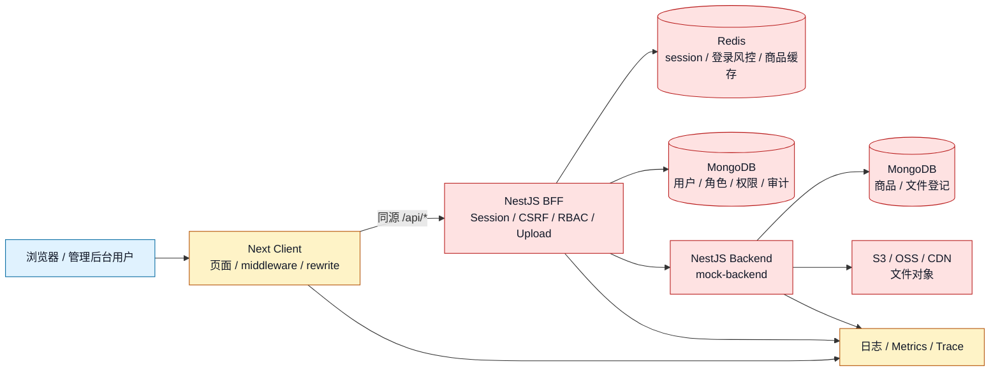
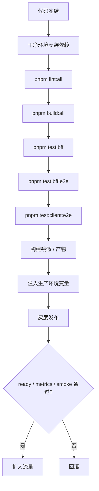
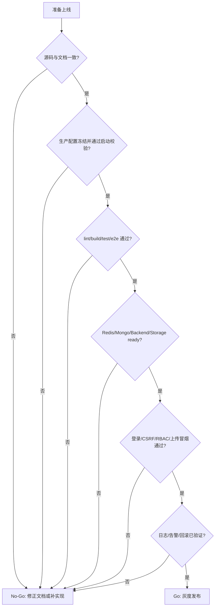

# 当前系统上线潜在问题清单

本文按当前仓库里的真实模块做上线风险评审，不把它写成通用 checklist。

当前系统可以理解为：

- `apps/client`：Next.js 管理后台，负责页面、登录页、同源 `/api/*` rewrite、前端错误和性能上报。
- `apps/bff`：NestJS BFF，负责 Cookie Session 登录、CSRF、RBAC、商品/用户/角色/权限接口、上传代理、审计、日志、metrics、trace。
- `apps/server`：NestJS Backend / mock-backend，负责后端商品与文件存储模拟。
- 依赖：MongoDB、Redis、对象存储 S3/OSS 或本地存储、日志/指标/Tracing 平台、部署平台。

## 1. 先给结论

当前系统如果要按“生产上线”标准评审，最大风险不是某一段代码，而是几个边界是否被明确关闭：

| 优先级 | 方面                  | 当前潜在问题                                                                                                | 上线判断                          |
| ------ | --------------------- | ----------------------------------------------------------------------------------------------------------- | --------------------------------- |
| P0     | 文档与实现一致性      | `docs/27`、`docs/30` 提到 JWT 模拟入口和源码目录，但当前源码没有 `auth-jwt-*` 模块，也没有 JWT 登录页面入口 | 如果上线范围包含 JWT 方案，不能上 |
| P0     | 环境配置              | 生产环境必须显式注入 `APP_ENV`、`MONGODB_URI`、`REDIS_URL`、`BACKEND_BASE_URL`、`BFF_BASE_URL` 等关键配置   | 配置未冻结前不能上                |
| P0     | 认证与会话            | 主方案依赖 HttpOnly Cookie + Redis Session；Redis 不可用会直接影响登录态和登录风控                          | 需要 Redis HA 和故障预案          |
| P0     | 数据和存储            | MongoDB、对象存储、文件签名密钥、上传访问策略一旦配置错误，会造成数据丢失、文件泄露或不可访问               | 需要备份、权限和演练              |
| P1     | CSRF / Cookie / HTTPS | `COOKIE_SECURE`、`CSRF_ALLOWED_ORIGINS`、反向代理协议头、SameSite 策略必须和真实域名一致                    | 需要生产域名联调                  |
| P1     | 权限边界              | RBAC 已有 Guard，但必须确认所有写接口都有 `AuthGuard + PermissionsGuard`，后端不可信任浏览器直接传 header   | 需要接口覆盖审计                  |
| P1     | 可观测性              | 当前有结构化日志、metrics 事件和 OpenTelemetry 初始化，但是否接入线上平台、告警阈值、日志脱敏仍需确认       | 需要告警闭环                      |
| P1     | 发布与回滚            | 需要确定构建产物、环境变量、健康检查、灰度、回滚、数据库 seed/migration 的顺序                              | 需要发布 runbook                  |
| P2     | 性能容量              | BFF、Mongo 查询、Redis、对象存储、Next 页面都需要容量基线；不能只靠本地测试判断                             | 需要压测和容量预估                |

## 2. 系统边界图



这张图里最关键的上线判断是：浏览器不能直接可信，BFF 是认证和权限边界；Redis、MongoDB、Backend、对象存储都是 BFF/Backend 的硬依赖。

## 3. P0：上线前必须先确认的问题

### 3.1 文档与实现有漂移

当前文档 `docs/27-登录为什么使用HttpOnly-Cookie-Session.md` 和 `docs/30-登录-JWT登录方案.md` 中提到：

```text
apps/bff/src/auth-jwt-common/
apps/bff/src/auth-jwt-local/
apps/bff/src/auth-jwt-cookie/
apps/client/app/login/jwt-local
apps/client/app/login/jwt-cookie
```

但当前源码里没有这些目录，`apps/client/app/login` 下也只有主登录页。

潜在问题：

- 如果产品或测试按文档访问 `/login/jwt-local`、`/login/jwt-cookie`，页面不存在。
- 如果上线范围要求“三种登录方案同时存在”，当前实现不满足。
- 如果文档被当作接口合同，测试用例、验收标准和真实系统会不一致。

上线前动作：

| 选择            | 动作                                                                                 |
| --------------- | ------------------------------------------------------------------------------------ |
| 不上线 JWT 模拟 | 明确把 JWT 文档标注为“方案文档 / 未接入当前运行系统”，不要把相关入口写进上线验收范围 |
| 上线 JWT 模拟   | 补齐 BFF 模块、Client 独立入口、rewrites、测试、生产关闭开关和安全边界               |

验证方式：

```bash
find apps/bff/src -maxdepth 2 -type d | sort
find apps/client/app/login -maxdepth 3 -type f | sort
rg -n "auth-jwt|jwt-local|jwt-cookie" apps docs
```

### 3.2 生产配置必须冻结

当前 `.env.example` 里包含开发默认值，例如：

```text
MOCK_SEED_ENABLED=true
COOKIE_SECURE=false
BFF_BASE_URL=http://localhost:3001
NEXT_INTERNAL_ORIGIN=http://127.0.0.1:3000
FILE_URL_SIGNING_SECRET=next-bff-dev-file-secret
```

BFF 和 Backend 已经做了一部分生产校验：

- 生产环境禁止 `MOCK_SEED_ENABLED=true`。
- BFF 生产环境禁止默认 `FILE_URL_SIGNING_SECRET`。
- Backend 生产环境禁止 `STORAGE_DRIVER=local`。
- 生产环境要求 `APP_VERSION`、`RELEASE_COMMIT_SHA`。
- MongoDB 库名不能带 dev/test/mock。

但上线仍要关注：

| 配置项                    | 潜在问题                                       | 上线前确认                                         |
| ------------------------- | ---------------------------------------------- | -------------------------------------------------- |
| `APP_ENV` / `NODE_ENV`    | 误用 development 会放松 cookie、seed、日志策略 | 容器、CI、部署平台统一设置为 production            |
| `BFF_BASE_URL`            | Next rewrite 指向错误 BFF                      | 生产域名能访问 BFF，且协议、端口、路径正确         |
| `NEXT_INTERNAL_ORIGIN`    | SSR / middleware 判断 origin 错误              | 与用户访问的管理后台 origin 一致                   |
| `CSRF_ALLOWED_ORIGINS`    | 过宽会放大 CSRF 风险，过窄会误拦截真实请求     | 只填真实管理后台域名，不用 `*`                     |
| `COOKIE_SECURE`           | 生产如果不是 Secure，Cookie 可能被明文链路携带 | HTTPS 下必须为 `true` 或由 production 默认推导     |
| `REDIS_URL`               | Redis 不可达会影响 Session、登录风控和缓存     | 使用生产 Redis 集群地址，确认 ACL、TLS、超时和容量 |
| `MONGODB_URI`             | 连到错误库会污染数据                           | 明确数据库名、账号权限、备份策略                   |
| `FILE_URL_SIGNING_SECRET` | 默认密钥会导致签名 URL 可被伪造                | 用 Secret Manager 注入，轮换时兼容旧 URL           |
| S3 / OSS 密钥             | 泄露会导致文件被读写                           | 最小权限、只走 Secret Manager，不进日志、不进仓库  |

### 3.3 主登录态依赖 Redis Session

当前主登录是 HttpOnly Cookie + `next_bff_session` + Redis Session。

```mermaid
sequenceDiagram
  participant Browser as Browser
  participant BFF as BFF AuthController
  participant Redis as Redis Session Store
  participant Mongo as MongoDB User/RBAC

  Browser->>BFF: POST /api/auth/login + CSRF
  BFF->>Mongo: 校验用户 / 角色
  BFF->>Redis: 写入 sessionId -> userId
  BFF-->>Browser: Set-Cookie next_bff_session; HttpOnly
  Browser->>BFF: GET /api/auth/me
  BFF->>Redis: 读取 sessionId
  BFF->>Mongo: 读取用户与角色
  BFF-->>Browser: 当前用户
```

潜在问题：

- Redis 宕机会导致新登录、`/me`、退出、登录失败计数都不稳定。
- Redis eviction 策略如果会驱逐 session key，用户会被异常登出。
- 多环境共用 Redis 且 key prefix 没隔离，会出现串环境登录态。
- `SESSION_TTL_SECONDS` 太长会增加被盗 cookie 的有效期，太短会影响后台操作体验。

上线前动作：

- Redis 必须有 HA、持久化、监控、容量和故障切换预案。
- 明确 `SESSION_REDIS_KEY_PREFIX`、`SESSION_USER_REDIS_KEY_PREFIX`、登录风控 prefix，避免多环境冲突。
- 验证登录、刷新、退出、权限变更、Redis 重启后的表现。
- 对 cookie 重放、会话吊销、管理员强制下线做演练。

## 4. 认证、授权与安全风险

| 方面            | 当前机制                                                 | 潜在问题                                               | 上线前关闭方式                                     |
| --------------- | -------------------------------------------------------- | ------------------------------------------------------ | -------------------------------------------------- |
| HttpOnly Cookie | `next_bff_session` Cookie，JS 读不到                     | 只能降低 XSS 直接偷 cookie，不能阻止 XSS 发同源请求    | CSP、输入输出转义、依赖扫描、前端错误审计          |
| CSRF            | BFF `createCsrfOriginMiddleware` + CSRF token            | 反向代理没传 `x-forwarded-proto/host` 时 origin 判断错 | 用真实域名、HTTPS、代理头做联调                    |
| 登录风控        | Redis 记录用户和 IP 失败次数                             | Redis 不可用时风控异常；代理后真实 IP 识别不准         | 明确可信代理和真实 IP 来源，压测错误密码场景       |
| RBAC            | `AuthGuard` + `PermissionsGuard` + `@RequirePermissions` | 新增接口可能漏加 Guard 或权限点                        | 上线前跑 controller 权限审计，写接口必须有权限声明 |
| 审计日志        | 登录审计、商品操作审计                                   | 高危接口如果没记录 reason、operator、traceId，事后难查 | 对创建、更新、删除、恢复、状态变更逐项验收         |
| 后端信任边界    | BFF 向 Backend 注入 `x-user-id`、`x-tenant-id`           | 如果 Backend 暴露公网，攻击者可伪造 header             | Backend 只允许 BFF 内网访问，或做服务间鉴权        |
| Swagger         | BFF 暴露 `/api/docs`                                     | 生产暴露接口结构，增加攻击面                           | 生产加认证、内网访问或关闭                         |
| 测试重置接口    | `TestResetModule` / `/api/test/reset`                    | 生产误暴露会破坏数据                                   | 生产环境禁用或加硬隔离；部署前主动探测不可访问     |

权限审计建议：

```bash
rg -n "@Controller|@UseGuards|RequirePermissions" apps/bff/src apps/server/src -g "*.ts"
```

## 5. 前端与 BFF 入口风险

当前 Next middleware 只保护：

```text
/present/:path*
/api/:path*
```

并通过是否存在 `next_bff_session` 判断登录态。

潜在问题：

- middleware 只看 cookie 是否存在，不代表 Redis session 一定有效；真正权限仍在 BFF。
- Next rewrite 如果 `BFF_BASE_URL` 错，会出现前端 200、接口 502/404 的混合问题。
- 当前只有 `/login` 主入口；文档中提到的 JWT 独立入口当前不存在。
- 前端 API 代理和 BFF CSRF 都在拦请求，真实域名、HTTPS、反向代理头必须一起联调。
- 前端错误上报 `/api/client-errors`、性能上报 `/api/client-metrics` 需要确认线上采集、采样和脱敏。

上线前手工冒烟：

```text
1. 未登录访问 /present/commodity/list -> 跳转 /login
2. 登录成功 -> Set-Cookie next_bff_session; HttpOnly; Secure; SameSite
3. 登录后刷新页面 -> 仍能读取 /api/auth/me
4. 删除 Redis session -> 前端应回到未登录状态
5. 跨站 POST -> 被 CSRF 拦截
6. 正常同源 POST -> 带 CSRF token 后成功
```

## 6. API Contract 与服务间调用风险

当前 BFF 对客户端输出统一响应 envelope，并向 Backend 转发请求。

潜在问题：

- Client、BFF、Backend 对错误结构、`traceId`、状态码的理解不一致，会导致页面展示和排障断链。
- BFF 到 Backend 的 timeout、重试、降级策略需要明确；不能无限等待。
- Backend 的 `mock-backend` 如果只是演示后端，不能被误当成完整生产商品系统。
- BFF 注入的用户上下文 header 只在 BFF 到 Backend 的可信链路内有效。
- 如果未来新增开放 API，不能复用浏览器 Cookie Session 的假设。

上线前动作：

| 检查项         | 目标                                                         |
| -------------- | ------------------------------------------------------------ |
| 成功响应       | `success / data / message / traceId` 稳定                    |
| 错误响应       | `statusCode / success=false / message / path / traceId` 稳定 |
| BFF -> Backend | 失败时有明确错误码、日志、traceId                            |
| 后端直连       | Backend 不暴露给公网用户，或加服务间认证                     |
| API 文档       | Swagger 与真实接口、权限、错误码一致                         |

## 7. 数据库风险

MongoDB 是用户、角色、权限、商品、审计、文件登记等数据的核心依赖。

潜在问题：

- 生产库名、账号、权限配置错误会导致连错库或权限过大。
- mock seed 如果误开，会污染生产数据。
- 索引缺失会在数据量上来后拖垮列表、审计、权限查询。
- 没有备份和恢复演练，误删、误更新无法恢复。
- 没有迁移策略时，字段结构变化可能让新旧版本滚动发布不兼容。

上线前必须确认：

- `MONGODB_URI` 包含明确数据库名，且不是 dev/test/mock。
- 用户、角色、权限、商品、审计集合的关键索引存在。
- 备份、恢复、只读账号、最小权限账号都已准备。
- seed 只在开发或测试环境启用。
- 回滚时，新版本写入的新字段不会让旧版本崩溃。

建议验证：

```bash
pnpm --filter @next-bff/bff test
pnpm --filter @next-bff/bff test:e2e
```

## 8. Redis 风险

当前 Redis 至少承载：

- Session store。
- 登录失败计数和锁定。
- 商品列表缓存。
- 健康检查依赖。

潜在问题：

- Redis 短暂不可用会造成登录失败、session 读取失败、缓存退化。
- key prefix 混用会导致多环境互相污染。
- TTL 设置不合理会造成 session 意外过期或缓存陈旧。
- Redis 内存策略如果是 volatile/random 或 allkeys-lru，可能误删关键 session。
- 监控只看 Redis 存活不够，还要看延迟、拒绝连接、内存、eviction、慢命令。

上线前动作：

| 项目       | 要求                                          |
| ---------- | --------------------------------------------- |
| HA         | 有主从或托管 Redis 高可用                     |
| 持久化     | 明确是否需要 AOF/RDB，至少 session 风险可接受 |
| 内存策略   | 不应随意驱逐 session key                      |
| key prefix | 每个环境独立                                  |
| 故障演练   | Redis 重启、网络抖动、连接数打满              |
| 告警       | 延迟、错误、eviction、内存、连接数            |

## 9. 文件上传、对象存储与 CDN 风险

当前 Backend 支持 `local`、`s3`、`oss` 存储驱动；生产禁止 `STORAGE_DRIVER=local`。

潜在问题：

- 本地存储不适合多实例，容器重启或扩缩容会丢文件。
- S3/OSS access key 权限过大，泄露后可读写全桶。
- 上传没有严格限制类型、大小、扩展名、内容嗅探，会带来安全风险。
- 文件 URL 签名密钥泄露，会导致私有文件被伪造访问。
- CDN 缓存策略错误，可能缓存了不该公开的文件，或更新后用户看不到新文件。
- 签名 URL TTL 太长会增加泄露后的有效期，太短会影响后台预览。

上线前确认：

```text
STORAGE_DRIVER=s3 或 oss
S3/OSS bucket 权限最小化
上传对象默认私有或按业务明确公开
FILE_URL_SIGNING_SECRET 由 Secret Manager 注入
文件大小、MIME、扩展名校验已覆盖
CDN 缓存策略与签名 URL TTL 一致
```

## 10. 可观测性与告警风险

当前系统已经有：

- `x-trace-id` 链路 ID。
- BFF / Backend 结构化日志。
- HTTP metrics 事件。
- 前端错误与性能上报入口。
- OpenTelemetry 初始化。
- `/api/health/live` 和 `/api/health/ready`。

潜在问题：

- 日志如果只输出到容器 stdout，但没有接入日志平台，事故时无法检索。
- metrics 如果只作为 JSON log 输出，没有指标平台聚合，无法做 P95、错误率告警。
- OpenTelemetry 如果没有配置 OTLP endpoint，只是本地初始化，不会形成线上 trace。
- 登录失败、权限拒绝、CSRF 拦截、上传失败如果没有告警，很难及时发现攻击或配置错误。
- 日志可能包含用户名、IP、User-Agent、路径、错误消息，需要确认脱敏和保留周期。

上线前至少要有这些告警：

| 告警                      | 建议触发条件                     |
| ------------------------- | -------------------------------- |
| BFF 5xx                   | 5 分钟错误率超过基线             |
| Backend 5xx               | 5 分钟错误率超过基线             |
| 登录失败激增              | IP 或用户维度失败数异常          |
| CSRF 拦截激增             | 可能是攻击，也可能是域名配置错误 |
| Redis down / 高延迟       | session 和风控受影响             |
| MongoDB down / 高延迟     | 核心业务不可用                   |
| 对象存储上传失败          | 文件链路不可用                   |
| `/api/health/ready` 非 ok | 实例不应继续接流量               |

## 11. 性能与容量风险

潜在问题：

- BFF 是所有前端业务请求的集中入口，CPU、连接数、event loop delay 都可能成为瓶颈。
- 商品列表、审计列表、权限展开如果没有索引和分页保护，数据量上来后会放大。
- Redis 商品缓存能降低读压力，但也可能造成短时间旧数据。
- 上传和文件预览会带来带宽、对象存储请求数和 CDN 成本。
- Next SSR / middleware / rewrites 在高并发下也要看延迟和错误率。

上线前建议给出容量基线：

| 指标      | 需要确认                       |
| --------- | ------------------------------ |
| RPS       | 登录、商品列表、商品写入、上传 |
| 延迟      | P50 / P95 / P99                |
| 错误率    | 4xx、5xx 分类                  |
| Mongo     | 查询耗时、慢查询、连接池       |
| Redis     | ping 延迟、命中率、内存        |
| Node 进程 | CPU、内存、event loop delay    |
| 对象存储  | 上传耗时、下载耗时、失败率     |

## 12. CI/CD、构建与发布风险

当前 `package.json` 提供了：

```text
pnpm lint:all
pnpm build:all
pnpm test:bff
pnpm test:bff:e2e
pnpm test:client:e2e
```

上线风险：

- `nest build`、Next build、TypeScript 类型检查、lint、e2e 没全部进 CI，会让本地遗漏进入生产。
- 构建产物 `dist` 不能作为源码事实来源；部署应从干净 checkout 全量构建。
- 发布时必须注入 `APP_VERSION`、`RELEASE_COMMIT_SHA`，否则 health 信息无法定位版本。
- 滚动发布时，新旧版本要兼容同一套 Mongo 数据和 Redis session。
- 没有灰度和快速回滚方案时，小配置错误会变成全量事故。

上线前推荐流水线：



## 13. 运维和故障预案风险

上线不是“服务能启动”就结束。至少需要下面这些 runbook：

| 故障场景      | 现象                            | 立即动作                                     |
| ------------- | ------------------------------- | -------------------------------------------- |
| Redis down    | 登录失败、用户掉线、ready 非 ok | 切 Redis、降级只读、暂停发布                 |
| MongoDB down  | 核心接口 5xx、ready 非 ok       | 切主、恢复连接、检查慢查询和连接池           |
| Backend down  | 商品、上传相关接口失败          | BFF ready 应变 unready，流量摘除             |
| CSRF 大量 403 | 正常用户无法提交                | 检查生产域名、代理头、`CSRF_ALLOWED_ORIGINS` |
| 登录失败激增  | 401/429 增多                    | 判断攻击或误配置，调整风控，封禁异常 IP      |
| 上传失败      | 文件无法保存或预览              | 检查对象存储权限、签名、bucket、CDN          |
| 版本异常      | 新版本错误率高                  | 用 `RELEASE_COMMIT_SHA` 定位并回滚           |

## 14. 上线前 Go / No-Go



最低上线门槛：

| 门槛     | 必须满足                                                               |
| -------- | ---------------------------------------------------------------------- |
| 功能闭环 | 登录、鉴权、商品列表、商品写入、上传、退出、错误页可用                 |
| 安全闭环 | HttpOnly、Secure、SameSite、CSRF、RBAC、测试重置接口隔离、Swagger 受控 |
| 数据闭环 | Mongo 备份恢复、索引、生产库隔离、seed 关闭                            |
| 依赖闭环 | Redis、Mongo、Backend、对象存储都有 ready check 和告警                 |
| 发布闭环 | CI 通过、版本可追踪、灰度可观测、可快速回滚                            |
| 文档闭环 | 上线范围与文档一致，特别是 JWT 模拟方案是否属于本次上线                |

## 15. 本次检查已执行和未执行

本次为文档评审，已做静态读取和局部构建验证：

```text
pnpm --filter @next-bff/bff build
pnpm --filter @next-bff/bff exec tsc --noEmit --incremental false --pretty false
```

以上命令通过。

未执行完整上线验证：

```text
pnpm lint:all
pnpm build:all
pnpm test:bff
pnpm test:bff:e2e
pnpm test:client:e2e
真实浏览器冒烟
Redis / Mongo / Backend / 对象存储故障演练
```

所以本文结论应作为上线前风险清单，不等同于“系统已经可以生产上线”。
