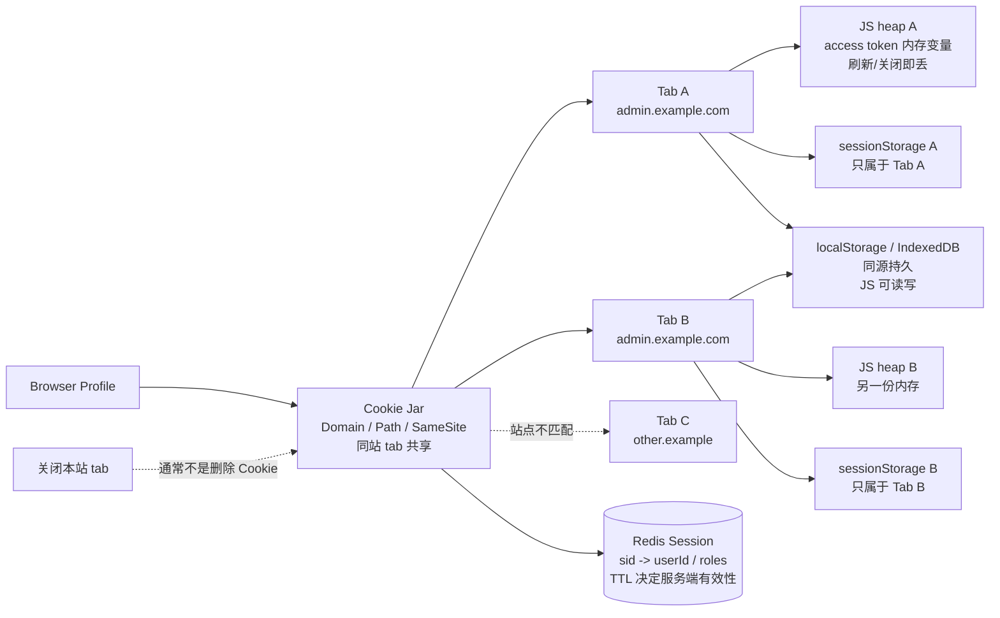
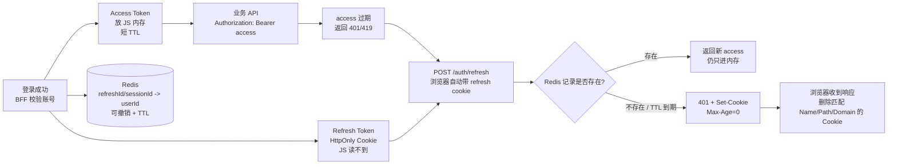
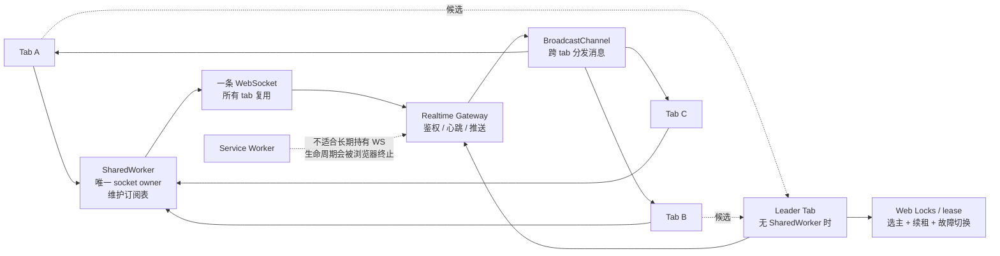
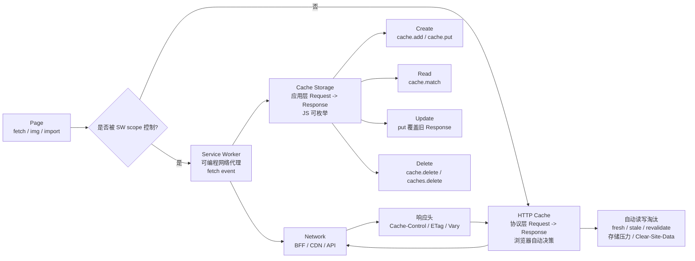
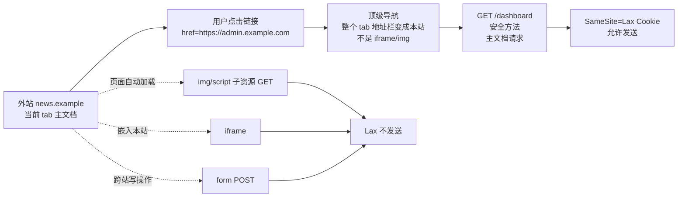
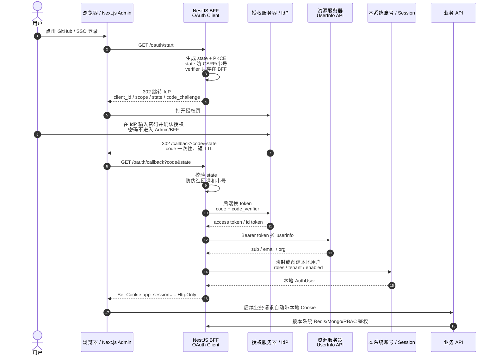

# 浏览器认证、缓存、SameSite 与 OAuth 图解

正文只保留边界结论；细节放在 Mermaid 图里。

## 速答

| 问题 | 最短答案 | 看图 |
| --- | --- | --- |
| Session Cookie 是否跨 tab | 是。Cookie 属于浏览器 Cookie Jar，不属于某个 tab。 | 图 1 |
| 关闭相关 tab 是否清 Session Cookie | 不可靠。关闭本站 tab 通常不清；关闭浏览器会话才可能清，且会话恢复可能保留。 | 图 1 / 图 2 |
| sessionStorage 是否跨 tab | 否。它属于 `origin + 当前顶层 tab`。复制 tab 可能拷贝初始值，之后独立。 | 图 1 |
| access token 放内存是哪里 | JS 变量、React state/context、内存 store、api client 闭包。 | 图 1 / 图 2 |
| 多 tab 共享 WebSocket | 让 `SharedWorker` 或 leader tab 持有唯一 socket，其他 tab 走消息通道。 | 图 3 |
| HTTP Cache / Cache Storage CRUD | HTTP Cache 由协议头自动管；Cache Storage 由 JS/Service Worker 显式管。 | 图 4 |
| 二者是否都是 Request -> Response 仓库 | 抽象上是；区别是协议缓存 vs 应用缓存。 | 图 4 |
| Cookie 未过期但 Redis 过期 | 下一次请求返回 `401`，并用 `Set-Cookie: Max-Age=0` 清浏览器 Cookie。 | 图 2 |
| SameSite=Lax 顶级 GET 导航 | 外站点击链接后，整个 tab 跳到本站主文档 GET，会带 Lax Cookie。 | 图 5 |
| OAuth 第一性原理 | 用户授权客户端访问有限资源，不把主账号密码交给客户端。 | 图 6 |

## 图 1：浏览器存储边界

## 图 2：access token、refresh token、Redis TTL 与清 Cookie

## 图 3：多 tab 共享 WebSocket

## 图 4：Service Worker、HTTP Cache、Cache Storage CRUD

## 图 5：SameSite=Lax 顶级 GET 导航

## 图 6：OAuth Authorization Code + PKCE 泳道图

核心流程：浏览器只负责跳转，BFF 负责校验、换 token 和落本地登录态。

1. 用户点击 SSO 登录后，BFF 生成 `state` 和 PKCE 参数，再把浏览器重定向到 IdP。
2. 用户只在 IdP 输入密码；IdP 登录成功后，把一次性 `code` 和原 `state` 带回 BFF。
3. BFF 校验 `state`，再用服务端保存的 `code_verifier` 去 IdP 换 token。
4. BFF 用 token 拉 `userinfo`，映射成本系统用户、租户和角色。
5. BFF 最终写入 `HttpOnly app_session`；后续业务接口只按本系统 Cookie、Redis Session 和 RBAC 鉴权。

## 必要边界

| 边界 | 结论 |
| --- | --- |
| Cookie vs Session | Cookie 是浏览器存储和自动发送机制；Session 是服务端登录态记录。 |
| Token vs 本地登录态 | 第三方 OAuth token 不应直接等同于当前系统登录态；BFF 应创建自己的 session。 |
| 缓存清理 | HTTP Cache 不能像普通 Map 一样被业务 JS 枚举 CRUD；Cache Storage 可以。 |
