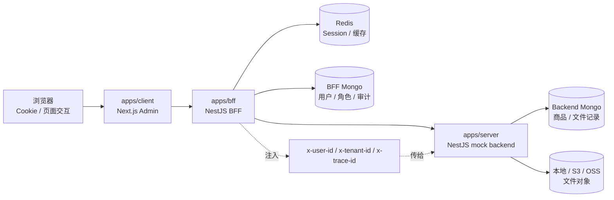
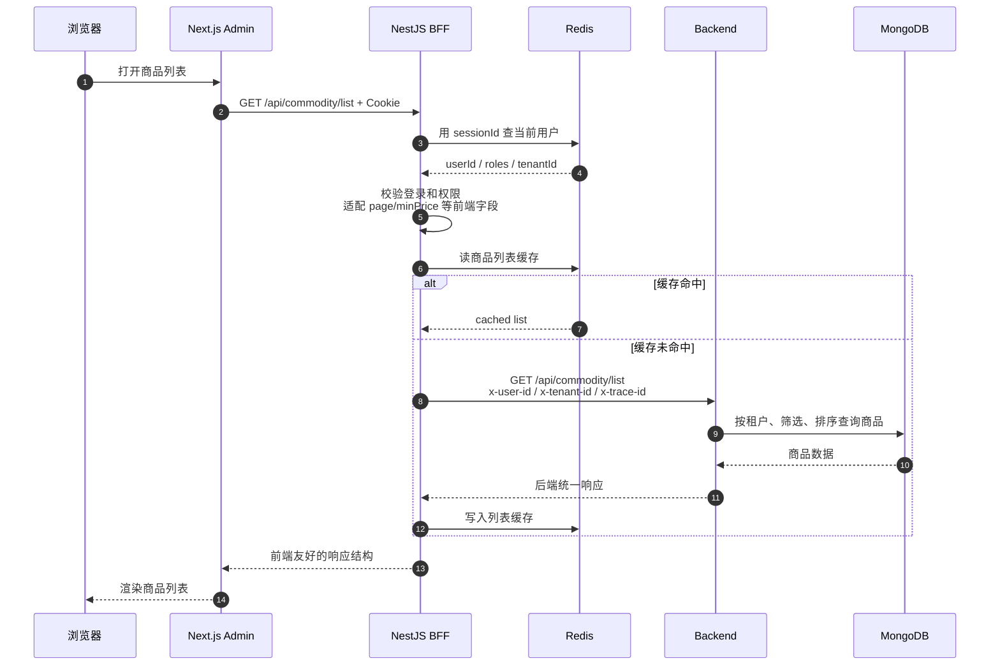
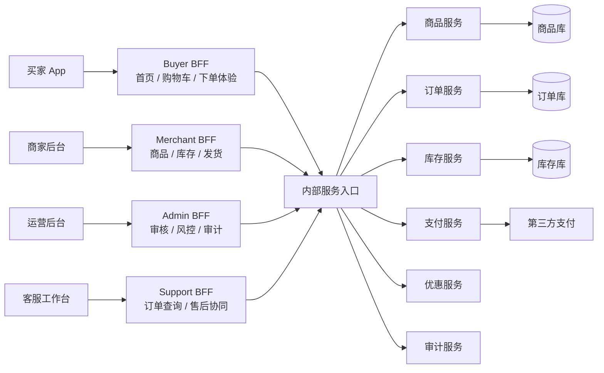
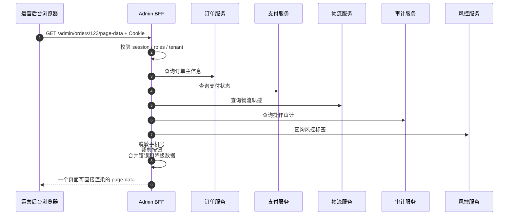

# BFF 和 Backend 为什么分层

## 一句话

BFF 面向浏览器，把 Cookie、Session、权限、聚合、缓存、错误包装成前端好用的接口；Backend 面向业务和数据，负责稳定的领域规则、存储和核心能力。

```text
BFF = 前端入口适配层
Backend = 业务能力层
```

## 图 1：当前项目的分层边界



这张图要表达的是：浏览器只直接信任 BFF；BFF 把浏览器请求转换成系统内部可信上下文，再调用 Backend。

## 图 2：商品列表请求怎么穿过两层



这个流程里，BFF 做的是“浏览器入口治理”，Backend 做的是“商品数据查询”。

## 为什么不能都放在 Backend

| 问题 | 放在 BFF 的原因 |
| --- | --- |
| Cookie / Session | 这是浏览器登录态问题，BFF 最接近浏览器。 |
| OAuth 回调 | `state`、PKCE、`Set-Cookie` 都属于前端登录入口，不应污染商品、订单等核心服务。 |
| 页面聚合 | 一个页面可能要用户、菜单、权限、列表、统计，BFF 可以聚合成前端需要的一次响应。 |
| 字段适配 | 前端用 `page/minPrice/maxPrice`，Backend 可用 `offset/priceMin/priceMax`，BFF 负责翻译。 |
| 统一错误 | Backend 可返回内部业务码，BFF 再转换成前端稳定的 HTTP 错误和提示。 |
| 缓存与审计 | BFF 可以缓存页面级查询，也可以记录“谁在页面上做了什么”。 |

## Backend 保留什么

Backend 不关心浏览器怎么登录，也不关心页面怎么展示。它应该保留稳定的业务能力：

| Backend 职责 | 当前项目例子 |
| --- | --- |
| 数据模型 | `apps/server/src/mock-backend/schemas/commodity.schema.ts` |
| 商品查询和写入 | `apps/server/src/mock-backend/commodity.service.ts` |
| 状态流转规则 | `apps/server/src/mock-backend/commodity-status-rules.ts` |
| 文件存储能力 | `apps/server/src/mock-backend/storage/*` |
| 后端统一响应 | `apps/server/src/mock-backend/mock-response.ts` |

## 当前项目里的具体例子

### 登录

`apps/bff/src/auth/auth.controller.ts` 负责登录、退出、`Set-Cookie`、CSRF Cookie。

这是 BFF 职责，因为它直接处理浏览器 Cookie 和 Session。

### 当前用户

`apps/bff/src/auth/get-current-user.ts` 从请求里取 session cookie，再查 `SessionStoreService`，得到当前用户。

Backend 不应该直接相信浏览器传来的 Cookie。

### 商品列表

`apps/bff/src/commodity/commodity.service.ts` 把前端查询字段转换成 Backend 查询字段，并注入：

```text
x-user-id
x-tenant-id
x-trace-id
```

然后通过 `apps/bff/src/bff/api-client.service.ts` 调用 Backend。

Backend 的 `apps/server/src/mock-backend/commodity.service.ts` 只负责按租户、筛选、排序和分页查询商品。

## 真实复杂度场景：多端电商运营系统

假设系统不是当前 MVP，而是一个真实电商/供应链平台：

```text
买家 App
商家后台
运营后台
客服工作台
开放平台 API
```

它们都需要商品、订单、库存、支付、优惠、物流、售后能力，但页面形态、权限边界和交互速度完全不同。



这个复杂场景里，BFF 和 Backend 分层不只是“代码整洁”，而是为了控制变化方向。

| 复杂度 | BFF 怎么承担 | Backend 怎么承担 |
| --- | --- | --- |
| 多端差异 | 不同端可以有不同 BFF，返回各自页面需要的字段和聚合结果。 | 商品、订单、库存服务不为某个页面定制接口。 |
| 权限差异 | 商家只能看自己的店铺；运营能跨租户；客服只能看脱敏信息。 | Backend 做最终权限兜底和数据隔离，不信任前端声明。 |
| 性能差异 | 首页、列表、工作台看板可以做页面级缓存和降级。 | Backend 保证核心写入、库存扣减、支付状态一致。 |
| 协议差异 | Web 用 Cookie Session，App 可能用 Bearer Token，开放平台用签名。 | Backend 接收统一的可信用户上下文和租户上下文。 |
| 发布节奏 | 前端页面改版时主要改 BFF 聚合和字段裁剪。 | 核心服务接口保持稳定，减少连锁回归。 |
| 故障隔离 | BFF 可以对非关键模块降级，例如少展示统计卡片。 | Backend 对支付、库存、订单写入保持强约束。 |

### 一个真实页面例子

运营后台的“订单详情页”可能一次需要：

```text
订单主信息
买家信息
商品快照
支付状态
物流轨迹
优惠明细
售后记录
风控标签
操作审计
当前操作人的可用按钮
```

如果前端直接调用所有 Backend 服务，会变成：

```text
浏览器同时理解 8 到 10 个后端接口
浏览器自己拼接权限、脱敏、降级和错误
每个页面都重复同样的聚合逻辑
```

更合理的是：

```text
浏览器请求 Admin BFF: GET /admin/orders/:id/page-data
Admin BFF 聚合订单、支付、物流、售后、审计
Admin BFF 根据当前用户角色裁剪字段和按钮
Backend 服务继续保持领域接口稳定
```



这里的关键不是“BFF 帮前端少发请求”这么简单，而是：

```text
BFF 负责页面语义
Backend 负责业务事实
```

### 真实系统里的分层考量

| 考量 | 设计结论 |
| --- | --- |
| BFF 能不能写业务规则 | 可以写展示规则、按钮可见性、字段脱敏；不要写库存扣减、支付成功、订单状态流转这类核心规则。 |
| Backend 能不能直接给前端用 | 可以给内部工具临时用，但长期会让 Backend 被页面结构绑死。 |
| 要不要一个 BFF 管所有端 | 小系统可以；复杂系统通常按端拆，例如 `admin-bff`、`merchant-bff`、`buyer-bff`。 |
| BFF 是否需要数据库 | 可以有自己的会话、缓存、审计、页面配置库；不应复制订单、库存这类核心事实表。 |
| 权限放哪层 | BFF 做入口校验和页面裁剪，Backend 做关键操作兜底校验。 |
| 缓存放哪层 | BFF 适合页面级/用户级缓存，Backend 适合领域数据缓存和查询优化。 |
| 错误谁来翻译 | Backend 返回稳定业务错误，BFF 翻译成前端能展示的错误、toast、空状态或降级块。 |

### 对当前项目的映射

当前 `next-bff` 还不是复杂多服务系统，但已经有这个分层雏形：

| 真实复杂系统 | 当前项目对应 |
| --- | --- |
| Admin BFF | `apps/bff` |
| 商品服务 | `apps/server/src/mock-backend/commodity.service.ts` |
| 页面级缓存 | `apps/bff/src/commodity/commodity-cache.service.ts` |
| 登录态和入口权限 | `apps/bff/src/auth/*`、`apps/bff/src/permission/*` |
| 用户上下文注入 | `apps/bff/src/bff/request-headers.service.ts` |
| 后端调用治理 | `apps/bff/src/bff/api-client.service.ts` |

所以当前项目里的 BFF 不是多余的一层。它是在提前模拟真实系统中最常见的边界：前端入口变化快，核心业务变化慢；BFF 承接变化，Backend 稳住事实。

## 最小判断标准

遇到一个逻辑放哪里，可以这样判断：

| 问题 | 放哪里 |
| --- | --- |
| 和浏览器、Cookie、OAuth、页面聚合有关 | BFF |
| 和核心业务规则、数据库写入、状态流转有关 | Backend |
| 和前端字段转换、响应裁剪、错误展示有关 | BFF |
| 和数据一致性、查询性能、存储边界有关 | Backend |

## 最后复述

BFF 不是“另一个后端”，而是浏览器和核心后端之间的适配层。它把不可信的浏览器请求变成可信的用户上下文，把多个后端能力组装成前端页面需要的接口；Backend 则保持稳定，专注业务规则和数据。
