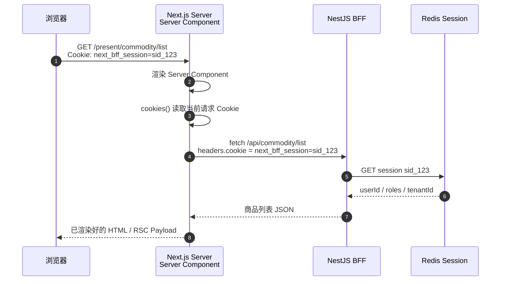
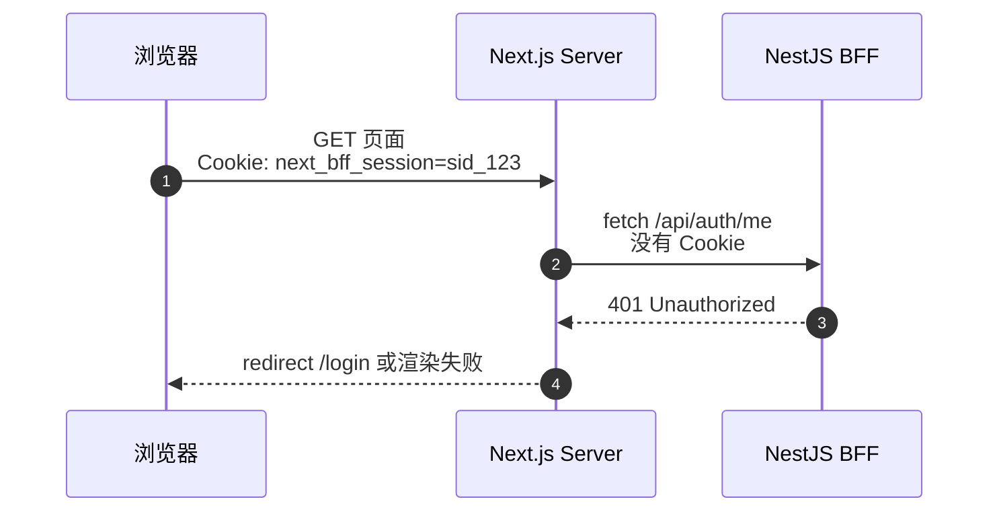
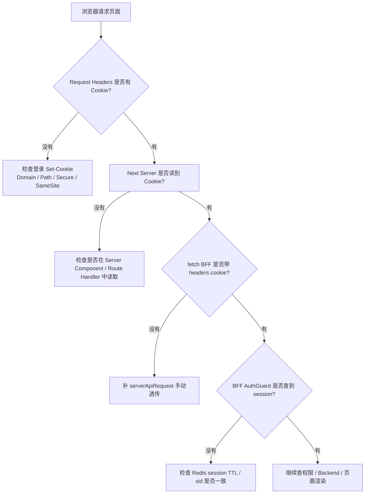

# Server Component 为什么要手动透传 Cookie

## 一句话

Server Component 里的 `fetch()` 是 Next 服务端重新发起的一次 HTTP 请求，不是浏览器原始请求；浏览器带给 Next 的 Cookie 不会自动出现在这次服务端请求里，所以要用 `cookies()` 读出来，再手动放进 `cookie` header 传给 BFF。

```text
浏览器请求页面时自动带 Cookie
Next Server 收到了 Cookie
Next Server 再 fetch BFF 时，要自己决定带不带 Cookie
```

## 图 1：Cookie 断在哪里



关键点：第一步是浏览器请求 Next；第四步是 Next 服务端请求 BFF。它们是两次不同的 HTTP 请求。

## 如果不手动透传会怎样



BFF 的 `AuthGuard` 只能从请求 Cookie 里拿到 `next_bff_session`。如果 Next 服务端请求 BFF 时没有带 Cookie，BFF 看起来就像收到了一个未登录请求。

## 当前项目的代码

统一封装在：

```text
apps/client/src/lib/server-api.ts
```

核心代码：

```ts
import { cookies } from "next/headers";

async function getCookieHeader() {
  const cookieStore = await cookies();
  return cookieStore.toString();
}

export async function serverApiRequest<T>(path: string, options: ServerApiRequestOptions & { init?: RequestInit }) {
  const cookie = await getCookieHeader();

  const response = await fetch(`${internalOrigin}${path}`, {
    ...options.init,
    cache: "no-store",
    headers: {
      ...(options.init?.headers
        ? Object.fromEntries(new Headers(options.init.headers).entries())
        : {}),
      cookie
    }
  });

  // ...
}
```

商品列表、商品详情、当前用户都走这个封装：

```text
apps/client/src/features/commodity/server.ts
apps/client/src/features/auth/server.ts
apps/client/src/features/user/server.ts
```

所以 Server Component 页面只需要调用业务函数，不需要每个页面重复写透传逻辑。

## 为什么浏览器请求会自动带 Cookie

浏览器有 Cookie Jar。只要域名、路径、过期时间、`Secure`、`SameSite` 等规则满足，浏览器请求本站时会自动带上 Cookie：

```http
GET /present/commodity/list HTTP/1.1
Host: localhost:3000
Cookie: next_bff_session=sid_123
```

这是浏览器的能力。

## 为什么 Server Component fetch 不会自动带

Server Component 运行在 Next 服务端。这里的 `fetch()` 更像后端代码发请求：

```text
Next Server -> BFF
```

它不是浏览器，所以没有浏览器 Cookie Jar；它也不会默认把“当前用户请求里的 Cookie”复制到任意下游请求。

这是安全边界：服务端可能请求数据库 API、第三方 API、对象存储、内部服务。如果框架自动把用户 Cookie 带给所有请求，就可能把登录凭证泄露给不该收到的地址。

所以必须显式写：

```ts
headers: {
  cookie: (await cookies()).toString()
}
```

这等于告诉系统：

```text
这次下游请求是发给我们自己的 BFF，可以带当前用户的登录 Cookie。
```

## 和 Client Component fetch 的区别

### Client Component

```text
Browser -> BFF
```

浏览器自己发请求，Cookie Jar 会按规则自动带 Cookie。

```ts
await fetch("/api/commodity/list");
```

### Server Component

```text
Browser -> Next Server -> BFF
```

浏览器只把 Cookie 带到了 Next Server。Next Server 再请求 BFF 时，需要手动转发：

```ts
const cookie = (await cookies()).toString();

await fetch(`${internalOrigin}/api/commodity/list`, {
  headers: {
    cookie
  }
});
```

## 为什么 HttpOnly Cookie 也能透传

`HttpOnly` 的含义是：浏览器 JS 不能通过 `document.cookie` 读取这个 Cookie。

但它并不是说服务端不能看到。浏览器请求 Next 页面时，HTTP 请求头里仍然会带：

```http
Cookie: next_bff_session=sid_123
```

Next Server Component 通过 `cookies()` 读取的是“HTTP 请求头里的 Cookie”，不是浏览器 JS 里的 `document.cookie`。

所以当前系统可以做到：

```text
浏览器 JS 读不到 next_bff_session
Next Server 可以读到请求 Cookie
Next Server 可以把它转发给自己的 BFF
BFF 用它查 Redis Session
```

这正是 `HttpOnly Cookie + Server Component + BFF` 适合后台系统的原因。

## 真实排障链路

如果 Server Component 页面刷新后总是跳回登录页，可以按这条链路排查：



观察点：

| 位置 | 看什么 |
| --- | --- |
| 浏览器 Network 的页面请求 | `Cookie: next_bff_session=...` 是否存在 |
| Next 服务端日志 | `cookies().toString()` 是否为空 |
| BFF 日志 | `/api/auth/me` 或 `/api/commodity/list` 是否收到 Cookie |
| Redis | `sid` 对应的 session 是否存在且未过期 |

## 最小原则

| 原则 | 说明 |
| --- | --- |
| 只转发给自己的 BFF | 不要把用户 Cookie 转发给第三方 API。 |
| 统一封装 | 用 `serverApiRequest()` 集中处理，不要每个页面手写。 |
| 动态渲染 | 使用 `cookies()` 代表依赖请求时数据，页面应按动态请求理解。 |
| 不在浏览器 JS 读 session | `next_bff_session` 应保持 `HttpOnly`，由服务端读取和转发。 |
| BFF 仍要校验 | 透传 Cookie 不是信任前端，BFF 仍要查 Redis Session 和权限。 |

## 最后复述

Server Component 能读到浏览器请求带来的 Cookie，但它再请求 BFF 时是一个新的服务端请求。Cookie 不会跨请求自动复制，所以当前项目用 `cookies().toString()` 取出当前请求 Cookie，并在 `serverApiRequest()` 里显式设置 `headers.cookie`。这样 BFF 才能识别当前用户。

## 参考

- Next.js `cookies()` 文档：https://nextjs.org/docs/app/api-reference/functions/cookies
- Next.js Server Components 文档：https://nextjs.org/docs/app/getting-started/server-and-client-components
