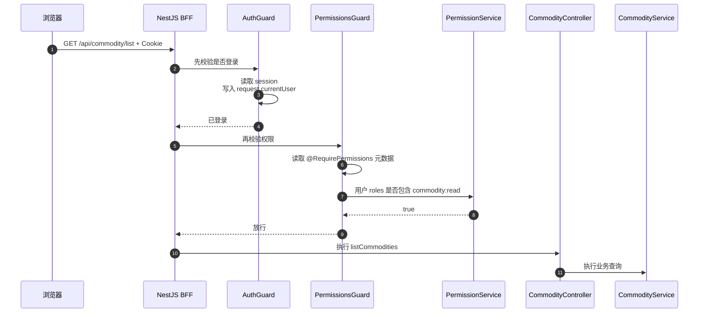
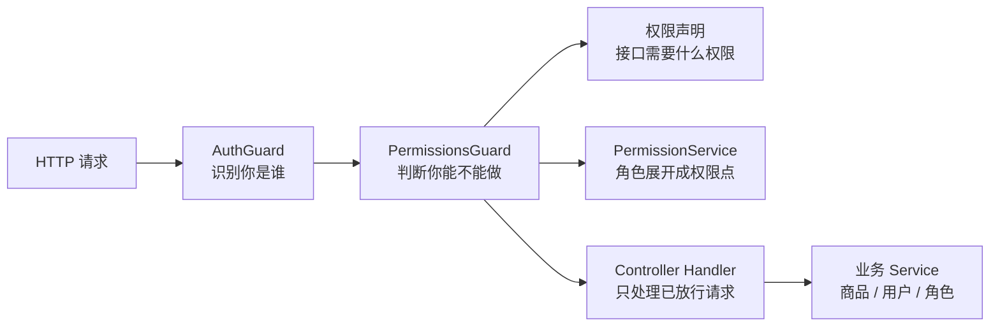

# 权限为什么用 Guard + Decorator

## 一句话

Decorator 负责把“这个接口需要什么权限”声明在接口旁边；Guard 负责在请求真正进入 Controller 前统一读取声明、拿当前用户做校验，不通过就直接返回 `401` 或 `403`。

```text
Decorator = 声明权限要求
Guard = 执行权限拦截
Service = 做业务逻辑
```

## 当前项目里的真实例子

商品列表接口：

```ts
@ApiTags("Commodity")
@Controller("api/commodity")
@UseGuards(AuthGuard, PermissionsGuard)
export class CommodityController {
  @Get("list")
  @RequirePermissions("commodity:read")
  async listCommodities() {
    // ...
  }
}
```

这里有两层含义：

| 写法 | 作用 |
| --- | --- |
| `@UseGuards(AuthGuard, PermissionsGuard)` | 请求进 Controller 前先经过登录和权限拦截。 |
| `@RequirePermissions("commodity:read")` | 声明这个接口需要商品读取权限。 |

## 图 1：一次权限校验怎么发生



如果没登录，`AuthGuard` 返回 `401`。如果已登录但没权限，`PermissionsGuard` 返回 `403`。

## 为什么不用 Controller 里手写 if

可以写成这样：

```ts
if (!user.roles.includes("admin")) {
  throw new ForbiddenException("permission denied");
}
```

但问题是：

| 问题 | 后果 |
| --- | --- |
| 每个接口重复写 | 新增接口容易漏掉权限判断。 |
| 权限和业务混在一起 | Controller/Service 既做业务又做拦截，职责不清。 |
| 不容易审计 | 很难全局搜索“哪些接口需要什么权限”。 |
| 返回结构不统一 | 有的接口返回 403，有的可能漏成 500 或业务错误。 |
| 测试重复 | 每个 service 都要重复测权限分支。 |

Guard + Decorator 的好处是：权限要求贴在接口上，权限执行集中在 Guard 里。

## Decorator 做了什么

当前代码：

```ts
// apps/bff/src/permission/permissions.decorator.ts
export const REQUIRED_PERMISSIONS_KEY = "requiredPermissions";

export const RequirePermissions = (...permissions: PermissionCode[]) =>
  SetMetadata(REQUIRED_PERMISSIONS_KEY, permissions);
```

它不会直接校验权限，只是把元数据挂到 Controller 或方法上：

```text
这个接口需要 commodity:create
这个接口需要 audit:read
这个 Controller 默认需要 user:manage
```

例如用户管理接口把权限写在 Controller 上：

```ts
@Controller("api/users")
@UseGuards(AuthGuard, PermissionsGuard)
@RequirePermissions("user:manage")
export class UserController {}
```

含义是：这个 Controller 下的接口默认都需要 `user:manage`。

## Guard 做了什么

当前 `PermissionsGuard` 的核心逻辑：

```ts
const requiredPermissions = this.reflector.getAllAndOverride<PermissionCode[]>(
  REQUIRED_PERMISSIONS_KEY,
  [context.getHandler(), context.getClass()]
);
```

它会从两个位置读权限要求：

```text
方法上的 @RequirePermissions
Controller 上的 @RequirePermissions
```

然后取当前用户：

```ts
const request = context.switchToHttp().getRequest<AuthenticatedRequest>();
const user = request.currentUser;
```

再调用权限服务：

```ts
await this.permissionService.hasAllPermissionsByRoleCodes(
  user.roles,
  requiredPermissions
);
```

最终判断：

```text
没有声明权限 -> 直接放行
声明了权限 + 用户没有登录 -> 403
声明了权限 + 用户缺权限 -> 403
声明了权限 + 用户有权限 -> 放行
```

注意：正常接口会先跑 `AuthGuard`，所以“没登录”通常在 `AuthGuard` 阶段返回 `401`。

## 图 2：职责拆分



这张图的关键是：权限判断发生在 Controller handler 执行前。业务代码拿到请求时，已经是“通过登录和权限校验的请求”。

## 401 和 403 的区别

| 状态码 | 谁返回 | 含义 | 当前项目例子 |
| --- | --- | --- | --- |
| `401` | `AuthGuard` | 我不知道你是谁。 | 没有有效 `next_bff_session`。 |
| `403` | `PermissionsGuard` | 我知道你是谁，但你不能做这件事。 | `viewer` 调用商品创建接口。 |

这两个状态必须区分。否则前端无法判断是该跳登录页，还是提示“无权限”。

## 为什么权限点放在 Decorator 上更适合审计

因为可以直接搜索：

```bash
rg -n "RequirePermissions|UseGuards" apps/bff/src
```

然后能看到：

```text
商品读取 -> commodity:read
商品创建 -> commodity:create
商品更新 -> commodity:update
商品删除 -> commodity:delete
审计日志 -> audit:read
用户管理 -> user:manage
角色管理 -> role:manage
权限管理 -> permission:manage
```

这比在几十个 service 里找 `if` 判断可靠得多。

## 真实复杂系统里为什么更重要

真实后台系统的权限通常会继续变复杂：

```text
角色权限
租户权限
数据范围
字段脱敏
高风险操作二次确认
审批流
审计日志
```

如果不用 Guard + Decorator，权限逻辑会散落在各个业务函数里：

```text
商品 Service 判断一部分
订单 Service 判断一部分
用户 Controller 判断一部分
前端按钮再判断一部分
```

最后会出现两个问题：

| 问题 | 真实风险 |
| --- | --- |
| 漏拦接口 | 前端按钮隐藏了，但接口仍可直接调用。 |
| 权限口径不一致 | A 页面不让操作，B 页面却能通过另一个接口操作。 |

Guard + Decorator 把入口权限变成统一机制：

```text
新增接口时必须写需要什么权限
请求进业务前统一校验
缺权限统一 403
权限审计可以全局扫描
```

## 当前项目的测试覆盖

权限失败路径已经在 BFF e2e 里覆盖，例如：

```text
apps/bff/src/commodity/commodity.e2e-spec.ts
```

断言重点：

```text
已登录但缺权限
-> PermissionsGuard 返回 403
-> message = permission denied
-> 业务 service 不应继续执行
```

这类测试验证的是 HTTP 管线，不只是某个 service 函数：

```text
Supertest
-> Nest HTTP Pipeline
-> AuthGuard
-> PermissionsGuard
-> Controller
-> Service
-> Filter
```

## 最小原则

| 原则 | 说明 |
| --- | --- |
| 登录和权限分开 | `AuthGuard` 管“你是谁”，`PermissionsGuard` 管“你能做什么”。 |
| 权限声明靠近接口 | 用 `@RequirePermissions(...)` 贴在 Controller 或方法上。 |
| 权限执行集中 | 不在每个业务函数里散落权限判断。 |
| Backend 仍要兜底 | BFF 校验不等于核心后端可以无条件信任高风险写操作。 |
| 前端按钮不是权限 | 隐藏按钮只是体验，接口 Guard 才是安全边界。 |

## 最后复述

Guard + Decorator 的本质是把权限拆成两件事：接口旁边声明“需要什么权限”，请求进入业务前统一判断“当前用户有没有这个权限”。这样权限规则可读、可审计、可测试，也能避免权限判断散落在业务代码里。
