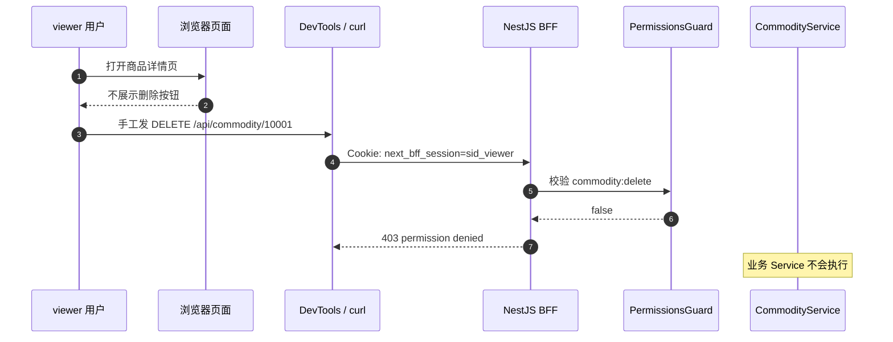
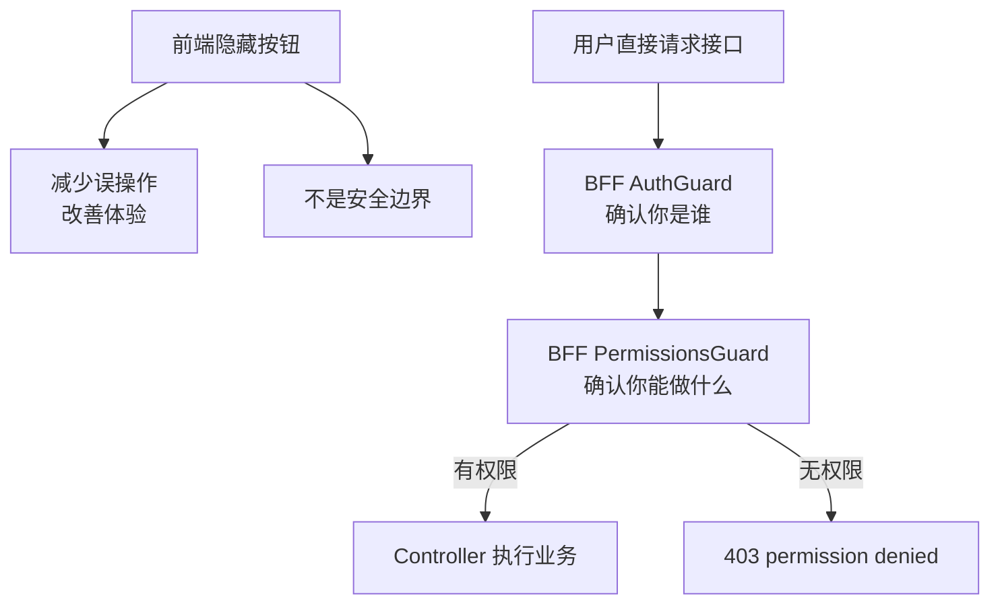
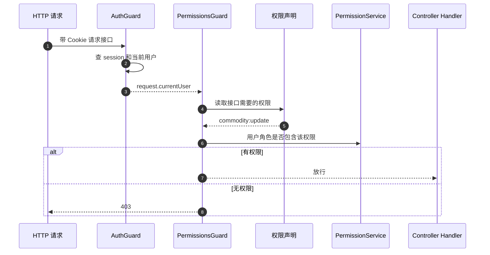

# 隐藏按钮为什么不是权限

## 一句话

隐藏按钮只是前端体验控制，不能阻止用户绕过页面直接请求接口；真正的权限必须在服务端入口校验，例如当前项目里的 `AuthGuard + PermissionsGuard + @RequirePermissions`。

```text
隐藏按钮 = 不让正常用户看到入口
接口权限 = 不让未授权请求执行成功
```

## 当前项目里的真实例子

商品详情页会按角色决定是否展示编辑、状态变更、删除区域：

```ts
const canUpdateCommodity = currentUser.roles.some(
  (role) => role === "admin" || role === "operator"
);
const canDeleteCommodity = currentUser.roles.includes("admin");

{canUpdateCommodity ? <CommodityEditForm commodity={commodity} /> : null}
{canUpdateCommodity ? <CommodityStatusForm ... /> : null}
{canDeleteCommodity ? <CommodityDeleteForm ... /> : null}
```

这能让 `viewer` 看不到编辑和删除入口，但它不是安全边界。

真正的安全边界在 BFF：

```ts
@Patch(":id")
@RequirePermissions("commodity:update")
async updateCommodity() {}

@Delete(":id")
@RequirePermissions("commodity:delete")
async deleteCommodity() {}
```

也就是：

```text
页面可以隐藏按钮
BFF 必须拦接口
```

## 图 1：隐藏按钮挡不住直接请求



如果只有隐藏按钮，没有 BFF Guard，那么上面的手工请求就可能真的删除商品。

## 为什么前端不可信

前端代码运行在用户可控环境里。用户可以：

```text
打开 DevTools
改 HTML
改 JS 断点
复制 Cookie
手写 fetch
用 curl / Postman 请求接口
直接访问隐藏路由
重放历史请求
```

所以不能把下面这些当成权限：

| 前端做法 | 为什么不是权限 |
| --- | --- |
| 隐藏按钮 | 只是不显示入口，接口仍可能被直接调用。 |
| 禁用按钮 | 用户可以改 DOM 去掉 `disabled`。 |
| 隐藏导航菜单 | 用户可以直接输入 URL。 |
| 前端判断 `role === admin` | 前端判断可以被绕过，服务端必须重判。 |
| 页面级 403 | 只能保护页面渲染，不代表所有 API 都安全。 |

## 图 2：正确权限边界



这张图的核心是：前端负责体验，BFF 负责拦截。

## 当前项目的两类前端控制

### 1. 隐藏导航

`apps/client/src/components/side-nav.tsx` 会根据当前用户隐藏部分菜单：

```ts
if (route.adminOnly && !currentUser.roles.includes("admin")) {
  return false;
}

if (route.requiredPermissions?.length) {
  return route.requiredPermissions.every((permission) =>
    currentUser.permissions?.includes(permission)
  );
}
```

这只能说明：

```text
普通用户不应该在菜单里看到这个入口
```

不能说明：

```text
普通用户绝对访问不了这个能力
```

真正访问接口时，仍要靠 BFF 的 Guard。

### 2. 隐藏操作表单

商品详情页里 `viewer` 看不到编辑、状态变更、删除表单。

但如果 `viewer` 手工调用：

```http
PATCH /api/commodity/10001
DELETE /api/commodity/10001
```

BFF 仍然必须返回：

```text
403 permission denied
```

否则隐藏按钮就只是“把门牌摘掉”，门本身还开着。

## 服务端权限怎么兜住

当前项目的兜底链路：



这就是为什么权限要落在接口入口，而不是只落在按钮上。

## 真实业务风险

如果只隐藏按钮，不做接口权限，真实系统里会出这些问题：

| 场景 | 风险 |
| --- | --- |
| 只隐藏删除按钮 | 用户手工发 `DELETE`，数据被删。 |
| 只隐藏审批按钮 | 用户手工发审批接口，绕过审批链。 |
| 只隐藏价格输入框 | 用户手工改请求体，提交非法价格。 |
| 只隐藏权限管理菜单 | 用户直接访问角色绑定接口，给自己提权。 |
| 只靠前端路由拦截 | 用户直接请求 API，绕过页面。 |

前端控制解决的是：

```text
不让普通用户误点
页面更干净
减少无意义请求
```

服务端权限解决的是：

```text
即使用户恶意构造请求，也不能越权成功
```

## 和 Server Component 的关系

Server Component 里隐藏按钮比纯浏览器 JS 稍强，因为判断发生在 Next 服务端，用户不容易直接改渲染逻辑。

但它仍然不是最终权限，因为用户可以不经过这个页面，直接请求 BFF API：

```text
Server Component 页面没渲染按钮
不等于 BFF 接口不能被调用
```

所以当前项目需要两层：

```text
Server Component / Client Component：隐藏入口
BFF Guard：拦住接口
```

## 怎么验证

以 `viewer` 用户为例：

1. 登录后打开商品详情页。
2. 页面不应显示编辑、状态变更、删除区域。
3. 手工请求删除或编辑接口。
4. BFF 应返回 `403 permission denied`。
5. `CommodityService` 不应被调用。

当前 BFF e2e 已覆盖类似断言：

```text
apps/bff/src/commodity/commodity.e2e-spec.ts
```

例如缺权限访问审计、创建、更新接口时：

```text
返回 403
message = permission denied
业务 service not.toHaveBeenCalled()
```

## 最小原则

| 原则 | 说明 |
| --- | --- |
| 前端可以隐藏入口 | 这是体验优化。 |
| 服务端必须拦接口 | 这是安全边界。 |
| 页面权限不等于 API 权限 | 页面只是访问路径之一。 |
| 按钮权限和接口权限要一致 | 否则会出现页面显示能做，但接口 403，或页面隐藏了但接口能做。 |
| 高风险操作要双重保护 | 前端隐藏/确认 + BFF Guard + Backend 关键操作兜底。 |

## 最后复述

隐藏按钮不是权限，因为它只改变用户看见什么，不改变用户能不能直接请求接口。真正的权限必须在服务端校验：请求进 BFF 后，`AuthGuard` 先确认用户是谁，`PermissionsGuard` 再确认用户是否拥有接口声明的权限；没有权限就返回 `403`，业务代码不能执行。
