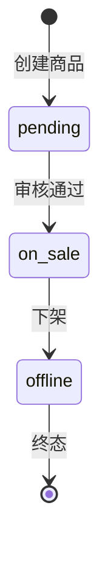
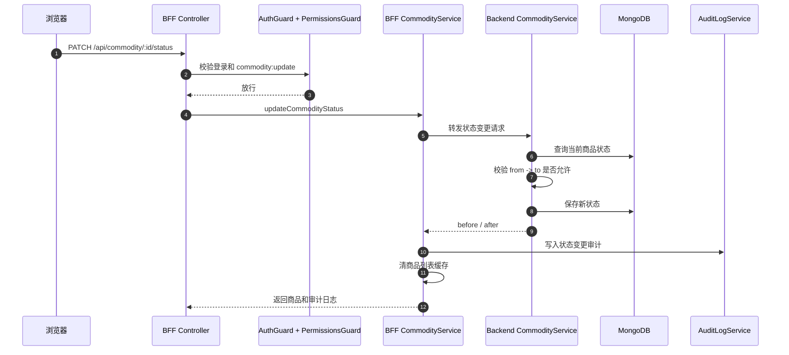
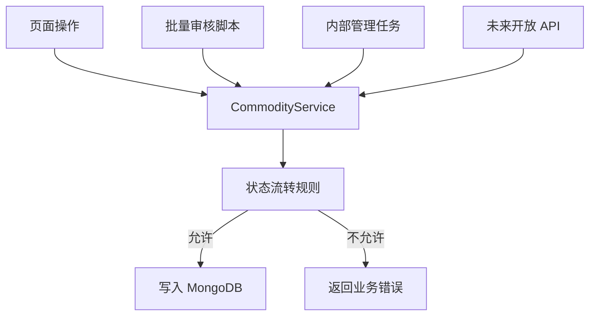

# 商品状态流转为什么放 Service

## 一句话

商品状态流转是业务规则，不是页面展示规则，也不是 HTTP 入参规则；它必须放在 Service 层统一执行，保证无论请求来自页面、脚本、测试还是未来其他端，都只能按同一套状态机修改商品状态。

```text
Controller = 接 HTTP 请求
BFF Service = 调后端、写审计、清缓存
Backend Service = 校验并执行商品状态流转
```

## 当前状态机

当前商品状态只有三种：

```text
pending   待审核
on_sale   上架中
offline   已下架
```

允许的流转：



当前规则在：

```text
apps/server/src/mock-backend/commodity-status-rules.ts
```

核心规则：

```ts
pending -> on_sale
on_sale -> offline
offline -> 不允许直接变更
```

## 一次状态变更的调用链



这条链路里，状态机真正落在 Backend Service。BFF Service 不重复判断状态机，它负责调用后端、记录审计和清缓存。

## 为什么不放前端

前端当前也有一份可选项规则：

```text
apps/client/src/features/commodity/status-rules.ts
```

它用于展示下拉框：

```ts
getNextCommodityStatusOptions(currentStatus);
```

这只是体验优化。用户仍然可以绕过页面，手工发请求：

```http
PATCH /api/commodity/10001/status
Content-Type: application/json

{
  "status": "offline",
  "reason": "绕过页面直接下架"
}
```

所以前端规则不能作为最终判断。

```text
前端规则 = 告诉用户能选什么
Service 规则 = 决定系统允许发生什么
```

## 为什么不放 Controller

Controller 的职责是 HTTP 边界：

```text
路由
参数
DTO 校验
登录和权限 Guard
调用 Service
```

如果把状态机写在 Controller，会出现几个问题：

| 问题 | 后果 |
| --- | --- |
| 规则和 HTTP 绑死 | 以后批量任务、定时任务、内部脚本绕过 Controller 时规则失效。 |
| Controller 变厚 | 路由层同时处理业务状态机、审计和响应，职责混乱。 |
| 多入口重复 | 创建、恢复、批量审核、导入任务都可能复制一份状态判断。 |
| 测试粒度变差 | 只能通过 HTTP 测规则，难以单独测业务状态机。 |

Controller 应该只表达：

```ts
@Patch(":id/status")
@RequirePermissions("commodity:update")
async updateCommodityStatus(...) {
  return this.commodityService.updateCommodityStatus(...);
}
```

## 为什么放 Service 最稳

Service 是业务能力入口。状态流转放在 Service，能保证所有入口共享同一套规则：



这种设计回答的是：

```text
商品当前是 pending，目标是 offline，到底能不能改？
```

这个问题不属于页面，也不属于 HTTP，而属于商品业务本身。

## 当前代码怎么分工

| 层 | 文件 | 职责 |
| --- | --- | --- |
| 前端表单 | `apps/client/app/present/commodity/[id]/commodity-status-form.tsx` | 展示可选目标状态、收集原因。 |
| 前端规则 | `apps/client/src/features/commodity/status-rules.ts` | 生成下拉选项，只服务体验。 |
| BFF Controller | `apps/bff/src/commodity/commodity.controller.ts` | 接收 `PATCH /status`，要求 `commodity:update` 权限。 |
| BFF Service | `apps/bff/src/commodity/commodity.service.ts` | 调 backend，写审计，清缓存。 |
| Backend Service | `apps/server/src/mock-backend/commodity.service.ts` | 查询当前状态，校验状态流转，保存新状态。 |
| 状态规则 | `apps/server/src/mock-backend/commodity-status-rules.ts` | 定义允许的状态边。 |

## Service 里的关键校验

Backend Service 会先查当前商品：

```ts
const commodity = await this.commodityModel.findOne({
  id,
  deletedAt: null,
  tenantId: tenantContext
});
```

再校验原因和目标状态：

```ts
if (!reason) {
  return mockBusinessError(20009, "status change reason is required");
}

if (!isCommodityStatus(body.status)) {
  return mockBusinessError(20010, "target status is invalid");
}
```

最后校验状态机：

```ts
const transitionResult = validateCommodityStatusTransition(
  commodity.status,
  body.status
);

if (!transitionResult.ok) {
  return mockBusinessError(transitionResult.code, transitionResult.message);
}
```

只有通过后才保存：

```ts
commodity.status = body.status;
await commodity.save();
```

## 真实复杂系统里的考虑

商品状态一旦进入真实业务，通常会牵连更多规则：

```text
pending -> on_sale 需要审核权限
on_sale -> offline 可能要检查未完成订单
offline -> on_sale 可能要重新审核
价格、库存、图片缺失时不能上架
状态变更必须写审计
部分状态变更要触发搜索索引、缓存、消息队列
```

这些都是业务一致性问题。它们必须集中在 Service 或更明确的领域服务里，而不是散在页面和 Controller。

## 怎么验证

当前 BFF e2e 覆盖了 HTTP 管线：

```text
apps/bff/src/commodity/commodity.e2e-spec.ts
```

重点包括：

```text
缺 reason -> 400，业务 service 不执行
缺权限 -> 403，业务 service 不执行
成功变更 -> 返回 success envelope，包含 auditLog 和 commodity
```

当前 BFF Service 单测覆盖了审计和缓存副作用：

```text
apps/bff/src/commodity/commodity.service.spec.ts
```

重点包括：

```text
转发 PATCH /api/commodity/:id/status
记录 before / after 状态审计
清理商品列表缓存
```

状态机本身在 backend service 里执行；如果后续要加强覆盖，应补 backend service 单测，直接验证非法流转不会写库。

## 最小原则

| 原则 | 说明 |
| --- | --- |
| 前端可以提示 | 下拉选项、按钮、文案只负责体验。 |
| Controller 不写状态机 | Controller 只接请求和调用 Service。 |
| Service 统一执行规则 | 所有入口都必须走同一套状态机。 |
| 写操作要有审计 | 状态变更要记录 before、after、reason、operator、traceId。 |
| 缓存要失效 | 状态变更后列表缓存必须清理。 |

## 最后复述

商品状态流转放 Service，是因为它是商品业务事实的一部分。页面可以告诉用户能选什么，Controller 可以接住 HTTP 请求，但最终能不能从 `pending` 变成 `on_sale`、能不能从 `offline` 再变更，必须由 Service 根据当前数据库状态统一判断并执行。
