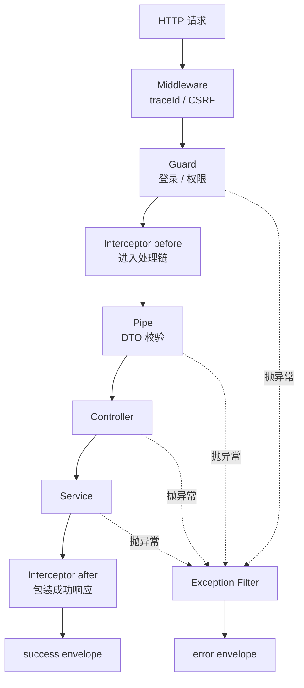
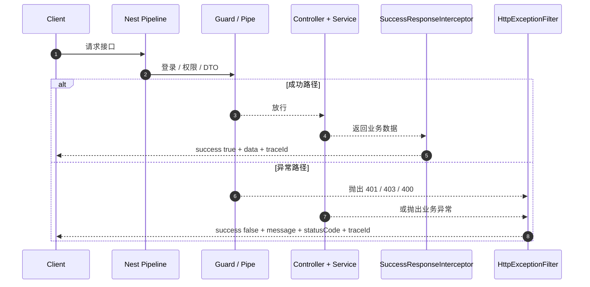

# 统一响应为什么用 Interceptor，统一异常为什么用 Filter

## 一句话

成功响应用 Interceptor，因为它能包住 Controller 的正常返回值并统一改造成响应 envelope；异常响应用 Filter，因为异常可能从 Guard、Pipe、Controller、Service 任意位置抛出，Filter 是 NestJS 专门负责兜底异常输出的边界。

```text
Interceptor = 处理成功返回
Filter = 处理异常返回
```

## 当前项目的统一结构

成功响应：

```json
{
  "success": true,
  "data": {},
  "message": "ok",
  "traceId": "trace-create"
}
```

异常响应：

```json
{
  "success": false,
  "message": "permission denied",
  "path": "/api/commodity/create",
  "traceId": "trace-forbidden",
  "statusCode": 403,
  "timestamp": "2026-05-18T00:00:00.000Z"
}
```

前端请求层只要稳定解析：

```text
success / data / message / traceId
```

错误页和日志也能用同一个 `traceId` 串起来。

## 图 1：Nest 请求管线里的位置



关键区别：

```text
成功返回会经过 Interceptor 的 map
抛出的异常会进入 Exception Filter
```

## 统一成功响应为什么用 Interceptor

当前实现：

```text
apps/bff/src/common/interceptors/success-response.interceptor.ts
```

核心逻辑：

```ts
return next.handle().pipe(
  map((value) => {
    return {
      success: true,
      data: value ?? null,
      message,
      traceId: request.traceId ?? ""
    };
  })
);
```

它适合做成功响应包装，因为 Interceptor 正好站在：

```text
Controller handler 执行之后
响应发送之前
```

所以 Controller 可以只返回业务数据：

```ts
return {
  user: result.user
};
```

Interceptor 统一补成：

```json
{
  "success": true,
  "data": {
    "user": {}
  },
  "message": "ok",
  "traceId": "trace-login"
}
```

## 为什么不在每个 Controller 手写统一响应

可以手写：

```ts
return {
  success: true,
  data,
  message: "ok",
  traceId: request.traceId
};
```

但这样会带来问题：

| 问题 | 后果 |
| --- | --- |
| 每个接口重复 | 新接口容易漏字段。 |
| message 不统一 | 有的叫 `ok`，有的叫 `success`，前端难解析。 |
| traceId 容易漏 | 排障时无法串日志。 |
| 业务代码变脏 | Controller 不再只关心业务返回。 |
| 测试重复 | 每个接口都要测 envelope 拼接。 |

Interceptor 把这件事收口成基础设施。

## 当前项目怎么注册 Interceptor

入口：

```text
apps/bff/src/main.ts
```

注册：

```ts
app.useGlobalInterceptors(
  app.get(RequestLoggingInterceptor),
  app.get(SuccessResponseInterceptor)
);
```

所以 BFF 里大多数 Controller 不需要手动包响应。

如果特殊接口不想包 envelope，可以用：

```ts
@SkipResponseEnvelope()
```

如果想改成功 message，可以用：

```ts
@SuccessResponseMessage("logout success")
```

## 统一异常为什么用 Filter

当前实现：

```text
apps/bff/src/common/filters/http-exception.filter.ts
```

它使用：

```ts
@Catch()
export class HttpExceptionFilter implements ExceptionFilter {}
```

`@Catch()` 不限定异常类型，所以可以兜住：

```text
Guard 抛出的 UnauthorizedException / ForbiddenException
Pipe 抛出的 BadRequestException
Controller 抛出的 NotFoundException
Service 抛出的业务异常
未知 Error
```

Filter 会统一输出：

```ts
response.status(status).json({
  success: false,
  message,
  path,
  traceId,
  statusCode: status,
  timestamp: new Date().toISOString()
});
```

这正是异常响应需要的能力：拿到异常、状态码、path、traceId，然后决定最终 HTTP 响应。

## 为什么异常不用 Interceptor 统一处理

Interceptor 可以处理一部分错误，但不适合作为全局异常兜底。

| 原因 | 说明 |
| --- | --- |
| 异常可能发生在 Interceptor 之前 | 例如 Guard 阶段就可能返回 `401` 或 `403`。 |
| Filter 是异常边界 | NestJS 的异常响应语义本来就由 Exception Filter 承担。 |
| Filter 更容易拿 HTTP 上下文 | `request`、`response`、`path`、`status`、`traceId` 都在这里集中处理。 |
| 成功和失败职责分开 | Interceptor 管成功数据，Filter 管失败数据，逻辑更清楚。 |

所以当前系统的边界是：

```text
成功返回 -> SuccessResponseInterceptor
抛出异常 -> HttpExceptionFilter
```

## 图 2：成功和失败两条路



## 当前项目里的真实例子

### 成功：创建商品

Controller 和 Service 返回业务数据：

```text
commodity
auditLog
```

最终响应由 Interceptor 包装成：

```json
{
  "success": true,
  "data": {
    "commodity": {},
    "auditLog": {}
  },
  "message": "ok",
  "traceId": "trace-create"
}
```

测试里能看到：

```text
apps/bff/src/commodity/commodity.e2e-spec.ts
```

断言点：

```text
success = true
traceId = trace-create
```

### 失败：缺权限

`PermissionsGuard` 抛出：

```text
ForbiddenException
```

`HttpExceptionFilter` 统一输出：

```json
{
  "success": false,
  "message": "permission denied",
  "path": "/api/commodity/create",
  "traceId": "trace-forbidden",
  "statusCode": 403
}
```

业务 Service 不会执行。

## 和前端请求层的关系

前端统一请求层依赖这个约定：

```text
apps/client/src/lib/server-api.ts
apps/client/src/features/auth/client.ts
```

成功时读取：

```text
envelope.data
envelope.message
envelope.traceId
```

失败时读取：

```text
message
statusCode
traceId
path
```

如果 BFF 没有统一响应和统一异常，前端每个请求都要猜响应格式。

## 最小原则

| 原则 | 说明 |
| --- | --- |
| Controller 返回业务数据 | 不手写 `success/data/message`。 |
| Interceptor 包成功 envelope | 统一 `success=true`、`data`、`message`、`traceId`。 |
| Filter 包错误 envelope | 统一 `success=false`、`message`、`path`、`statusCode`、`traceId`。 |
| Guard/Pipe/Service 只管抛异常 | 不关心最终错误 JSON 怎么长。 |
| 前端只解析一种协议 | 请求层不为每个接口写一套解析逻辑。 |

## 最后复述

统一响应使用 Interceptor，是因为成功返回会从 Controller 经过 Interceptor，正好可以统一包装 `data/message/traceId`。统一异常使用 Filter，是因为异常可能从 Guard、Pipe、Controller、Service 任意位置抛出，Filter 才是统一决定错误状态码、错误结构和日志输出的边界。
