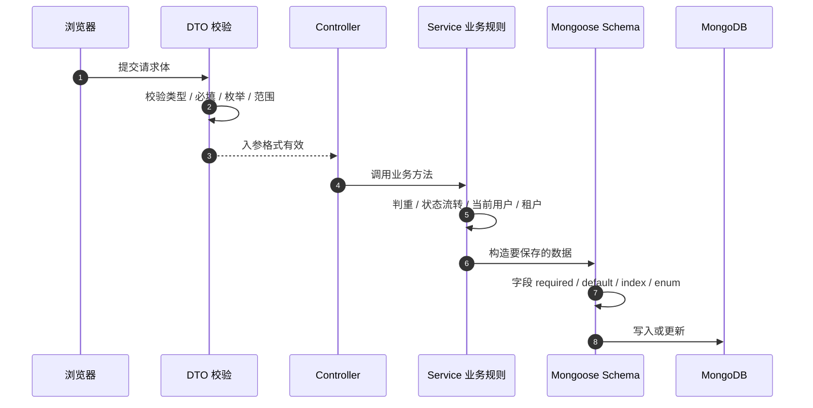
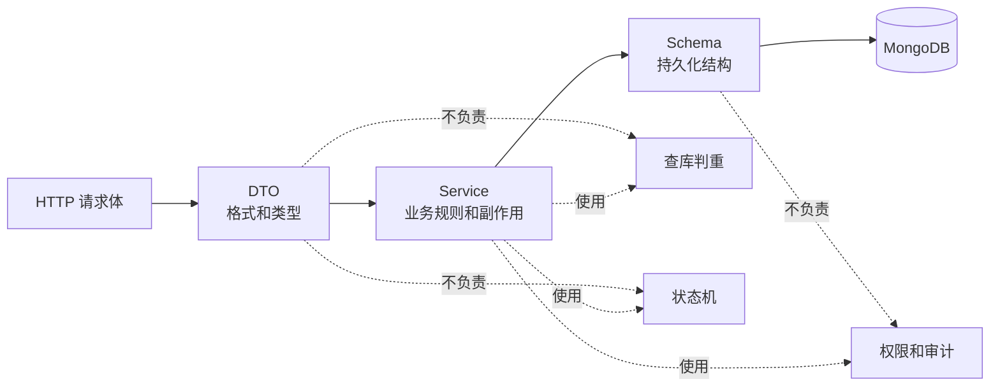

# DTO、Schema、业务规则为什么不能混在一起

## 一句话

DTO 管“这次请求长得对不对”，Schema 管“数据库里怎么存”，业务规则管“这件事能不能发生”。三者解决的问题不同，混在一起会让接口、数据和业务状态互相绑死，后续一改就连锁出错。

```text
DTO = HTTP 入参边界
Schema = 持久化数据结构
Service 业务规则 = 系统允许发生什么
```

## 当前项目里的三类代码

| 类型 | 当前文件 | 回答的问题 |
| --- | --- | --- |
| DTO | `apps/bff/src/commodity/dto/create-commodity.dto.ts` | 请求里的 `name/price/status` 类型和格式是否合法？ |
| Schema | `apps/server/src/mock-backend/schemas/commodity.schema.ts` | MongoDB 里商品字段、索引、默认值怎么存？ |
| 业务规则 | `apps/server/src/mock-backend/commodity-status-rules.ts` | 商品能不能从 `pending` 流转到目标状态？ |
| 业务执行 | `apps/server/src/mock-backend/commodity.service.ts` | 查当前商品、判重、校验状态机、写库。 |

## 图 1：一次写请求经过三层



这张图的关键是：DTO、Service、Schema 是顺序协作，不是互相替代。

## DTO 管什么

DTO 是 HTTP 入参合同。它最适合做“请求形状”校验：

```ts
export class CreateCommodityDto {
  @IsString()
  @IsNotEmpty()
  name!: string;

  @IsNumber()
  @Min(0.01)
  price!: number;

  @IsInt()
  @Min(0)
  stock!: number;

  @IsEnum(CreateCommodityStatus)
  status!: CreateCommodityStatus;
}
```

DTO 能回答：

```text
price 是不是数字？
stock 是不是非负整数？
status 是不是枚举值？
reason 有没有传？
pageSize 有没有超过 100？
```

DTO 不应该回答：

```text
商品名在这个租户下是否重复？
当前商品能不能从 offline 改成 on_sale？
当前用户有没有权限创建商品？
这个角色 code 在数据库里是否存在？
```

这些问题需要查数据库、查当前状态或查用户上下文，不是 DTO 的职责。

## Schema 管什么

Schema 是数据库持久化结构。当前商品 Schema：

```ts
@Schema({
  collection: "commodities",
  versionKey: false
})
export class Commodity {
  @Prop({ required: true, unique: true })
  id!: string;

  @Prop({ required: true, min: 0 })
  price!: number;

  @Prop({ enum: ["on_sale", "pending", "offline"], required: true })
  status!: "on_sale" | "pending" | "offline";

  @Prop({ default: "tenant_demo", required: true })
  tenantId!: string;
}
```

Schema 能回答：

```text
字段是否必填？
默认值是什么？
数据库字段类型是什么？
索引怎么建？
唯一约束怎么表达？
```

Schema 不应该承载复杂业务流程：

```text
pending 只能变 on_sale
on_sale 只能变 offline
删除商品必须写审计
创建商品必须带当前登录用户
operator 不能删除商品
```

因为这些规则经常需要上下文、审计、缓存失效、外部服务或多表查询。Schema 只能看到“这一条记录怎么存”，看不到完整业务动作。

## 业务规则管什么

业务规则放在 Service 或领域规则模块里。当前状态流转规则：

```ts
export const commodityStatusTransitionRules = [
  {
    from: "pending",
    to: "on_sale",
    message: "pending commodity can only be approved to on_sale"
  },
  {
    from: "on_sale",
    to: "offline",
    message: "on_sale commodity can only be taken offline"
  }
];
```

Backend Service 执行规则：

```ts
const transitionResult = validateCommodityStatusTransition(
  commodity.status,
  body.status
);

if (!transitionResult.ok) {
  return mockBusinessError(transitionResult.code, transitionResult.message);
}

commodity.status = body.status;
await commodity.save();
```

Service 能回答：

```text
当前记录存在吗？
当前租户能操作这条数据吗？
商品名是否重复？
当前状态是否允许变更到目标状态？
成功后要不要写审计、清缓存、发消息？
```

这些是“系统是否允许这件事发生”，不是“请求格式是否合法”。

## 图 2：三者边界



读图方式：

```text
DTO 先挡掉明显非法请求
Service 决定业务动作是否允许
Schema 保证落库结构稳定
```

## 为什么不能混在 DTO 里

如果把业务规则塞进 DTO，会有几个问题：

| 混法 | 问题 |
| --- | --- |
| DTO 查数据库判重 | DTO 从“请求结构”变成“业务服务”，测试和依赖都变复杂。 |
| DTO 校验状态流转 | DTO 只有目标状态，不一定知道数据库里的当前状态。 |
| DTO 校验权限 | DTO 不应该依赖 `currentUser`、角色、租户。 |
| DTO 写审计原因 | DTO 可以要求 `reason` 必填，但不能决定审计怎么落库。 |

例如 `UpdateCommodityStatusDto` 可以要求：

```text
status 是合法枚举
reason 非空
```

但不能只靠 DTO 判断：

```text
pending -> on_sale 是否允许
offline -> on_sale 是否允许
```

因为这个判断必须先查当前商品状态。

## 为什么不能混在 Schema 里

Schema 可以写：

```ts
@Prop({ enum: ["on_sale", "pending", "offline"], required: true })
status!: "on_sale" | "pending" | "offline";
```

这只能保证：

```text
最终保存的 status 是三个值之一
```

不能保证：

```text
这次状态变化路径是合法的
```

如果只靠 Schema，下面这种非法业务动作仍可能通过“字段合法”检查：

```text
offline -> on_sale
```

因为 `on_sale` 本身是合法枚举，但这条状态边不一定合法。

Schema 也不适合做审计：

```text
谁操作的？
为什么操作？
before / after 是什么？
traceId 是多少？
缓存要不要失效？
```

这些都属于一次业务动作，不属于单条数据结构。

## 为什么不能混在 Controller 里

Controller 是 HTTP 边界。它应该薄：

```text
接路由
拿 DTO
拿 currentUser
调用 Service
返回结果
```

如果 Controller 写业务规则，会导致：

```text
HTTP 接口能校验
但脚本、队列、内部任务绕过 Controller 就失效
```

例如未来有批量审核任务：

```text
批量审核脚本 -> CommodityService
```

如果状态机只写在 Controller，这个脚本就可能绕过规则。

## 当前项目里的好边界

### 商品创建

DTO 校验：

```text
name 必填
price > 0
stock >= 0
status 是合法枚举
```

Service 校验：

```text
createdBy 必须来自 BFF 当前用户
同租户商品名不能重复
生成 id / createdAt / updatedAt
写入 MongoDB
```

Schema 约束：

```text
id 唯一
tenantId + name 唯一索引
status enum
price / stock 非负
```

### 商品状态变更

DTO 校验：

```text
status 是目标枚举
reason 非空
```

Service 校验：

```text
商品存在
当前状态到目标状态是否合法
保存新状态
BFF 写审计和清缓存
```

Schema 约束：

```text
status 最终只能是 on_sale / pending / offline
updatedAt 是 Date
```

### 用户绑定角色

DTO 校验：

```text
roles 是非空字符串数组
reason 非空
```

Service 校验：

```text
这些 role code 是否真的存在
用户是否存在
是否允许变更
```

Schema 约束：

```text
roles 是 string 数组
username 唯一
```

## 真实复杂系统里的后果

如果三者混在一起，复杂系统很快会出问题：

| 混乱方式 | 真实后果 |
| --- | --- |
| DTO 里查库 | 请求校验层依赖数据库，单测重、复用差、性能不可控。 |
| Schema 里堆业务 | 数据模型变成业务流程引擎，难以处理审计、权限、外部依赖。 |
| Controller 写规则 | Web 接口有规则，异步任务、脚本、内部调用没有规则。 |
| 前端复制规则 | 页面看起来限制了，手工请求仍能越权或非法变更。 |
| 多处重复规则 | A 入口允许，B 入口拒绝，线上出现口径不一致。 |

核心风险是：

```text
规则不再只有一个可信来源
```

## 怎么判断一段逻辑应该放哪里

| 问题 | 放哪里 |
| --- | --- |
| 请求字段是不是字符串、数字、枚举、必填 | DTO |
| query 参数怎么转数字、分页最大值是多少 | DTO |
| 数据库字段、默认值、索引、唯一约束 | Schema |
| 当前用户能不能做这件事 | Guard / Service |
| 当前状态能不能变成目标状态 | Service / 领域规则 |
| 是否需要写审计、清缓存、发消息 | Service |
| 最终响应格式怎么统一 | Interceptor / Filter |

## 测试应该怎么分

| 测试对象 | 重点 |
| --- | --- |
| DTO / e2e | 非法请求是否在进入 Service 前返回 `400`。 |
| Service 单测 | 业务规则、审计、缓存、外部调用是否正确。 |
| Schema / 集成测试 | 索引、默认值、持久化结构是否符合预期。 |
| e2e | Guard、Pipe、Controller、Interceptor、Filter 的完整链路。 |

当前项目里已有类似思路：

```text
缺 reason -> 400，BFF Service 不执行
缺权限 -> 403，业务 Service 不执行
成功状态变更 -> Service 写审计并清缓存
```

## 最小原则

| 原则 | 说明 |
| --- | --- |
| DTO 不查库 | DTO 只做请求结构校验。 |
| Schema 不写流程 | Schema 只描述数据怎么存。 |
| Service 管业务事实 | 状态机、判重、审计、缓存失效都放业务层。 |
| Controller 保持薄 | 接请求，调 Service，不承载核心业务规则。 |
| 规则只有一个可信来源 | 前端可以复制规则做体验，但服务端 Service 必须兜底。 |

## 最后复述

DTO、Schema、业务规则不能混在一起，是因为它们分别站在不同边界：DTO 保护 HTTP 入参，Schema 保护数据库结构，Service 保护业务事实。当前商品状态变更就是典型例子：DTO 只能确认 `status/reason` 合法，Schema 只能确认最终 `status` 是枚举值，真正能不能从当前状态变到目标状态，必须由 Service 根据数据库里的当前商品统一判断。
