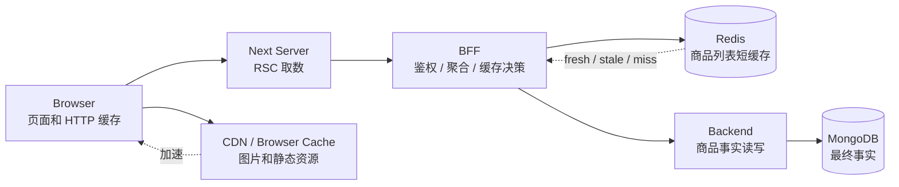
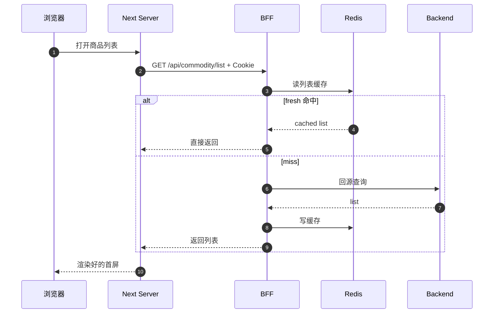
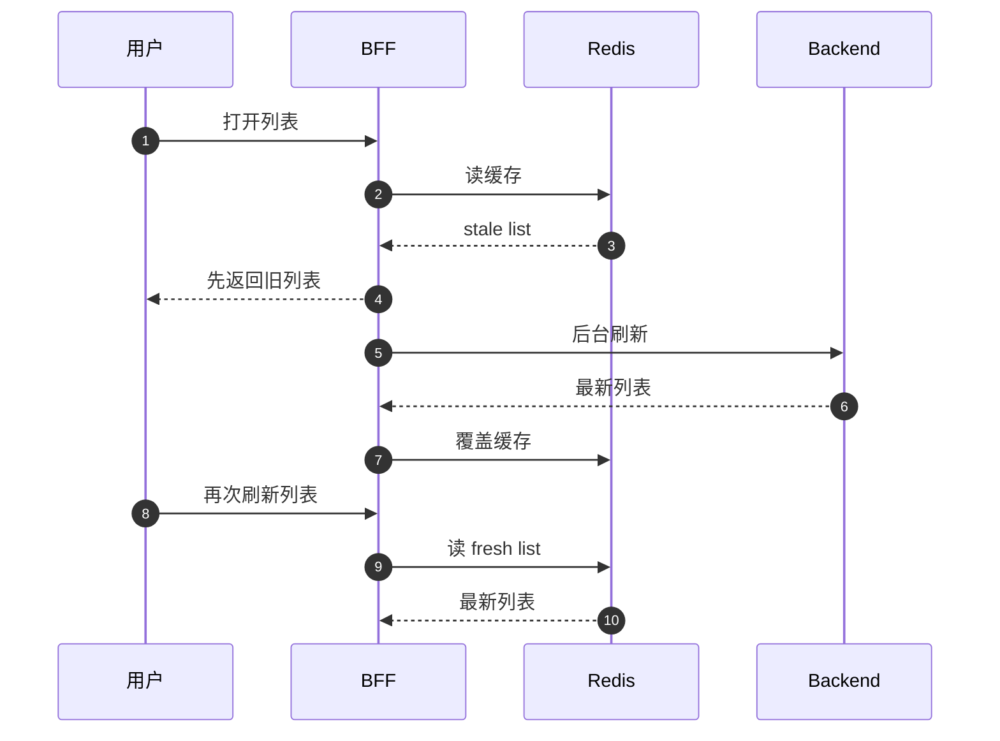
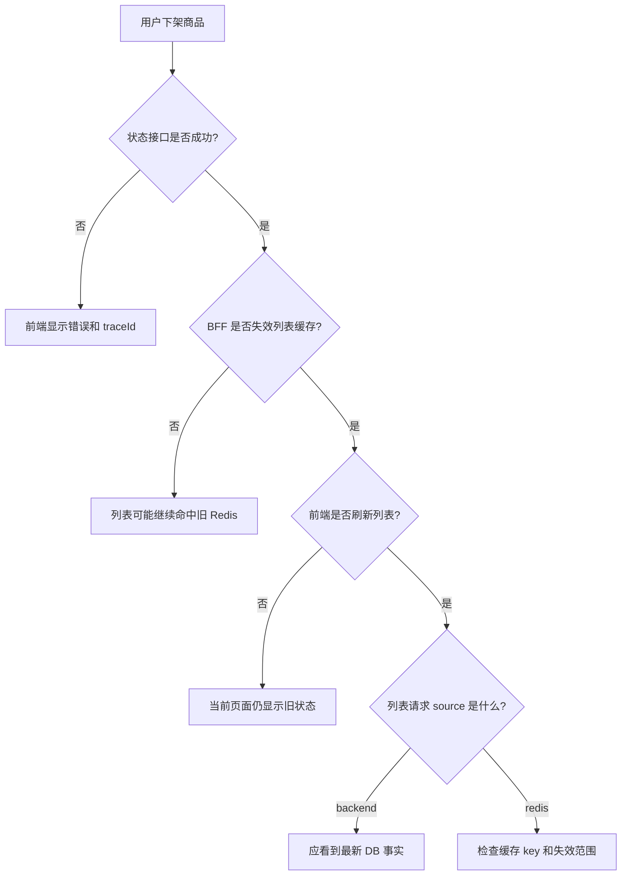

# 复杂缓存体系对前端体验的影响

## 一句话

复杂缓存体系会直接改变用户看到页面的速度、是否看到旧数据、写操作后多久刷新、错误时有没有兜底；前端不能只问“接口有没有调”，还要判断数据来自 Browser、Next、BFF Redis、CDN 还是 DB。

```text
缓存命中 = 更快
缓存过期 = 可能短暂旧数据
缓存失效 = 写后尽快看到新数据
缓存异常 = 页面要能降级和重试
```

## 当前项目里的缓存层级



用户感知不是某一层单独决定的，而是这几层叠加后的结果。

## 体验影响总览

| 缓存层 | 对用户的好处 | 可能的问题 | 当前项目策略 |
| --- | --- | --- | --- |
| Browser / CDN 静态缓存 | JS、CSS、图片更快加载。 | 资源更新后可能看到旧图或旧静态资源。 | 静态资源用 hash；图片用签名 URL、版本化、缓存头。 |
| Next Server Component | 首屏直接带数据，减少浏览器 loading。 | DevTools 里看不到服务端内部请求，排障容易误判。 | `serverApiRequest()` 统一 `no-store` 和 Cookie 透传。 |
| BFF Redis 列表缓存 | 商品列表更快，降低 backend 压力。 | fresh/stale 阶段可能短暂看到旧列表。 | fresh 5s、stale 30s；写操作后主动失效。 |
| 权限和当前用户 | 减少越权展示风险。 | 如果缓存错了，会长期显示不该看的入口。 | 不做公共长缓存，按请求重新判断。 |
| 审计日志 | 保证追责和排障可信。 | 缓存会让日志看起来缺失或延迟。 | 不缓存可信审计查询。 |

## 图 1：商品列表为什么会快



用户看到的是同一个商品列表页面，但背后有两种体验：

```text
fresh 命中：快，backend 和 DB 压力小
miss 回源：慢一些，但拿到最终事实
```

## 图 2：为什么可能短暂看到旧数据



`stale` 的目标不是保证绝对最新，而是在 backend 抖动或热点 key 过期时，先让用户看到可用页面。

这会带来体验取舍：

```text
优点：页面不容易卡住
代价：用户可能短时间看到旧列表
```

## 写操作后的体验

当前商品写操作包括：

```text
创建
编辑
状态变更
删除
恢复
```

BFF Service 在这些操作成功后都会执行：

```text
invalidateCommodityList()
```

所以前端写成功后再刷新页面，应该尽快看到新列表。

删除商品的前端体验是：

```ts
await deleteCommodity(commodityId, { reason });
router.push("/present/commodity/list");
router.refresh();
```

这里有两件事：

```text
BFF 删除 Redis 列表缓存
前端跳回列表并触发重新取数
```

如果只做 `router.refresh()`，但 BFF 没有失效缓存，用户仍可能看到旧列表。  
如果只失效缓存，但前端页面不刷新，用户当前屏幕也可能还停留在旧状态。

## 复杂缓存对前端状态的影响

| 用户现象 | 可能原因 | 前端应该怎么处理 |
| --- | --- | --- |
| 首屏快 | BFF Redis fresh 命中，或图片/静态资源命中缓存。 | 保持稳定布局，减少跳动。 |
| 首屏慢 | Redis miss、backend 慢、DB 查询慢、缓存预热不足。 | 显示 loading/skeleton，不让页面空白。 |
| 写完列表没变 | 页面没刷新，或缓存没失效，或 DB 事实没变。 | 写成功后 `router.refresh()`，并用 traceId 排查。 |
| 看到短暂旧数据 | stale 返回旧值并后台刷新。 | 关键操作后主动刷新；必要时展示“数据可能正在刷新”。 |
| 图片还是旧的 | 图片 URL 没版本化，Browser/CDN 命中旧资源。 | 换图后使用新 fileId、版本参数或新 URL。 |
| 权限菜单不对 | 当前用户或权限被错误缓存。 | 权限数据不要公共长缓存，重新请求当前用户。 |
| 列表偶发失败 | Redis 或 backend 抖动。 | error boundary 展示重试、清筛选、traceId。 |

## 当前项目已有的前端兜底

### Loading

商品列表有专门的 loading UI：

```text
apps/client/app/present/commodity/list/loading.tsx
```

用户看到：

```text
商品列表加载中
skeleton-list
```

这解决的是：

```text
缓存 miss 或 backend 慢时，页面不要空白
```

### Error Boundary

商品列表错误页：

```text
apps/client/app/present/commodity/list/error.tsx
```

提供：

```text
错误信息
traceId
重新加载
清空筛选
返回登录页
```

这解决的是：

```text
缓存、查询、权限、后端错误发生时，用户知道怎么恢复，研发知道怎么查日志
```

### Empty State

商品列表为空时显示空状态：

```text
当前筛选条件没有匹配结果
```

这要和缓存错误区分：

```text
空列表 = 请求成功，数据为空
错误页 = 请求失败
旧列表 = 请求成功，但数据可能来自 stale
```

## 前端为什么要看缓存响应头

商品列表响应会带排障 header：

```text
X-Cache-Layer: bff-redis
X-Commodity-List-Cache-State: fresh / stale / miss
X-Commodity-List-Cache-Source: redis / backend
X-Commodity-List-Cache-Refresh: none / background
X-Commodity-List-Cache-Key: cache hash
```

这些 header 不给普通用户看，但对排障很重要：

| Header 现象 | 说明 |
| --- | --- |
| `state=fresh source=redis` | 页面快，来自新鲜缓存。 |
| `state=stale source=redis refresh=background` | 先返回旧数据，后台刷新中。 |
| `state=miss source=backend` | 本次回源，可能慢一些。 |
| 没有这些 header | 请求可能没有到 BFF 商品列表接口。 |

所以排查旧数据时，不要只看页面；要看 Network、headers 和 traceId。

## 哪些数据不能为了体验随便缓存

复杂缓存体系最容易犯的错是：为了“快”，把高风险数据也缓存太久。

| 数据 | 为什么不能长缓存 |
| --- | --- |
| 当前用户 | 用户禁用、角色变更后必须尽快生效。 |
| 权限菜单 | 旧权限会导致越权入口长期可见。 |
| 审计日志 | 审计用于追责，不能让用户以为操作没发生。 |
| 写操作结果 | 创建、删除、状态变更必须以 DB 事实为准。 |
| CSRF / session | 认证安全数据不能被公共缓存共享。 |

当前策略是：

```text
静态资源和图片可以积极缓存
商品列表可以短缓存
权限、审计、登录态要谨慎缓存
```

## 真实场景：状态已变但列表没变



这个场景要分清两件事：

```text
服务端事实是否变了
前端屏幕是否重新取数了
```

缓存系统只解决读取性能，不会自动替前端更新所有已经渲染的 DOM。

## 复杂缓存带来的产品取舍

| 取舍 | 用户体验收益 | 工程代价 |
| --- | --- | --- |
| 短缓存商品列表 | 列表更快，峰值更稳。 | 需要处理写后失效和旧数据排查。 |
| stale 返回旧值 | 后端抖动时页面仍可用。 | 用户可能短时间看到旧数据。 |
| 静态资源长缓存 | 页面资源加载快。 | 需要 hash 或版本化避免旧资源。 |
| 图片 CDN 缓存 | 图片打开快，源站压力低。 | 换图必须换 URL 或版本。 |
| 权限不长缓存 | 安全和一致性更好。 | 每次页面请求会多一次权限判断。 |
| Error Boundary | 错误可恢复、可排查。 | 前端要设计清楚 loading、empty、error。 |

## 前端设计原则

| 原则 | 说明 |
| --- | --- |
| 区分 loading / empty / error / stale | 这四种状态给用户的含义不同。 |
| 写成功后主动刷新 | `router.refresh()` 让 Server Component 重新取数。 |
| 不把当前页面状态当 DB 事实 | 页面显示可能来自缓存或旧 render。 |
| 展示 traceId | 用户报错时能让研发查到 BFF/backend 日志。 |
| 不缓存高风险数据 | 当前用户、权限、审计、认证数据优先可信。 |
| 用 header 判断来源 | 旧数据问题要看 `source/state/refresh`。 |

## 和已有文档的关系

| 文档 | 重点 |
| --- | --- |
| `docs/22-多层缓存设计.md` | 缓存放在哪层、TTL、stale、失效策略。 |
| `docs/23-缓存问题排障.md` | 旧数据、traceId、header、穿透/击穿/雪崩排查。 |
| 本文 | 缓存如何影响用户看到的速度、旧数据、刷新、loading、error 和权限体验。 |

## 最后复述

复杂缓存体系对前端体验的影响不是只有“更快”。它还会带来旧数据、刷新时机、错误兜底、权限一致性和排障复杂度。当前项目的原则是：静态资源和图片积极缓存，商品列表做 BFF Redis 短缓存并写后失效，权限、审计、当前用户保持谨慎；前端用 loading、error boundary、traceId、`router.refresh()` 和缓存 header 把这些取舍变成可理解、可恢复的用户体验。
