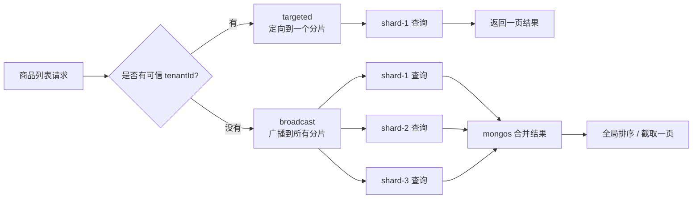
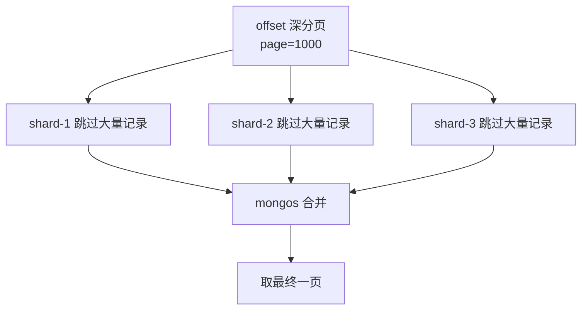
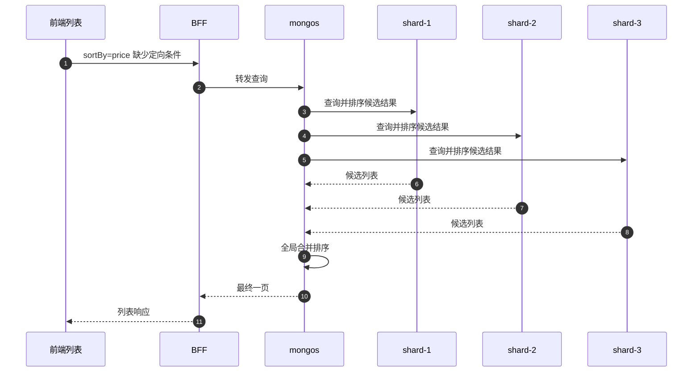

# MongoDB 分片对列表、分页、排序的影响

## 一句话

MongoDB 分片后，列表查询不再只是“查一页数据”；它会先决定请求去哪几个分片，再在分片内过滤、排序、分页，最后可能还要合并结果。带 shard key 的查询便宜，深 offset 和跨分片全局排序最贵。

```text
列表 = 路由到分片 + 过滤 + 排序 + 分页 + 合并
```

## 当前项目里的核心变量

当前商品列表请求看起来是前端 URL：

```text
/present/commodity/list?page=1&pageSize=10&status=on_sale&sortBy=createdAt&sortOrder=desc
```

BFF 会转换成 backend 查询：

```text
limit=10
offset=0
status=on_sale
sortField=createdAt
sortDirection=desc
```

同时 BFF 从登录态注入可信租户：

```text
x-tenant-id: tenant_demo
```

backend 再组装 MongoDB 查询：

```ts
filters = {
  tenantId: "tenant_demo",
  deletedAt: null,
  status: "on_sale"
};

sort = {
  createdAt: -1,
  id: -1
};
```

这里的 `tenantId` 就是理解分片影响的核心。

## 图 1：带 shard key 和不带 shard key 的区别



前端不直接配置分片，但前端设计会影响是否容易带上 shard key。

当前项目的正确做法是：

```text
前端不传 tenantId
BFF 从 session 的 AuthUser.tenantId 注入 x-tenant-id
backend 用 tenantId 过滤和生成 sharding 信息
```

这样避免用户通过 URL 伪造别的租户。

## 对列表的影响

### 1. 普通租户列表

有 `tenantId`：

```text
只查当前租户所在分片
扫描范围小
响应更稳定
缓存 key 也能按租户隔离
```

当前商品索引也围绕这个设计：

```ts
{ tenantId: 1, deletedAt: 1, createdAt: -1, id: -1 }
{ tenantId: 1, deletedAt: 1, status: 1, createdAt: -1, id: -1 }
```

### 2. 全局列表

没有 `tenantId` 或者故意做全局后台查询：

```text
多个分片都要查
结果要合并
排序和分页更贵
接口抖动更明显
```

所以真实系统里，全局列表通常要谨慎：

```text
限制筛选条件
限制时间范围
限制 pageSize
优先 cursor
必要时走离线报表或搜索服务
```

## 对分页的影响

### offset 分页

当前 BFF 会把页码转换成 offset：

```ts
offset = (query.page - 1) * query.pageSize;
```

例如：

```text
page=1000&pageSize=20
offset=19980
```

这意味着数据库要跳过前面 19980 条再取 20 条。单分片已经有成本；跨分片时，多个分片可能都要跳过、排序、返回候选结果，再由路由层合并。



用户感知：

```text
第一页快
越往后翻越慢
某些页偶发超时
```

### cursor 分页

cursor 分页不是跳到第 N 页，而是说：

```text
从上一页最后一条之后继续取
```

当前 backend 用：

```text
createdAt + id
```

生成下一页 cursor。前端分页组件会优先使用 `pagination.nextCursor`：

```ts
cursor: nextCursor,
page: currentPage + 1
```

cursor 的好处：

```text
不用跳过大量历史记录
适合继续加载、下一页、时间流列表
分片下更稳定
```

cursor 的限制：

```text
不适合随意跳到第 1000 页
必须绑定稳定排序字段
当前项目只支持 createdAt 排序下使用 cursor
```

## 对排序的影响

排序最关键的问题是：

```text
排序字段能不能和查询条件一起走索引？
```

当前最稳的排序路径是：

```text
tenantId + deletedAt + createdAt + id
tenantId + deletedAt + status + createdAt + id
```

也就是默认按创建时间排序，或状态筛选后按创建时间排序。

如果前端选择：

```text
sortBy=price
sortBy=stock
sortBy=name
```

当前 queryPlan 会把它标记成不在主索引路径：

```text
unsupportedFilters: ["sort:price"]
costLevel: medium / high
```

这不代表不能查，而是代表规模变大后可能更慢。

## 图 2：排序和分片合并



这种全局排序会比“带 tenantId 的 createdAt 排序”更贵。

## 当前项目如何暴露影响

商品列表响应里有两个排障对象：

```text
sharding
queryPlan
```

页面上也展示：

```text
查询路由
分片
租户标识
候选索引
查询成本
未覆盖条件
```

BFF 同时写响应 header：

```text
X-Commodity-List-Routing-Mode
X-Commodity-List-Shard-Name
X-Commodity-List-Candidate-Index
X-Commodity-List-Query-Cost
X-Commodity-List-Unsupported-Filters
```

排障时可以这样读：

| 现象 | 说明 |
| --- | --- |
| `routingMode=targeted` | 有 shard key，查询定向到某个分片。 |
| `routingMode=broadcast` | 缺少 shard key，可能跨分片查询。 |
| `costLevel=low` | 当前筛选、排序、分页比较贴合索引。 |
| `costLevel=high` | 可能是跨分片、深 offset 或多个未覆盖筛选。 |
| `unsupportedFilters` 包含 `sort:price` | 价格排序不是当前主索引路径。 |
| `offset >= 1000` | 深分页，建议考虑 cursor。 |

## 列表、分页、排序的设计建议

| 设计点 | 推荐做法 | 原因 |
| --- | --- | --- |
| 租户列表 | BFF 注入 `tenantId`，前端不要自己传。 | 保证定向分片和租户隔离。 |
| 默认排序 | 使用 `createdAt + id` 稳定排序。 | 适合索引和 cursor，避免重复/漏数据。 |
| 状态 tab | `status + createdAt + id`。 | 状态筛选后仍能按时间稳定分页。 |
| 深分页 | 避免大页码跳转，优先下一页/cursor。 | offset 在分片下成本放大。 |
| 全局搜索 | 限制条件或走专门搜索服务。 | 跨分片搜索和排序成本高。 |
| 任意字段排序 | 产品上谨慎开放。 | 每个排序字段都可能需要索引和代价评估。 |
| 大 pageSize | 限制最大值。 | 单次跨分片合并结果越多越慢。 |

## 前端应该怎么感知

前端不需要知道 MongoDB 怎么迁移 chunk，但要知道这些页面表现意味着什么：

| 页面表现 | 可能原因 |
| --- | --- |
| 第一页快，深页慢 | offset 跳过成本增加。 |
| 某个租户慢，其他租户正常 | 热点租户或热点分片。 |
| 按 createdAt 快，按 price 慢 | price 排序没有匹配主索引。 |
| 带状态筛选快，关键词搜索慢 | status 有索引路径，keyword 正则未优化。 |
| 偶发超时 | 分片迁移、广播查询、缓存 miss 同时回源。 |

前端报问题时，至少带上：

```text
traceId
page / pageSize / cursor
sortBy / sortOrder
status / keyword / price / stock
routingMode / shardName
candidateIndex / costLevel
```

## 和缓存的关系

分片影响回源成本，缓存影响回源频率。

```text
Redis fresh 命中：用户快，看不到分片成本
Redis miss：请求回源，分片、索引、排序成本暴露出来
Redis stale：用户先看到旧数据，后台刷新承担回源成本
```

所以一个列表接口上线前，要同时考虑：

```text
有没有合适索引
有没有 shard key
分页是否会深翻
缓存 miss 时 DB 是否扛得住
```

## 最小原则

| 原则 | 说明 |
| --- | --- |
| shard key 要可信注入 | 当前系统由 BFF 从 session 注入 `tenantId`。 |
| 默认排序要稳定 | 使用 `createdAt + id`，避免分页重复或漏数据。 |
| 深分页优先 cursor | offset 深页在分片下成本更高。 |
| 全局排序要谨慎 | 缺 shard key 时会广播查询并合并排序。 |
| 新筛选/排序先看 queryPlan | 看 `candidateIndex`、`costLevel`、`unsupportedFilters`。 |
| 前端要带 traceId 排障 | 不要只说“列表慢”，要带 query、page、sort、shard 信息。 |

## 最后复述

MongoDB 分片对列表、分页、排序的影响，本质是查询成本被放大了：没有 shard key 会跨分片，深 offset 会让每个分片跳过大量数据，全局排序会让多个分片先各自排序再合并。当前项目通过 BFF 注入 `tenantId`、默认 `createdAt + id` 稳定排序、预留 cursor、暴露 `sharding/queryPlan/header`，让前端能设计更稳的列表，也能在慢查询时说清楚问题发生在哪一层。
