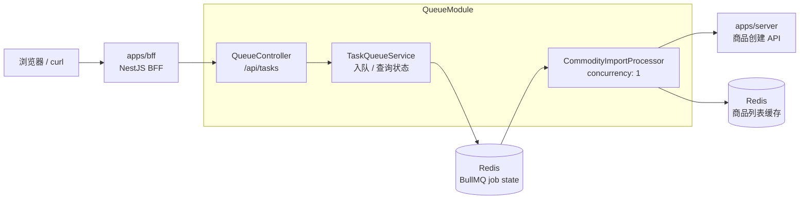
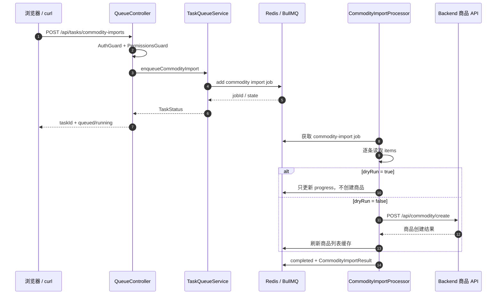
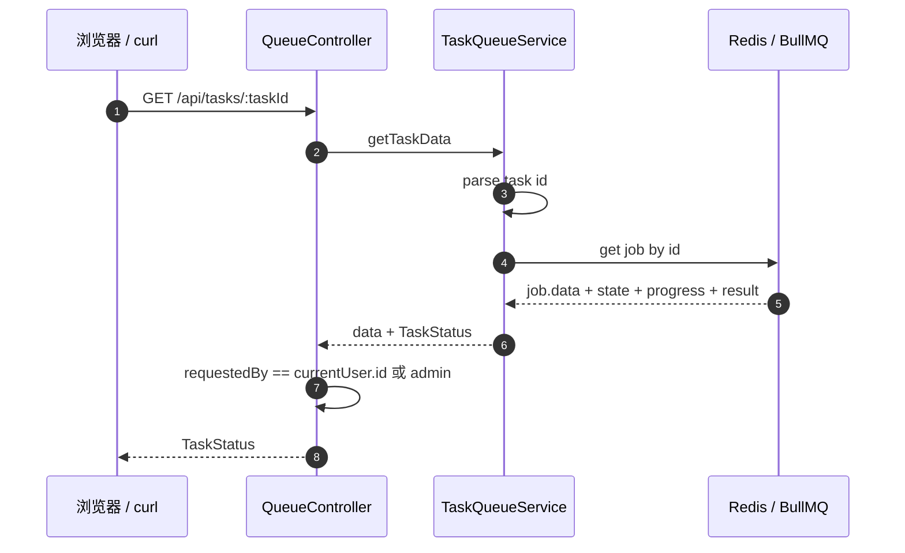
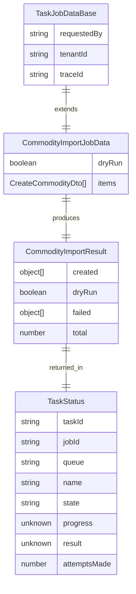
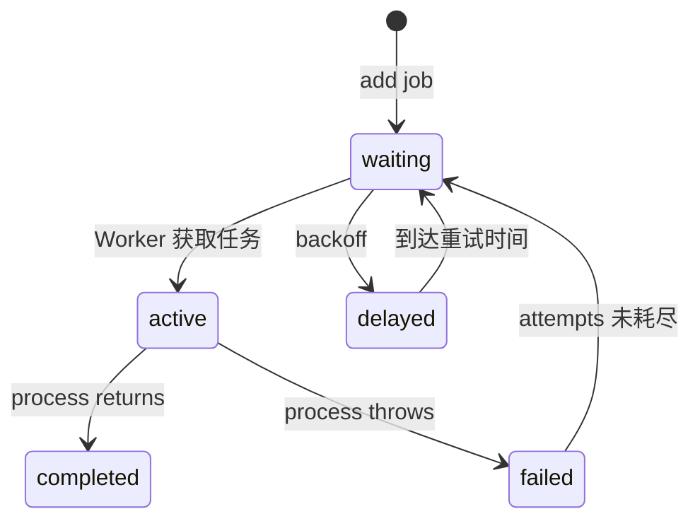

# BullMQ 商品异步导入队列图解

## 一句话

当前 `QueueModule` 只保留商品批量导入这一类异步任务：BFF 接收导入请求后把任务写入 BullMQ/Redis，`CommodityImportProcessor` 后台消费任务，前端通过 `taskId` 查询进度和结果。

```text
POST /api/tasks/commodity-imports = 提交商品导入任务
GET  /api/tasks/:taskId          = 查询商品导入任务状态
```

## 本次 MVP 范围

| 能力 | 当前是否保留 | 说明 |
| --- | --- | --- |
| 商品批量导入异步任务 | 是 | 保留 `commodity-import` 队列和 `CommodityImportProcessor` |
| 图片异步处理 | 否 | 上传接口只负责上传，不再自动投递图片处理任务 |
| 审计日志导出 | 否 | 不再暴露 `audit-export` 队列和任务接口 |

这个版本的目标是先把 BullMQ 的核心闭环压到最小：

```text
一个队列
一个提交接口
一个 Processor
一个任务查询接口
```

## 当前代码范围

| 文件 | 职责 |
| --- | --- |
| `apps/bff/src/app.module.ts` | 接入 `QueueModule` |
| `apps/bff/src/queue/queue.module.ts` | 配置 BullMQ、Redis 连接、注册 `commodity-import` 队列 |
| `apps/bff/src/queue/queue.constants.ts` | 只保留商品导入队列名和 job 名 |
| `apps/bff/src/queue/queue.types.ts` | 定义商品导入 job payload、结果和统一任务状态 |
| `apps/bff/src/queue/queue.controller.ts` | 暴露商品导入任务提交和任务查询 API |
| `apps/bff/src/queue/task-queue.service.ts` | 封装入队、`taskId`、任务状态查询和状态映射 |
| `apps/bff/src/queue/processors/commodity-import.processor.ts` | 后台消费商品导入任务 |
| `apps/bff/src/queue/dto/create-commodity-import-task.dto.ts` | 校验商品导入请求体 |
| `apps/bff/src/queue/task-queue.service.spec.ts` | 覆盖任务 ID 和状态映射 |

## 系统边界



边界说明：

| 模块 | 职责 |
| --- | --- |
| `QueueController` | 校验登录、权限和任务归属；暴露 HTTP API |
| `TaskQueueService` | 把商品导入请求变成 BullMQ job；把 BullMQ 状态映射成业务状态 |
| Redis / BullMQ | 保存 job、调度状态、记录 progress/result/failedReason |
| `CommodityImportProcessor` | 后台逐条处理商品导入，必要时调用 Backend 创建商品 |
| Backend | 负责真正的商品创建业务能力 |

## 提交流程



## 查询流程



`taskId` 使用 `queueName:jobId` 格式，例如：

```text
commodity-import:0a4d9a6d-...
```

这样查询时可以先确认队列名合法，再去对应队列查 job。

## 数据结构



关键字段：

| 字段 | 作用 |
| --- | --- |
| `requestedBy` | 查询任务时做归属校验；Processor 调 Backend 时透传用户身份 |
| `tenantId` | 商品创建时透传租户边界 |
| `traceId` | 串联 HTTP 请求、队列任务和 Backend 请求 |
| `dryRun` | 只预演导入，不真正创建商品 |
| `items` | 要导入的商品列表，最大 200 条 |

## Worker 可控点

当前商品导入 Processor：

```ts
@Processor(COMMODITY_IMPORT_QUEUE, { concurrency: 1 })
```

含义是：

```text
无论瞬间提交多少商品导入任务，同一个 Worker 实例一次只处理 1 个 commodity-import job。
```

这个设计先保守控制写入压力，避免批量导入同时打到 Backend 和缓存。

| 控制点 | 当前值 |
| --- | --- |
| 队列 | `commodity-import` |
| Job 名 | `commodity.import` |
| Worker 并发 | `1` |
| 重试次数 | `attempts: 2` |
| 重试退避 | `exponential`, `delay: 1000` |
| 完成任务保留 | 1 天或 1000 条 |
| 失败任务保留 | 7 天或 5000 条 |

## 状态流转



当前对外状态映射：

| BullMQ state | API state |
| --- | --- |
| `active` | `running` |
| `waiting` / `waiting-children` / `prioritized` / `paused` | `queued` |
| `completed` | `completed` |
| `delayed` | `delayed` |
| `failed` | `failed` |
| 其他 | `unknown` |

## 最小验证

单测：

```bash
pnpm test:bff -- task-queue.service.spec.ts
```

curl 脚本：

```bash
pnpm dev:all
./scripts/test-bullmq-queue-curl.sh
```

脚本会执行：

```text
获取 CSRF
登录 admin
提交 commodity-import dryRun 任务
轮询 GET /api/tasks/:taskId
等待 completed 或 failed
```

## 生产扩展方向

当前版本是商品异步导入 MVP。后续如果导入量变大，需要补：

| 方向 | 说明 |
| --- | --- |
| 幂等性 | 同一个导入文件或同一批商品重复执行时不能产生重复脏数据 |
| 结果存储 | 大批量导入结果不宜长期放 Redis，可落库或对象存储 |
| 导入审计 | 记录谁导入、导入多少、失败多少、失败原因 |
| Worker 独立部署 | 高负载时把 API 和 Worker 拆成不同进程 |
| 告警和重放 | 多次失败后告警，并支持人工重试 |
