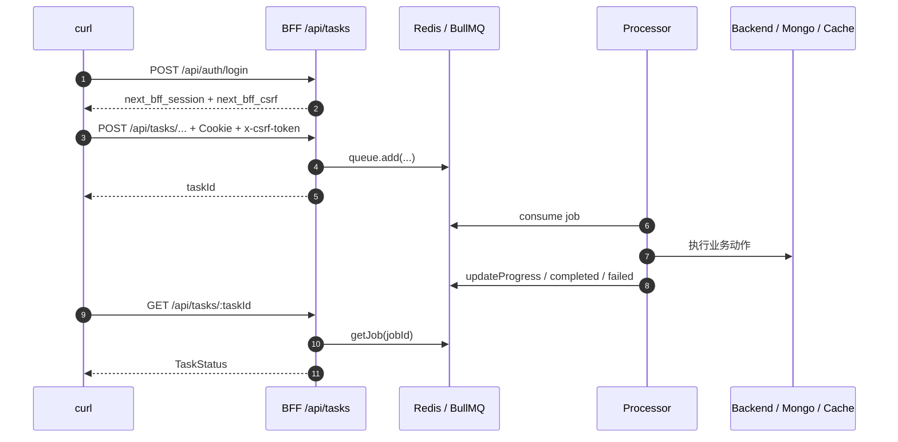

# BullMQ 异步任务 curl 测试操作

## 目标

用 `curl` 模拟浏览器调用 BFF 的异步任务接口，验证当前 `QueueModule` 是否能完成：

```text
登录 -> 获取 Cookie / CSRF -> 提交 BullMQ 任务 -> 查询任务状态 -> 观察 completed / failed
```

当前 `apps/client/next.config.ts` 还没有代理 `/api/tasks/*`，所以任务测试直接访问 BFF 端口：

```text
http://127.0.0.1:3001
```

## 前置条件

在仓库根目录启动完整本地服务：

```bash
pnpm dev:all
```

启动成功后应有：

```text
client: http://localhost:3000
bff:    http://localhost:3001
server: http://localhost:3002
mongo:  mongodb://127.0.0.1:27017/next-bff-dev
redis:  redis://127.0.0.1:6379
```

测试账号：

```text
username: admin
password: admin123
```

## 快速脚本

如果只想快速验证默认的商品导入 dryRun 队列闭环，可以直接运行：

```bash
bash scripts/test-bullmq-queue-curl.sh
```

脚本默认会访问：

```text
BFF_URL=http://127.0.0.1:3001
COOKIE_FILE=/tmp/next-bff-auth.cookie
USERNAME=admin
PASSWORD=admin123
```

也可以临时覆盖：

```bash
BFF_URL=http://127.0.0.1:3001 \
COOKIE_FILE=/tmp/next-bff-auth.cookie \
USERNAME=admin \
PASSWORD=admin123 \
bash scripts/test-bullmq-queue-curl.sh
```

下面的步骤是脚本背后做的具体操作，适合手动排查。

## 1. 设置基础变量

```bash
BFF=http://127.0.0.1:3001
COOKIE=/tmp/next-bff-auth.cookie
```

`COOKIE` 文件用于保存 BFF 返回的：

```text
next_bff_session
next_bff_csrf
```

## 2. 获取 CSRF Token

BFF 对非 GET 请求启用了 CSRF 校验。先访问 `/api/auth/csrf`，拿到 cookie 和响应体里的 token。

```bash
CSRF=$(curl -s -c "$COOKIE" "$BFF/api/auth/csrf" \
  | sed -n 's/.*"csrfToken":"\([^"]*\)".*/\1/p')

echo "$CSRF"
```

如果这里输出为空，先检查 BFF 是否启动：

```bash
curl -i "$BFF/"
```

## 3. 登录并保存 Session Cookie

```bash
curl -i \
  -b "$COOKIE" \
  -c "$COOKIE" \
  -H "Content-Type: application/json" \
  -H "x-csrf-token: $CSRF" \
  -d '{"username":"admin","password":"admin123"}' \
  "$BFF/api/auth/login"
```

成功时响应头里会有：

```text
Set-Cookie: next_bff_session=...
Set-Cookie: next_bff_csrf=...
```

登录后建议重新获取一次 CSRF，避免继续使用旧 token：

```bash
CSRF=$(curl -s -b "$COOKIE" -c "$COOKIE" "$BFF/api/auth/csrf" \
  | sed -n 's/.*"csrfToken":"\([^"]*\)".*/\1/p')
```

确认登录态：

```bash
curl -s \
  -b "$COOKIE" \
  "$BFF/api/auth/me"
```

## 4. 提交商品批量导入 dryRun 任务

推荐先测 `dryRun: true`，因为它会走队列、校验 DTO、更新进度和返回结果，但不会真正创建商品。

```bash
TASK_ID=$(curl -s \
  -b "$COOKIE" \
  -H "Content-Type: application/json" \
  -H "x-csrf-token: $CSRF" \
  -d '{
    "dryRun": true,
    "items": [
      {
        "name": "curl BullMQ 测试商品",
        "price": 99.9,
        "stock": 10,
        "status": "pending",
        "description": "用 curl 模拟商品批量导入任务"
      }
    ]
  }' \
  "$BFF/api/tasks/commodity-imports" \
  | tee /tmp/next-bff-task.json \
  | sed -n 's/.*"taskId":"\([^"]*\)".*/\1/p')

echo "$TASK_ID"
```

成功时 `TASK_ID` 类似：

```text
commodity-import:0a4d9a6d-...
```

响应体会被保存到：

```text
/tmp/next-bff-task.json
```

## 5. 查询任务状态

```bash
curl -s \
  -b "$COOKIE" \
  "$BFF/api/tasks/$TASK_ID"
```

可能看到的状态：

| state | 含义 |
| --- | --- |
| `queued` | job 已写入 Redis，等待 Processor 消费 |
| `running` | Processor 已拿到 job，正在执行 |
| `completed` | 任务成功完成 |
| `failed` | 任务失败，查看 `failedReason` |
| `delayed` | job 处于延迟或退避等待中 |

如果想连续观察：

```bash
for i in 1 2 3 4 5; do
  curl -s -b "$COOKIE" "$BFF/api/tasks/$TASK_ID"
  echo
  sleep 1
done
```

`dryRun` 成功完成后，结果里通常能看到：

```json
{
  "dryRun": true,
  "failed": [],
  "total": 1
}
```

## 6. 提交真实商品导入任务

确认 dryRun 成功后，可以把 `dryRun` 改成 `false`，这会调用 Backend 创建商品，并刷新商品列表缓存。

```bash
CSRF=$(curl -s -b "$COOKIE" -c "$COOKIE" "$BFF/api/auth/csrf" \
  | sed -n 's/.*"csrfToken":"\([^"]*\)".*/\1/p')

TASK_ID=$(curl -s \
  -b "$COOKIE" \
  -H "Content-Type: application/json" \
  -H "x-csrf-token: $CSRF" \
  -d '{
    "dryRun": false,
    "items": [
      {
        "name": "curl BullMQ 真实导入商品",
        "price": 129.9,
        "stock": 20,
        "status": "pending",
        "description": "这条记录会通过队列调用 Backend 创建商品"
      }
    ]
  }' \
  "$BFF/api/tasks/commodity-imports" \
  | sed -n 's/.*"taskId":"\([^"]*\)".*/\1/p')

curl -s -b "$COOKIE" "$BFF/api/tasks/$TASK_ID"
```

这个测试会写入本地开发 MongoDB，不要在生产环境执行。

## 常见问题

| 现象 | 原因 | 处理方式 |
| --- | --- | --- |
| `401 Unauthorized` | 没带 `next_bff_session` 或 session 过期 | 重新登录，并确认请求里有 `-b "$COOKIE"` |
| `403 CSRF token invalid` | `x-csrf-token` 和 `next_bff_csrf` cookie 不一致 | 重新调用 `/api/auth/csrf`，并带上新的 header |
| `403 permission denied` | 当前用户没有接口权限，或查询了别人的任务 | 使用 `admin` 账号，或确认 `taskId` 属于当前用户 |
| `TASK_ID` 为空 | 响应不是成功结构，`sed` 没解析到 `taskId` | 查看 `/tmp/next-bff-task.json` 或去掉 `sed` 看完整响应 |
| 一直 `queued` | job 已入 Redis，但 Processor 没消费 | 确认 `pnpm dev:all` 中 BFF 正常启动，Redis 正常 |
| `failed` | Processor 执行时报错 | 查看 `failedReason`，再看 BFF 终端日志 |

## 最小心智模型



测试时只要抓住三件事：

```text
Cookie 证明你是谁
CSRF header 证明这是合法写请求
taskId 证明你要查哪条 BullMQ job
```
