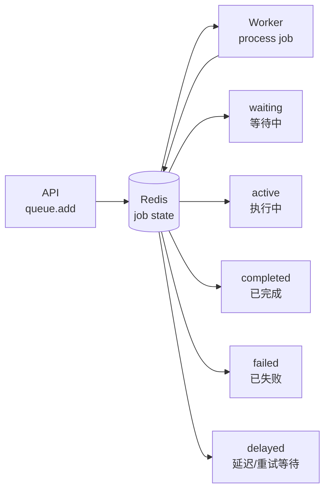
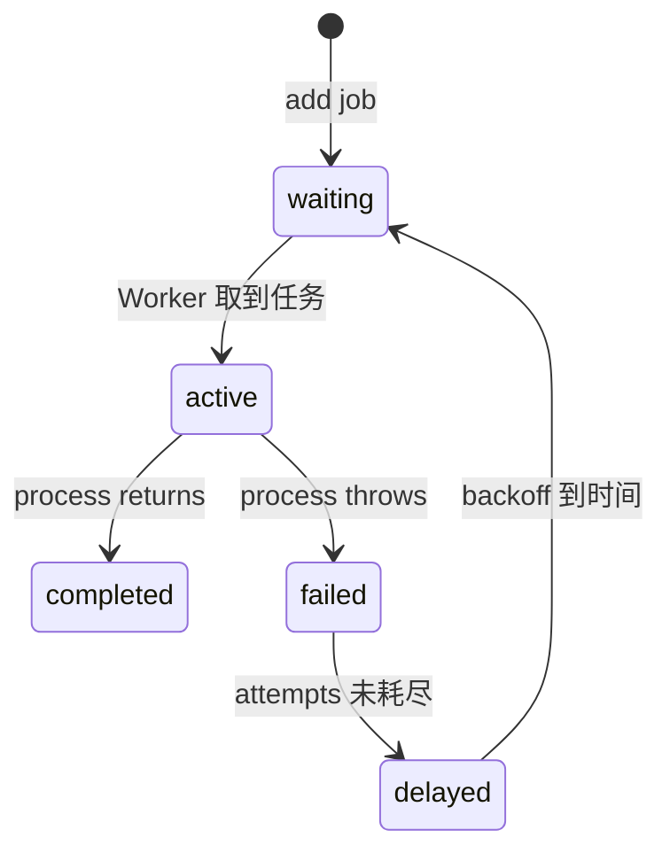
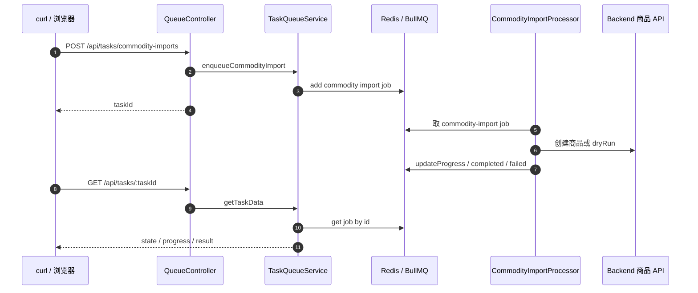

# BullMQ 第一性原理

## 一句话

BullMQ 的本质不是“让 NestJS 多开一个进程”，而是：

```text
把任务写进 Redis
让 Worker 从 Redis 取任务执行
再把进度、结果、失败原因写回 Redis
```

它解决的是：

```text
HTTP 请求不应该一直等慢任务完成
慢任务也不应该只存在 Node 进程内存里
```

## 如果不用 BullMQ

商品批量导入如果直接放在 HTTP 请求里，会变成：

```text
POST /api/tasks/commodity-imports
-> 校验 200 条商品
-> 一条条调用 Backend 创建
-> 刷新缓存
-> 全部完成后才返回
```

问题是：

| 问题 | 后果 |
| --- | --- |
| 请求时间长 | 浏览器一直等待，可能超时 |
| 并发不可控 | 来多少请求就可能同时跑多少批导入 |
| 中途失败 | 很难恢复和重试 |
| 进程重启 | 内存里的任务直接丢 |
| 前端查进度 | 没有稳定的任务状态 |

## BullMQ 底层是什么

BullMQ 底层核心是 Redis 里的任务状态机。



一个任务的生命周期：



Redis 不是只存一个数组，而是保存：

| Redis 里的内容 | 作用 |
| --- | --- |
| job data | 任务入参 |
| waiting / active / completed / failed | 任务状态 |
| progress | 执行进度 |
| returnvalue | 成功结果 |
| failedReason | 失败原因 |
| lock | 防止同一个 job 被多个 Worker 同时执行 |

## NestJS 做了什么

原生 BullMQ 你会手动写：

```ts
const queue = new Queue("commodity-import", { connection });

const worker = new Worker("commodity-import", async (job) => {
  // 执行业务
});
```

`@nestjs/bullmq` 做的是把这些对象接入 NestJS：

```mermaid
flowchart TD
  A[BullModule.forRootAsync] --> B[配置 Redis connection]
  B --> C[BullModule.registerQueue]
  C --> D[创建 Queue provider]
  D --> E[@InjectQueue 注入 Queue]
  E --> F[TaskQueueService queue.add]

  C --> G[@Processor 注册 Worker]
  G --> H[WorkerHost process job]
```

对应当前项目：

| 当前代码 | 本质 |
| --- | --- |
| `queue.module.ts` | 注册 Redis 连接和 `commodity-import` 队列 |
| `task-queue.service.ts` | 调 `queue.add()` 投递任务，查 job 状态 |
| `queue.controller.ts` | 暴露提交任务和查询任务 API |
| `commodity-import.processor.ts` | Worker 真正执行商品导入 |
| `redis-connection.ts` | 把 `REDIS_URL` 转成 BullMQ Redis 配置 |

## commodityImportQueue 从哪里来

`commodityImportQueue` 不是手写 `new Queue()` 得到的变量，而是 NestJS 通过依赖注入放进 `TaskQueueService` 的 BullMQ Queue 实例。

代码里是：

```ts
constructor(
  @InjectQueue(COMMODITY_IMPORT_QUEUE)
  private readonly commodityImportQueue: Queue<CommodityImportJobData>
) {}
```

这行等价于：

```text
我要注入名为 commodity-import 的 BullMQ Queue
并把它保存成 TaskQueueService 的 commodityImportQueue 属性
```

来源链路：

```mermaid
flowchart TD
  A[COMMODITY_IMPORT_QUEUE<br/>commodity-import] --> B[BullModule.registerQueue]
  B --> C[Nest 创建 BullMQ Queue provider]
  C --> D[@InjectQueue 注入 commodity import queue]
  D --> E[TaskQueueService commodityImportQueue]
  E --> F[调用 add 写入 job]
  E --> G[调用 getJob 查询 job]
```

对应文件：

| 步骤 | 文件 |
| --- | --- |
| 定义队列名 | `queue.constants.ts` |
| 注册队列 provider | `queue.module.ts` |
| 注入 Queue 实例 | `task-queue.service.ts` |
| 使用 Queue 入队和查询 | `task-queue.service.ts` |

## 当前项目流程



## Worker 可控是什么意思

没有队列时：

```text
来了 100 个导入请求
= 可能同时跑 100 批导入
```

有 BullMQ 后：

```text
来了 100 个导入请求
= Redis 排 100 个 job
= Worker 按 concurrency 慢慢消费
```

当前代码：

```ts
@Processor(COMMODITY_IMPORT_QUEUE, { concurrency: 1 })
```

意思是：

```text
同一个 Worker 实例一次只处理 1 个商品导入任务。
```

所以 BullMQ 的价值不是“更快”，而是“可控”：

| 控制点 | 当前例子 |
| --- | --- |
| 执行并发 | `concurrency: 1` |
| 失败重试 | `attempts: 2` |
| 重试间隔 | `backoff: exponential` |
| 状态查询 | `GET /api/tasks/:taskId` |
| 历史清理 | `removeOnComplete` / `removeOnFail` |

## 最小结论

```text
NestJS 负责组织代码和依赖注入
BullMQ 负责队列和任务状态机
Redis 负责保存任务状态
Worker 负责真正执行任务
```

当前项目里的 `QueueModule`，本质就是把：

```text
HTTP 请求
Redis 任务状态
后台 Worker
商品导入业务
```

连成一个最小异步任务闭环。
