# BullMQ、Redis、状态机、Worker、进程线程

## 一句话

BullMQ 不是简单等于 Redis，也不是让 NestJS 自动多开线程。

更准确地说：

```text
BullMQ = 基于 Redis 的任务状态机 + Worker 协调机制
Redis = 任务状态和队列数据的持久化存储
Worker = 从队列取任务并执行业务代码的消费者
Node 进程 = 承载 NestJS、Queue 和 Worker 的运行容器
```

当前项目里，BullMQ 只用于商品批量导入：

```text
POST /api/tasks/commodity-imports
-> 写入 Redis job
-> CommodityImportProcessor 后台消费
-> GET /api/tasks/:taskId 查询状态
```

## BullMQ 的本质是不是 Redis

不是。

Redis 是 BullMQ 的底层状态存储；BullMQ 是建立在 Redis 上的任务调度和状态流转规则。

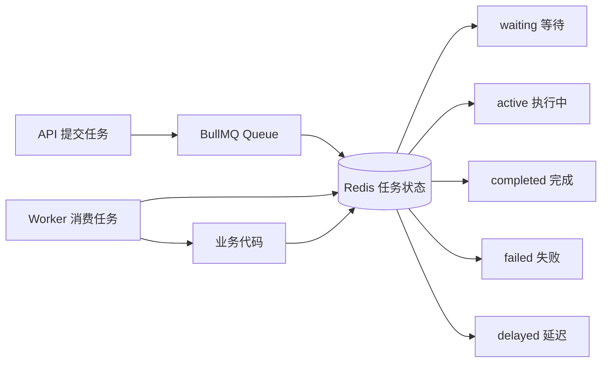

Redis 在这里保存：

| Redis 里的内容 | 作用 |
| --- | --- |
| job data | 任务入参，例如要导入的商品列表 |
| waiting | 等待被 Worker 消费的任务 |
| active | 正在执行的任务 |
| completed | 已完成任务和结果 |
| failed | 失败任务和失败原因 |
| delayed | 延迟执行或等待重试的任务 |
| progress | 当前执行进度 |
| lock | 防止同一个任务被多个 Worker 同时执行 |

所以更准确的理解是：

```text
Redis 提供存储和原子操作能力
BullMQ 定义任务如何进入、流转、重试、完成和失败
```

## 状态机的本质

状态机的本质是：

```text
一个对象只能处在有限状态之一
状态之间只能按规则迁移
每次迁移都有明确触发条件
```

BullMQ job 的状态机可以简化成：

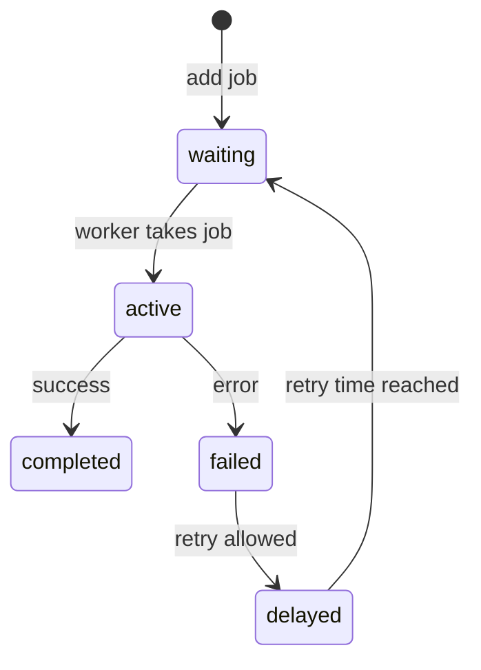

状态机要解决的问题不是“给任务起几个状态名”，而是让系统可以稳定回答三个问题：

| 问题 | 状态机怎么回答 |
| --- | --- |
| 任务现在到哪一步了 | 查 job 当前 state |
| 任务失败能不能重试 | 看 attempts 和 backoff 规则 |
| Worker 挂了怎么办 | 根据 Redis 里的状态和 lock 恢复或重新调度 |

没有状态机时，后台任务通常只是一次内存函数调用：

```text
processImport(data)
```

一旦进程挂了，调用链没了，状态也没了。

有状态机后，任务变成：

```text
waiting -> active -> completed
waiting -> active -> failed -> delayed -> waiting
```

任务状态保存在 Redis 里，进程不是唯一真相来源。

## Worker 的本质

Worker 的本质不是线程。

Worker 是一个消费者：

```text
不断从 Redis 取 job
执行你的业务逻辑
把进度、结果、失败原因写回 Redis
```

当前项目里的 Worker 是：

```text
CommodityImportProcessor
```

它做的事：

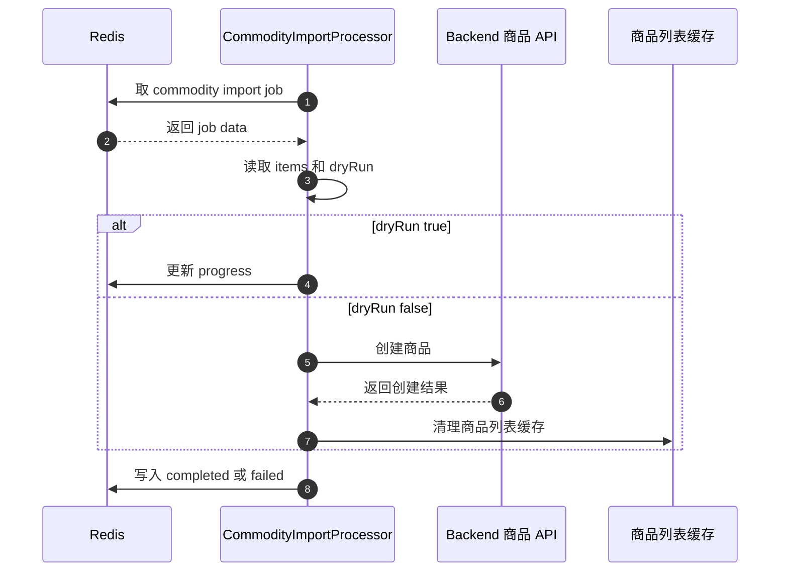

Worker 可控的含义：

```text
请求可以很多
真正同时执行的任务数量由 Worker 配置控制
```

当前代码：

```ts
@Processor(COMMODITY_IMPORT_QUEUE, { concurrency: 1 })
```

含义是：

```text
同一个 Worker 实例一次只处理 1 个商品导入任务。
```

所以 BullMQ 的价值不是让任务神奇变快，而是让任务执行变可控：

| 控制点 | 当前例子 |
| --- | --- |
| 同时跑几个任务 | `concurrency: 1` |
| 失败重试几次 | `attempts: 2` |
| 重试怎么等待 | `exponential backoff` |
| 状态怎么查 | `GET /api/tasks/:taskId` |
| 结果保存在哪里 | Redis job return value |

## concurrency 会占用什么资源

`concurrency` 控制的是：

```text
同一个 Worker 实例里，同时允许多少个 job 进入 process 流程。
```

它不是“开几个线程”，而是“允许几个异步任务流同时进行”。

当前项目：

```ts
@Processor(COMMODITY_IMPORT_QUEUE, { concurrency: 1 })
```

表示：

```text
同一个 CommodityImportProcessor 实例一次只处理 1 个商品导入 job。
```

真实运行时资源关系：

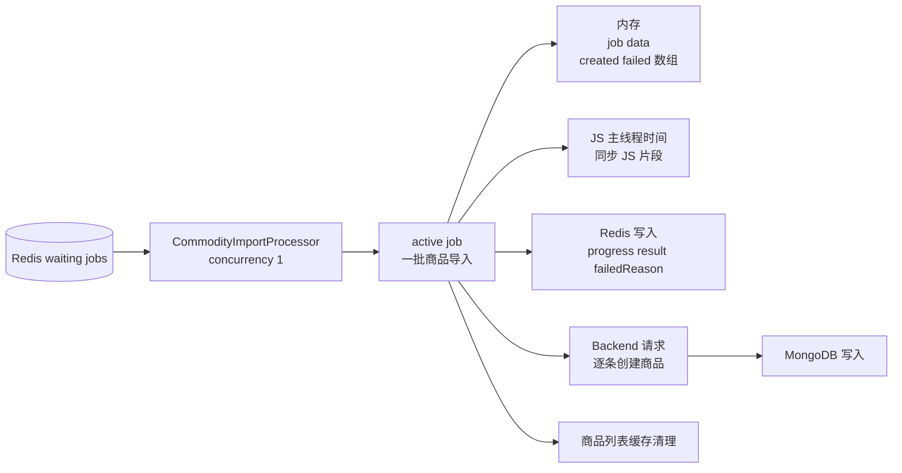

这些资源会被占用：

| 资源 | 当前项目里怎么发生 |
| --- | --- |
| 内存 | `job.data.items`、`created`、`failed`、当前 `item` 都在进程内存里 |
| JS 主线程时间 | `for` 循环、数组 push、错误处理、JSON 处理都要回到主线程执行 |
| 网络连接 | `createCommodity` 会通过 `fetch` 调 Backend |
| Redis 压力 | 每条商品都会 `updateProgress`，任务结束还会写 result |
| Backend 压力 | `dryRun=false` 时，每条商品会调用一次创建接口 |
| 数据库压力 | Backend 创建商品时最终会写 MongoDB |
| 缓存压力 | 只要创建成功过商品，最后会清理商品列表缓存 |

当前代码还有一个重要细节：

```text
一个 job 内部是顺序处理 items，不是 200 条同时并发。
```

因为代码是：

```ts
for (const item of job.data.items) {
  await this.createCommodity(job.data, item);
}
```

所以 `concurrency: 1` 时，运行态大概是：

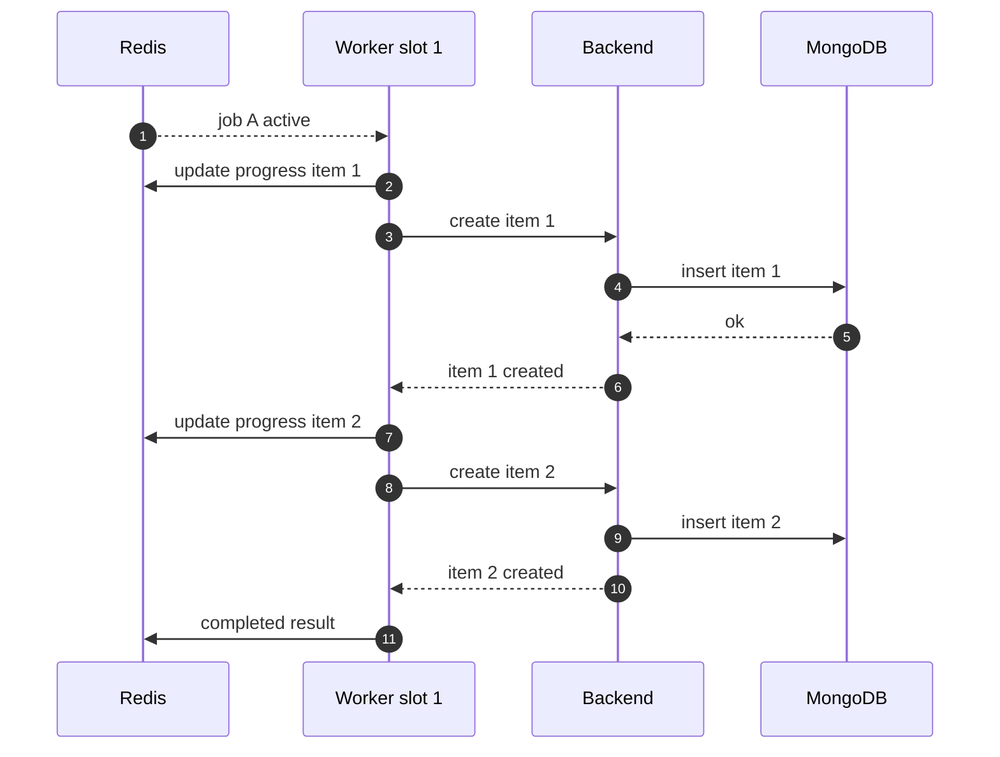

如果 Redis 里同时有多个导入任务，因为 `concurrency: 1`，它们会排队：

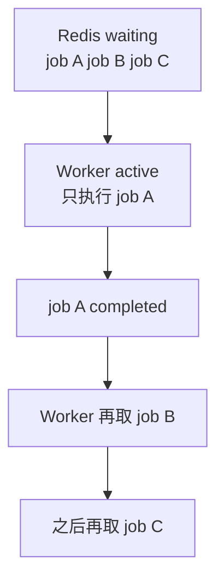

如果未来改成 `concurrency: 3`，真实运行会变成：

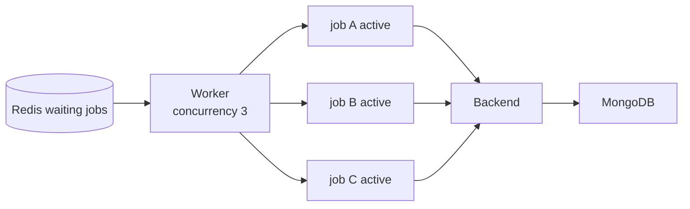

这时不是多了 3 个 JS 线程，而是：

```text
3 个 job 的 async process 流程同时挂在 Event Loop 上
最多可能同时有 3 个 Backend 创建请求在飞
3 个 job 都会写 Redis progress 和 result
3 份 job data 和结果数组都占内存
```

对当前商品导入来说，保守设置 `concurrency: 1` 的原因是：

```text
一批导入最多 200 条商品
每条都可能写 Backend 和 MongoDB
先保证任务可控，再考虑提高吞吐
```

## 从进程和线程理解 Node 服务

一个 NestJS BFF 服务，本质上通常是一个 Node.js 进程。

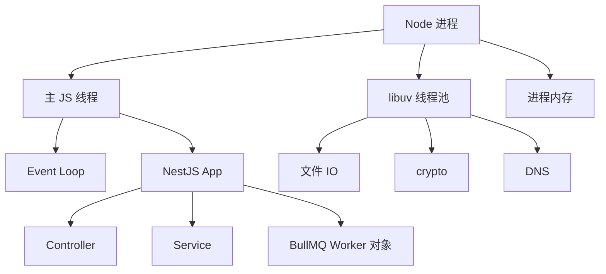

几个概念要分清：

| 概念 | 本质 |
| --- | --- |
| 进程 | 操作系统资源隔离单位，有自己的内存空间 |
| 线程 | 进程里的执行流 |
| Node 主线程 | 执行 JavaScript 和 Event Loop |
| libuv 线程池 | Node 用来处理部分底层异步任务 |
| BullMQ Worker | 运行在 Node 进程里的任务消费者对象，不等于 OS 线程 |

## Event Loop 和主线程如何配合

Node 里执行 JavaScript 的主要是一个主线程。Event Loop 不是另一个专门跑业务 JS 的线程，而是主线程上的调度循环。

先把“主线程内部”理解成一个调度模型，而不是很多条线程：

```text
调用栈 = 现在正在执行的 JS
队列 = 等着以后被执行的回调
Event Loop = 调用栈空了以后，决定从哪个队列拿回调继续跑
```

最小模型：

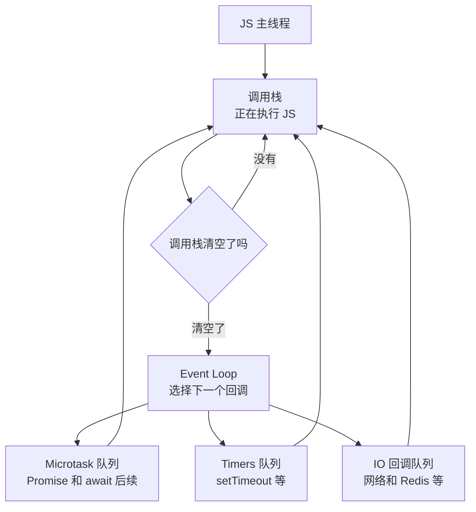

也就是说，图里画出多个队列，不代表主线程里有多个线程同时执行。真正执行 JS 的还是同一个调用栈。

可以这样理解：

```text
主线程负责执行 JS 调用栈
Event Loop 负责决定下一轮该执行哪个回调
libuv 和操作系统负责等待 IO 完成
```

图解：

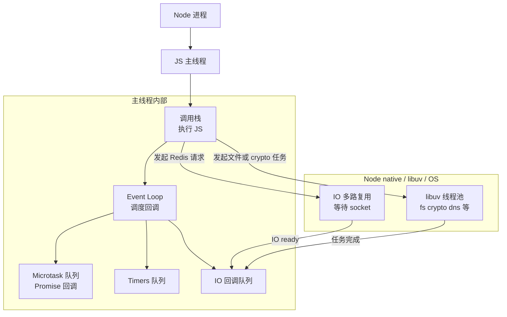

一次异步 Redis 请求大概是：

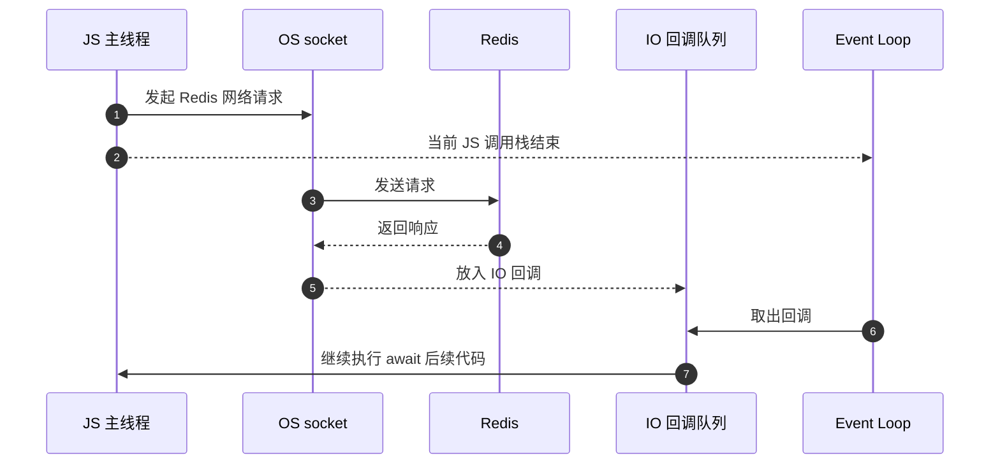

关键点：

| 现象 | 本质 |
| --- | --- |
| Node 可以同时处理很多请求 | 多数时间在等 IO，Event Loop 在回调之间切换 |
| JS 代码仍然是单主线程执行 | 同一时刻只有一个 JS 调用栈在跑 |
| 异步不是给每个请求开线程 | 网络 IO 由 OS 和 libuv 事件机制通知完成 |
| CPU 密集任务会卡住 Node | 主线程忙着算，Event Loop 没机会调度其他回调 |

## BullMQ Worker 和 Event Loop 的关系

当前项目的 `CommodityImportProcessor` 不是单独线程。它是运行在 Node 主线程调度体系里的一个消费者对象。

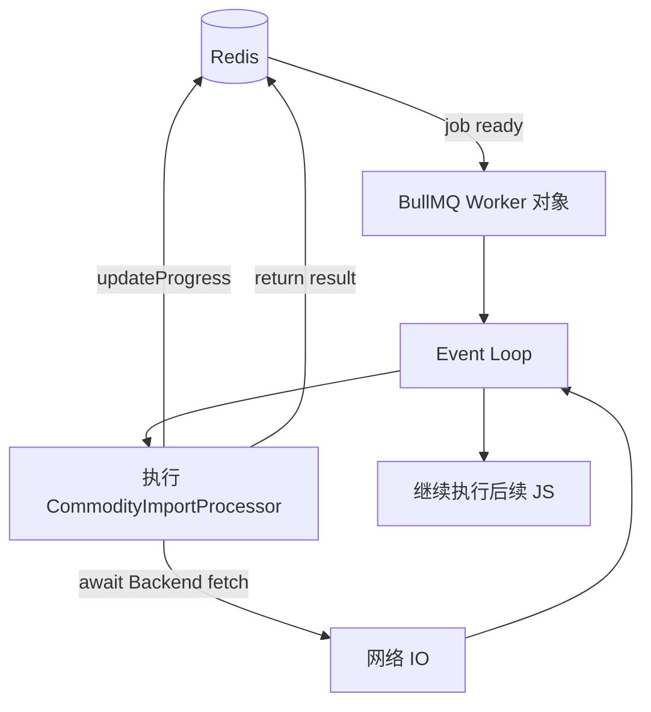

如果 `process` 里主要是网络 IO，比如调用 Backend 创建商品：

```text
主线程发起 fetch
等待 Backend 响应时主线程可以处理别的回调
响应回来后 Event Loop 再调度后续代码
```

如果 `process` 里是大量 CPU 同步计算：

```text
主线程一直在算
Event Loop 不能及时处理其他请求和回调
BFF API 也会变慢
```

所以 BullMQ 的 Worker 并发控制不等于多线程并行计算。它控制的是：

```text
同一个 Worker 实例同时允许多少个 job 进入执行流程
```

当前配置：

```ts
@Processor(COMMODITY_IMPORT_QUEUE, { concurrency: 1 })
```

意思是：

```text
这个 Worker 实例一次只让 1 个商品导入 job 进入 process 流程。
```

## IO 型任务和 CPU 型任务

Node 很适合 IO 型任务：

```text
查 Redis
调 Backend API
读写数据库
等待网络响应
```

因为等待 IO 时，Event Loop 可以去处理其他回调。

Node 不适合在主线程里长时间跑 CPU 型任务：

```text
大图片压缩
大文件同步解析
大量加密计算
复杂报表同步计算
```

这类任务如果很多，生产上通常要：

| 方案 | 作用 |
| --- | --- |
| 独立 Worker 进程 | 避免拖慢 API 进程 |
| Worker Threads | 把 CPU 计算挪到线程 |
| 外部服务 | 让专门服务处理图片、报表、视频等重任务 |
| 限制 concurrency | 控制同时执行的任务数量 |

当前项目如果只启动一个 BFF 进程，那么 API 和 Worker 在同一个 Node 进程里：

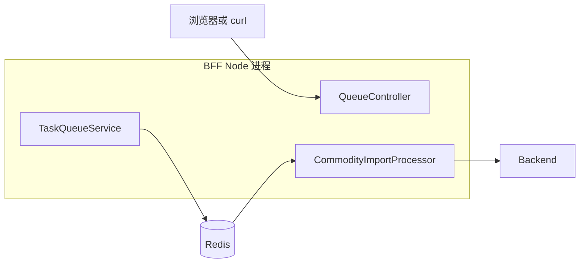

这叫：

```text
逻辑解耦了
物理还没隔离
```

逻辑解耦：

```text
HTTP 请求提交任务后立即返回 taskId
慢任务由 Worker 后续执行
```

物理隔离：

```text
API 进程和 Worker 进程分开部署
```

生产中可以演进成：

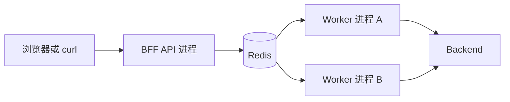

这样做的好处：

| 方式 | 特点 |
| --- | --- |
| API 和 Worker 同进程 | 简单，适合本地开发和 MVP |
| API 和 Worker 分进程 | 更稳，慢任务不会占满 API 进程资源 |

## 当前项目的完整关系

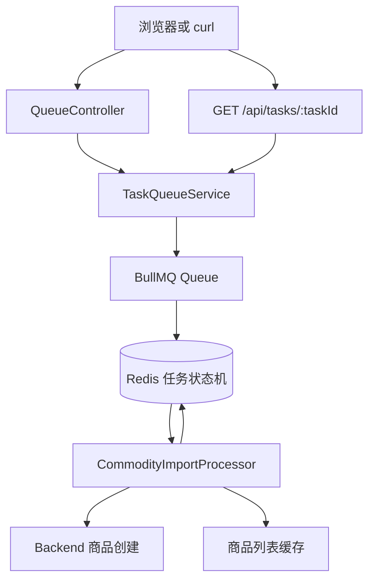

对应代码：

| 文件 | 本质 |
| --- | --- |
| `queue.module.ts` | 把 BullMQ 接进 NestJS 模块系统 |
| `task-queue.service.ts` | 生产者，负责写入 job 和查询 job |
| `queue.controller.ts` | HTTP 入口，负责提交任务和查询任务 |
| `commodity-import.processor.ts` | 消费者，负责真正执行商品导入 |
| `redis-connection.ts` | Redis 连接配置 |

## 最小结论

```text
BullMQ 不是 Redis 本身
BullMQ 是基于 Redis 的任务状态机和 Worker 协调机制

状态机不是抽象术语
状态机就是任务只能按规则从 waiting 流到 active、completed、failed

Worker 不是线程
Worker 是运行在 Node 进程里的消费者对象

Node 服务不是每个请求一个线程
Node 主要靠一个 JS 主线程和 Event Loop 处理并发 IO
```

一句话总结：

```text
BullMQ 把一次不可靠的内存函数调用
变成一次可持久化、可查询、可重试、可控并发的 Redis 状态迁移。
```
