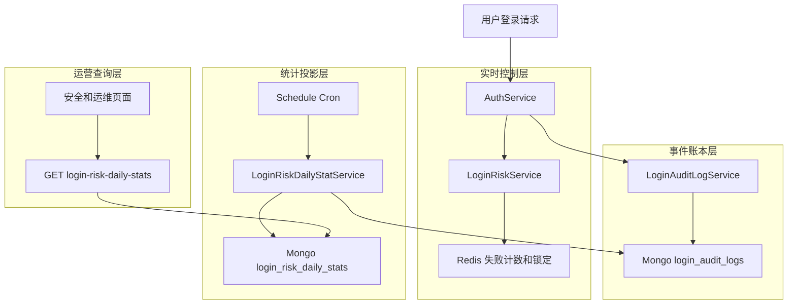
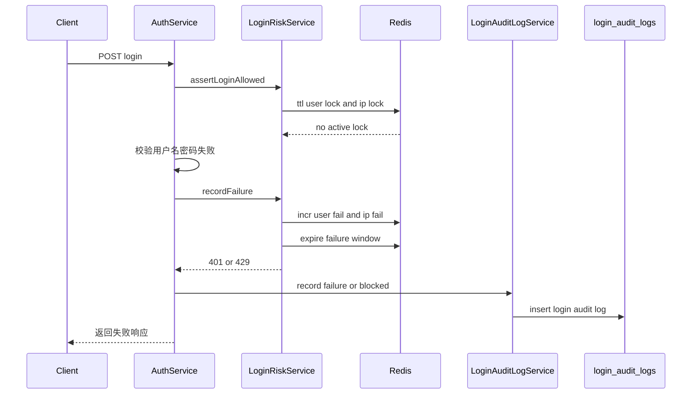
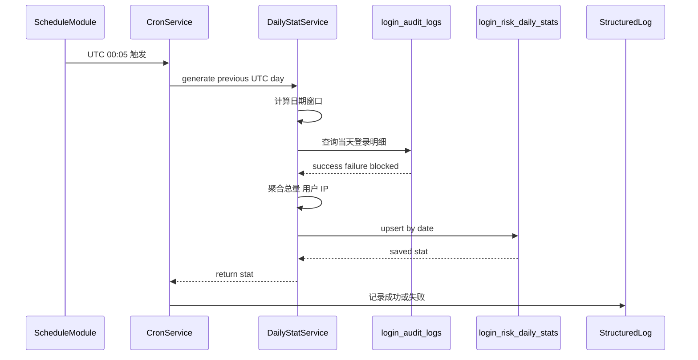
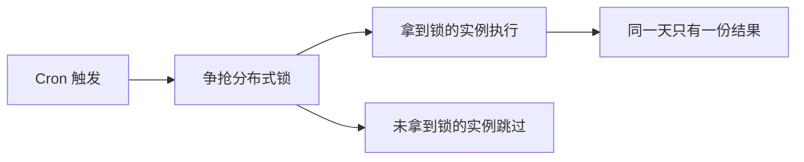
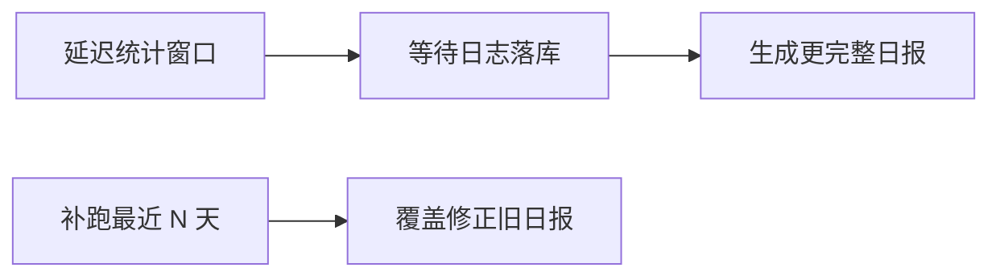
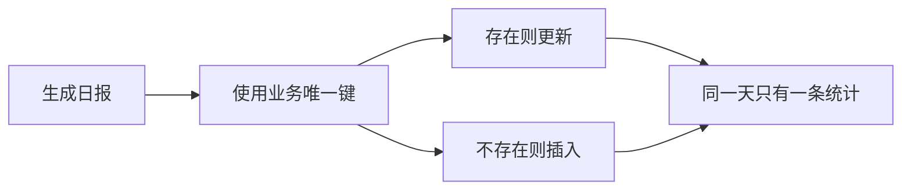
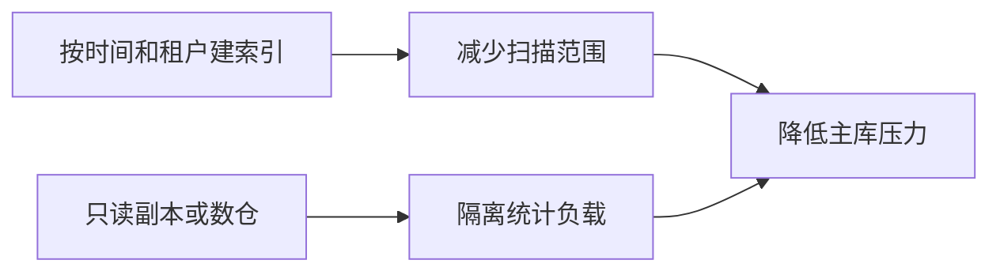
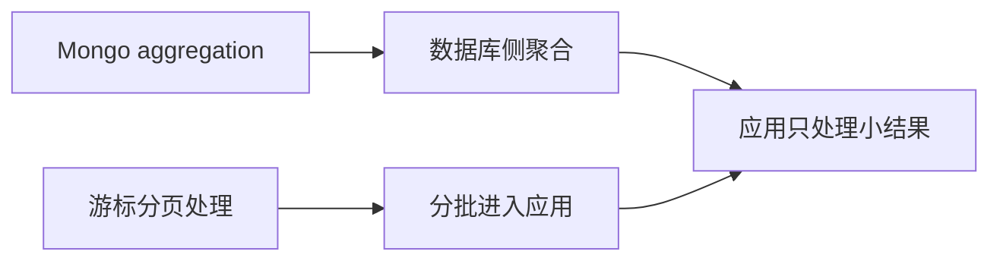
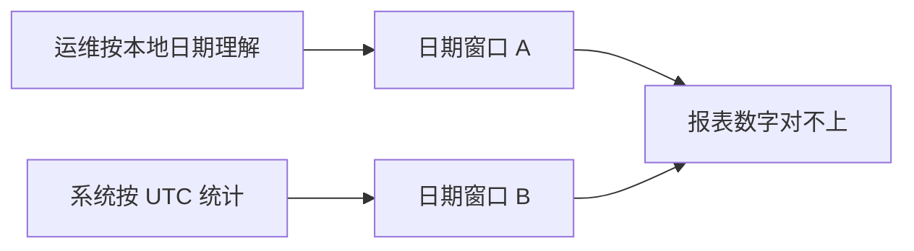
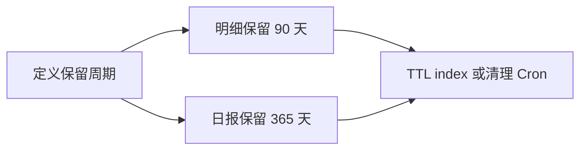

# 登录风控每日统计 Cron 图解

本文解释本次新增的“每天生成登录失败和风控统计”功能。

这不是一个简单的定时任务例子。它背后的设计问题是：

```text
登录系统既要实时拦截攻击，又要留下可追溯的安全证据，还要给运维提供低成本查询入口。
```

所以当前系统把能力拆成三层：

```text
实时控制层：现在要不要拦截
事件账本层：每次登录到底发生了什么
统计投影层：每天风险态势是什么
```

## 核心结论

本次功能不是新增一条登录拦截规则，而是新增一个安全运营视角的读模型。

```text
Redis 风控 key
适合实时判断，但会过期。

login_audit_logs
适合审计追溯，但明细太多，不适合每次页面查询都扫描。

login_risk_daily_stats
适合报表、安全看板、运维排障。
```

真实系统里，这种结构通常叫：

```text
事件明细表 + 周期聚合表
```

或者更抽象一点：

```text
write model + read model
```

登录发生时先保证明细准确，后面再异步构建适合查询的统计视图。

## 系统边界怎么看

这张图重点不是“有哪些类”，而是看三条数据链路的边界：



读这张图时重点看三件事：

| 重点 | 说明 |
|---|---|
| Redis 没有进入日报统计 | Redis 是瞬时控制状态，不是历史事实来源 |
| 日报来自 `login_audit_logs` | 审计明细是事实账本，统计可以重复生成 |
| 查询接口读 `login_risk_daily_stats` | 页面查询不直接扫描所有登录明细 |

## 一次登录失败发生了什么



这里有一个重要取舍：

```text
登录请求路径只做实时判断和写明细，不做日报统计。
```

如果每次登录都同步更新日报，登录接口会被报表逻辑污染，并且会引入更多并发更新问题。

## 每日 Cron 做什么



当前 Cron 时间是：

```text
UTC 00:05
```

不是 UTC 00:00 的原因是给日志写入留一点缓冲。真实系统里还会考虑日志延迟、跨服务时钟漂移、队列积压和数据库复制延迟。

## 统计口径

当前日报不是简单 count，它把登录明细压缩成几个安全运营最关心的指标。

| 指标 | 来源 | 用途 |
|---|---|---|
| `totals.success` | `outcome = success` | 判断正常登录规模 |
| `totals.failure` | `outcome = failure` | 判断密码错误或撞库规模 |
| `totals.blocked` | `outcome = blocked` | 判断风控实际拦截量 |
| `uniqueIps` | 明细 IP 去重 | 判断来源分散程度 |
| `uniqueUsernames` | 用户名去重 | 判断攻击面 |
| `lockedUsers` | 出现 blocked 的用户 | 找被锁账号 |
| `abnormalIps` | 失败和拦截聚合后的 IP | 找异常来源 |

当前风险分数：

```text
riskScore = failures + blocked * 5
```

这不是生产级模型，只是 MVP 的最小可解释规则。它表达的是：

```text
一次 blocked 比一次普通 failure 更值得关注。
```

真实系统会继续加入：

- IP 地理位置和 ASN。
- 是否命中新设备或新 UA。
- 是否跨租户尝试。
- 是否短时间内枚举大量用户名。
- 是否来自代理、机房或已知恶意网段。
- 与历史基线相比是否异常上升。

## 幂等性设计

日报生成一定要幂等。

原因很现实：

- Cron 可能被重复触发。
- 运维可能手动补跑某一天。
- 多实例部署时多个 BFF 可能同时跑同一个 Cron。
- 第一次生成失败后需要重试。

当前代码使用：

```text
findOneAndUpdate by date with upsert
```

效果是：

```text
同一个 date 只保留一条日报。
重复生成会覆盖同一天统计，不会插入多条。
```

当前 MVP 解决了“重复插入”的问题，但没有完全解决“多实例并发重复计算”的问题。

生产系统通常会再加一层：

```text
分布式锁
```

例如：

```text
SET cron:login-risk:2026-05-21 value NX EX 600
```

只有拿到锁的实例执行统计，其他实例跳过。

## 一致性边界

这个功能是最终一致，不是强一致。

```text
登录发生
-> 先写登录明细
-> 之后 Cron 再生成日报
```

这意味着：

```text
今天刚发生的登录失败，不会立刻出现在日报里。
```

这是可接受的，因为日报服务的是安全运营分析，不是登录当下的拦截判断。

如果业务要求“准实时安全看板”，方案就不是每日 Cron，而是：

```text
登录事件流
-> Kafka 或 Redis Stream
-> 流式聚合
-> 实时指标表
```

当前 MVP 刻意没有引入这个复杂度。

## 查询成本

为什么要有 `login_risk_daily_stats`？

因为运维页面常见查询是：

```text
最近 30 天每天失败多少
最近 30 天哪些 IP 最异常
最近 30 天哪些账号经常被锁
```

如果每次都扫 `login_audit_logs`，数据量一大就会变成：

```text
页面查询 = 大范围聚合查询
```

这会把运营页面的成本压到主业务数据库上。

当前设计变成：

```text
写入时保留明细
每天离线聚合一次
页面只查小表
```

查询成本从“扫大量登录明细”变成“扫几十条每日统计”。

## 当前 MVP 和真实系统的距离

| 维度 | 当前实现 | 真实系统通常需要 |
|---|---|---|
| 任务触发 | 单机 Cron | 分布式锁或独立调度平台 |
| 幂等 | 按 `date` upsert | `date + tenant + app` 唯一键，带任务运行记录 |
| 聚合方式 | Node 内存聚合 | Mongo aggregation 或离线数仓 |
| 数据保留 | 暂未清理 | 明细 90 天，统计 1 年或更久 |
| 补偿能力 | 暂无手动补跑接口 | 支持指定日期补跑和批量 backfill |
| 监控告警 | 结构化日志 | 指标、告警、失败重试、运行时长监控 |
| 多租户 | 暂未按租户拆分 | tenantId 维度隔离和权限过滤 |
| 风险模型 | 简单权重 | 基线、设备、地理位置、IP 信誉、行为序列 |
| 数据安全 | `audit:read` 权限 | 字段脱敏、访问审计、最小权限 |

所以这次代码更像是：

```text
安全运营日报的最小闭环
```

不是完整 SIEM，也不是生产级风控平台。

## 真实系统 Top 10 问题与解决方式

1. 多实例重复跑 Cron

现象：部署 3 个 BFF 实例后，同一天日报可能被 3 个实例同时生成。

根因：NestJS Cron 默认运行在每个应用进程里，不知道自己是不是唯一实例。

第一性原理：同一个统计日期只能对应一个确定结果，重复执行必须先收敛到唯一执行权。

<span style="color: #15803d">解决方式：用 Redis <code>SET NX EX</code>、数据库锁或调度平台保证同一日期只有一个执行者。</span>

问题图：


解决图：



2. Cron 错过执行

现象：服务重启、发布或宕机期间刚好错过 00:05，日报当天没有生成。

根因：进程内 Cron 只在应用存活时工作，错过时间点不会自动补偿。

第一性原理：时间触发不是事实记录；只有持久化任务状态，系统才知道什么日期已经完成、什么日期缺失。

<span style="color: #15803d">解决方式：增加任务运行记录表，应用启动后扫描未完成日期并补跑。</span>

问题图：


解决图：


3. 登录日志延迟写入

现象：00:05 统计时，还有少量昨天的登录日志没落库，日报数字偏小。

根因：跨服务写入、数据库复制、队列积压或时钟偏差都可能让明细晚到。

第一性原理：统计只能基于已经到达的事实；如果事实会晚到，统计窗口必须等待或允许重算。

<span style="color: #15803d">解决方式：延迟统计窗口，例如 00:15 再跑；或者允许补跑最近 N 天覆盖修正。</span>

问题图：


解决图：



4. 重复生成导致脏数据

现象：手动补跑或重试后，同一天出现多条日报。

根因：写统计结果时没有业务唯一键，重复执行变成重复插入。

第一性原理：幂等依赖业务唯一键；同一个业务事实必须落到同一条记录上。

<span style="color: #15803d">解决方式：用 <code>date + tenantId + appId</code> 做唯一键，并用 upsert 覆盖同一统计日。</span>

问题图：


解决图：



5. 聚合查询拖垮主库

现象：`login_audit_logs` 数据量很大，日报生成时扫描大量数据，影响登录系统主库。

根因：统计任务和在线业务共用数据库资源，且聚合缺少合适索引。

第一性原理：统计是批量读负载，在线登录是低延迟负载；两者竞争同一资源时，必须缩小扫描范围或隔离资源。

<span style="color: #15803d">解决方式：给 <code>createdAt/outcome/tenantId</code> 建索引；大规模时迁到 Mongo aggregation、只读副本或离线数仓。</span>

问题图：


解决图：



6. 内存聚合撑爆应用

现象：一天登录日志几十万到几百万条，Node 一次性 `lean()` 全读进内存，导致内存升高甚至 OOM。

根因：应用层全量读取再聚合，数据规模超过单进程内存预算。

第一性原理：内存是有限资源；能在数据所在位置聚合，就不要把全量数据搬到应用进程。

<span style="color: #15803d">解决方式：用 Mongo aggregation 在数据库侧聚合，或使用分页游标流式处理。</span>

问题图：


解决图：



7. 时区口径混乱

现象：运维按本地日期看报表，系统按 UTC 生成，双方看到的数字对不上。

根因：统计窗口没有被清晰定义，页面也没有展示统计时区。

第一性原理：日报的本质是一个时间窗口；窗口边界不一致，数字就不可能一致。

<span style="color: #15803d">解决方式：明确统计口径：统一 UTC，或按租户时区生成 <code>statDate</code>，并在页面标注时区。</span>

问题图：



解决图：


8. 数据无限增长

现象：登录明细和日报长期只增不删，存储成本持续上升。

根因：审计数据没有保留策略，Mongo 集合持续膨胀。

第一性原理：存储不是无限资源；历史价值会随时间衰减，数据必须有生命周期。

<span style="color: #15803d">解决方式：设置保留策略，例如明细 90 天、日报 365 天；使用 TTL index 或清理 Cron。</span>

问题图：


解决图：



9. 权限和脱敏不足

现象：安全报表暴露 IP、用户名、失败原因，普通账号也能查看。

根因：把安全运营数据当成普通审计列表，没有单独设计权限和字段保护。

第一性原理：安全数据本身也是敏感资产；能看到风险数据的人必须被最小授权和可追踪。

<span style="color: #15803d">解决方式：使用专门权限，例如 <code>security:risk:read</code>；敏感字段脱敏，并记录访问审计。</span>

问题图：


解决图：

```mermaid
flowchart LR
  p9s1["专门安全权限"] --> p9s4["降低误访问"]
  p9s2["字段脱敏"] --> p9s4
  p9s3["访问审计"] --> p9s4
```

10. 没有运行可观测性

现象：Cron 失败了没人知道，报表几天没更新才被发现。

根因：只有业务结果表，没有任务运行状态、耗时、扫描条数和失败原因。

第一性原理：后台任务没有用户实时反馈；必须把运行状态外显，否则失败就是静默失败。

<span style="color: #15803d">解决方式：记录任务状态、耗时、扫描条数、失败原因；接入 metrics 和告警。</span>

问题图：

```mermaid
flowchart LR
  p10a["Cron 执行失败"] --> p10b["没有状态记录"]
  p10b --> p10c["没有告警"]
  p10c --> p10d["报表停止更新后才发现"]
```

解决图：

```mermaid
flowchart LR
  p10s1["任务运行表"] --> p10s3["记录状态和错误"]
  p10s2["metrics 告警"] --> p10s4["失败及时通知"]
  p10s3 --> p10s5["定位失败原因"]
  p10s4 --> p10s6["触发补跑"]
```

如果把它落到当前项目，优先补的不是复杂风控模型，而是这三件事：

```text
分布式锁
任务运行记录
数据保留策略
```

原因是它们直接决定这个 Cron 在多实例、故障恢复和长期运行下是否可靠。

## 真实生产路径

如果继续往真实系统推进，优先级应该是：

1. 增加分布式锁，避免多 BFF 实例重复跑 Cron。
2. 增加数据保留策略，例如登录明细保留 90 天，日报保留 365 天。
3. 增加手动补跑接口，例如补跑某一天或某个日期范围。
4. 把聚合从 Node 内存循环迁到 Mongo aggregation，降低应用内存压力。
5. 增加任务运行记录表，记录 started、success、failed、duration、error。
6. 增加 `tenantId` 维度，避免多租户数据混在一份日报里。
7. 给安全页面增加趋势图、Top IP、Top 用户、blocked 比例和环比变化。

## 当前代码对应

| 责任 | 文件 |
|---|---|
| 启用 NestJS 定时任务 | `apps/bff/src/app.module.ts` |
| Cron 触发 | `apps/bff/src/auth/login-risk-daily-stat-cron.service.ts` |
| 聚合登录明细 | `apps/bff/src/auth/login-risk-daily-stat.service.ts` |
| 每日统计 schema | `apps/bff/src/auth/schemas/login-risk-daily-stat.schema.ts` |
| 查询 DTO | `apps/bff/src/auth/dto/query-login-risk-daily-stat.dto.ts` |
| 查询接口 | `apps/bff/src/auth/auth.controller.ts` |

## 验证方式

已运行：

```bash
pnpm test:bff -- login-risk-daily-stat.service.spec.ts auth.service.spec.ts rbac-seed.service.spec.ts
pnpm lint:bff
pnpm build:bff
```

本地验证思路：

1. 制造几次登录失败和锁定。
2. 在测试里直接调用 `generateForDate`，或等 Cron 到点。
3. 查询 `GET /api/auth/login-risk-daily-stats`。
4. 对比 `login_audit_logs` 明细和 `login_risk_daily_stats` 聚合结果。

关键校验不是“接口有返回”，而是：

```text
同一天重复生成不会新增多条。
统计窗口只覆盖目标 UTC 日期。
blocked 用户进入 lockedUsers。
异常 IP 按 riskScore 排序。
查询接口不扫描 login_audit_logs。
```
