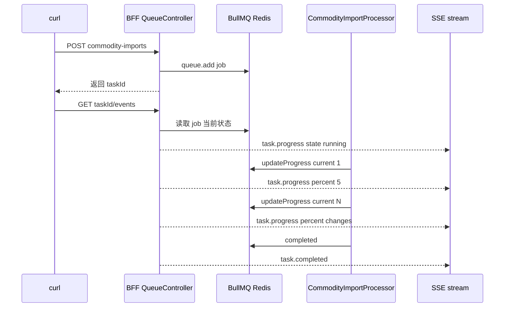
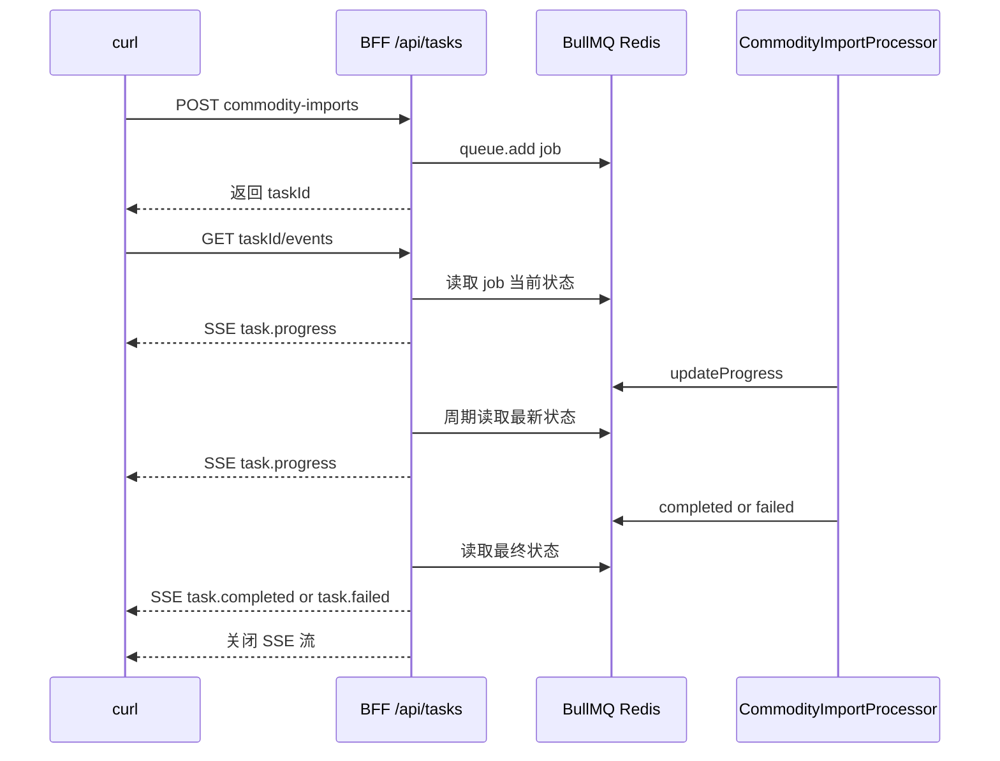

# SSE 任务进度 curl 测试操作

## 目标

用 `curl` 验证当前 BFF 的 SSE 任务进度推送接口：

```text
登录
-> 提交商品批量导入任务
-> 用 curl -N 订阅 /api/tasks/:taskId/events
-> 观察 task.progress / task.completed / task.failed
```

当前已经接入 SSE 的任务类型：

```text
商品批量导入：POST /api/tasks/commodity-imports
```

审计导出和图片扫描还没有接回队列，后续接入后复用同一个 SSE 任务事件接口。

## 前置条件

在仓库根目录启动本地服务：

```bash
pnpm dev:all
```

商品导入 Worker 里已经写死了每条商品处理后的短暂 delay，方便本地观察多段 `task.progress`。

需要这些服务可用：

```text
BFF:   http://127.0.0.1:3001
Redis: redis://127.0.0.1:6379
Mongo: mongodb://127.0.0.1:27017/next-bff-dev
```

测试账号：

```text
username: admin
password: admin123
```

## 1. 设置变量

```bash
BFF=http://127.0.0.1:3001
COOKIE=/tmp/next-bff-auth.cookie
```

本文默认用 `jq` 格式化 JSON 和提取字段。
一次性 HTTP JSON 响应直接 `| jq .`；SSE 不是纯 JSON 文档，所以只格式化每一行 `data:` 里的 JSON。

```bash
jq --version
```

如果本机没有 `jq`，macOS 可以先装：

```bash
brew install jq
```

`COOKIE` 文件保存：

```text
next_bff_session
next_bff_csrf
```

SSE 是 `GET` 请求，不需要 CSRF header。  
但提交任务是 `POST`，仍然需要 `x-csrf-token`。

## 2. 获取 CSRF

```bash
CSRF_RESPONSE=$(curl -s -c "$COOKIE" "$BFF/api/auth/csrf")

printf '%s\n' "$CSRF_RESPONSE" | jq .

CSRF=$(printf '%s\n' "$CSRF_RESPONSE" | jq -r '.data.csrfToken // empty')

echo "CSRF=$CSRF"
```

如果输出为空，先检查 BFF：

```bash
curl -s "$BFF/api/auth/csrf" | jq .
```

## 3. 登录

```bash
LOGIN_RESPONSE=$(curl -s \
  -b "$COOKIE" \
  -c "$COOKIE" \
  -H "Content-Type: application/json" \
  -H "x-csrf-token: $CSRF" \
  -d '{"username":"admin","password":"admin123"}' \
  "$BFF/api/auth/login")

printf '%s\n' "$LOGIN_RESPONSE" | jq .
```

确认登录态：

```bash
curl -s \
  -b "$COOKIE" \
  "$BFF/api/auth/me" \
  | jq .
```

登录后重新取一次 CSRF，给提交任务用：

```bash
CSRF_RESPONSE=$(curl -s -b "$COOKIE" -c "$COOKIE" "$BFF/api/auth/csrf")
printf '%s\n' "$CSRF_RESPONSE" | jq .
CSRF=$(printf '%s\n' "$CSRF_RESPONSE" | jq -r '.data.csrfToken // empty')
```

## 4. 生成批量导入请求体

这个请求体用来模拟“前端提交一个批量导入任务”。

这里使用：

```text
dryRun: true
```

所以会走完整队列和进度更新，但不会真正创建商品。

请求体里放 20 条商品。商品导入 Worker 每条处理后有一个短暂 delay，所以本地更容易看到连续进度。

```bash
node - <<'NODE' > /tmp/next-bff-sse-import-payload.json
const now = Date.now();

const items = Array.from({ length: 20 }, (_, index) => ({
  name: `SSE 长路径商品 ${now}-${index + 1}`,
  price: 50 + index,
  stock: 10 + index,
  status: "pending",
  description: "用 curl 模拟 SSE 长路径任务"
}));

process.stdout.write(JSON.stringify({
  dryRun: true,
  items
}, null, 2));
NODE

jq . /tmp/next-bff-sse-import-payload.json
```

## 5. 模拟前端：提交任务后立即订阅 SSE

真实前端流程是：

```text
POST /api/tasks/commodity-imports
-> 拿到 taskId
-> new EventSource("/api/tasks/:taskId/events")
-> 接收 task.progress
-> 接收 task.completed
```

用 curl 模拟就是：



直接运行这整段：

```bash
TASK_RESPONSE=$(curl -s \
  -b "$COOKIE" \
  -H "Content-Type: application/json" \
  -H "x-csrf-token: $CSRF" \
  --data-binary @/tmp/next-bff-sse-import-payload.json \
  "$BFF/api/tasks/commodity-imports")

printf '%s\n' "$TASK_RESPONSE" > /tmp/next-bff-sse-task.json
printf '%s\n' "$TASK_RESPONSE" | jq .

TASK_ID=$(printf '%s\n' "$TASK_RESPONSE" | jq -r '.data.taskId // empty')

echo "TASK_ID=$TASK_ID"

if [ -z "$TASK_ID" ]; then
  echo "TASK_ID is empty. Full response:"
  jq . /tmp/next-bff-sse-task.json
  exit 1
fi

curl -N \
  -b "$COOKIE" \
  -H "Accept: text/event-stream" \
  "$BFF/api/tasks/$TASK_ID/events" \
  | while IFS= read -r line; do
      case "$line" in
        event:*)
          printf '\n\033[1;36m%s\033[0m\n' "$line"
          ;;
        id:*|retry:*)
          printf '\033[2m%s\033[0m\n' "$line"
          ;;
        data:\ *)
          json="${line#data: }"
          printf '%s\n' "$json" | jq .
          ;;
        "")
          printf '%s\n' "----------------------------------------"
          ;;
        *)
          printf '%s\n' "$line"
          ;;
      esac
    done
```

预期重点不是 `queued`，而是看到 `running` 期间 `progress` 连续变化：

```text
event: task.progress
{
  "state": "running",
  "progress": {
    "current": 1,
    "percent": 5,
    "total": 20
  }
}
----------------------------------------

event: task.progress
{
  "state": "running",
  "progress": {
    "current": 10,
    "percent": 50,
    "total": 20
  }
}
----------------------------------------

event: task.completed
{
  "state": "completed",
  "progress": {
    "current": 20,
    "percent": 100,
    "total": 20
  },
  "result": {
    "dryRun": true,
    "total": 20
  }
}
----------------------------------------
```

如果还是只看到 `task.completed`，把 `items` 数量从 `20` 调大，例如：

```js
Array.from({ length: 50 }, ...)
```

## 6. 可选：模拟 queued 状态

如果你还想看到 `queued`，可以用“双任务模拟”：

```text
第 1 个长任务占住 Worker。
第 2 个任务先排队，所以 SSE 会先看到 queued。
```

为什么这样可行：

```text
CommodityImportProcessor concurrency = 1
同一个 Worker 同时只处理 1 个导入任务
```

提交第 1 个长任务，让它占住 Worker：

```bash
BLOCKING_TASK_RESPONSE=$(curl -s \
  -b "$COOKIE" \
  -H "Content-Type: application/json" \
  -H "x-csrf-token: $CSRF" \
  --data-binary @/tmp/next-bff-sse-import-payload.json \
  "$BFF/api/tasks/commodity-imports")

printf '%s\n' "$BLOCKING_TASK_RESPONSE" | jq .
```

马上回到第 5 步，再提交一个新的任务并订阅它。你会更容易看到：

```text
event: task.progress
data: {"state":"queued","progress":0}

event: task.progress
data: {"state":"running","progress":0}

event: task.progress
data: {"state":"running","progress":{"current":5,"percent":25,"total":20}}

event: task.completed
data: {"state":"completed","progress":{"current":20,"percent":100,"total":20}}
```

### failed 状态怎么模拟

当前商品导入 Worker 会捕获单条商品创建失败，并把失败写入 `result.failed`，整体任务仍可能是：

```json
{
  "state": "completed",
  "result": {
    "failed": []
  }
}
```

所以在当前商品导入 MVP 里，不建议用它模拟 BullMQ 的 `state: failed`。  
真正的 `failed` 状态更适合后续在“审计导出 / 图片扫描”这类任务里用不可恢复错误模拟。

## 7. 对比普通状态查询

SSE 是服务端持续推送。普通查询是客户端主动拉取。

普通查询：

```bash
curl -s \
  -b "$COOKIE" \
  "$BFF/api/tasks/$TASK_ID" \
  | jq .
```

SSE 查询：

```bash
curl -N \
  -b "$COOKIE" \
  -H "Accept: text/event-stream" \
  "$BFF/api/tasks/$TASK_ID/events" \
  | while IFS= read -r line; do
      case "$line" in
        event:*)
          printf '\n\033[1;36m%s\033[0m\n' "$line"
          ;;
        id:*|retry:*)
          printf '\033[2m%s\033[0m\n' "$line"
          ;;
        data:\ *)
          json="${line#data: }"
          printf '%s\n' "$json" | jq .
          ;;
        "")
          printf '%s\n' "----------------------------------------"
          ;;
        *)
          printf '%s\n' "$line"
          ;;
      esac
    done
```

区别：

```text
GET /api/tasks/:taskId
-> 查一次，返回一次。

GET /api/tasks/:taskId/events
-> 建立长连接，状态变化时持续推送，completed / failed 后结束。
```

## 8. 权限验证

SSE 接口和普通任务查询一样：

```text
只有任务创建者，或同租户 admin 可以查看。
```

如果没登录：

```bash
curl -s "$BFF/api/tasks/$TASK_ID/events" | jq .
```

预期：

```text
401 Unauthorized
```

如果登录用户不是任务创建者，且不是 `admin`：

```text
403 permission denied
```

如果是 `admin`，但和任务不在同一个 `tenantId`，也应该返回：

```text
403 permission denied
```

## 9. 断线重连恢复验证

这个测试模拟浏览器 `EventSource` 断开后重新进入页面。

第一个终端先订阅 SSE：

```bash
curl -N \
  -b "$COOKIE" \
  -H "Accept: text/event-stream" \
  "$BFF/api/tasks/$TASK_ID/events" \
  | while IFS= read -r line; do
      case "$line" in
        event:*)
          printf '\n\033[1;36m%s\033[0m\n' "$line"
          ;;
        id:*|retry:*)
          printf '\033[2m%s\033[0m\n' "$line"
          ;;
        data:\ *)
          json="${line#data: }"
          printf '%s\n' "$json" | jq .
          ;;
        "")
          printf '%s\n' "----------------------------------------"
          ;;
        *)
          printf '%s\n' "$line"
          ;;
      esac
    done
```

看到 `running` 后按 `Ctrl-C` 断开。

然后先查一次当前状态：

```bash
curl -s \
  -b "$COOKIE" \
  "$BFF/api/tasks/$TASK_ID" \
  | jq .
```

再重新订阅：

```bash
curl -N \
  -b "$COOKIE" \
  -H "Accept: text/event-stream" \
  "$BFF/api/tasks/$TASK_ID/events" \
  | while IFS= read -r line; do
      case "$line" in
        event:*)
          printf '\n\033[1;36m%s\033[0m\n' "$line"
          ;;
        id:*|retry:*)
          printf '\033[2m%s\033[0m\n' "$line"
          ;;
        data:\ *)
          json="${line#data: }"
          printf '%s\n' "$json" | jq .
          ;;
        "")
          printf '%s\n' "----------------------------------------"
          ;;
        *)
          printf '%s\n' "$line"
          ;;
      esac
    done
```

预期：

```text
后台 Worker 不会因为 curl 断开而停止。
重新订阅时，BFF 会先读取 Redis 里的最新 job 状态。
所以你会看到当前 progress，而不是从 0 重新开始。
```

## 常见问题

### 1. curl 一直没有输出

先确认任务是否存在：

```bash
curl -s -b "$COOKIE" "$BFF/api/tasks/$TASK_ID" | jq .
```

再确认你用了 `-N`：

```bash
curl -N ...
```

没有 `-N` 时，curl 可能缓冲响应，看起来像没有事件。

### 2. 只看到 completed，没有 progress

原因通常是任务太快。

`dryRun` 不调用 Backend，可能在你订阅 SSE 前就结束了。  
这是当前测试场景的正常现象。

要更容易看到 `task.progress`，可以：

```text
增加 items 数量
或使用 dryRun: false 让 Worker 逐条调用 Backend
```

真实业务里，图片扫描、审计导出、大批量导入耗时更长，更适合展示 SSE 进度。

### 3. 404 task not found

常见原因：

```text
TASK_ID 为空
TASK_ID 写错
任务完成很久后被 BullMQ removeOnComplete 清理
```

先看任务创建响应：

```bash
jq . /tmp/next-bff-sse-task.json
```

### 4. 403 CSRF token invalid

SSE `GET` 不需要 CSRF。  
提交任务的 `POST /api/tasks/commodity-imports` 需要 CSRF。

重新获取：

```bash
CSRF_RESPONSE=$(curl -s -b "$COOKIE" -c "$COOKIE" "$BFF/api/auth/csrf")
printf '%s\n' "$CSRF_RESPONSE" | jq .
CSRF=$(printf '%s\n' "$CSRF_RESPONSE" | jq -r '.data.csrfToken // empty')
```

### 5. 一直 queued

说明 job 已进 Redis，但 Worker 没消费。

检查：

```text
BFF 是否启动
Redis 是否启动
QueueModule 是否正常连接 Redis
```

本地通常重新启动：

```bash
pnpm dev:all
```

## 最小心智模型



当前实现的边界：

```text
客户端不再轮询 BFF。
BFF 内部仍然每秒读取 BullMQ job 状态。
```

后续如果要进一步事件化，可以改成：

```text
BullMQ QueueEvents
-> BFF SSE
-> Browser EventSource
```
