# SSE 第一性原理图解

## 一句话

SSE 的本质是：

```text
一个不立刻结束的 HTTP GET 响应。
```

服务端把响应类型设成：

```http
Content-Type: text/event-stream
```

然后持续往这个 HTTP 响应里写入事件文本。

## 普通 HTTP 和 SSE 的区别

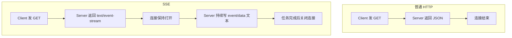

普通接口适合一次性查询：

```text
现在任务是什么状态？
```

SSE 适合服务端持续通知：

```text
任务状态变化了，我主动推给你。
```

## text/event-stream 是什么

`text/event-stream` 不是一种新网络协议，它只是 HTTP 的响应内容类型。

它告诉客户端：

```text
这个响应体是一段持续增长的事件文本流。
```

一个 SSE 事件长这样：

```text
id: commodity-import:job-001
event: task.progress
retry: 1000
data: {"state":"running","progress":{"percent":50}}

```

重点是最后的空行。

```text
空行 = 一个事件结束
```

浏览器 `EventSource` 会按这些字段解析：

| 字段    | 含义                         |
| ------- | ---------------------------- |
| `event` | 事件名，例如 `task.progress` |
| `data`  | 事件数据，通常是 JSON 字符串 |
| `id`    | 事件 ID，可用于断线续传      |
| `retry` | 客户端断线后的重连间隔       |

## 底层数据流

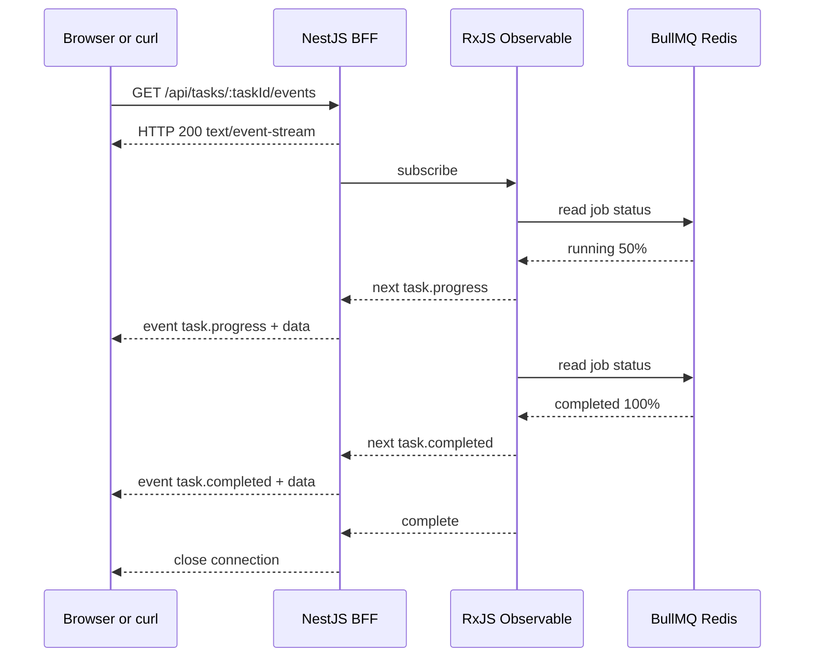

当前项目里，BFF 内部还是每秒读取 BullMQ job 状态。  
但客户端不用轮询 BFF，而是保持一条 SSE 连接等服务端推送。

## NestJS @Sse 做了什么

当前接口：

```ts
@Sse(":taskId/events")
taskEvents(): Observable<MessageEvent> {
  return stream$;
}
```

Nest 做的事可以理解成：

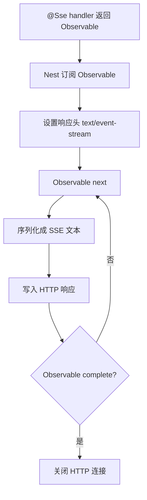

所以 `@Sse()` 的关键不是“开新进程”，而是：

```text
把 Observable 的 next/complete 映射成 HTTP 流式响应。
```

## NestJS 底层怎么封装 SSE

本项目当前安装的是 NestJS 11.1.19。  
`@Sse()` 不是一个独立服务器，也不是 WebSocket 网关，它在 Nest 里主要分成四层封装：

| 层级       | Nest 源码位置                                       | 负责什么                                                               |
| ---------- | --------------------------------------------------- | ---------------------------------------------------------------------- |
| 装饰器层   | `@nestjs/common/decorators/http/sse.decorator.js`   | 给 controller 方法打上 route path、GET method、SSE metadata            |
| 路由执行层 | `@nestjs/core/router/router-execution-context.js`   | 发现这个 handler 是 SSE，切换到 SSE 响应处理逻辑                       |
| 响应控制层 | `@nestjs/core/router/router-response-controller.js` | 校验返回值必须是 Observable，订阅它，处理 complete/error/close         |
| 流转换层   | `@nestjs/core/router/sse-stream.js`                 | 设置 SSE 响应头，把 `MessageEvent` 对象转成 `event/data/id/retry` 文本 |

### 1. 装饰器只负责打元数据

当代码写成：

```ts
@Sse(":taskId/events")
taskEvents(): Observable<MessageEvent> {
  return stream$;
}
```

Nest 底层不会在这里立刻创建连接。  
`@Sse()` 只是把这个方法标记成：

```text
PATH_METADATA = ":taskId/events"
METHOD_METADATA = GET
SSE_METADATA = true
```

这一步的含义是：

```text
这个 handler 是一个 GET 路由。
但它的响应不要按普通 JSON 返回。
后面要走 SSE 专用响应处理。
```

所以 `@Sse()` 本质上仍然是 HTTP 路由装饰器，只是多了一个 `__sse__` 标记。

### 2. 路由执行阶段识别 SSE

请求进来后，Nest 仍然会先走普通 controller 链路：

```text
路由匹配
-> Guard
-> Interceptor 进入
-> Pipe / 参数装饰器取值
-> Controller handler
-> Interceptor 返回
```

在当前项目里，也就是说：

```text
GET /api/tasks/:taskId/events
-> AuthGuard
-> PermissionsGuard
-> @CurrentUser
-> taskEvents()
```

真正不同的是响应阶段。

普通 `@Get()` handler 返回对象时，Nest 会把结果序列化成一次性 JSON 响应。  
`@Sse()` handler 返回 `Observable` 时，Nest 会调用 SSE 专用响应函数。

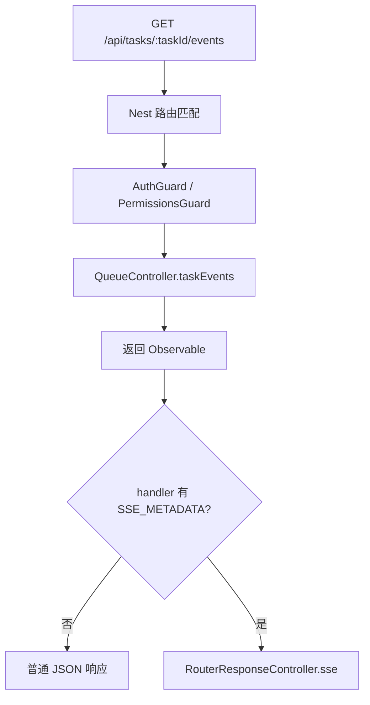

这里有一个关键约束：

```text
SSE handler 必须返回 Observable。
```

如果返回普通对象、数组或 Promise 普通值，Nest 会认为这不是一个可持续输出的事件源。

### 3. 响应控制层订阅 Observable

Nest 拿到 controller 返回值后，会做几件事：

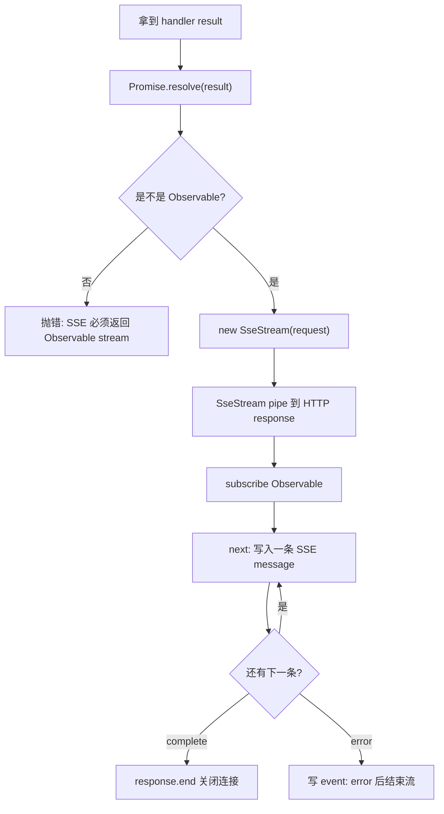

这就是 Nest 对 RxJS 的封装点：

```text
业务代码只负责 next / error / complete。
Nest 负责把这些信号翻译成 HTTP response.write / response.end。
```

当前项目里的业务 Observable 来自：

```text
TaskQueueService.streamTaskStatus(taskId)
```

它每秒读取一次 BullMQ job 状态。  
但 Nest 不知道 BullMQ，也不关心任务状态是什么；Nest 只看到一串 `MessageEvent`。

### 4. SseStream 负责设置响应头

`SseStream` pipe 到 HTTP response 时，会设置 SSE 必要响应头：

```http
Content-Type: text/event-stream
Connection: keep-alive
Cache-Control: private, no-cache, no-store, must-revalidate, max-age=0, no-transform
X-Accel-Buffering: no
```

这些头分别解决几个问题：

| 响应头                            | 作用                                   |
| --------------------------------- | -------------------------------------- |
| `Content-Type: text/event-stream` | 告诉浏览器这是 SSE 事件流              |
| `Connection: keep-alive`          | 表示连接不要按普通短响应立刻关闭       |
| `Cache-Control: no-cache...`      | 避免浏览器、代理缓存这段不断增长的响应 |
| `X-Accel-Buffering: no`           | 提示 Nginx 不要缓冲 SSE 输出           |

所以 Nest 帮你做了协议层的基本封装。  
但生产环境里如果前面还有 Nginx、网关、云负载均衡，仍然要确认这些中间层没有重新打开响应缓冲。

### 5. MessageEvent 怎么变成 SSE 文本

Nest 的 `MessageEvent` 类型大致是：

```ts
interface MessageEvent {
  data: string | object;
  id?: string;
  type?: string;
  retry?: number;
}
```

注意这里的 `type` 对应最终 SSE 文本里的 `event` 字段。

当前项目 controller 最终返回给 Nest 的对象类似：

```ts
{
  data: event.status,
  id: event.status.taskId,
  retry: 1000,
  type: event.type
}
```

Nest 会把它转换成：

```text
event: task.progress
id: commodity-import:job-001
retry: 1000
data: {"taskId":"commodity-import:job-001","state":"running"}

```

转换规则可以理解成：

| `MessageEvent` 字段 | SSE 文本字段 | 说明                                              |
| ------------------- | ------------ | ------------------------------------------------- |
| `type`              | `event:`     | 浏览器用 `addEventListener("task.progress")` 监听 |
| `id`                | `id:`        | 浏览器断线重连时可带 `Last-Event-ID`              |
| `retry`             | `retry:`     | 建议浏览器断线后多久重连                          |
| `data`              | `data:`      | 真正业务数据；对象会先转成 JSON 字符串            |

最后额外写一个空行：

```text
空行 = 这一条 SSE 事件结束
```

### 6. 断开连接时怎么清理

SSE 是长连接，所以断开清理很重要。

Nest 在底层监听 request 的 `close` 事件：

```text
浏览器关闭页面
或 curl 进程结束
或 网络断开
-> request close
-> Nest unsubscribe Observable
-> SseStream end
```

这会触发当前项目 `streamTaskStatus` 里的 teardown：

```text
unsubscribe
-> cleanup()
-> clearTimeout(timer)
-> unregisterConnection()
```

也就是说，当前项目的清理链路是闭合的：

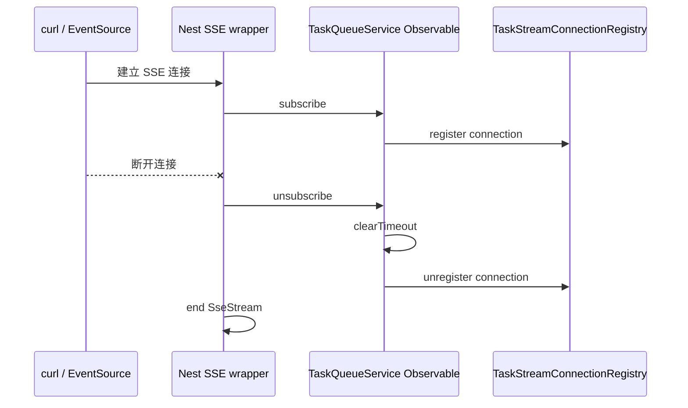

如果没有这条清理链路，客户端虽然断开了，但服务端可能还在后台定时查询 BullMQ，造成无意义的资源占用。

### 7. NestJS 没有替业务做什么

Nest 只封装 SSE 协议输出，不封装任务业务语义。

它不会自动做这些事：

| Nest 不负责                                  | 当前项目由谁负责                              |
| -------------------------------------------- | --------------------------------------------- |
| 判断用户能不能看这个任务                     | `QueueController.assertTaskAccess`            |
| 查询 BullMQ job 状态                         | `TaskQueueService.getTask`                    |
| 决定发 `task.progress` 还是 `task.completed` | `TaskQueueService.toStreamEventType`          |
| 任务完成后结束业务流                         | `streamTaskStatus` 里 `subscriber.complete()` |
| 断线续传历史事件                             | 当前 MVP 未实现                               |
| 业务心跳事件                                 | 当前 MVP 未实现                               |

因此当前项目真正的分工是：

```text
NestJS =
HTTP route + SSE headers + Observable subscription + SSE 文本序列化 + 断开清理

业务代码 =
认证授权 + 任务归属 + BullMQ 状态读取 + 任务事件类型 + 终态 complete
```

## 当前项目的任务进度链路

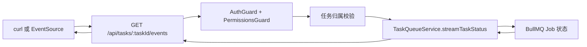

当前 SSE 事件类型：

```text
task.progress
task.completed
task.failed
```

触发规则：

| BullMQ 状态                      | SSE 事件         |
| -------------------------------- | ---------------- |
| `queued` / `running` / `delayed` | `task.progress`  |
| `completed`                      | `task.completed` |
| `failed`                         | `task.failed`    |

## 本次 SSE 功能具体代码怎么实现

本次功能的代码目标很收敛：

```text
把 BullMQ 里的异步任务状态
包装成 NestJS @Sse 能消费的 Observable<MessageEvent>
再通过浏览器 EventSource 或 curl -N 持续推给客户端。
```

涉及的核心文件：

| 文件                                                            | 职责                                                                      |
| --------------------------------------------------------------- | ------------------------------------------------------------------------- |
| `apps/bff/src/queue/queue.controller.ts`                        | 暴露 `GET /api/tasks/:taskId/events`，做登录态、权限、任务归属和 SSE 映射 |
| `apps/bff/src/queue/task-queue.service.ts`                      | 查询 BullMQ job，生成任务状态流，终态后 complete                          |
| `apps/bff/src/queue/task-stream-connection-registry.service.ts` | 记录当前活跃 SSE 连接，按 user/tenant/task 分组统计                       |
| `apps/bff/src/queue/queue.types.ts`                             | 定义 `TaskStatus`、`TaskStatusStreamEvent`、连接元数据等类型              |
| `apps/bff/src/queue/queue.controller.spec.ts`                   | 验证 SSE controller 会带上 user/tenant/task 连接上下文                    |
| `apps/bff/src/queue/task-queue.service.spec.ts`                 | 验证状态映射、终态 complete、连接注册和断开清理                           |

### 总调用链

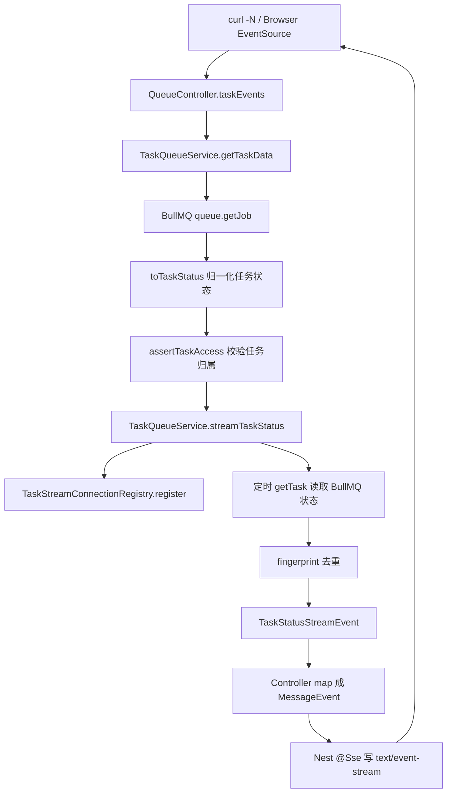

这条链路里有两个边界：

```text
Controller 边界：
负责 HTTP、认证授权、任务归属、把业务事件映射成 Nest MessageEvent。

Service 边界：
负责 BullMQ taskId 解析、状态读取、状态归一化、事件流生成和连接清理。
```

### 1. Controller 如何建立 SSE 流

入口在 `QueueController.taskEvents`：

```ts
@Sse(":taskId/events")
taskEvents(
  @CurrentUser() user: AuthUser,
  @Param("taskId") taskId: string
): Observable<MessageEvent> {
  return from(this.taskQueueService.getTaskData(taskId)).pipe(
    tap(({ data }) => this.assertTaskAccess(user, data)),
    switchMap(({ data, status }) =>
      this.taskQueueService.streamTaskStatus(taskId, {
        connection: {
          taskId,
          tenantId: data.tenantId ?? user.tenantId,
          userId: user.id
        },
        initialStatus: status
      })
    ),
    map((event) => ({
      data: event.status,
      id: event.status.taskId,
      retry: 1000,
      type: event.type
    }))
  );
}
```

这里每一步都有明确目的：

| 代码步骤               | 解决什么问题                                              |
| ---------------------- | --------------------------------------------------------- |
| `getTaskData(taskId)`  | 先读取任务数据和当前状态；不存在就返回 404                |
| `assertTaskAccess`     | SSE 是长连接，建立前必须确认用户有权看这个任务            |
| `switchMap`            | 权限通过后，把一次性读取结果切换成持续任务状态流          |
| `initialStatus`        | 避免客户端连接后等 1 秒才看到第一条状态，先立即推当前状态 |
| `connection`           | 把 task/user/tenant 写入连接登记表，方便统计和清理        |
| `map(...MessageEvent)` | 把业务事件转成 Nest `@Sse()` 需要的 `data/id/retry/type`  |

Controller 的关键点是：

```text
它不自己 setHeader，不自己 response.write。
它只返回 Observable<MessageEvent>。
底层 SSE 协议细节交给 Nest @Sse。
```

### 2. 权限校验为什么放在 stream 前

当前项目先拿到任务数据，再校验任务归属：

```ts
private assertTaskAccess(user: AuthUser, task: TaskJobDataBase) {
  const sameTenant = task.tenantId ? task.tenantId === user.tenantId : true;
  const isOwner = user.id === task.requestedBy && sameTenant;
  const isTenantAdmin = user.roles.includes("admin") && sameTenant;

  if (isOwner || isTenantAdmin) {
    return;
  }

  throw new ForbiddenException("permission denied");
}
```

这一步必须发生在订阅流之前：

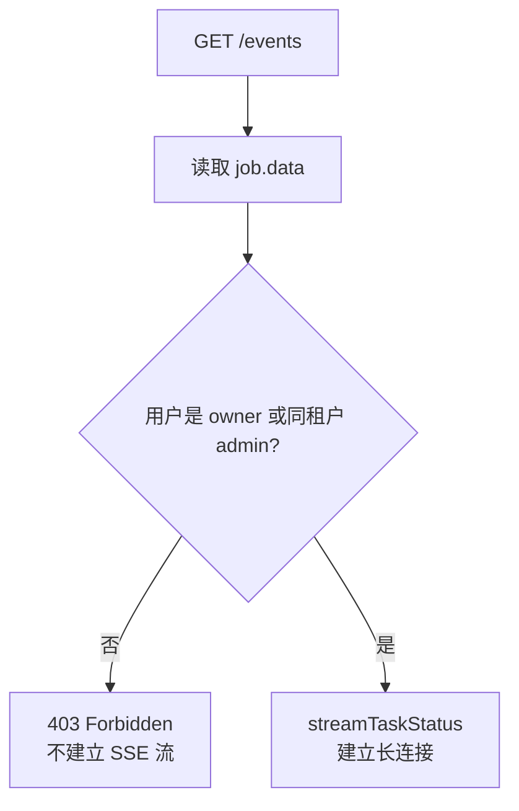

原因是：

```text
SSE 一旦建立，就是持续输出。
如果权限校验放在后面，可能先泄露一部分任务状态。
```

### 3. taskId 怎么定位到 BullMQ job

当前对外暴露的 `taskId` 是：

```text
commodity-import:job-001
```

它由两部分组成：

```text
queueName = commodity-import
jobId = job-001
```

Service 里先解析：

```ts
parseTaskId(taskId: string) {
  const [queueName, ...jobIdParts] = taskId.split(":");
  const jobId = jobIdParts.join(":");

  if (!this.isTaskQueueName(queueName) || !jobId) {
    throw new NotFoundException("task not found");
  }

  return { jobId, queueName };
}
```

然后读取 BullMQ：

```ts
const { jobId, queueName } = this.parseTaskId(taskId);
const job = await this.commodityImportQueue.getJob(jobId);

if (!job) {
  throw new NotFoundException("task not found");
}
```

图解：

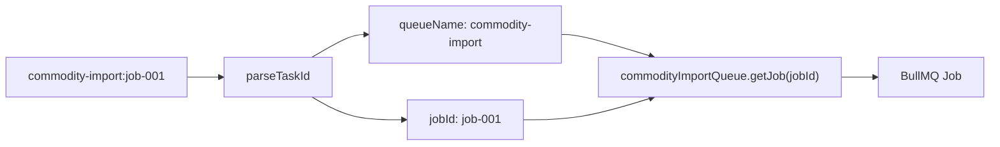

这个设计的好处是：

```text
客户端只拿一个 taskId。
BFF 内部可以从 taskId 反推出任务属于哪条队列。
```

当前 MVP 只支持 `commodity-import` 这一条队列，所以未知 queueName 会直接当成任务不存在。

### 4. BullMQ 状态怎么变成业务状态

BullMQ 的原始状态不一定适合直接暴露给前端。

所以 `toTaskStatus` 会把 BullMQ job 归一化成当前项目自己的 `TaskStatus`：

```ts
return {
  attemptsMade: job.attemptsMade,
  createdAt: this.toDateString(job.timestamp),
  failedReason: job.failedReason || undefined,
  finishedAt: this.toDateString(job.finishedOn),
  jobId,
  name: job.name,
  processedAt: this.toDateString(job.processedOn),
  progress: job.progress,
  queue: queueName,
  result: job.returnvalue,
  state: this.mapState(state),
  taskId: this.buildTaskId(queueName, jobId)
};
```

状态映射规则：

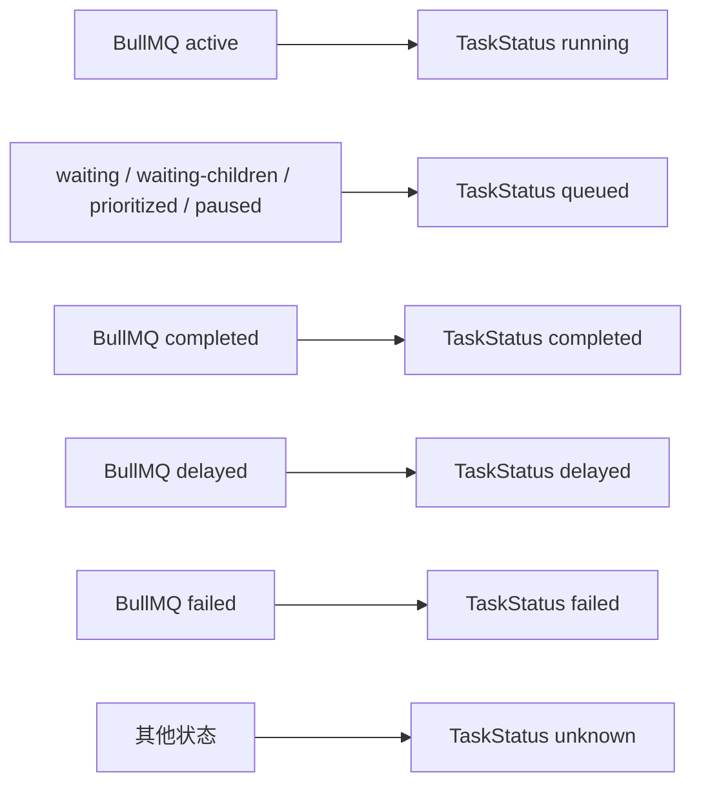

为什么要归一化：

```text
前端不应该依赖 BullMQ 的内部状态命名。
BFF 对外提供稳定的业务状态 contract。
以后底层从 BullMQ 换成别的队列，前端可以少改或不改。
```

### 5. streamTaskStatus 怎么持续推送

`streamTaskStatus` 是本次功能的核心。

它返回一个 RxJS `Observable<TaskStatusStreamEvent>`：

```ts
streamTaskStatus(taskId, options) {
  return new Observable<TaskStatusStreamEvent>((subscriber) => {
    // register connection
    // emit initial status
    // setTimeout loop
    // subscriber.next(...)
    // terminal state -> subscriber.complete()
    // teardown -> cleanup()
  });
}
```

内部循环可以拆成 5 步：

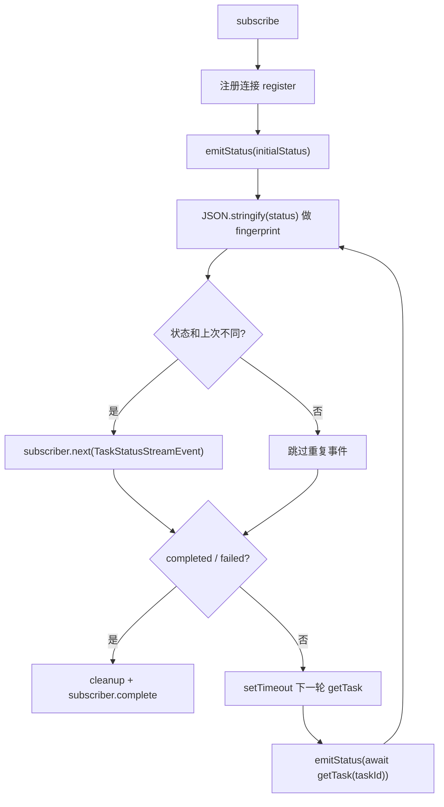

这里有三个关键实现点。

第一，立即发送初始状态：

```ts
void emitStatus(options.initialStatus).then(scheduleNext);
```

这让客户端刚连上就能看到当前任务状态，而不是等下一轮 timer。

第二，用 fingerprint 去重：

```ts
const fingerprint = JSON.stringify(currentStatus);

if (fingerprint !== lastFingerprint) {
  lastFingerprint = fingerprint;
  subscriber.next({
    status: currentStatus,
    type: this.toStreamEventType(currentStatus.state)
  });
}
```

这样如果任务状态没有变化，就不会每秒推一条完全相同的事件。

注意：BFF 当前仍然会每秒查一次 BullMQ，只是不会把重复状态推给客户端。

第三，终态后主动结束流：

```ts
if (TERMINAL_TASK_STATES.has(currentStatus.state)) {
  cleanup();
  subscriber.complete();
}
```

终态集合是：

```ts
const TERMINAL_TASK_STATES = new Set<TaskStatusState>(["completed", "failed"]);
```

也就是说：

```text
completed / failed
-> 发最后一条事件
-> cleanup
-> Observable complete
-> Nest response.end
-> SSE 连接关闭
```

### 6. 业务事件怎么映射成 SSE 事件名

Service 里先把任务状态映射成内部流事件：

```ts
private toStreamEventType(state: TaskStatusState) {
  if (state === "completed") {
    return "task.completed";
  }

  if (state === "failed") {
    return "task.failed";
  }

  return "task.progress";
}
```

然后 Controller 再转成 Nest `MessageEvent`：

```ts
map((event) => ({
  data: event.status,
  id: event.status.taskId,
  retry: 1000,
  type: event.type
}));
```

完整映射链路：

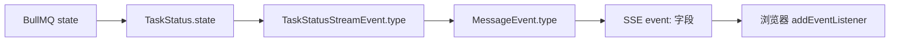

对应关系：

| BullMQ / TaskStatus 状态         | 内部事件 type    | SSE 文本     | 浏览器监听方式                            |
| -------------------------------- | ---------------- | ------------ | ----------------------------------------- |
| `queued` / `running` / `delayed` | `task.progress`  | `event: ...` | `addEventListener("task.progress", ...)`  |
| `completed`                      | `task.completed` | `event: ...` | `addEventListener("task.completed", ...)` |
| `failed`                         | `task.failed`    | `event: ...` | `addEventListener("task.failed", ...)`    |

### 7. 连接注册和断开清理怎么实现

当前项目新增了 `TaskStreamConnectionRegistry`，用来记录活跃 SSE 连接：

```ts
register(connection: TaskStatusStreamConnection) {
  const connectionId = `${connection.taskId}:${connection.userId}:${++this.nextConnectionId}`;

  this.connections.set(connectionId, connection);
  this.addToGroup(this.byTaskId, connection.taskId, connectionId);
  this.addToGroup(this.byTenantId, connection.tenantId, connectionId);
  this.addToGroup(this.byUserId, connection.userId, connectionId);

  let active = true;

  return () => {
    if (!active) {
      return;
    }

    active = false;
    this.unregister(connectionId);
  };
}
```

它的作用不是发送事件，而是给线上观测和限流留接口：

```text
当前有多少 SSE 连接？
某个 user 打开了几条？
某个 tenant 打开了几条？
某个 taskId 被多少客户端订阅？
```

连接生命周期：

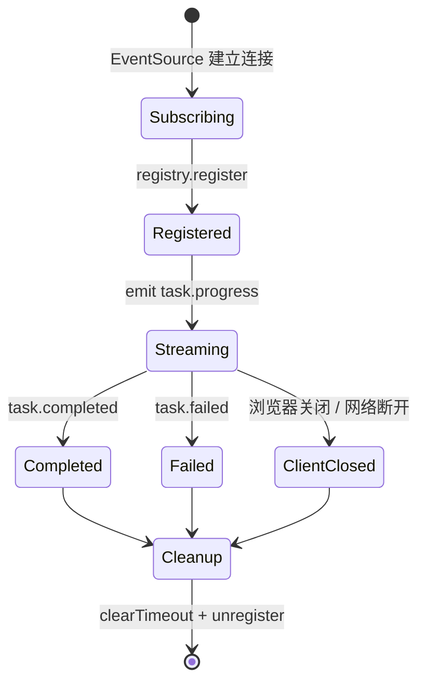

`streamTaskStatus` 里的 cleanup 负责收尾：

```ts
const cleanup = () => {
  closed = true;

  if (timer) {
    clearTimeout(timer);
    timer = undefined;
  }

  if (unregisterConnection) {
    unregisterConnection();
    unregisterConnection = undefined;
  }
};
```

所以本次功能不是只“能推送”，还补了资源回收：

```text
任务终态
或 客户端断开
或 查询 BullMQ 出错
-> cleanup
-> 清 timer
-> 从 registry 移除连接
```

### 8. 错误和终态怎么流转

运行时主要有三类结果：

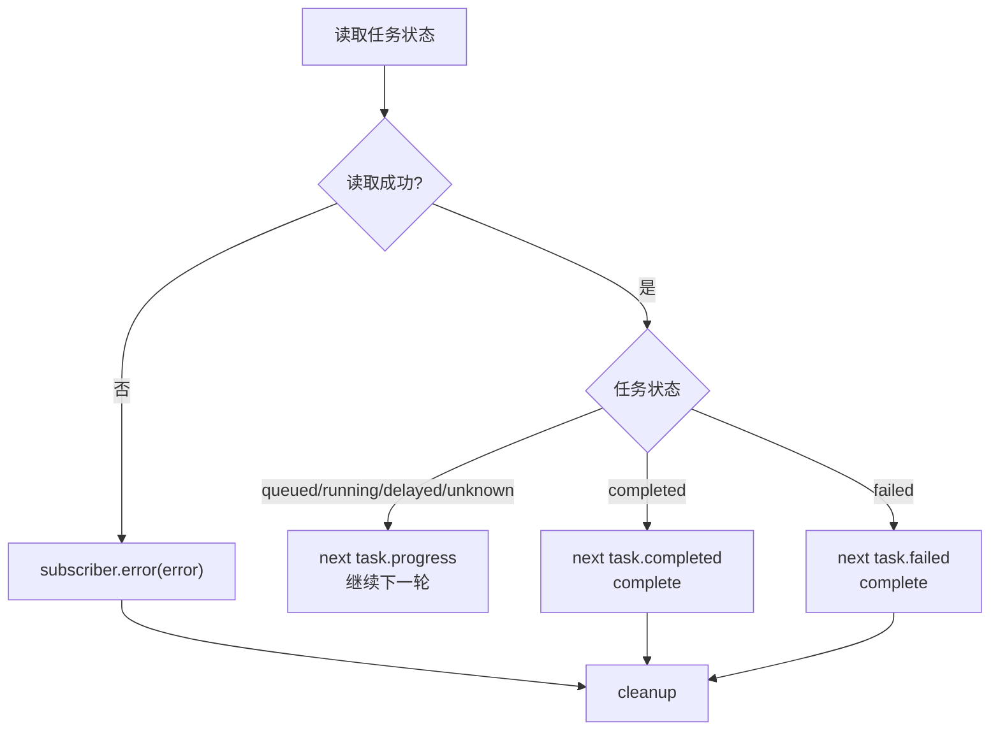

`getTaskData` / `getTask` 找不到任务时会抛 `NotFoundException`。

如果发生在建立流之前，客户端得到普通 404。

如果发生在流内部，Observable 会 `error`，Nest 的 SSE 封装会写一条 `event: error` 后结束流。

当前项目最重要的行为契约是：

```text
running 类状态：继续保持 SSE。
completed / failed：发最后一条事件后关闭 SSE。
not found / permission denied：不应该建立业务 SSE 流。
```

### 9. 测试覆盖了什么

这次功能的测试重点不是“Nest 会不会输出 text/event-stream”，因为那是框架能力。

测试重点是当前项目自己的业务契约：

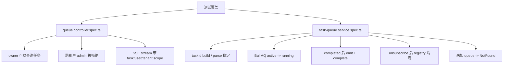

这说明本次功能关注的是：

```text
权限边界正确。
状态 contract 稳定。
终态能关闭。
断开能清理。
连接能被观测。
```

没有覆盖或生产中还需要补的：

| 未覆盖项                          | 原因或后续方向                                                       |
| --------------------------------- | -------------------------------------------------------------------- |
| 真实 HTTP `text/event-stream` e2e | 当前测试直接调用 controller/service；可后续用 supertest 或浏览器验证 |
| 代理缓冲行为                      | 需要在 Nginx / 网关环境验证                                          |
| `Last-Event-ID` 断线续传          | 当前 MVP 是重连后读取当前 BullMQ 状态，不做历史事件回放              |
| heartbeat                         | 当前状态不变时不会推送心跳，生产长连接可按需要补                     |

## 浏览器或客户端怎么接收 SSE

浏览器接收 SSE 的核心是：

```text
不是等整个 HTTP 响应结束再处理。
而是一边读取响应 body，一边按 SSE 文本格式解析事件。
```

当前项目服务端推出来的原始文本类似：

```text
event: task.progress
id: commodity-import:job-001
retry: 1000
data: {"taskId":"commodity-import:job-001","state":"running","progress":50}

```

最后的空行很关键：

```text
浏览器遇到空行
-> 认为一条 SSE 事件结束
-> 组装成 MessageEvent
-> 触发对应事件监听器
```

客户端代码通常这样写：

```ts
const source = new EventSource("/api/tasks/commodity-import:job-001/events");

source.addEventListener("task.progress", (event) => {
  const status = JSON.parse(event.data);
  console.log("任务进度", status);
});

source.addEventListener("task.completed", (event) => {
  const status = JSON.parse(event.data);
  console.log("任务完成", status);
  source.close();
});

source.addEventListener("task.failed", (event) => {
  const status = JSON.parse(event.data);
  console.log("任务失败", status);
  source.close();
});

source.onerror = () => {
  console.log("SSE 连接异常或正在重连");
};
```

浏览器内部处理链路：

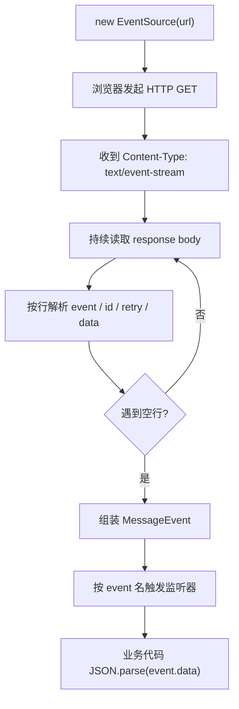

字段对应关系：

| 服务端 SSE 字段          | 浏览器里怎么体现                                   |
| ------------------------ | -------------------------------------------------- |
| `event: task.progress`   | 触发 `addEventListener("task.progress")`           |
| `data: {...}`            | 变成 `event.data`，类型是字符串                    |
| `id: commodity-import:1` | 变成 `event.lastEventId`，重连续传时可作为游标     |
| `retry: 1000`            | 浏览器断线后按这个建议间隔重连                     |
| 空行                     | 当前事件结束，浏览器可以把缓冲的字段派发给 JS 回调 |

几个容易踩坑的点：

| 点                          | 真实表现                                                | 当前项目怎么处理                                                            |
| --------------------------- | ------------------------------------------------------- | --------------------------------------------------------------------------- |
| `event.data` 不是对象       | 直接 `event.data.state` 会拿不到值                      | 前端需要 `JSON.parse(event.data)`                                           |
| 服务端不写 `event:`         | 浏览器默认触发 `message` 事件                           | 当前项目写 `type: task.progress / task.completed / task.failed`             |
| `EventSource` 会自动重连    | 任务完成后如果不关闭，浏览器可能继续请求                | `task.completed` / `task.failed` 后前端应 `source.close()`                  |
| 原生 `EventSource` 不能加头 | 不能像 `fetch` 一样随意加 `Authorization` 自定义 header | 当前项目用 cookie 登录态，同源请求会自动携带 `next_bff_session` 这类 cookie |

如果是跨域 SSE，并且需要带 cookie，前端通常要写：

```ts
const source = new EventSource(url, {
  withCredentials: true
});
```

但后端也必须允许 CORS credentials。  
当前项目的任务进度 SSE 更适合同源 cookie 模式，因为原生 `EventSource` 对自定义 header 支持很弱。

## 为什么 curl 要加 -N

测试命令：

```bash
curl -N \
  -b "$COOKIE" \
  -H "Accept: text/event-stream" \
  "$BFF/api/tasks/$TASK_ID/events"
```

`-N` 的意思是：

```text
不要缓冲响应。
```

如果不加 `-N`，curl 可能等缓冲区满了才打印，看起来像 SSE 没有推送。

## SSE 和轮询的区别

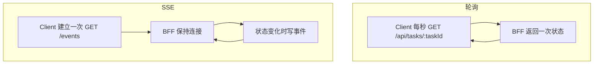

轮询的问题：

```text
大量客户端会制造大量重复 HTTP 请求。
```

SSE 的优势：

```text
一个任务一条连接，服务端有变化再推。
```

当前实现的边界：

```text
客户端不轮询 BFF。
BFF 内部仍每秒读取 BullMQ 状态。
```

更彻底的事件化方案是：

```text
BullMQ QueueEvents
-> BFF SSE
-> Browser EventSource
```

## SSE 和 WebSocket 的区别

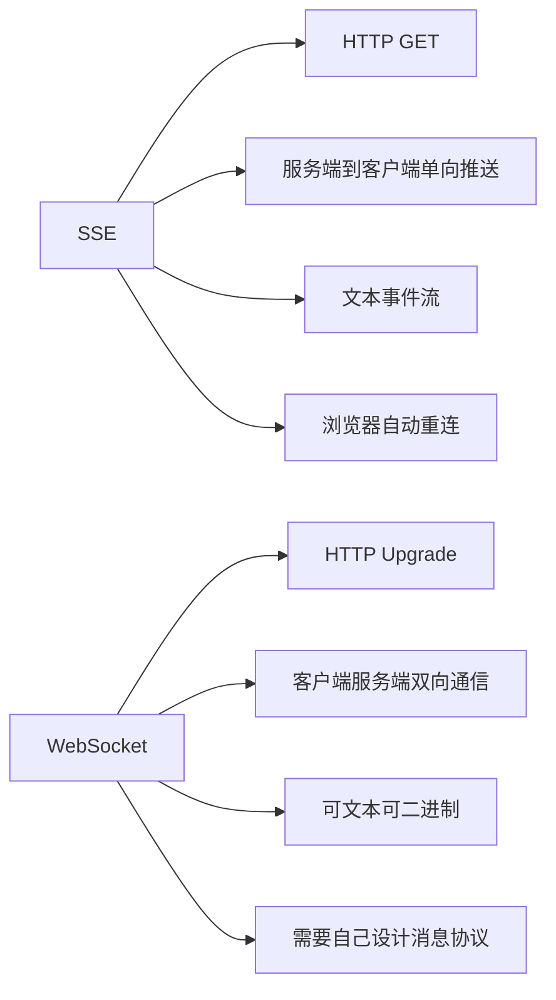

任务进度推送更适合 SSE：

```text
任务进度主要是服务端推给前端。
前端不需要频繁往服务端发消息。
```

如果是聊天、多人协作、实时游戏，才更适合 WebSocket。  
当前项目只是任务进度单向推送，所以不引入 `@WebSocketGateway()`。

## SSE 线上 Top 3 问题

### 问题 1：本地正常，线上事件延迟到一批才到

最常见现象：

```text
服务端明明已经 next 了。
浏览器或 curl 很久没显示。
过一会儿突然刷出一批事件。
```

根因通常不是 Nest 没写，而是中间层缓冲了响应：

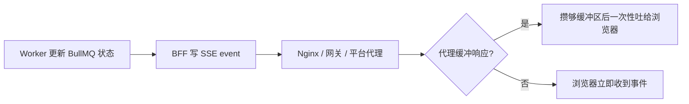

怎么观察：

| 观察点             | 判断方式                                                         |
| ------------------ | ---------------------------------------------------------------- |
| BFF 日志           | 服务端已经产生 `task.progress`，但客户端没立刻收到               |
| `curl -N` 直连 BFF | 直连正常，经过域名或网关变慢，基本就是代理层问题                 |
| 浏览器 Network     | 请求一直 pending 是正常的；关键看 response stream 是否持续增长   |
| 代理配置           | 存在 `proxy_buffering`、gzip、平台默认 response buffering 的风险 |

解决方式：

```text
SSE 路径必须关闭响应缓冲。
不要让代理压缩、缓存或攒包。
```

Nest 当前已经通过 `SseStream` 设置了这些头：

```http
Content-Type: text/event-stream
Cache-Control: private, no-cache, no-store, must-revalidate, max-age=0, no-transform
X-Accel-Buffering: no
```

但这些头不是所有平台都会完全尊重。  
如果前面有 Nginx，SSE 路径通常还需要显式配置：

```nginx
location /api/tasks/ {
  proxy_http_version 1.1;
  proxy_buffering off;
  proxy_cache off;
  gzip off;
  proxy_read_timeout 1h;
}
```

当前项目验证时优先用：

```bash
curl -N \
  -b "$COOKIE" \
  -H "Accept: text/event-stream" \
  "$BFF/api/tasks/$TASK_ID/events"
```

判断标准：

```text
任务状态变化后，curl 应该立即打印下一条 event/data。
如果直连立即打印，走网关延迟打印，优先查代理缓冲。
```

### 问题 2：连接频繁断开，然后浏览器一直自动重连

最常见现象：

```text
Network 面板里 /events 一直 pending、closed、pending、closed。
后端日志里同一个 taskId 被反复订阅。
用户看到进度偶尔跳，或者任务完成后还在发请求。
```

典型根因有三个：

| 根因                           | 为什么会发生                                            |
| ------------------------------ | ------------------------------------------------------- |
| 中间层 idle timeout            | 一段时间没有任何字节输出，代理认为连接空闲并关闭        |
| 前端没有在终态关闭 EventSource | `EventSource` 默认会自动重连，完成后不 close 就可能再连 |
| 服务端没有处理 close 清理      | 客户端断了，但服务端定时器、订阅、连接登记还留着        |

问题链路：

```mermaid
sequenceDiagram
  participant Browser as Browser EventSource
  participant Proxy as Proxy / LB
  participant BFF as NestJS BFF
  participant Stream as streamTaskStatus

  Browser->>Proxy: GET /api/tasks/:taskId/events
  Proxy->>BFF: 转发 SSE 请求
  BFF->>Stream: subscribe
  Stream-->>BFF: 状态没变化，暂时不发新事件
  Proxy--xBrowser: idle timeout 关闭连接
  Browser->>Proxy: 自动重连
  Proxy->>BFF: 新的 SSE 请求
  BFF->>Stream: 再次 subscribe
```

解决方式：

| 位置     | 处理方式                                                                     |
| -------- | ---------------------------------------------------------------------------- |
| 前端     | 收到 `task.completed` / `task.failed` 后立即 `source.close()`                |
| BFF      | request `close` 时必须 `unsubscribe`，当前 Nest + Observable teardown 已覆盖 |
| 业务流   | 终态后 `subscriber.complete()`，当前 `streamTaskStatus` 已覆盖               |
| 代理层   | 增大 SSE 路径 idle/read timeout                                              |
| 生产增强 | 长时间没有业务事件时发 heartbeat，例如注释帧或轻量 `task.heartbeat`          |

当前项目已经有两个关键保护：

```text
1. completed / failed 后 subscriber.complete()
2. 客户端断开后 Observable teardown 会 clearTimeout + unregisterConnection
```

还可以补的生产能力：

```text
如果任务状态长时间不变化，定期发 heartbeat，避免代理以为连接空闲。
```

心跳不一定要改变业务状态。SSE 协议里可以发注释帧：

```text
: heartbeat

```

浏览器不会把注释帧派发成业务事件，但它能让连接上持续有字节流动。  
如果需要前端也观察心跳，可以发显式事件：

```text
event: task.heartbeat
data: {"taskId":"commodity-import:job-001","ts":"2026-05-23T12:00:00.000Z"}

```

### 问题 3：连接数变多后，BFF 内存、句柄或 Redis 压力上升

最常见现象：

```text
用户一多，BFF 的 open connections、timer、memory、Redis read 明显上升。
任务已经结束，但连接数没有下降。
多实例部署后，不同实例看到的连接状态不一致。
```

SSE 的成本模型和普通接口不一样：

```text
普通 HTTP =
一次请求 -> 一次响应 -> 连接结束

SSE =
一次请求 -> 长时间占用一个 HTTP 连接 -> 持续占用服务端资源
```

当前项目还要注意一个额外点：

```text
TaskQueueService.streamTaskStatus 当前每条连接会定时读取 BullMQ job 状态。
客户端不轮询 BFF，但 BFF 内部仍有定时读取 Redis 的成本。
```

资源压力图：

```mermaid
flowchart TD
  users["大量浏览器 EventSource"] --> conns["BFF 长连接数上升"]
  conns --> timers["每条连接一个状态检查 timer"]
  timers --> redis["周期读取 BullMQ / Redis"]
  conns --> memory["连接对象 / subscription / registry 占用内存"]
  redis --> pressure["Redis QPS 上升"]
  memory --> pressure
```

怎么解决：

| 方向            | 做法                                                                  |
| --------------- | --------------------------------------------------------------------- |
| 终态关闭        | 任务 `completed` / `failed` 后服务端 complete，前端 close             |
| 断开清理        | close 时 clear timer、unsubscribe、unregister，当前项目已经实现       |
| 限制连接        | 对单用户、单租户、单 taskId 的连接数做上限，避免一个页面开多个连接    |
| 降低 Redis 压力 | 用 BullMQ `QueueEvents` 或 Redis pub/sub 推动事件，减少每连接定时读取 |
| 可观测性        | 记录当前 SSE 连接数、按用户/租户/taskId 分组的连接数、断开原因        |
| 多实例部署      | 不把连接注册表当成全局真相；跨实例事件来源应放在 Redis / QueueEvents  |

更适合生产的事件化结构：

```mermaid
flowchart LR
  worker["Worker"] --> bull["BullMQ / Redis"]
  bull --> events["QueueEvents / PubSub"]
  events --> bff1["BFF instance A"]
  events --> bff2["BFF instance B"]
  bff1 --> c1["Browser A SSE"]
  bff2 --> c2["Browser B SSE"]
```

这样 BFF 不需要为每条 SSE 连接每秒主动查 Redis，而是订阅共享事件源。  
当前 MVP 为了简单可解释，仍采用“每条连接定时读取当前 job 状态”的方式。

### Top 3 快速排障表

| 现象                  | 优先怀疑                | 第一验证动作                      | 典型修复                                        |
| --------------------- | ----------------------- | --------------------------------- | ----------------------------------------------- |
| 事件一批一批到        | 代理缓冲 / gzip / 缓存  | `curl -N` 直连 BFF 和走网关对比   | 关闭 SSE 路径 buffering、cache、gzip            |
| `/events` 反复重连    | idle timeout / 未 close | 看 Network 是否 closed 后自动重连 | 加 heartbeat、终态 close、调大代理 read timeout |
| 连接数和 Redis QPS 高 | 长连接成本 / 轮询式实现 | 看连接数、timer、Redis QPS        | 终态关闭、连接限流、改 QueueEvents / pubsub     |

## 真实系统要注意什么

1. 连接数

SSE 是长连接。用户很多时，要关注 BFF 进程能承受多少连接。

2. 代理缓冲

Nginx、网关、平台代理可能缓冲响应，导致事件不能及时到达。生产要关闭 SSE 路径的响应缓冲。

3. 断线重连

浏览器 `EventSource` 会自动重连。服务端如果支持 `Last-Event-ID`，可以做事件级续传。  
当前项目不做事件级续传，采用“重连后重新读取 BullMQ 当前状态”的恢复方式。

4. 权限校验

SSE 是长连接，建立连接前必须校验登录态、任务归属和租户边界。当前项目只允许任务创建者或同租户 admin 查看。

5. 任务完成后关闭连接

任务进入 `completed` 或 `failed` 后应主动结束 SSE，避免无意义占用连接。

当前项目已经做到：

```text
completed / failed 后 Observable complete
Nest 关闭 HTTP SSE 连接
```

## 最小心智模型

```text
SSE =
HTTP GET 不结束
+ Content-Type: text/event-stream
+ 服务端持续写 event/data 文本
+ 客户端 EventSource 或 curl -N 持续读取
```

当前项目：

```text
BullMQ job 状态
-> TaskQueueService Observable
-> Nest @Sse
-> text/event-stream
-> curl / EventSource
```
