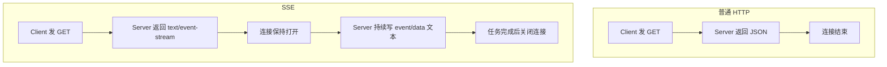
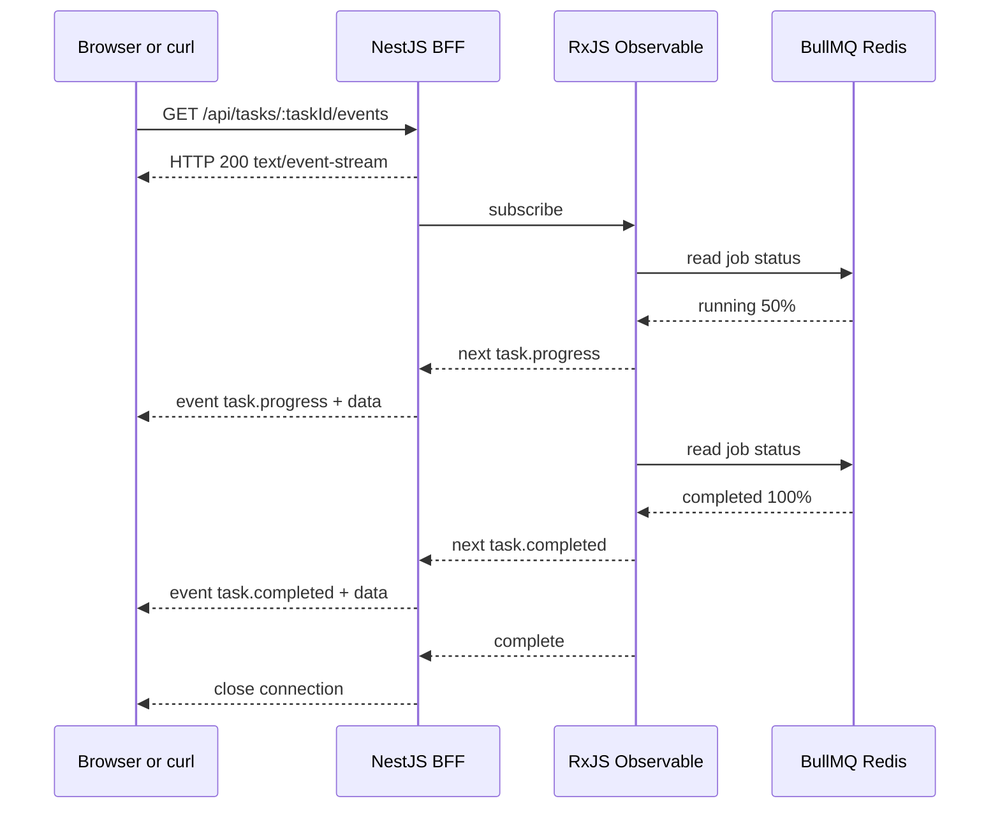
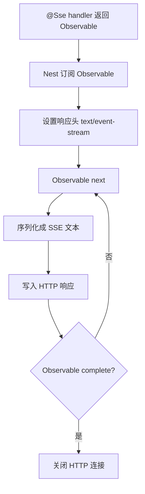
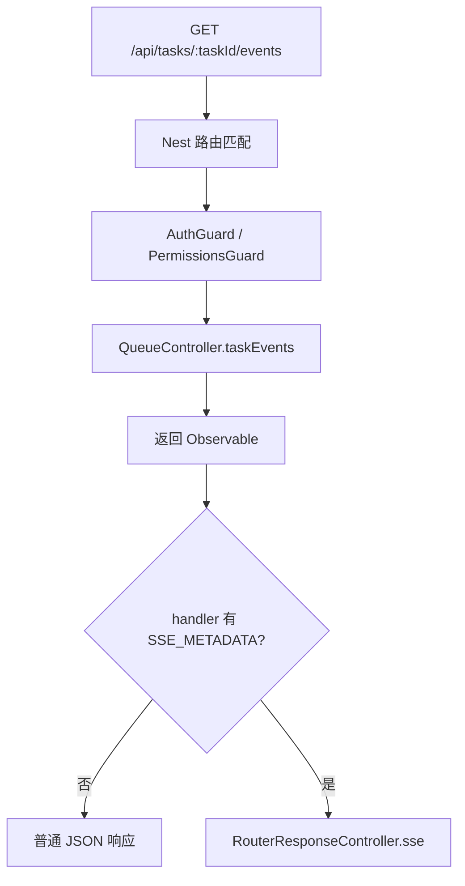
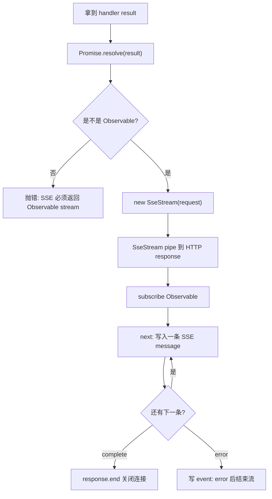
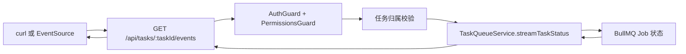
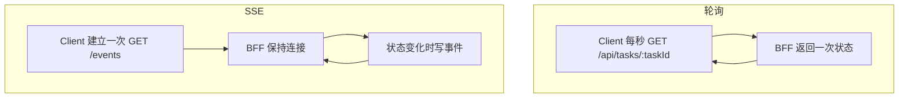
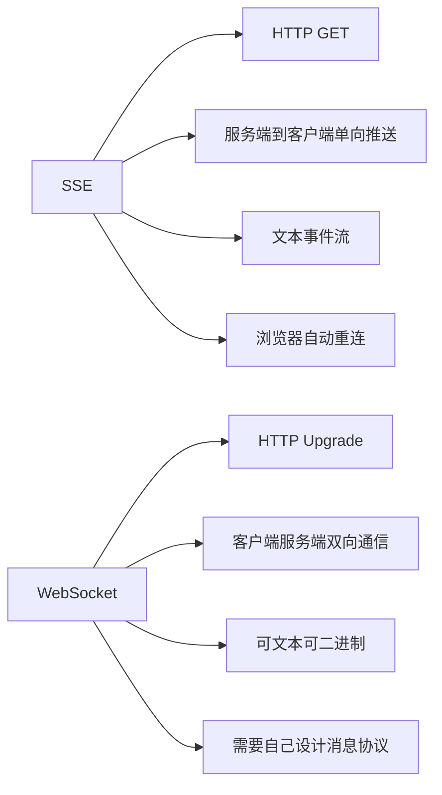

# SSE 第一性原理图解

## 一句话

SSE 的本质是：

```text
一个不立刻结束的 HTTP GET 响应。
```

服务端把响应类型设成：

```http
Content-Type: text/event-stream
```

然后持续往这个 HTTP 响应里写入事件文本。

## 普通 HTTP 和 SSE 的区别



普通接口适合一次性查询：

```text
现在任务是什么状态？
```

SSE 适合服务端持续通知：

```text
任务状态变化了，我主动推给你。
```

## text/event-stream 是什么

`text/event-stream` 不是一种新网络协议，它只是 HTTP 的响应内容类型。

它告诉客户端：

```text
这个响应体是一段持续增长的事件文本流。
```

一个 SSE 事件长这样：

```text
id: commodity-import:job-001
event: task.progress
retry: 1000
data: {"state":"running","progress":{"percent":50}}

```

重点是最后的空行。

```text
空行 = 一个事件结束
```

浏览器 `EventSource` 会按这些字段解析：

| 字段    | 含义                         |
| ------- | ---------------------------- |
| `event` | 事件名，例如 `task.progress` |
| `data`  | 事件数据，通常是 JSON 字符串 |
| `id`    | 事件 ID，可用于断线续传      |
| `retry` | 客户端断线后的重连间隔       |

## 底层数据流



当前项目里，BFF 内部还是每秒读取 BullMQ job 状态。  
但客户端不用轮询 BFF，而是保持一条 SSE 连接等服务端推送。

## NestJS @Sse 做了什么

当前接口：

```ts
@Sse(":taskId/events")
taskEvents(): Observable<MessageEvent> {
  return stream$;
}
```

Nest 做的事可以理解成：



所以 `@Sse()` 的关键不是“开新进程”，而是：

```text
把 Observable 的 next/complete 映射成 HTTP 流式响应。
```

## NestJS 底层怎么封装 SSE

本项目当前安装的是 NestJS 11.1.19。  
`@Sse()` 不是一个独立服务器，也不是 WebSocket 网关，它在 Nest 里主要分成四层封装：

| 层级       | Nest 源码位置                                       | 负责什么                                                               |
| ---------- | --------------------------------------------------- | ---------------------------------------------------------------------- |
| 装饰器层   | `@nestjs/common/decorators/http/sse.decorator.js`   | 给 controller 方法打上 route path、GET method、SSE metadata            |
| 路由执行层 | `@nestjs/core/router/router-execution-context.js`   | 发现这个 handler 是 SSE，切换到 SSE 响应处理逻辑                       |
| 响应控制层 | `@nestjs/core/router/router-response-controller.js` | 校验返回值必须是 Observable，订阅它，处理 complete/error/close         |
| 流转换层   | `@nestjs/core/router/sse-stream.js`                 | 设置 SSE 响应头，把 `MessageEvent` 对象转成 `event/data/id/retry` 文本 |

### 1. 装饰器只负责打元数据

当代码写成：

```ts
@Sse(":taskId/events")
taskEvents(): Observable<MessageEvent> {
  return stream$;
}
```

Nest 底层不会在这里立刻创建连接。  
`@Sse()` 只是把这个方法标记成：

```text
PATH_METADATA = ":taskId/events"
METHOD_METADATA = GET
SSE_METADATA = true
```

这一步的含义是：

```text
这个 handler 是一个 GET 路由。
但它的响应不要按普通 JSON 返回。
后面要走 SSE 专用响应处理。
```

所以 `@Sse()` 本质上仍然是 HTTP 路由装饰器，只是多了一个 `__sse__` 标记。

### 2. 路由执行阶段识别 SSE

请求进来后，Nest 仍然会先走普通 controller 链路：

```text
路由匹配
-> Guard
-> Interceptor 进入
-> Pipe / 参数装饰器取值
-> Controller handler
-> Interceptor 返回
```

在当前项目里，也就是说：

```text
GET /api/tasks/:taskId/events
-> AuthGuard
-> PermissionsGuard
-> @CurrentUser
-> taskEvents()
```

真正不同的是响应阶段。

普通 `@Get()` handler 返回对象时，Nest 会把结果序列化成一次性 JSON 响应。  
`@Sse()` handler 返回 `Observable` 时，Nest 会调用 SSE 专用响应函数。



这里有一个关键约束：

```text
SSE handler 必须返回 Observable。
```

如果返回普通对象、数组或 Promise 普通值，Nest 会认为这不是一个可持续输出的事件源。

### 3. 响应控制层订阅 Observable

Nest 拿到 controller 返回值后，会做几件事：



这就是 Nest 对 RxJS 的封装点：

```text
业务代码只负责 next / error / complete。
Nest 负责把这些信号翻译成 HTTP response.write / response.end。
```

当前项目里的业务 Observable 来自：

```text
TaskQueueService.streamTaskStatus(taskId)
```

它每秒读取一次 BullMQ job 状态。  
但 Nest 不知道 BullMQ，也不关心任务状态是什么；Nest 只看到一串 `MessageEvent`。

### 4. SseStream 负责设置响应头

`SseStream` pipe 到 HTTP response 时，会设置 SSE 必要响应头：

```http
Content-Type: text/event-stream
Connection: keep-alive
Cache-Control: private, no-cache, no-store, must-revalidate, max-age=0, no-transform
X-Accel-Buffering: no
```

这些头分别解决几个问题：

| 响应头                            | 作用                                   |
| --------------------------------- | -------------------------------------- |
| `Content-Type: text/event-stream` | 告诉浏览器这是 SSE 事件流              |
| `Connection: keep-alive`          | 表示连接不要按普通短响应立刻关闭       |
| `Cache-Control: no-cache...`      | 避免浏览器、代理缓存这段不断增长的响应 |
| `X-Accel-Buffering: no`           | 提示 Nginx 不要缓冲 SSE 输出           |

所以 Nest 帮你做了协议层的基本封装。  
但生产环境里如果前面还有 Nginx、网关、云负载均衡，仍然要确认这些中间层没有重新打开响应缓冲。

### 5. MessageEvent 怎么变成 SSE 文本

Nest 的 `MessageEvent` 类型大致是：

```ts
interface MessageEvent {
  data: string | object;
  id?: string;
  type?: string;
  retry?: number;
}
```

注意这里的 `type` 对应最终 SSE 文本里的 `event` 字段。

当前项目 controller 最终返回给 Nest 的对象类似：

```ts
{
  data: event.status,
  id: event.status.taskId,
  retry: 1000,
  type: event.type
}
```

Nest 会把它转换成：

```text
event: task.progress
id: commodity-import:job-001
retry: 1000
data: {"taskId":"commodity-import:job-001","state":"running"}

```

转换规则可以理解成：

| `MessageEvent` 字段 | SSE 文本字段 | 说明                                              |
| ------------------- | ------------ | ------------------------------------------------- |
| `type`              | `event:`     | 浏览器用 `addEventListener("task.progress")` 监听 |
| `id`                | `id:`        | 浏览器断线重连时可带 `Last-Event-ID`              |
| `retry`             | `retry:`     | 建议浏览器断线后多久重连                          |
| `data`              | `data:`      | 真正业务数据；对象会先转成 JSON 字符串            |

最后额外写一个空行：

```text
空行 = 这一条 SSE 事件结束
```

### 6. 断开连接时怎么清理

SSE 是长连接，所以断开清理很重要。

Nest 在底层监听 request 的 `close` 事件：

```text
浏览器关闭页面
或 curl 进程结束
或 网络断开
-> request close
-> Nest unsubscribe Observable
-> SseStream end
```

这会触发当前项目 `streamTaskStatus` 里的 teardown：

```text
unsubscribe
-> cleanup()
-> clearTimeout(timer)
-> unregisterConnection()
```

也就是说，当前项目的清理链路是闭合的：

```mermaid
sequenceDiagram
  participant Client as curl / EventSource
  participant Nest as Nest SSE wrapper
  participant Stream as TaskQueueService Observable
  participant Registry as TaskStreamConnectionRegistry

  Client->>Nest: 建立 SSE 连接
  Nest->>Stream: subscribe
  Stream->>Registry: register connection
  Client--xNest: 断开连接
  Nest->>Stream: unsubscribe
  Stream->>Stream: clearTimeout
  Stream->>Registry: unregister connection
  Nest->>Nest: end SseStream
```



如果没有这条清理链路，客户端虽然断开了，但服务端可能还在后台定时查询 BullMQ，造成无意义的资源占用。

### 7. NestJS 没有替业务做什么

Nest 只封装 SSE 协议输出，不封装任务业务语义。

它不会自动做这些事：

| Nest 不负责                                  | 当前项目由谁负责                              |
| -------------------------------------------- | --------------------------------------------- |
| 判断用户能不能看这个任务                     | `QueueController.assertTaskAccess`            |
| 查询 BullMQ job 状态                         | `TaskQueueService.getTask`                    |
| 决定发 `task.progress` 还是 `task.completed` | `TaskQueueService.toStreamEventType`          |
| 任务完成后结束业务流                         | `streamTaskStatus` 里 `subscriber.complete()` |
| 断线续传历史事件                             | 当前 MVP 未实现                               |
| 业务心跳事件                                 | 当前 MVP 未实现                               |

因此当前项目真正的分工是：

```text
NestJS =
HTTP route + SSE headers + Observable subscription + SSE 文本序列化 + 断开清理

业务代码 =
认证授权 + 任务归属 + BullMQ 状态读取 + 任务事件类型 + 终态 complete
```

## 当前项目的任务进度链路



当前 SSE 事件类型：

```text
task.progress
task.completed
task.failed
```

触发规则：

| BullMQ 状态                      | SSE 事件         |
| -------------------------------- | ---------------- |
| `queued` / `running` / `delayed` | `task.progress`  |
| `completed`                      | `task.completed` |
| `failed`                         | `task.failed`    |

## 为什么 curl 要加 -N

测试命令：

```bash
curl -N \
  -b "$COOKIE" \
  -H "Accept: text/event-stream" \
  "$BFF/api/tasks/$TASK_ID/events"
```

`-N` 的意思是：

```text
不要缓冲响应。
```

如果不加 `-N`，curl 可能等缓冲区满了才打印，看起来像 SSE 没有推送。

## SSE 和轮询的区别



轮询的问题：

```text
大量客户端会制造大量重复 HTTP 请求。
```

SSE 的优势：

```text
一个任务一条连接，服务端有变化再推。
```

当前实现的边界：

```text
客户端不轮询 BFF。
BFF 内部仍每秒读取 BullMQ 状态。
```

更彻底的事件化方案是：

```text
BullMQ QueueEvents
-> BFF SSE
-> Browser EventSource
```

## SSE 和 WebSocket 的区别



任务进度推送更适合 SSE：

```text
任务进度主要是服务端推给前端。
前端不需要频繁往服务端发消息。
```

如果是聊天、多人协作、实时游戏，才更适合 WebSocket。  
当前项目只是任务进度单向推送，所以不引入 `@WebSocketGateway()`。

## 真实系统要注意什么

1. 连接数

SSE 是长连接。用户很多时，要关注 BFF 进程能承受多少连接。

2. 代理缓冲

Nginx、网关、平台代理可能缓冲响应，导致事件不能及时到达。生产要关闭 SSE 路径的响应缓冲。

3. 断线重连

浏览器 `EventSource` 会自动重连。服务端如果支持 `Last-Event-ID`，可以做事件级续传。  
当前项目不做事件级续传，采用“重连后重新读取 BullMQ 当前状态”的恢复方式。

4. 权限校验

SSE 是长连接，建立连接前必须校验登录态、任务归属和租户边界。当前项目只允许任务创建者或同租户 admin 查看。

5. 任务完成后关闭连接

任务进入 `completed` 或 `failed` 后应主动结束 SSE，避免无意义占用连接。

当前项目已经做到：

```text
completed / failed 后 Observable complete
Nest 关闭 HTTP SSE 连接
```

## 最小心智模型

```text
SSE =
HTTP GET 不结束
+ Content-Type: text/event-stream
+ 服务端持续写 event/data 文本
+ 客户端 EventSource 或 curl -N 持续读取
```

当前项目：

```text
BullMQ job 状态
-> TaskQueueService Observable
-> Nest @Sse
-> text/event-stream
-> curl / EventSource
```
