# SSE 任务进度新增逻辑图解

本文只解释本次新增的代码逻辑：

```text
GET /api/tasks/:taskId/events
```

它的目标是：

```text
前端提交异步任务后，不再反复轮询任务状态，而是打开一条 SSE 连接等待 BFF 推送进度。
```

当前已接入：

```text
商品批量导入任务 commodity-import
```

审计导出、图片扫描后续如果重新接队列，也可以复用同一个任务事件接口。

## 新增了什么

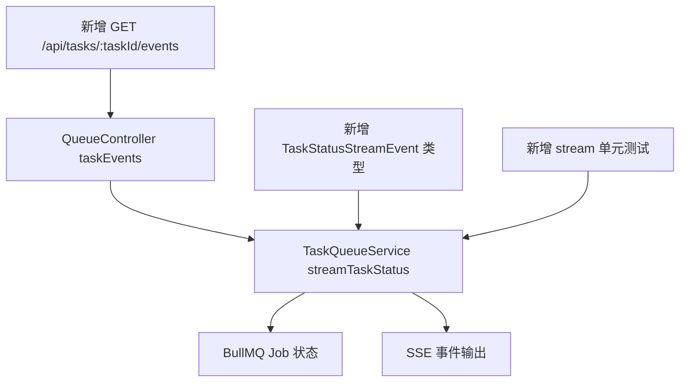

对应文件：

| 文件 | 作用 |
|---|---|
| `apps/bff/src/queue/queue.controller.ts` | 新增 `@Sse(":taskId/events")` 接口 |
| `apps/bff/src/queue/task-queue.service.ts` | 新增 `streamTaskStatus`，把任务状态变成事件流 |
| `apps/bff/src/queue/queue.types.ts` | 新增 SSE 事件类型 |
| `apps/bff/src/queue/task-queue.service.spec.ts` | 覆盖任务完成后 stream 自动结束 |
| `docs/47-SSE任务进度curl测试操作.md` | curl 测试操作 |
| `docs/48-SSE第一性原理图解.md` | SSE 底层原理 |

## 整体流程

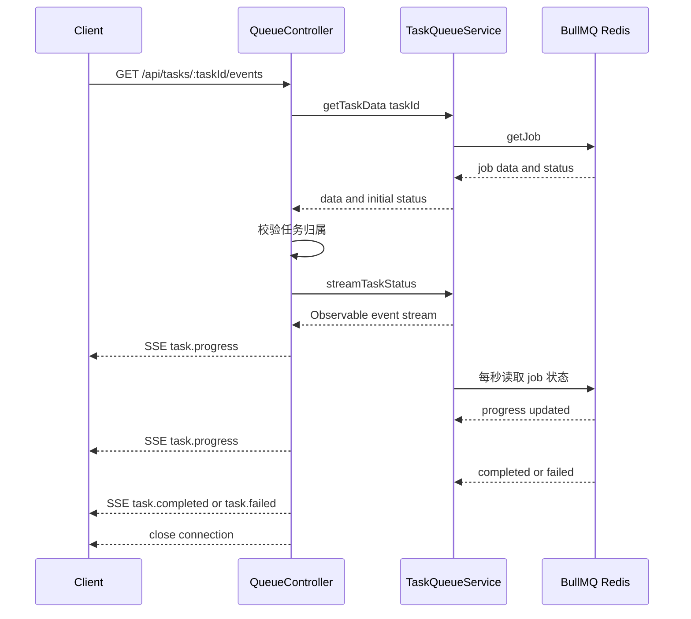

这条链路里有两个阶段：

```text
建立连接前：校验任务是否存在、当前用户能不能看。
建立连接后：持续读取任务状态，有变化就推事件。
```

## Controller 做什么

新增入口在 `QueueController`：

```ts
@Sse(":taskId/events")
taskEvents(...) {
  return from(this.taskQueueService.getTaskData(taskId)).pipe(...)
}
```

它负责四件事：

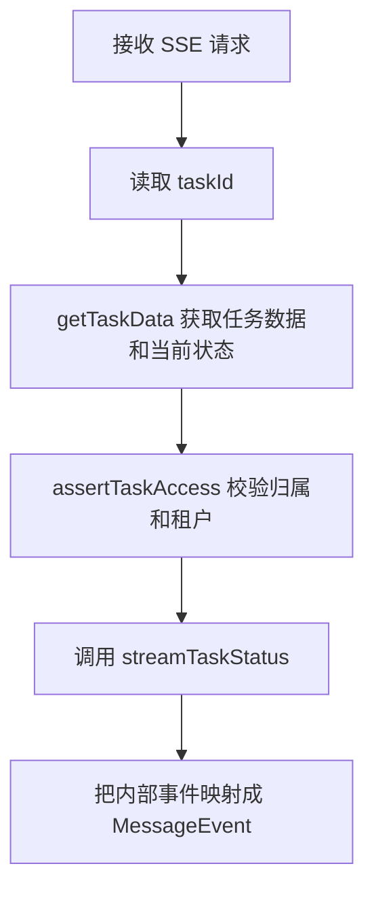

权限边界：

```text
AuthGuard
-> 必须登录

PermissionsGuard
-> Controller 级别启用

assertTaskAccess
-> 任务创建者，或同租户 admin 才能订阅
```

为什么 SSE 也要做归属校验：

```text
SSE 是长连接。
如果连接建立前不校验，别人可以持续看到你的任务进度和结果。
```

## RxJS 管道在做什么

Controller 里这段代码：

```ts
return from(this.taskQueueService.getTaskData(taskId)).pipe(
  tap(({ data }) => this.assertTaskAccess(user, data)),
  switchMap(({ data, status }) =>
    this.taskQueueService.streamTaskStatus(taskId, {
      connection: {
        taskId,
        tenantId: data.tenantId ?? user.tenantId,
        userId: user.id
      },
      initialStatus: status
    })
  ),
  map((event) => ({
    data: event.status,
    id: event.status.taskId,
    retry: 1000,
    type: event.type
  }))
);
```

它不是在做复杂算法，本质是：

```text
先查任务并校验权限，再把任务状态变成 SSE 格式持续推给客户端。
```

建立状态流时还会登记连接分组：

```text
byUserId
byTenantId
byTaskId
```

这不是为了把任务进度广播给所有人，而是给后续“按用户或租户推送消息”留下边界。  
当前任务进度仍然是一条 `taskId` 对应一条 SSE 订阅。

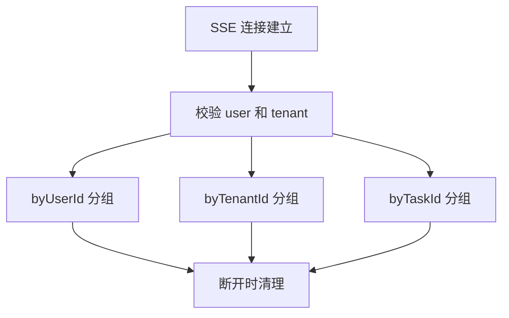

### 数据怎么流

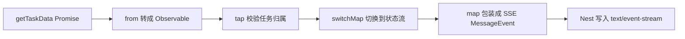

### 每一步的数据形态

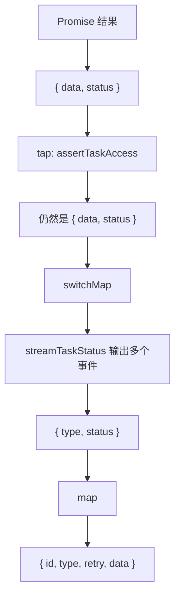

### from

`getTaskData(taskId)` 返回的是一次性 `Promise`：

```text
查一次任务
拿到 job.data 和当前 status
```

`from(...)` 把它转成 Observable：

```text
Promise resolve 后，往 RxJS 管道里吐出一个值。
```

吐出的值是：

```ts
{
  data,
  status
}
```

### tap

`tap` 是旁路动作。

```ts
tap(({ data }) => this.assertTaskAccess(user, data))
```

它只做校验，不改数据。

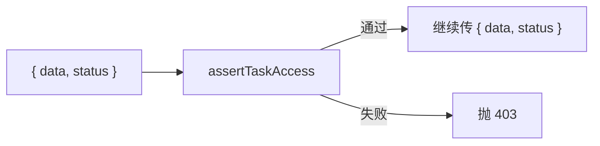

所以 `tap` 后面的数据仍然是：

```ts
{
  data,
  status
}
```

### switchMap

`switchMap` 是关键。

```ts
switchMap(({ data, status }) =>
  this.taskQueueService.streamTaskStatus(taskId, {
    connection: {
      taskId,
      tenantId: data.tenantId ?? user.tenantId,
      userId: user.id
    },
    initialStatus: status
  })
)
```

它把“一次性结果”切换成“持续状态流”。

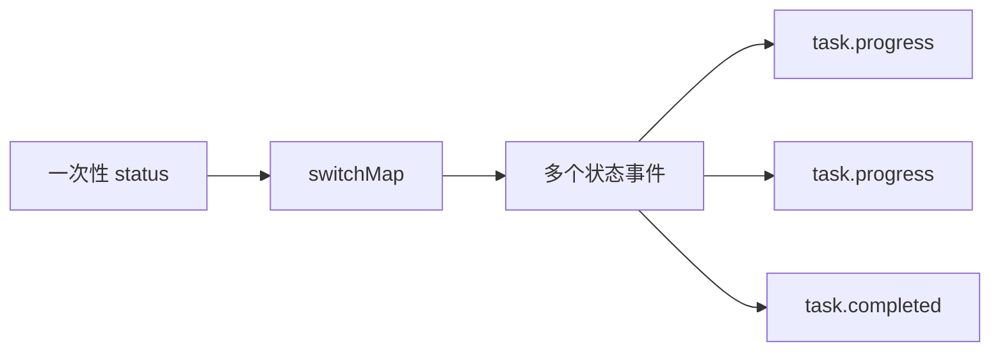

`initialStatus: status` 的作用：

```text
SSE 一建立，先把刚查到的当前状态发出去。
客户端不用等下一秒。
```

### map

`streamTaskStatus` 输出的是内部事件：

```ts
{
  type: "task.progress",
  status: {...}
}
```

`map` 把它改成 Nest SSE 需要的 `MessageEvent`：

```ts
{
  data: event.status,
  id: event.status.taskId,
  retry: 1000,
  type: event.type
}
```

图上看就是：

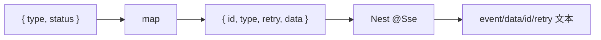

最终客户端收到类似：

```text
id: commodity-import:job-001
event: task.progress
retry: 1000
data: {"taskId":"commodity-import:job-001","state":"running"}

```

### 不用 RxJS 术语怎么理解

这段代码可以近似理解成：

```ts
const { data, status } = await this.taskQueueService.getTaskData(taskId);

this.assertTaskAccess(user, data);

return this.taskQueueService
  .streamTaskStatus(taskId, {
    connection: {
      taskId,
      tenantId: data.tenantId ?? user.tenantId,
      userId: user.id
    },
    initialStatus: status
  })
  .map((event) => ({
    data: event.status,
    id: event.status.taskId,
    retry: 1000,
    type: event.type
  }));
```

真正的区别是：

```text
Nest @Sse 需要返回 Observable。
所以这里用 RxJS 把“一次 Promise 查询 + 后续事件流”串成一个 Observable。
```

## Service 做什么

新增核心方法：

```ts
streamTaskStatus(taskId, options)
```

它把 BullMQ job 状态包装成 RxJS `Observable`。

完整代码逻辑可以拆成：

```text
创建 Observable
-> 立即发送一次初始状态
-> 定时读取 BullMQ job 状态
-> 状态变化才 next
-> completed / failed 后 complete
-> 客户端断开或结束时 cleanup
```

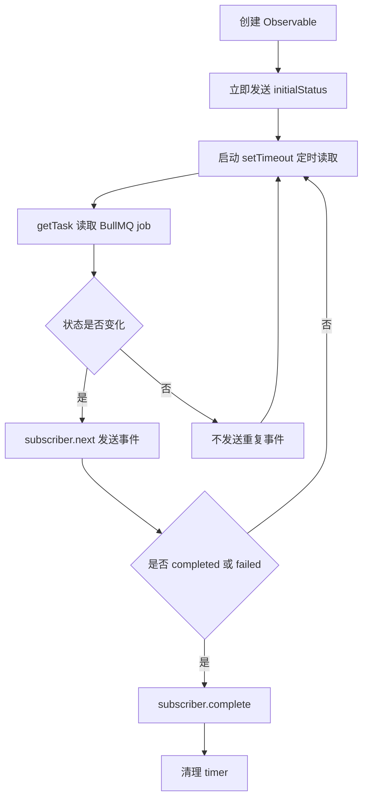

## streamTaskStatus 细节图解

### 它为什么返回 Observable

`@Sse()` 需要一个可以持续吐数据的对象。

```text
Promise 只能 resolve 一次。
Observable 可以 next 很多次，最后 complete。
```

所以 `streamTaskStatus` 返回：

```ts
new Observable<TaskStatusStreamEvent>((subscriber) => {
  ...
});
```

这里的 `subscriber` 可以理解成：

```text
当前这条 SSE 连接的写出口。
```

每次：

```ts
subscriber.next(...)
```

Nest 就会往 HTTP SSE 响应里写一段事件。

### 变量分别管什么

```ts
let closed = false;
let lastFingerprint = "";
let timer: NodeJS.Timeout | undefined;
```

对应职责：

| 变量 | 作用 |
|---|---|
| `closed` | 标记这条 SSE 流是否已经结束，避免结束后继续推送 |
| `lastFingerprint` | 记录上一次推送的状态快照，用来避免重复推送相同状态 |
| `timer` | 保存 `setTimeout` 句柄，结束时可以清理 |

图上看：

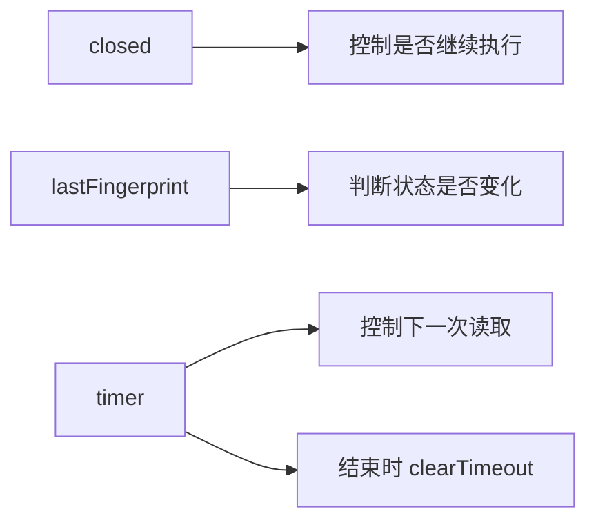

### cleanup 做什么

```ts
const cleanup = () => {
  closed = true;

  if (timer) {
    clearTimeout(timer);
    timer = undefined;
  }
};
```

它负责关闭这条流的本地资源。

触发场景：

```text
任务 completed
任务 failed
读取任务时报错
客户端断开连接
```

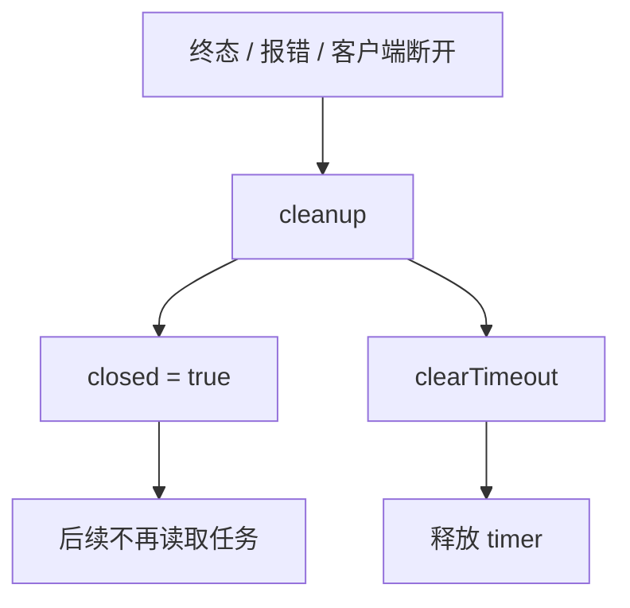

### emitStatus 做什么

`emitStatus` 是“读状态并决定是否推送”的核心函数。

```ts
const currentStatus = status ?? (await this.getTask(taskId));
```

这里有两种来源：

```text
第一次：使用 initialStatus
后续：调用 getTask(taskId) 重新读取 BullMQ job 状态
```

然后生成 fingerprint：

```ts
const fingerprint = JSON.stringify(currentStatus);
```

作用：

```text
把当前任务状态变成字符串快照。
如果和上次一样，就不重复推送。
```

核心判断：

```ts
if (fingerprint !== lastFingerprint) {
  lastFingerprint = fingerprint;
  subscriber.next({
    status: currentStatus,
    type: this.toStreamEventType(currentStatus.state)
  });
}
```

图解：

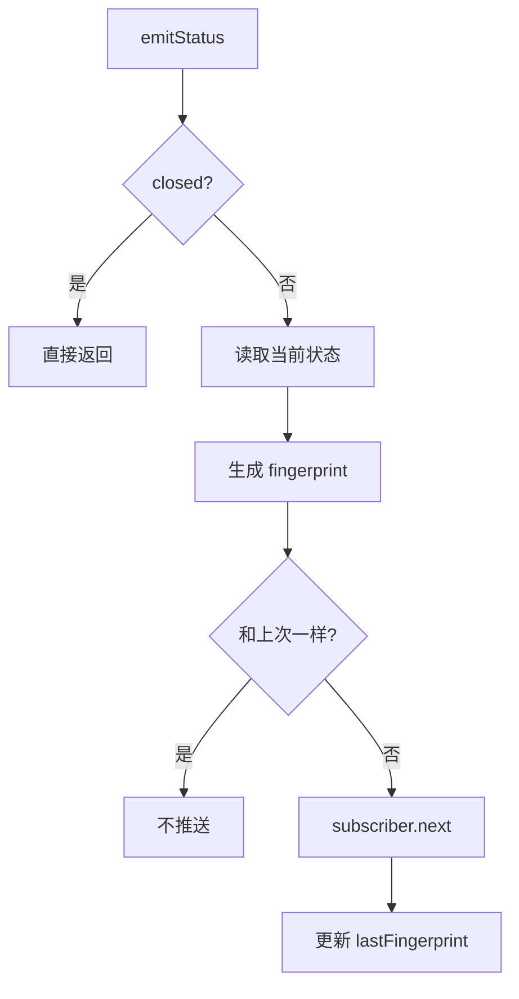

### 为什么要判断终态

```ts
if (TERMINAL_TASK_STATES.has(currentStatus.state)) {
  cleanup();
  subscriber.complete();
}
```

终态是：

```ts
completed
failed
```

原因：

```text
任务已经成功或失败后，进度不会再变化。
继续保持 SSE 连接只会浪费连接和 timer。
```

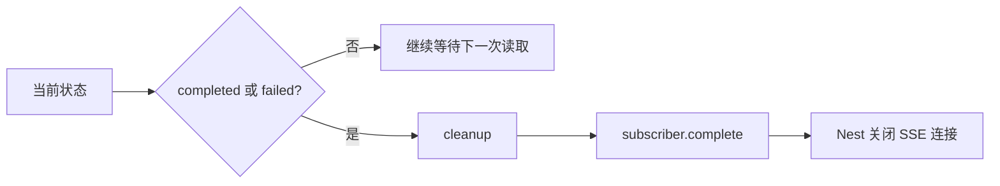

### scheduleNext 做什么

```ts
timer = setTimeout(async () => {
  await emitStatus();
  scheduleNext();
}, intervalMs);
```

它不是 `setInterval`，而是递归 `setTimeout`。

好处：

```text
等这次 emitStatus 真正执行完，再安排下一次。
```

如果用 `setInterval`，当 `getTask` 很慢时，可能出现多次读取重叠。

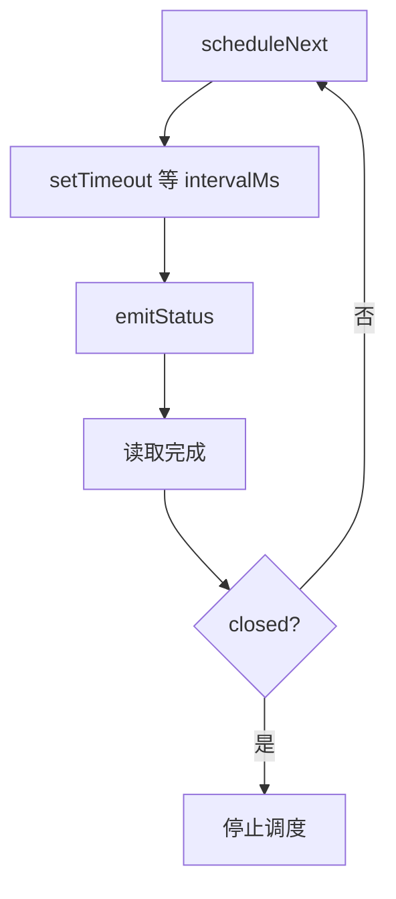

### 第一轮为什么这样写

```ts
void emitStatus(options.initialStatus).then(scheduleNext);
```

意思是：

```text
先立即推一次初始状态。
初始状态推完后，再开始下一轮定时读取。
```

这里的 `void` 是为了告诉 TypeScript / lint：

```text
这个 Promise 是刻意不 await 的。
Observable 会自己管理后续异步流程。
```

### return cleanup 是什么意思

```ts
return cleanup;
```

在 RxJS 里，Observable 的构造函数可以返回一个清理函数。

当订阅结束时，RxJS 会调用它。

在 SSE 场景里，对应：

```text
客户端断开连接
Nest 取消订阅 Observable
RxJS 调用 cleanup
清理 timer
```

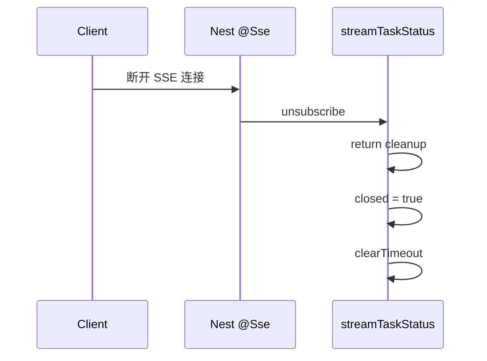

### 完整生命周期

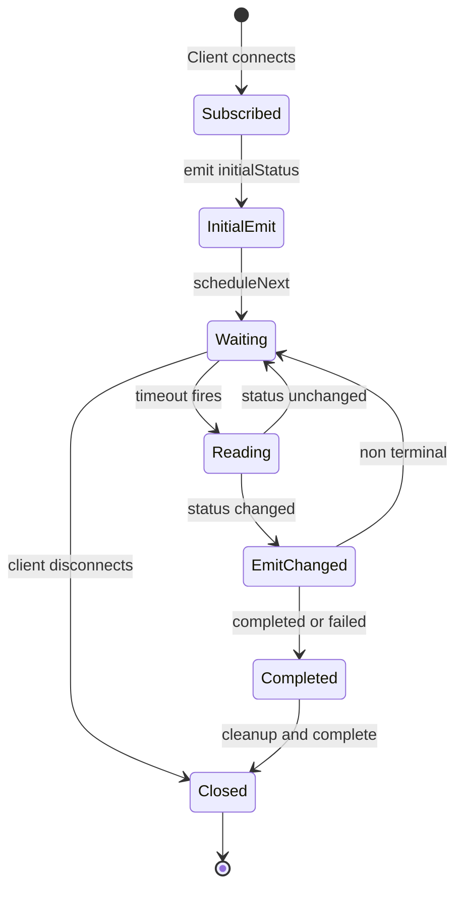

一句话总结：

```text
streamTaskStatus =
给每个 SSE 连接创建一个小型状态机，
定时读取任务状态，
只推变化，
终态或断开时清理资源。
```

这里有几个关键点。

### 1. 先发 initialStatus

SSE 建立时，Controller 已经调用过一次：

```text
getTaskData(taskId)
```

所以 `streamTaskStatus` 会先把这个初始状态发出去。

好处：

```text
客户端一连接就能看到当前状态，不用等下一秒。
```

### 2. 每秒读取一次 BullMQ 状态

当前实现：

```text
TASK_STATUS_STREAM_INTERVAL_MS = 1000
```

也就是 BFF 内部每秒读取一次 job 状态。

注意边界：

```text
客户端不轮询 BFF。
BFF 内部仍然用定时读取 BullMQ 的方式生成 SSE 事件。
```

后续可以升级成：

```text
BullMQ QueueEvents
-> 真实事件驱动
-> BFF SSE
```

### 3. 状态没变化不重复推

代码里会对当前状态做 fingerprint：

```text
JSON.stringify(currentStatus)
```

只有 fingerprint 变化才 `subscriber.next`。

作用：

```text
避免每秒推一条完全一样的事件。
```

### 4. completed 或 failed 后结束连接

终态：

```text
completed
failed
```

进入终态后：

```text
发送最后一个事件
-> subscriber.complete
-> Nest 关闭 SSE 连接
-> 清理 timer
```

这样不会让已经结束的任务长期占着连接。

## 事件类型怎么映射

新增类型：

```ts
type TaskStatusStreamEventType =
  | "task.progress"
  | "task.completed"
  | "task.failed";
```

映射规则：

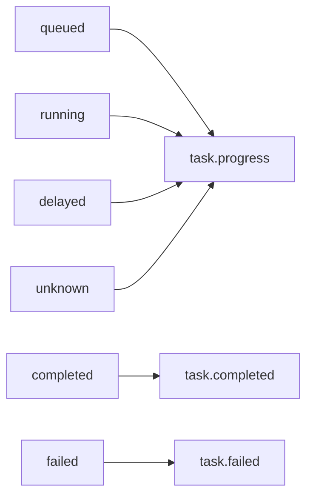

为什么 `queued` 也叫 `task.progress`：

```text
SSE 事件名表达的是“任务状态更新”。
只要不是最终成功或失败，都先归为 progress。
```

## SSE 输出长什么样

Controller 最后返回的是 `MessageEvent`：

```ts
{
  id: event.status.taskId,
  type: event.type,
  retry: 1000,
  data: event.status
}
```

Nest 会把它序列化成类似：

```text
id: commodity-import:job-001
event: task.progress
retry: 1000
data: {"taskId":"commodity-import:job-001","state":"running","progress":{"percent":50}}

```

客户端看到的是：

```text
event: task.progress
data: 最新任务状态
```

## 和原来的轮询接口是什么关系

原来的接口：

```text
GET /api/tasks/:taskId
```

新增接口：

```text
GET /api/tasks/:taskId/events
```

关系：

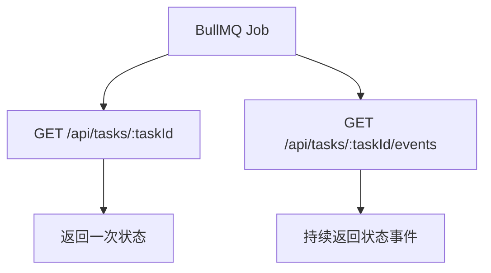

两个接口共用同一套任务状态模型：

```text
TaskStatus
```

所以前端不需要理解两套数据结构。

## 这次解决了什么问题

原来前端如果要看进度，只能这样：

```text
setInterval
-> GET /api/tasks/:taskId
-> 等 1 秒
-> 再 GET
```

问题：

```text
任务越多，请求越多。
状态没变化时也会重复请求。
页面关闭时还要小心清理 timer。
```

现在可以：

```text
new EventSource("/api/tasks/:taskId/events")
```

BFF 主动推：

```text
task.progress
task.completed
task.failed
```

客户端只维护一条连接。

## 当前实现的边界

1. 只支持单向推送

SSE 只能服务端推客户端。  
如果前端需要暂停任务、取消任务、发送控制指令，仍要走普通 HTTP。
只有未来出现协同编辑、实时审批、在线操作状态同步等双向协作场景，再引入 `@WebSocketGateway()`。

2. BFF 内部还不是完全事件驱动

当前是：

```text
SSE 对客户端是推送
BFF 对 BullMQ 是每秒读取
```

后续更真实的做法是：

```text
BullMQ QueueEvents
-> completed / failed / progress 事件
-> SSE
```

3. 只接了商品导入

目前只有：

```text
commodity-import
```

后续审计导出、图片扫描重新接队列后，应复用：

```text
TaskQueueService
QueueController SSE endpoint
TaskStatus
```

4. 断线重连恢复

当前返回了：

```text
id: taskId
retry: 1000
```

但没有基于 `Last-Event-ID` 做事件级续传。  
任务进度场景采用更简单的恢复方式：

```text
浏览器断开
-> Worker 继续处理 job
-> 用户重新进入页面
-> GET /api/tasks/:taskId/events
-> BFF 先读取 BullMQ 当前状态
-> 立即推送当前 progress
```

这能恢复“当前进度”，但不会补发断线期间每一条历史事件。

5. 连接分组是进程内边界

当前 `TaskStreamConnectionRegistry` 维护的是 BFF 单进程内存分组：

```text
userId -> connection ids
tenantId -> connection ids
taskId -> connection ids
```

如果未来 BFF 多实例部署，需要把跨实例广播交给 Redis Pub/Sub、BullMQ QueueEvents 或独立事件总线。

## 最小心智模型

```text
本次新增逻辑 =
把已有 GET /api/tasks/:taskId 的一次性状态
包装成一个持续输出的 SSE 状态流。
```

代码链路：

```text
QueueController @Sse
-> getTaskData 校验任务、归属和租户
-> 注册 userId / tenantId / taskId 连接分组
-> TaskQueueService.streamTaskStatus
-> Observable 定时读取 BullMQ job
-> 状态变化时 next
-> Nest 写 text/event-stream
-> completed 或 failed 后 complete
```
