# Worker 第一性原理图文解释

## 一句话结论

在当前项目里，`CommodityImportProcessor` 的本质是：

```text
运行在 BFF Node 进程里的一个队列消费者对象。
它不是线程，也不是 Redis。
它负责从 Redis 里的 BullMQ 队列取 job，然后执行 process。
```

对应代码：

```text
apps/bff/src/queue/processors/commodity-import.processor.ts
```

核心代码形态：

```ts
@Processor(COMMODITY_IMPORT_QUEUE, { concurrency: 1 })
export class CommodityImportProcessor extends WorkerHost {
  async process(job: Job<CommodityImportJobData>) {
    // 这里才是真正执行商品导入的地方
  }
}
```

## Worker 在进程里是什么

这张图只回答一个问题：`CommodityImportProcessor` 到底在计算机里是什么。

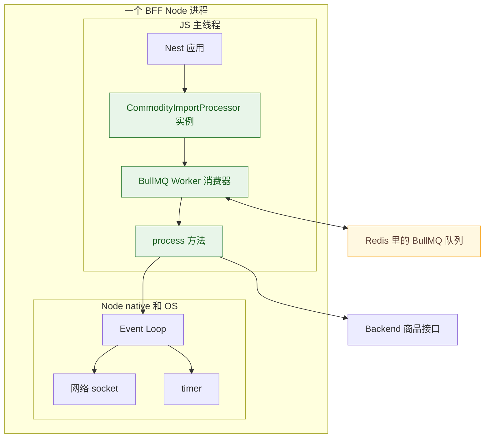

关键点：

```text
CommodityImportProcessor 是对象。
BullMQ Worker 是这个对象背后的消费机制。
process 是被 BullMQ 调用的业务方法。
真正执行 JS 的还是 Node 的 JS 主线程。
```

所以它不是这样：

```text
一个 job = 一个线程
一个 Worker = 一个操作系统线程
```

而是这样：

```text
一个 Worker = 一个消费者对象
一个 job = Redis 里的一份任务数据
process = 消费者拿到任务后执行的函数
```

## Worker 为什么需要 Redis

如果没有队列，HTTP 请求会直接做慢任务：

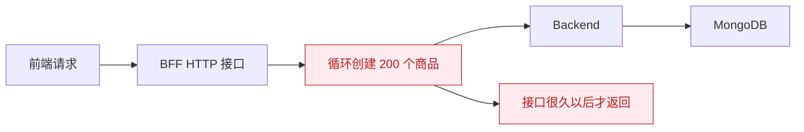

问题是：

```text
HTTP 请求被慢任务占住。
用户需要一直等待。
瞬间多个批量导入会一起打到 Backend 和 MongoDB。
失败后不容易恢复、重试、查询进度。
```

有 Worker 后，HTTP 请求只负责投递任务：

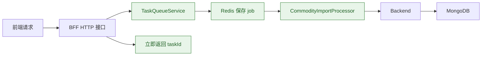

第一性原理上，Worker 解决的是：

```text
把一次同步函数调用，变成一条可持久化、可排队、可重试、可查询进度的任务。
```

## 一次 job 是怎么被 Worker 执行的

当前商品批量导入的真实链路：

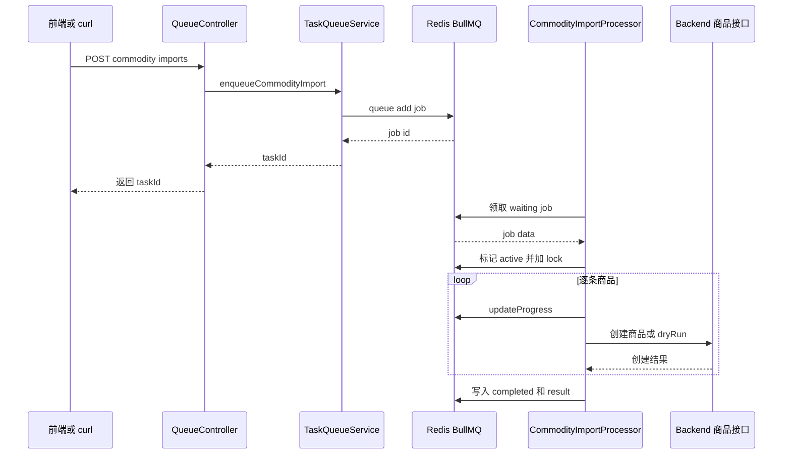

这里最重要的是分工：

```text
Controller 不导入商品，只创建任务。
Redis 不执行业务，只保存任务状态。
Worker 不接 HTTP 请求，只消费任务。
Backend 不知道 BullMQ，只处理商品领域逻辑。
```

## process 到底是谁调用的

不是你在 Controller 里手动调用：

```text
controller.process(job)
```

真实情况是：

```text
Nest 启动
-> @Processor 注册 BullMQ Worker
-> BullMQ Worker 监听 Redis 队列
-> Redis 里有 waiting job
-> BullMQ Worker 把 job 取出来
-> BullMQ 调用 process(job)
```

图解：

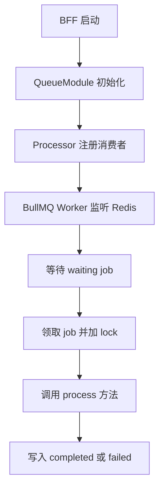

所以 `process(job)` 的本质是：

```text
队列消费者的回调函数。
```

## Worker 和线程的关系

当前项目里：

```text
CommodityImportProcessor 不是线程。
它运行在 BFF Node 进程里。
它的 JS 代码由 Node 的 JS 主线程执行。
```

图解：

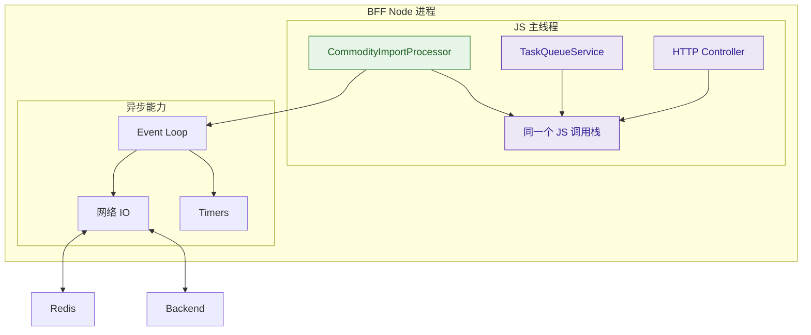

这意味着：

```text
await 网络请求时，JS 主线程可以去处理别的回调。
执行同步 JS 代码时，还是会占用同一个 JS 主线程。
如果 process 里做大量 CPU 计算，会拖慢整个 BFF 进程。
```

## concurrency 是什么

当前代码：

```ts
@Processor(COMMODITY_IMPORT_QUEUE, { concurrency: 1 })
```

它的意思不是“开 1 个线程”。

它的意思是：

```text
同一个 Worker 实例，同时最多允许 1 个 job 进入 process。
```

图解：

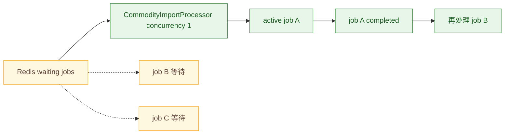

如果 `concurrency: 3`，大概是：

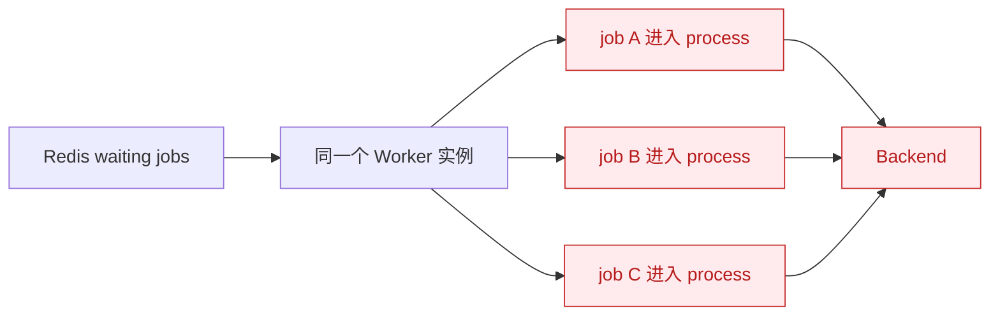

这会带来更多并发压力：

```text
更多 job.data 在内存里。
更多 Redis progress 写入。
更多 Backend 请求。
更多 MongoDB 写入。
更多 JS 回调进入 Event Loop。
```

所以当前商品导入先用 `concurrency: 1`，是为了让批量写入可控。

## Worker 怎么给出 progress

Worker 处理一条商品，就主动写一次进度：

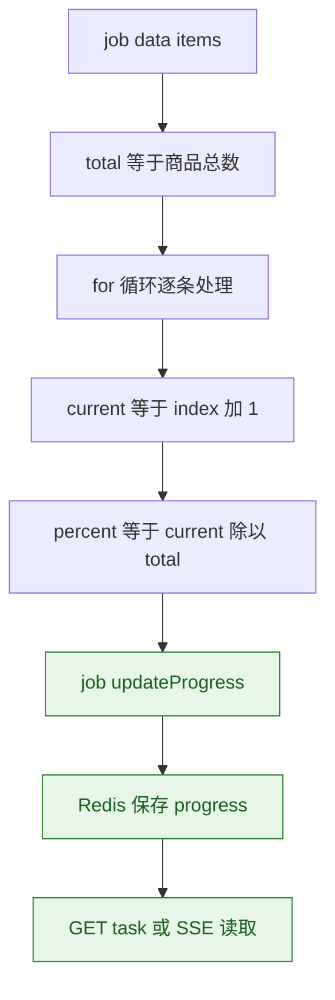

对应代码逻辑：

```ts
const total = job.data.items.length;

for (const [index, item] of job.data.items.entries()) {
  await job.updateProgress({
    current: index + 1,
    percent: Math.round(((index + 1) / total) * 100),
    total
  });
}
```

所以 progress 不是 BullMQ 自动算出来的。

```text
业务代码知道总数。
业务代码知道当前处理到第几条。
业务代码调用 updateProgress 写回 Redis。
```

## Worker 的状态机视角

一个 job 的状态大概这样变化：

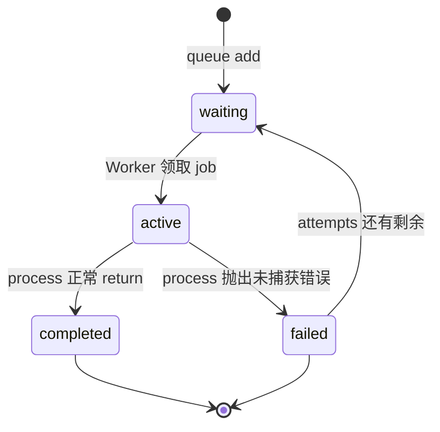

当前商品导入里，单条商品创建失败会被 catch 住并写入 `failed` 数组。

也就是说：

```text
单条商品失败，不一定让整个 job 变成 failed。
只有 process 抛出未捕获错误，BullMQ 才会把整个 job 标成 failed。
```

## 本地开发和真实系统的区别

当前本地 MVP 通常是：

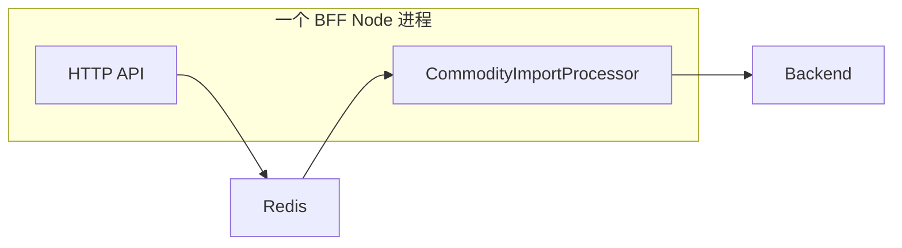

这种方式简单，适合学习和本地验证。

真实系统高负载时，常见做法是拆进程：

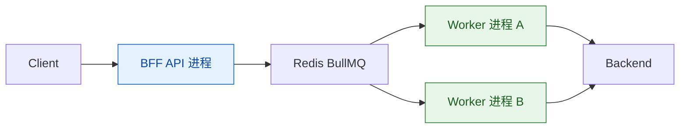

拆开后的价值：

```text
API 进程专心处理 HTTP 请求。
Worker 进程专心处理慢任务。
Worker 挂了不会直接拖死 API。
可以单独扩容 Worker 数量。
可以给 Worker 设置不同 CPU 和内存资源。
```

## 什么时候 Worker 会拖慢系统

Worker 不是免费的。它会消耗：

```text
JS 主线程时间：同步代码、JSON 处理、循环逻辑都会执行。
内存：job.data、created、failed、临时对象都在内存里。
Redis 压力：领取 job、lock、updateProgress、写 result。
Backend 压力：dryRun false 时逐条请求 Backend。
数据库压力：Backend 最终写 MongoDB。
网络连接：Redis、Backend 都是网络 IO。
```

风险图：

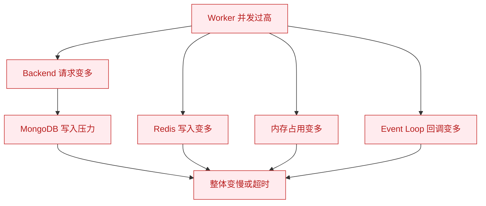

所以 Worker 的关键不是“多开就更快”，而是：

```text
用队列把压力排起来。
用 concurrency 控制同时处理多少任务。
用 progress 和 result 让前端能观察任务。
用 retry 和 failedReason 让失败可恢复和可排查。
```

## 当前项目最小闭环

当前商品导入 Worker 的闭环是：

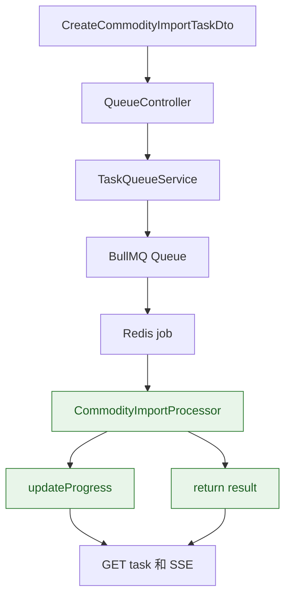

你可以按这个顺序读代码：

```text
1. apps/bff/src/queue/dto/create-commodity-import-task.dto.ts
   定义前端提交的 items 和 dryRun。

2. apps/bff/src/queue/queue.controller.ts
   接收请求，调用 TaskQueueService 创建任务。

3. apps/bff/src/queue/task-queue.service.ts
   queue.add 写入 BullMQ job，getTask 读取状态。

4. apps/bff/src/queue/processors/commodity-import.processor.ts
   Worker 消费 job，执行 process，更新 progress，返回 result。

5. apps/bff/src/queue/task-queue.service.ts
   streamTaskStatus 把 job 状态包装成 SSE 事件。
```

## 最后总结

```text
Worker 不是线程。
Worker 是消费者。

Redis 不执行业务。
Redis 保存 job、状态、progress、result 和 lock。

process 不是 HTTP 请求入口。
process 是 BullMQ 拿到 job 后调用的业务函数。

concurrency 不是线程数。
concurrency 是同一个 Worker 同时允许多少个 job 进入 process。

当前项目的 CommodityImportProcessor
就是商品批量导入任务的后台消费者。
```
