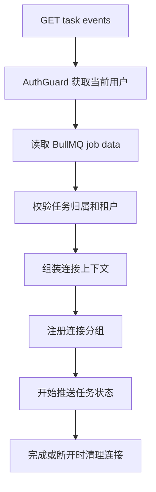
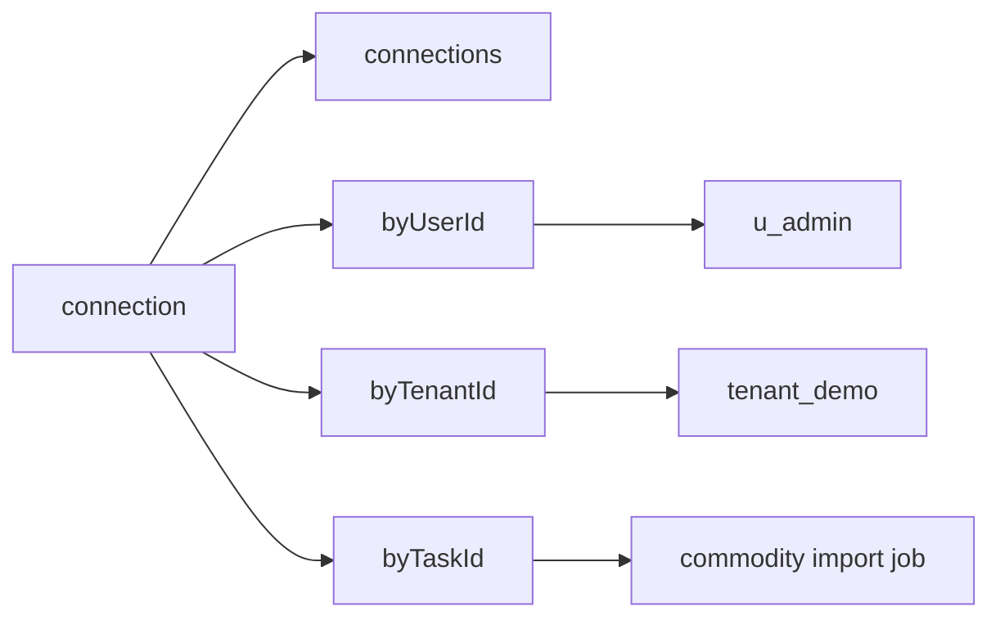
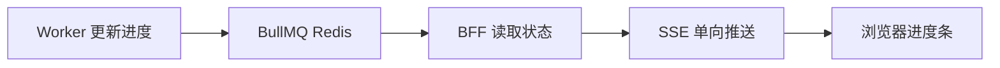
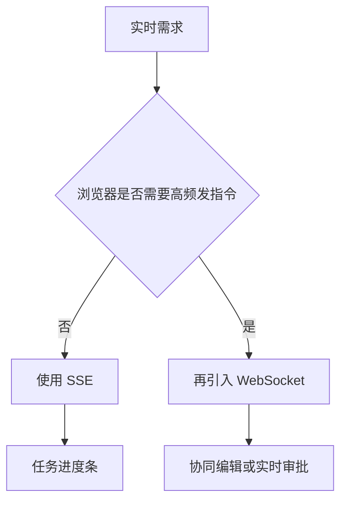
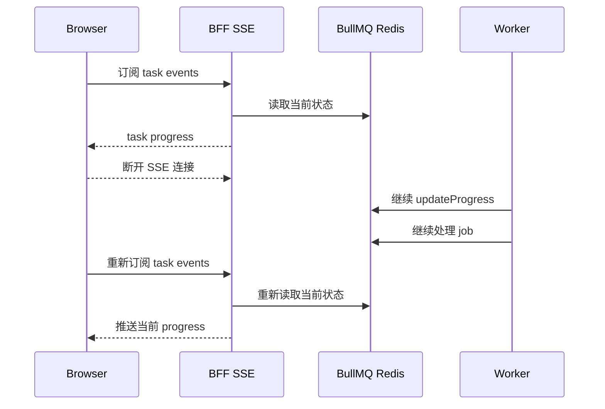
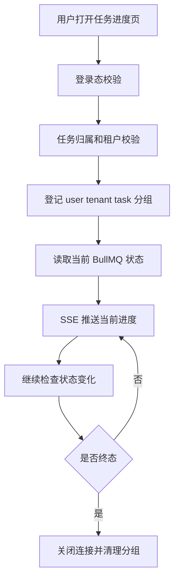
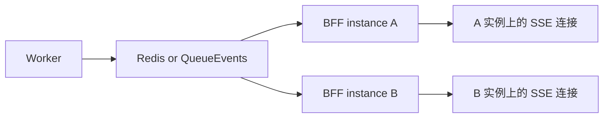

# SSE 连接分组、WebSocket 边界、断线恢复图解

## 这次解决的三个问题

这篇文档只讲三个功能点：

```text
1. 按 userId / tenantId / taskId 维护 SSE 连接分组
2. 任务进度只用 SSE，不提前引入 WebSocket
3. 浏览器断线后，重新连接能恢复当前任务进度
```

当前实现的目标不是做一个完整实时消息平台，而是让“异步任务进度”这个场景安全、可观察、可恢复。

## 代码位置

| 功能 | 代码位置 |
|---|---|
| SSE 入口、权限校验、连接上下文组装 | `apps/bff/src/queue/queue.controller.ts` |
| 连接注册、分组、清理 | `apps/bff/src/queue/task-stream-connection-registry.service.ts` |
| 状态流、定时读取、断开清理、终态关闭 | `apps/bff/src/queue/task-queue.service.ts` |
| 连接上下文类型 | `apps/bff/src/queue/queue.types.ts` |
| QueueModule 注册 provider | `apps/bff/src/queue/queue.module.ts` |
| Controller 权限和连接上下文测试 | `apps/bff/src/queue/queue.controller.spec.ts` |
| Registry 分组和清理测试 | `apps/bff/src/queue/task-queue.service.spec.ts` |
| curl 断线重连验证 | `docs/47-SSE任务进度curl测试操作.md` |

## 功能一：按 userId 或 tenantId 维护连接分组

### 为什么要分组

SSE 是长连接。连接一旦建立，服务端就可以持续往浏览器推数据。

如果不做边界，风险是：

```text
用户 A 可能看到用户 B 的任务进度
租户 A 可能看到租户 B 的任务进度
后续做租户消息广播时没有可控范围
```

所以连接建立时要同时记录三层信息：

```text
userId
tenantId
taskId
```

### 当前链路



### 权限判断

当前 `QueueController` 的判断是：

```text
任务创建者可以看自己的任务
同租户 admin 可以看本租户任务
跨租户 admin 不可以看
缺 tenantId 的老任务不让 admin 兜底查看
```

代码位置：

```text
apps/bff/src/queue/queue.controller.ts
```

关键逻辑：

```ts
private assertTaskAccess(user: AuthUser, task: TaskJobDataBase) {
  const sameTenant = task.tenantId === user.tenantId;
  const isOwner = user.id === task.requestedBy;
  const isTenantAdmin = user.roles.includes("admin") && sameTenant;

  if (isOwner || isTenantAdmin) {
    return;
  }

  throw new ForbiddenException("permission denied");
}
```

### 连接上下文怎么传下去

SSE 入口先查任务，再把 `taskId / tenantId / userId` 传给 `streamTaskStatus`。

代码位置：

```text
apps/bff/src/queue/queue.controller.ts
```

关键逻辑：

```ts
return from(this.taskQueueService.getTaskData(taskId)).pipe(
  tap(({ data }) => this.assertTaskAccess(user, data)),
  switchMap(({ data, status }) =>
    this.taskQueueService.streamTaskStatus(taskId, {
      connection: {
        taskId,
        tenantId: data.tenantId ?? user.tenantId,
        userId: user.id
      },
      initialStatus: status
    })
  )
);
```

### Registry 维护什么

`TaskStreamConnectionRegistry` 是一个进程内连接登记表。

代码位置：

```text
apps/bff/src/queue/task-stream-connection-registry.service.ts
```

它维护四份数据：

```text
connections: connectionId -> connection
byUserId: userId -> connectionId set
byTenantId: tenantId -> connectionId set
byTaskId: taskId -> connectionId set
```

图解：



### 注册和清理

连接建立时注册：

```text
streamTaskStatus
-> registry.register(connection)
-> 返回 unregister 函数
```

连接结束时清理：

```text
completed / failed
客户端断开
发生错误
```

都会进入同一个 `cleanup`。

代码位置：

```text
apps/bff/src/queue/task-queue.service.ts
```

关键逻辑：

```ts
let unregisterConnection = options.connection
  ? this.streamConnectionRegistry.register(options.connection)
  : undefined;

const cleanup = () => {
  closed = true;

  if (timer) {
    clearTimeout(timer);
    timer = undefined;
  }

  if (unregisterConnection) {
    unregisterConnection();
    unregisterConnection = undefined;
  }
};
```

## 功能二：暂不引入 WebSocket

### 为什么任务进度用 SSE

任务进度的通信方向是单向的：

```text
服务端 -> 浏览器
```

前端只是接收：

```text
queued
running
progress
completed
failed
```

所以当前用 SSE 足够。



### 什么时候才需要 WebSocket

WebSocket 适合双向协作。

也就是浏览器不只是接收，还要频繁向服务端发送实时操作：

```text
协同编辑
实时审批
在线操作状态同步
多人房间
聊天
实时游戏
```

判断图：



当前明确不做：

```text
不为了进度条提前引入 @WebSocketGateway()
```

原因：

```text
WebSocket 会引入连接鉴权、心跳、断线恢复、广播拓扑、房间管理、反压、网关扩容等复杂度。
任务进度只是单向通知，用 SSE 更小、更直接。
```

## 功能三：断线重连后的状态恢复

### 关键原则

浏览器断开 SSE 连接，不等于后台任务停止。

原因是：

```text
任务在 BullMQ / Redis 里
Worker 独立消费 job
SSE 只是观察任务状态的连接
```

断开的是观察通道，不是任务本身。

### 断线前后的真实流程



### 为什么能恢复当前进度

因为每次进入 SSE 都会先执行：

```text
getTaskData(taskId)
```

它会读取 BullMQ job 的当前状态。

然后把这个状态作为 `initialStatus` 传给流：

```ts
this.taskQueueService.streamTaskStatus(taskId, {
  connection: {...},
  initialStatus: status
});
```

在 `streamTaskStatus` 里：

```ts
void emitStatus(options.initialStatus).then(scheduleNext);
```

这表示：

```text
连接一建立
-> 立刻推一次当前状态
-> 然后再按 interval 继续检查变化
```

### 当前恢复能力的边界

当前实现恢复的是：

```text
当前状态
当前 progress
最终 result
failedReason
```

当前不做的是：

```text
补发断线期间每一条历史 SSE event
基于 Last-Event-ID 做事件级续传
```

对任务进度条来说，这通常足够：

```text
用户关掉页面
后台继续导入
用户回来
直接看到当前进度或最终结果
```

## 三个功能放在一起看



这三个功能形成的边界是：

```text
谁能看：任务创建者或同租户 admin
看什么：只能看对应 taskId 的状态
怎么推：SSE 单向推送
断了怎么办：重连后重新读取 BullMQ 当前状态
什么时候清：断开、错误、completed、failed 都清理
```

## 测试覆盖

代码测试位置：

```text
apps/bff/src/queue/queue.controller.spec.ts
apps/bff/src/queue/task-queue.service.spec.ts
```

覆盖点：

```text
任务创建者可以查询自己的任务
跨租户 admin 不能查询任务
缺 tenantId 的老任务不允许 admin 兜底查看
SSE 建立时传入 userId / tenantId / taskId
连接注册后 snapshot 能看到分组计数
unsubscribe 后分组计数清空
终态 completed 会推送 task.completed 并 complete
```

curl 验证位置：

```text
docs/47-SSE任务进度curl测试操作.md
```

重点看：

```text
第 8 节：权限验证
第 9 节：断线重连恢复验证
```

## 生产环境边界

当前 `TaskStreamConnectionRegistry` 是进程内内存表。

这意味着：

```text
单个 BFF 进程内有效
多个 BFF 实例之间不共享
进程重启后连接表清空
```

如果未来要做“本租户消息广播”或多实例部署，需要引入共享事件源：

```text
Redis Pub/Sub
BullMQ QueueEvents
独立事件总线
WebSocket 网关集群适配器
```

生产级结构大概是：



当前 MVP 先完成最小安全闭环：

```text
权限正确
连接可清理
进度可恢复
协议不过度设计
```
