# 统一限流 Throttler 代码逻辑图解

这篇文档解释本次新增的统一限流逻辑，以及代码里出现的新语法。

本次功能的目标是：

```text
把登录、上传、创建用户、审计读取这类高风险接口的限流规则统一放到一个模块里。
请求还没有进入 Controller 业务逻辑前，先由全局 Guard 判断是否应该放行。
```

## 一句话先讲本质

限流的第一性原理不是 NestJS，也不是某个装饰器，而是这个公式：

```text
同一个 key
+ 在一段时间窗口 ttl 内
+ 请求次数超过 limit
= 拒绝请求，返回 429
```

在当前项目里：

```text
key 可以是 ip:127.0.0.1
key 可以是 username:admin
key 可以是 user:u_001
key 可以是 tenant:tenant_demo
```

所以这次代码的核心就是两件事：

```text
1. 哪些接口要限流
2. 每个接口用什么 key 来计数
```

## 代码位置

| 文件                                                        | 作用                                                    |
| ----------------------------------------------------------- | ------------------------------------------------------- |
| `apps/bff/src/app.module.ts`                                | 引入 `RateLimitModule`，让限流能力进入整个 BFF 应用     |
| `apps/bff/src/rate-limit/rate-limit.module.ts`              | 注册 `ThrottlerModule` 和全局 `BffThrottlerGuard`       |
| `apps/bff/src/rate-limit/rate-limit.config.ts`              | 集中定义所有限流策略、路径匹配、计数 key                |
| `apps/bff/src/rate-limit/bff-throttler.guard.ts`            | 继承 `ThrottlerGuard`，在用户和租户级限流前补齐当前用户 |
| `apps/bff/src/common/filters/http-exception.filter.spec.ts` | 验证 429 会进入统一错误格式                             |
| `apps/bff/src/rate-limit/rate-limit.config.spec.ts`         | 验证限流策略、路径匹配、tracker 生成                    |
| `apps/bff/src/rate-limit/bff-throttler.guard.spec.ts`       | 验证登录限流和上传前解析当前用户                        |

## 总体链路

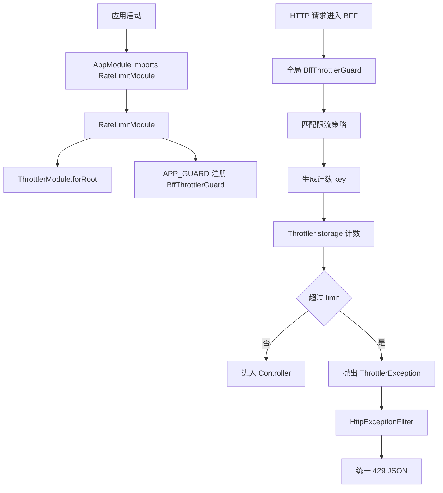

重点看两条线：

```text
启动阶段：
AppModule -> RateLimitModule -> 注册全局 Guard

请求阶段：
HTTP request -> BffThrottlerGuard -> Throttler storage -> Controller 或 429
```

## 启动时发生了什么

入口在 `apps/bff/src/app.module.ts`：

```ts
imports: [
  // ...
  RateLimitModule
  // ...
];
```

这表示 BFF 应用启动时会加载限流模块。

真正注册限流能力的位置在 `apps/bff/src/rate-limit/rate-limit.module.ts`：

```ts
@Module({
  imports: [AuthModule, ThrottlerModule.forRoot(createBffThrottlerOptions())],
  providers: [
    {
      provide: APP_GUARD,
      useClass: BffThrottlerGuard
    }
  ]
})
export class RateLimitModule {}
```

这段代码可以拆成两层理解。

第一层：注册 Throttler 的配置。

```ts
ThrottlerModule.forRoot(createBffThrottlerOptions());
```

含义是：

```text
把 createBffThrottlerOptions 返回的限流策略交给 Nest Throttler。
```

第二层：把 `BffThrottlerGuard` 变成全局 Guard。

```ts
{
  provide: APP_GUARD,
  useClass: BffThrottlerGuard
}
```

含义是：

```text
每个 HTTP 请求都会先经过 BffThrottlerGuard。
不需要在每个 Controller 上单独写 @UseGuards(BffThrottlerGuard)。
```

## 新语法 1：forRoot 是什么

```ts
ThrottlerModule.forRoot(createBffThrottlerOptions());
```

`forRoot` 是 NestJS 模块常见写法。

它的意思不是“调用一个普通工具函数后结束”，而是：

```text
创建一个带配置的动态模块。
这个模块内部会根据配置注册 provider。
后续 ThrottlerGuard 可以从 Nest 容器里拿到这些配置。
```

图解：


## 新语法 2：APP_GUARD 是什么

```ts
{
  provide: APP_GUARD,
  useClass: BffThrottlerGuard
}
```

`APP_GUARD` 是 Nest 提供的全局 Guard token。

可以把它理解成：

```text
告诉 Nest：这个 Guard 不是某个 Controller 私有的，而是整个应用共享的。
```

普通写法是局部的：

```ts
@UseGuards(AuthGuard)
```

这只影响当前 Controller 或方法。

`APP_GUARD` 是全局的：

```text
所有请求都会经过它。
```

这也是为什么限流适合放在这里：

```text
限流应该尽早发生。
最好在业务逻辑、数据库查询、文件上传处理之前就拒绝异常流量。
```

## 请求进来后怎么判断

核心配置在 `apps/bff/src/rate-limit/rate-limit.config.ts`。

当前注册了这些策略：

```text
default
loginIp
loginUsername
uploadUser
uploadTenant
userCreate
sensitiveAuthMutation
auditExportUser
```

每个策略都回答五个问题：

```text
1. name：策略叫什么
2. limit：时间窗口内允许多少次
3. ttl：时间窗口多长
4. getTracker：用什么 key 计数
5. skipIf：什么时候跳过这条策略
```

示例：

```ts
{
  blockDuration: ONE_MINUTE_MS,
  getTracker: getLoginUsernameTrackerForThrottler,
  limit: LOGIN_USERNAME_LIMIT,
  name: "loginUsername",
  skipIf: (context) => !isLoginRequest(context),
  ttl: ONE_MINUTE_MS
}
```

这段代码的业务含义是：

```text
只对 POST /api/auth/login 生效。
按 username 计数。
1 分钟内最多 5 次。
超过后阻塞 1 分钟。
```

## Throttler 单条策略的具体执行逻辑

上面的策略配置最终会交给官方 `ThrottlerGuard` 执行。

当前项目的 `BffThrottlerGuard` 先补齐 `currentUser`，然后调用：

```ts
return super.canActivate(context);
```

从这里开始进入 `@nestjs/throttler` 的通用逻辑。

一条策略的具体判断可以压缩成这张图：

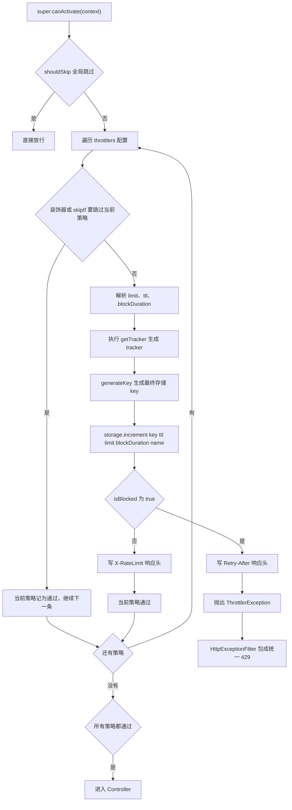

这里有三个容易误解的点。

第一，`skipIf` 只跳过“当前这条策略”，不是跳过所有限流。比如登录请求会执行 `default`、`loginIp`、`loginUsername`，但会跳过 `uploadUser`、`uploadTenant` 等不匹配登录路径的策略。

第二，`tracker` 不是最终存储 key。当前项目里 `tracker` 是比较容易读懂的业务维度：

```text
ip:127.0.0.1
username:admin
user:u_001
tenant:tenant_demo
```

官方 `generateKey` 会再把 Controller、handler、策略名和 tracker 组合后做 hash，避免不同接口或不同策略共用同一个底层 key。

可以理解成：

```text
AuthController-login-loginUsername-username:admin
-> sha256
-> 存到 ThrottlerStorage 的真实 key
```

第三，`limit` 是允许次数，不是拒绝阈值。

以 `loginUsername` 为例：

```text
第 1 到 5 次：
totalHits <= 5，放行。

第 6 次：
totalHits > 5，进入 blocked，抛 429。
```

## 默认内存 Storage 怎么计数

当前代码没有替换 `ThrottlerStorage`，所以使用 `@nestjs/throttler` 默认内存存储。

默认 storage 的核心动作是 `increment`：

```text
给某个 key 增加一次命中
判断命中数是否超过 limit
返回 totalHits、timeToExpire、isBlocked、timeToBlockExpire
```

图解如下：

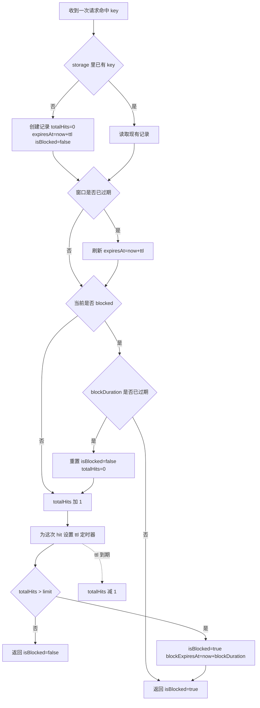

结合登录用户名限流看一次真实状态变化：

```text
策略：loginUsername
key 维度：username:admin
limit：5
ttl：60 秒
blockDuration：60 秒
```

| 请求                 | totalHits 变化 | 结果                                 |
| -------------------- | -------------: | ------------------------------------ |
| 第 1 次              |         0 -> 1 | 放行                                 |
| 第 2 次              |         1 -> 2 | 放行                                 |
| 第 3 次              |         2 -> 3 | 放行                                 |
| 第 4 次              |         3 -> 4 | 放行                                 |
| 第 5 次              |         4 -> 5 | 放行                                 |
| 第 6 次              |         5 -> 6 | 超过 `limit`，进入 blocked，返回 429 |
| blocked 期间         |   不再正常累加 | 继续返回 429，并带 `Retry-After`     |
| blockDuration 到期后 |   重置阻塞状态 | 下一次请求重新开始计数               |

所以在当前实现里，限流不是 Controller 里的业务 `if`，而是 Guard 层在进入业务前完成的这条链：

```text
匹配策略
-> 生成 tracker
-> 生成 storage key
-> increment
-> 根据 isBlocked 决定 Controller 或 429
```

## 新语法 3：skipIf 是什么

```ts
skipIf: (context) => !isLoginRequest(context);
```

`skipIf` 的意思是：

```text
如果返回 true，这条限流策略不执行。
如果返回 false，这条限流策略执行。
```

这里写的是：

```text
不是登录接口 -> 跳过 loginUsername 策略
是登录接口 -> 不跳过，执行 loginUsername 策略
```

图解：

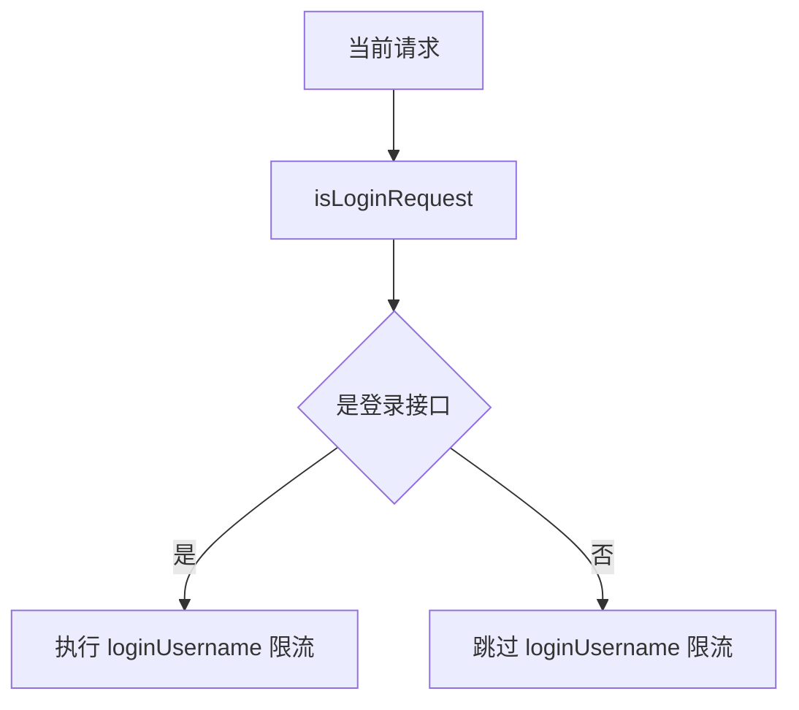

## 新语法 4：getTracker 是什么

```ts
getTracker: getLoginUsernameTrackerForThrottler;
```

`getTracker` 的意思是：

```text
把当前请求转换成一个计数 key。
```

比如登录接口：

```ts
export function getLoginUsernameTracker(request: RateLimitRequest) {
  const username =
    typeof request.body?.username === "string"
      ? request.body.username.trim().toLowerCase()
      : "";

  return username
    ? `username:${username}`
    : `${getIpTracker(request)}:username:missing`;
}
```

真实例子：

```text
请求体 username = " Admin "
trim 后是 "Admin"
toLowerCase 后是 "admin"
最后计数 key 是 username:admin
```

为什么要转小写：

```text
否则 admin、Admin、ADMIN 会变成三个 key。
攻击者可以换大小写绕过用户名维度限流。
```

## 登录接口为什么有两条限流

登录接口同时注册了两条策略：

```text
loginIp
loginUsername
```

图解：

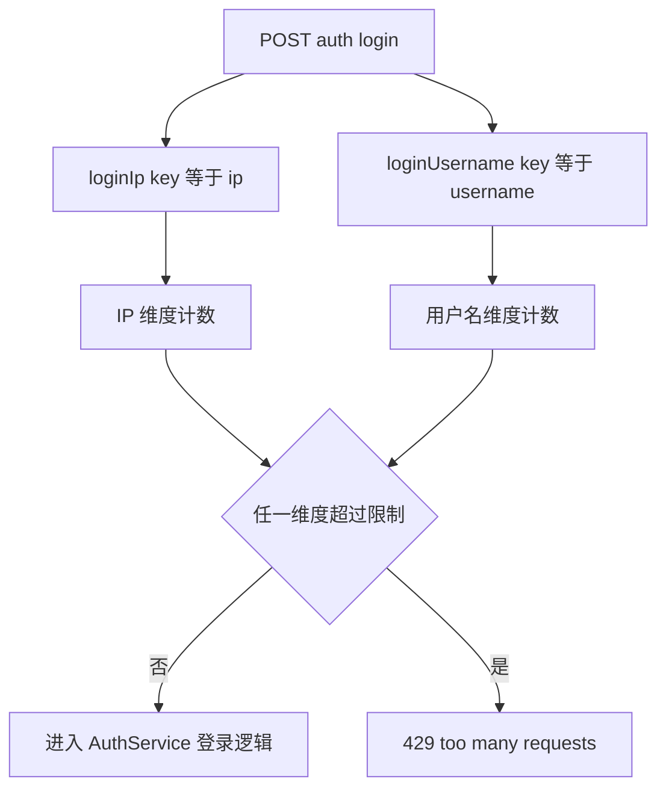

为什么要两个维度：

```text
只按 IP：
同一个攻击者可以换 IP 猜 admin 密码。

只按用户名：
同一个 IP 可以疯狂试不同用户名。

IP + username：
同时压住单 IP 爆破和单账号爆破。
```

当前配置：

```text
loginIp：同 IP 1 分钟 10 次
loginUsername：同用户名 1 分钟 5 次
```

## 上传为什么按用户和租户限流

上传接口同时注册了两条策略：

```text
uploadUser
uploadTenant
```

图解：

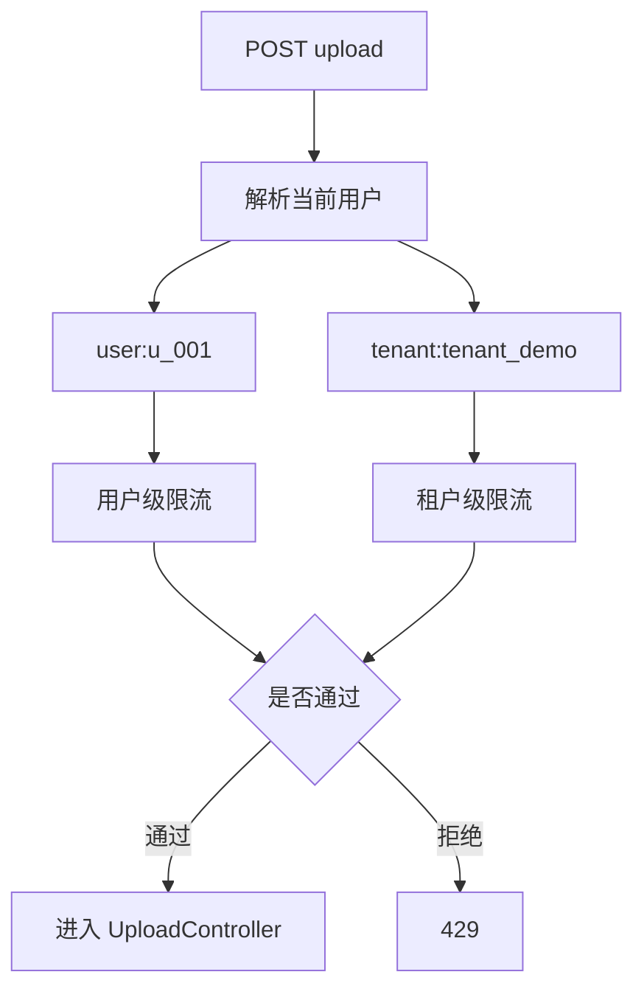

为什么不是只按 IP：

```text
真实系统里同一个公司可能多人共用出口 IP。
只按 IP 会误伤整个办公室。

只按用户又挡不住同一租户下多个账号同时刷上传。

用户级 + 租户级：
既能限制单个用户，也能保护整个租户的资源上限。
```

当前配置：

```text
uploadUser：同用户 1 分钟 20 次
uploadTenant：同租户 1 分钟 100 次
```

## 为什么 BffThrottlerGuard 要先解析当前用户

代码在 `apps/bff/src/rate-limit/bff-throttler.guard.ts`：

```ts
async canActivate(context: ExecutionContext) {
  await this.attachCurrentUserForScopedLimits(context);

  return super.canActivate(context);
}
```

这里的重点是：

```text
BffThrottlerGuard 是全局 Guard。
它可能比 Controller 上的 AuthGuard 更早执行。
```

但是上传、创建用户、审计读取这些策略需要知道：

```text
currentUser.id
currentUser.tenantId
```

所以本项目做了一个补充：

```text
如果当前请求属于用户或租户级限流接口，
BffThrottlerGuard 会先调用 GetCurrentUserService，
把 currentUser 挂到 request 上，
然后再交给 ThrottlerGuard 计数。
```

图解：

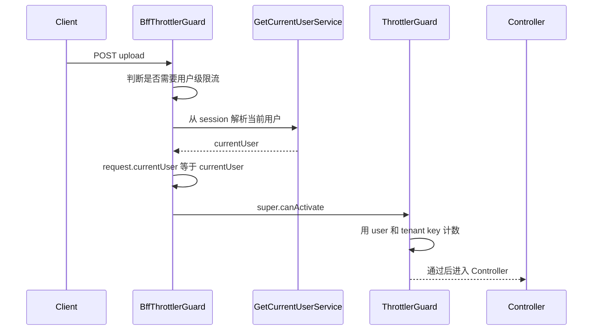

对应代码：

```ts
private async attachCurrentUserForScopedLimits(context: ExecutionContext) {
  if (!shouldResolveCurrentUserForRateLimit(context)) {
    return;
  }

  const request = context.switchToHttp().getRequest<AuthenticatedRequest>();

  if (request.currentUser) {
    return;
  }

  const user = await this.getCurrentUserService.execute(request);

  if (user) {
    request.currentUser = user;
  }
}
```

这段代码不是在做登录认证本身，而是在限流前补齐“按谁计数”的信息。

## 新语法 5：extends ThrottlerGuard 和 super

```ts
export class BffThrottlerGuard extends ThrottlerGuard {
  async canActivate(context: ExecutionContext) {
    await this.attachCurrentUserForScopedLimits(context);

    return super.canActivate(context);
  }
}
```

`extends ThrottlerGuard` 的意思是：

```text
BffThrottlerGuard 继承官方 ThrottlerGuard 的能力。
```

`super.canActivate(context)` 的意思是：

```text
调用父类 ThrottlerGuard 原本的限流判断逻辑。
```

本项目只是在官方逻辑前面插入了一步：

```text
先解析 currentUser
再执行官方限流
```

图解：

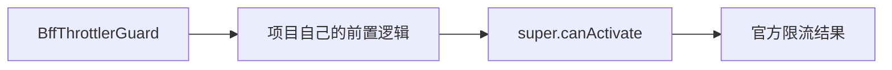

## 新语法 6：构造函数里的注入装饰器

```ts
constructor(
  @InjectThrottlerOptions()
  options: ThrottlerModuleOptions,
  @InjectThrottlerStorage()
  storageService: ThrottlerStorage,
  reflector: Reflector,
  private readonly getCurrentUserService: GetCurrentUserService
) {
  super(options, storageService, reflector);
}
```

这里有四个依赖：

```text
options：Throttler 配置，也就是 createBffThrottlerOptions 返回的内容
storageService：计数存储
reflector：Nest 用来读取装饰器元数据
getCurrentUserService：项目自己的当前用户解析服务
```

`@InjectThrottlerOptions()`：

```text
告诉 Nest 从 ThrottlerModule 里拿 options。
```

`@InjectThrottlerStorage()`：

```text
告诉 Nest 从 ThrottlerModule 里拿计数存储。
```

`private readonly getCurrentUserService`：

```text
这是 TypeScript 构造函数参数属性语法。
它等价于声明一个私有只读字段，并在构造函数里赋值。
```

近似等价于：

```ts
private readonly getCurrentUserService: GetCurrentUserService;

constructor(getCurrentUserService: GetCurrentUserService) {
  this.getCurrentUserService = getCurrentUserService;
}
```

## 新语法 7：ExecutionContext 是什么

很多函数接收这个参数：

```ts
context: ExecutionContext;
```

它是 Nest 对“当前执行现场”的封装。

当前项目用的是 HTTP，所以会这样取 request：

```ts
context.switchToHttp().getRequest<RateLimitRequest>();
```

含义是：

```text
从 Nest 当前上下文里切到 HTTP 模式，然后拿 Express request。
```

本次限流需要从 request 里读：

```text
method
originalUrl
url
ip
body.username
currentUser
```

## 新语法 8：Set 是什么

代码里有：

```ts
const AUDIT_EXPORT_PATHS = new Set([
  "/api/auth/login-logs",
  "/api/auth/login-risk-daily-stats",
  "/api/commodity/audit-logs"
]);
```

`Set` 是 JavaScript 的集合。

这里不用数组的原因是：

```text
判断某个 path 是否在集合里，用 Set.has(path) 更直接。
```

当前仓库还没有恢复审计导出任务接口，所以这里先把高成本审计读取接口放到同一类用户级限流里：

```text
GET /api/auth/login-logs
GET /api/auth/login-risk-daily-stats
GET /api/commodity/audit-logs
```

以后如果恢复审计导出任务接口，只需要把对应 path 加到这个集合里。

## 新语法 9：几个 TypeScript 写法

### import type

```ts
import type { ExecutionContext } from "@nestjs/common";
```

`import type` 表示：

```text
这里只导入类型，运行时不会真的引入这个值。
```

它的好处是：

```text
让 TypeScript 编译结果更干净，也避免把只用于类型检查的东西当成运行时代码。
```

### 交叉类型

```ts
type RateLimitRequest = AuthenticatedRequest &
  Request & {
    body?: {
      username?: unknown;
    };
  };
```

`&` 在这里不是“并且执行”，而是 TypeScript 的交叉类型。

含义是：

```text
RateLimitRequest 同时具备 AuthenticatedRequest 的字段、
Express Request 的字段、
以及 body.username 这个可选字段。
```

当前限流代码需要同时读这些东西：

```text
request.ip
request.method
request.originalUrl
request.body.username
request.currentUser
```

所以用一个组合类型描述它。

### 可选链

```ts
request.currentUser?.id;
request.body?.username;
```

`?.` 的意思是：

```text
左边不存在时，不继续往下取值，直接返回 undefined。
```

为什么这里需要它：

```text
有些请求还没登录，没有 currentUser。
有些请求没有 body。
限流代码不能因为读取字段就把请求打崩。
```

### 模板字符串

```ts
return `user:${request.currentUser.id}`;
```

反引号包起来的是模板字符串。

它的作用是把变量拼进字符串里。

当前项目用它生成计数 key：

```text
user:u_001
tenant:tenant_demo
username:admin
```

### 类型断言

```ts
getIpTracker(request as RateLimitRequest);
```

`as RateLimitRequest` 是类型断言。

它的意思是：

```text
告诉 TypeScript：这里请把 request 当成 RateLimitRequest 来检查。
```

这里为什么需要：

```text
@nestjs/throttler 提供的 getTracker 函数类型比较通用。
而本项目自己的 getIpTracker 需要更具体的 RateLimitRequest。
所以中间做一次类型转换。
```

注意：

```text
类型断言只影响 TypeScript 编译检查，不会在运行时改造对象。
```

## 429 是怎么变成统一错误格式的

当请求超过限制时，`ThrottlerGuard` 会抛出 `ThrottlerException`。

`ThrottlerException` 本质上是一个 HTTP 429 异常。

当前项目已有全局异常格式，所以 429 不会直接裸奔给前端，而是被统一包一层：

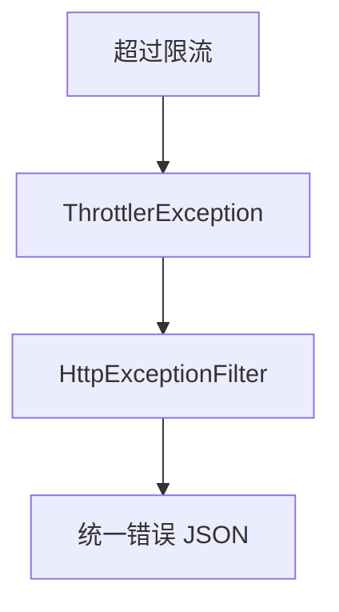

返回形态类似：

```json
{
  "success": false,
  "message": "too many requests",
  "path": "/api/auth/login",
  "traceId": "trace-throttle",
  "statusCode": 429,
  "timestamp": "2026-05-23T00:00:00.000Z"
}
```

测试位置：

```text
apps/bff/src/common/filters/http-exception.filter.spec.ts
```

## 和之前登录风控的区别

当前系统里已经有 `LoginRiskService`，它也是登录安全能力，但它和 Throttler 不是一回事。

图解：

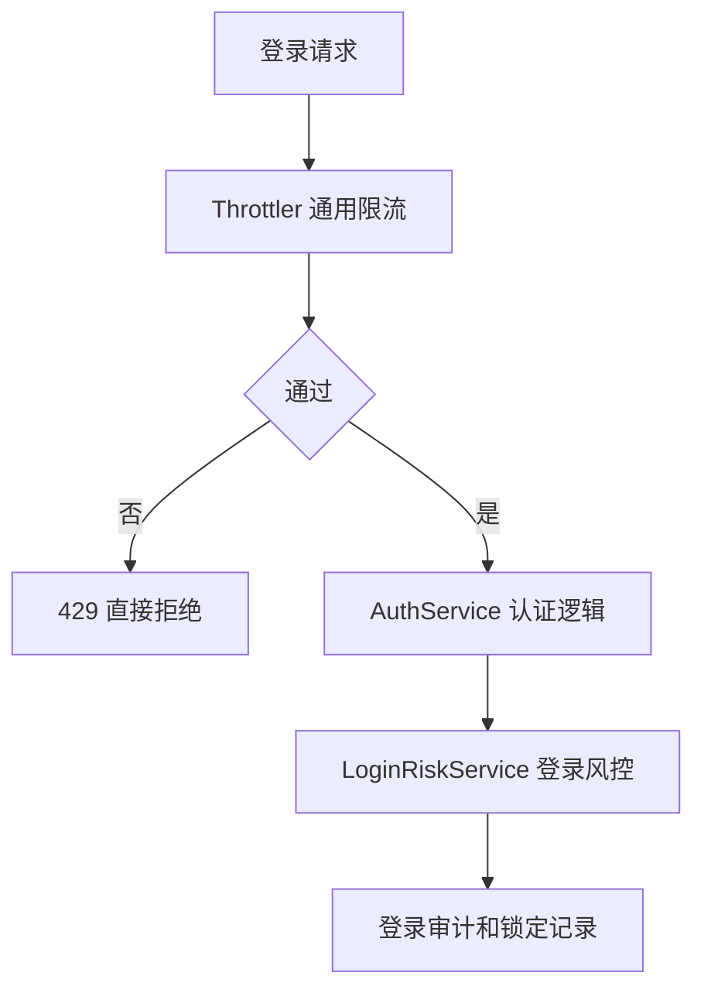

区别：

```text
Throttler：
请求进入业务逻辑前做通用频率限制。
它保护的是 BFF 接口入口。

LoginRiskService：
进入登录业务后，根据登录失败次数、账号、IP 做风控锁定和审计。
它保护的是认证流程本身。
```

所以登录接口现在是两层保护：

```text
第一层：还没查用户、没验密码前，Throttler 先挡高频请求。
第二层：进入登录流程后，LoginRiskService 记录失败、锁定账号或 IP。
```

## 计数存在哪里

当前代码使用 `@nestjs/throttler` 的默认存储。

在当前本地单进程 BFF 里可以理解成：

```text
计数存在当前 Node 进程内存里。
```

这满足本次 MVP 的目标：

```text
不再每个接口手写 Redis 计数逻辑。
先把限流规则统一收口。
```

但生产多实例时要注意：

```text
如果 BFF 部署 3 个实例，每个实例都有自己的内存计数。
用户请求如果被负载均衡打到不同实例，计数会被分散。
```

生产级演进方向：

```text
把 Throttler storage 换成共享存储，例如 Redis-backed storage。
这样所有 BFF 实例看到的是同一份计数。
```

图解：

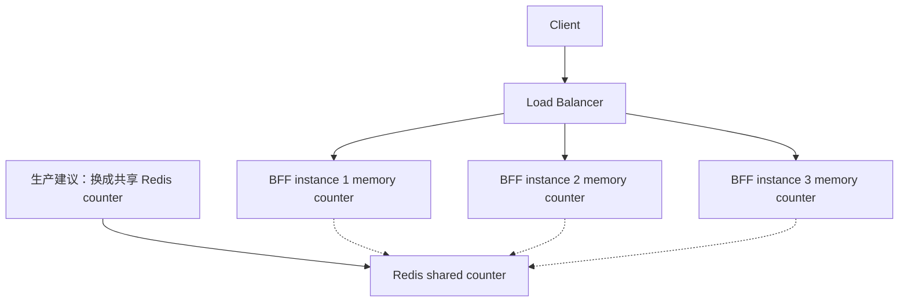

## 当前策略清单

策略统一定义在 `createBffThrottlerOptions()` 的 `throttlers` 数组里。

每条策略都按这几个字段描述：

| 字段            | 含义                                                |
| --------------- | --------------------------------------------------- |
| `name`          | 策略名                                              |
| `skipIf`        | 返回 `true` 就跳过该策略，返回 `false` 就执行该策略 |
| `getTracker`    | 生成计数维度，例如 IP、用户名、用户 ID、租户 ID     |
| `limit`         | 一个时间窗口内允许多少次                            |
| `ttl`           | 时间窗口长度                                        |
| `blockDuration` | 超限后阻塞多久；未显式配置时通常按 `ttl` 的长度处理 |

当前项目的 8 条策略：

| 策略                    | 生效范围                                                                                            | 计数维度 | 限制          |
| ----------------------- | --------------------------------------------------------------------------------------------------- | -------- | ------------- |
| `default`               | 默认所有接口，跳过 `/api/health`、`/api/test/reset`                                                 | IP       | 1 分钟 120 次 |
| `loginIp`               | `POST /api/auth/login`                                                                              | IP       | 1 分钟 10 次  |
| `loginUsername`         | `POST /api/auth/login`                                                                              | 用户名   | 1 分钟 5 次   |
| `uploadUser`            | `POST /api/upload`                                                                                  | 用户 ID  | 1 分钟 20 次  |
| `uploadTenant`          | `POST /api/upload`                                                                                  | 租户 ID  | 1 分钟 100 次 |
| `userCreate`            | `POST /api/users`                                                                                   | 用户 ID  | 5 分钟 10 次  |
| `sensitiveAuthMutation` | `POST /api/auth/reset-password`、`POST /api/auth/send-verification-code`                            | 用户 ID  | 5 分钟 10 次  |
| `auditExportUser`       | `GET /api/auth/login-logs`、`GET /api/auth/login-risk-daily-stats`、`GET /api/commodity/audit-logs` | 用户 ID  | 5 分钟 5 次   |

例如一次 `POST /api/auth/login` 会同时命中：

```text
default        -> 按 IP 计数
loginIp        -> 按 IP 计数
loginUsername  -> 按 username 计数
```

## 测试在验证什么

### rate-limit.config.spec.ts

验证配置本身：

```text
策略名是否完整注册
登录、上传、审计路径是否能匹配
Admin 和 admin 是否归到同一个 username:admin key
有 currentUser 时是否生成 user 和 tenant key
```

### bff-throttler.guard.spec.ts

验证 Guard 行为：

```text
同一个用户名登录 5 次后，第 6 次会抛 ThrottlerException
ADMIN 和 admin 会被认为是同一个用户名
上传请求进入限流前，会先调用 GetCurrentUserService
```

### http-exception.filter.spec.ts

验证错误格式：

```text
ThrottlerException 最终会变成统一 429 JSON。
```

## 从真实请求看完整过程

以登录为例：

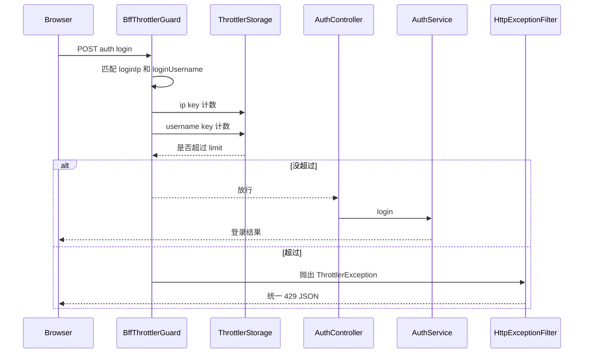

以上传为例：

```mermaid
sequenceDiagram
  participant Browser as Browser
  participant Guard as BffThrottlerGuard
  participant CurrentUser as GetCurrentUserService
  participant Storage as ThrottlerStorage
  participant Upload as UploadController

  Browser->>Guard: POST upload
  Guard->>CurrentUser: 解析 session 得到 currentUser
  CurrentUser-->>Guard: userId 和 tenantId
  Guard->>Storage: user key 计数
  Guard->>Storage: tenant key 计数
  Storage-->>Guard: 是否超过 limit
  alt 没超过
    Guard-->>Upload: 放行
  else 超过
    Guard-->>Browser: 429
  end
```

## 读代码建议顺序

建议按这个顺序读：

```text
1. apps/bff/src/app.module.ts
   先确认 RateLimitModule 是怎么进入应用的。

2. apps/bff/src/rate-limit/rate-limit.module.ts
   看 ThrottlerModule.forRoot 和 APP_GUARD。

3. apps/bff/src/rate-limit/rate-limit.config.ts
   看每条策略的 limit、ttl、skipIf、getTracker。

4. apps/bff/src/rate-limit/bff-throttler.guard.ts
   看为什么限流前要补 currentUser。

5. apps/bff/src/common/filters/http-exception.filter.spec.ts
   看 429 最终怎么被统一包装。

6. apps/bff/src/rate-limit/*.spec.ts
   看这些行为怎么被测试固定下来。
```

## 这次代码的真实工程边界

已经完成：

```text
统一注册全局限流 Guard
登录接口按 IP 和 username 双维度限流
上传接口按 userId 和 tenantId 双维度限流
创建用户接口按 userId 限流
审计类高成本读取接口按 userId 限流
429 进入统一错误格式
补充关键单元测试
```

还没有做：

```text
生产多实例共享限流存储
按环境配置不同 limit
更细粒度的文件大小、文件类型、对象存储成本限流
真实审计导出任务接口恢复后的专用路径注册
限流命中后的 metrics 和告警
```

如果用一句话概括这次代码：

```text
这次不是在某个接口里加 if 判断，而是把“请求频率控制”提升成 BFF 请求入口的统一基础设施。
```
