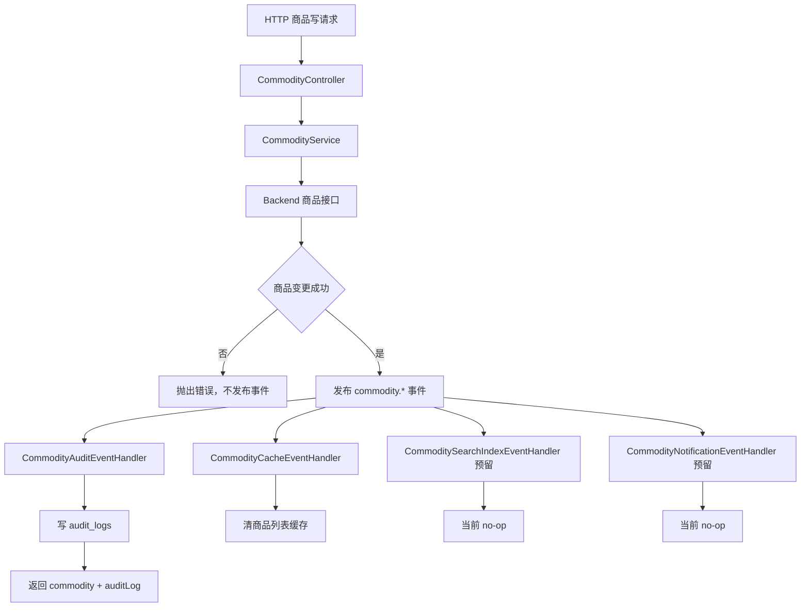
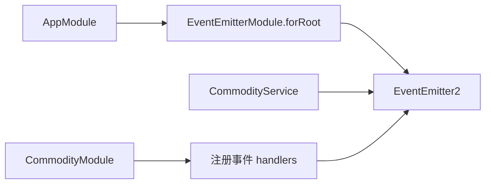
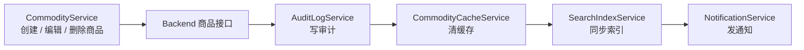
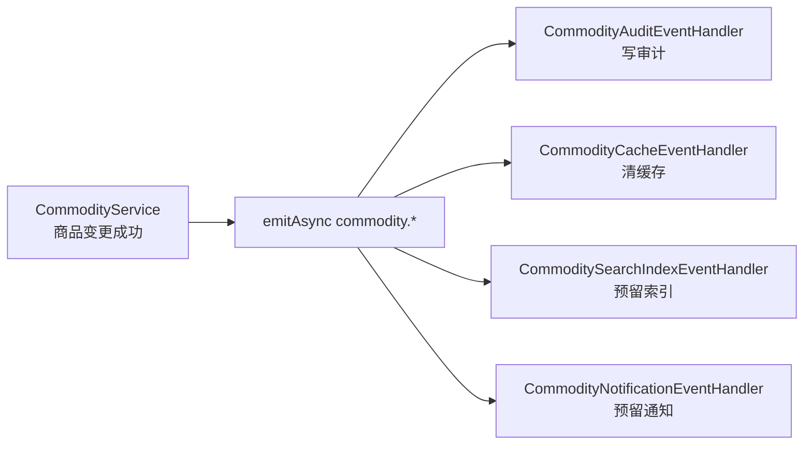
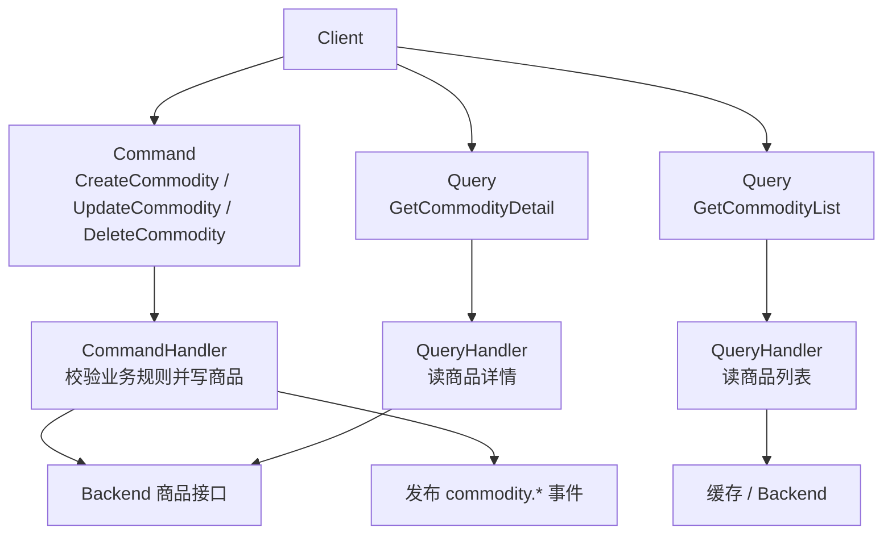
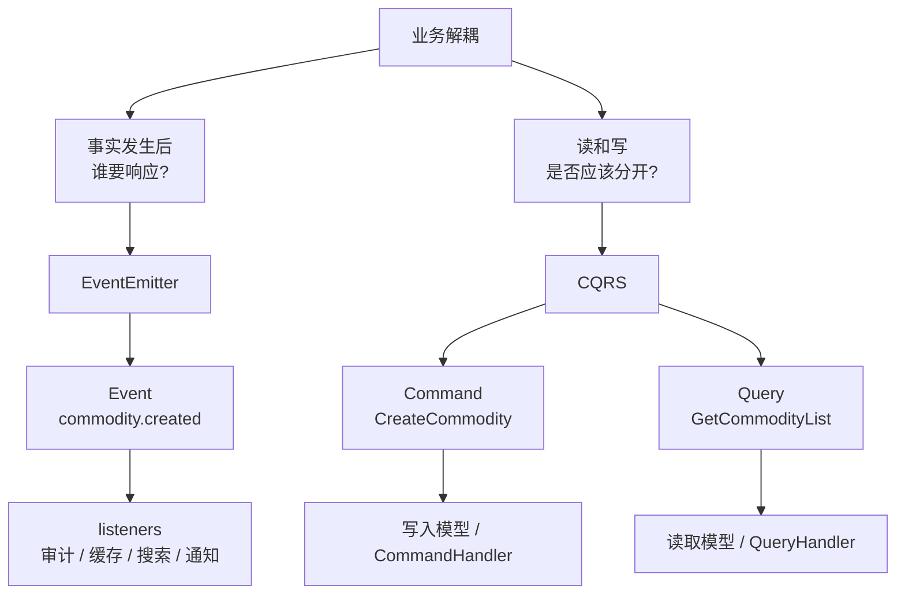
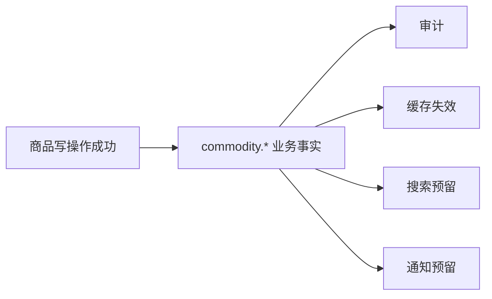
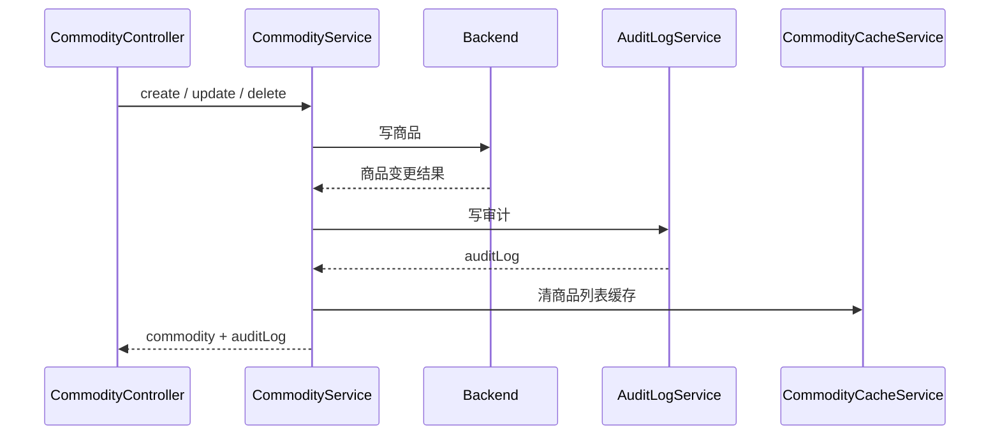
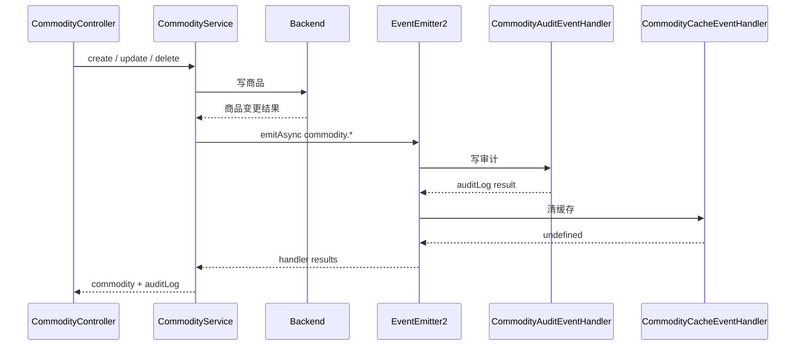

# 业务事件解耦 EventEmitter 代码逻辑图解

这篇文档解释本次“模块六：业务事件解耦 EventEmitter / CQRS”的改造。

本次功能的目标是：

```text
商品创建、编辑、删除、恢复、状态变更成功后，
CommodityService 不再直接串行处理所有副作用，
而是发布商品领域事件，
由独立 handler 处理审计、缓存失效、搜索索引、通知等后续动作。
```

当前只接入 `@nestjs/event-emitter`。

没有引入 `@nestjs/cqrs`，因为当前命令、查询、事件边界还没有复杂到需要完整 CQRS 结构。

## 一句话先讲本质

以前商品写操作是：

```text
CommodityService
-> 调 backend 完成商品变更
-> 写审计日志
-> 清商品列表缓存
-> 返回商品和审计日志
```

现在变成：

```text
CommodityService
-> 调 backend 完成商品变更
-> 发布 commodity.* 事件
-> 审计 handler 写审计
-> 缓存 handler 清缓存
-> 预留搜索/通知 handler
-> 返回商品和审计日志
```

重点变化不是“异步就不用管了”，而是：

```text
主业务事实：商品变更成功
副作用：审计、缓存、搜索、通知
```

这两类逻辑现在有了清晰边界。

## 代码位置

| 文件                                                   | 作用                                                 |
| ------------------------------------------------------ | ---------------------------------------------------- |
| `apps/bff/package.json`                                | 新增 `@nestjs/event-emitter` 依赖                    |
| `apps/bff/src/app.module.ts`                           | 注册 `EventEmitterModule.forRoot()`                  |
| `apps/bff/src/commodity/commodity.events.ts`           | 定义商品事件名、事件 payload 和审计 handler 返回结构 |
| `apps/bff/src/commodity/commodity.service.ts`          | 商品写操作成功后发布事件                             |
| `apps/bff/src/commodity/commodity-audit.events.ts`     | 订阅商品事件并写审计日志                             |
| `apps/bff/src/commodity/commodity-cache.events.ts`     | 订阅商品事件并失效商品列表缓存                       |
| `apps/bff/src/commodity/commodity-extension.events.ts` | 预留搜索索引和通知 handler                           |
| `apps/bff/src/commodity/commodity.module.ts`           | 注册事件 handler providers                           |
| `apps/bff/src/commodity/commodity.service.spec.ts`     | 验证主 Service 发布事件                              |
| `apps/bff/src/commodity/commodity-events.spec.ts`      | 验证审计 handler 和缓存 handler 行为                 |

## 总体链路



关键点：

```text
商品变更没有成功时，不发布事件。
商品变更成功后，事件代表“业务事实已经发生”。
handler 只处理这个事实带来的副作用。
```

## 应用启动时怎么接入事件能力

入口在 `apps/bff/src/app.module.ts`：

```ts
EventEmitterModule.forRoot();
```

它把 `EventEmitter2` 注册进 Nest 容器。

`CommodityService` 通过构造函数拿到它：

```ts
constructor(
  private readonly apiClientService: ApiClientService,
  private readonly auditLogService: AuditLogService,
  private readonly commodityCacheService: CommodityCacheService,
  private readonly eventEmitter: EventEmitter2
) {}
```

事件 handler 通过 `@OnEvent(...)` 订阅事件：

```ts
@OnEvent(COMMODITY_EVENTS.created)
async handleCommodityCreated(event: CommodityCreatedEvent) {
  // 写审计
}
```

启动关系可以这样看：



## 当前定义了哪些事件

事件名集中在 `commodity.events.ts`：

| 事件名                     | 触发场景         | 事件类                        |
| -------------------------- | ---------------- | ----------------------------- |
| `commodity.created`        | 创建商品成功     | `CommodityCreatedEvent`       |
| `commodity.updated`        | 编辑商品成功     | `CommodityUpdatedEvent`       |
| `commodity.deleted`        | 软删除商品成功   | `CommodityDeletedEvent`       |
| `commodity.restored`       | 恢复商品成功     | `CommodityRestoredEvent`      |
| `commodity.status_changed` | 修改商品状态成功 | `CommodityStatusChangedEvent` |

事件 payload 里保留这些关键上下文：

| 字段          | 作用                               |
| ------------- | ---------------------------------- |
| `operatorId`  | 谁触发了本次商品变更               |
| `traceId`     | 串起请求、审计、日志和后续 handler |
| `commodityId` | 被操作的商品 ID                    |
| `before`      | 变更前状态，用于审计 diff          |
| `after`       | 变更后状态，用于审计 diff          |
| `reason`      | 删除、恢复、状态变更原因           |
| `commodity`   | 创建商品后的完整结果               |

## CommodityService 现在做什么

以创建商品为例：

```ts
const commodity = await this.apiClientService.request<Commodity>(...);

const auditLog = await this.publishCommodityMutationEvent(
  COMMODITY_EVENTS.created,
  new CommodityCreatedEvent({
    commodity,
    operatorId: user.id,
    traceId: request.traceId ?? ""
  })
);

return {
  auditLog,
  commodity
};
```

`CommodityService` 仍然负责：

```text
1. 调 backend 完成商品主业务变更
2. 组装事件 payload
3. 发布事件
4. 返回 API 当前仍需要的 commodity + auditLog
```

它不再直接负责：

```text
1. 具体怎么写审计
2. 具体怎么清缓存
3. 未来怎么同步搜索索引
4. 未来怎么发送通知
```

这些逻辑进入各自 handler。

## 审计 handler

代码在 `commodity-audit.events.ts`。

它订阅商品事件，然后调用 `AuditLogService`：

```ts
@OnEvent(COMMODITY_EVENTS.deleted)
async handleCommodityDeleted(event: CommodityDeletedEvent) {
  return createCommodityAuditEventResult(
    await this.auditLogService.recordCommodityDelete(
      event.payload.operatorId,
      event.payload.commodityId,
      event.payload.before,
      event.payload.after,
      event.payload.reason,
      event.payload.traceId
    )
  );
}
```

这里的重点是：

```text
审计仍然是当前 API 响应契约的一部分。
商品写操作返回值里仍包含 auditLog。
```

所以审计 handler 会把结果包装成：

```ts
{
  kind: ("commodityAuditLog", auditLog);
}
```

`CommodityService` 会从 `emitAsync` 的结果里找到这份 auditLog。

## 缓存失效 handler

代码在 `commodity-cache.events.ts`。

它也订阅商品事件，然后统一执行：

```ts
await this.commodityCacheService.invalidateCommodityList();
```

但是缓存失效失败不会阻断商品写操作。

原因是：

```text
商品变更已经成功。
缓存只是读取加速层。
清缓存失败应该记录日志、后续告警或重试，
不能把已经成功的商品变更伪装成失败。
```

当前 handler 会捕获异常并写结构化日志：

```text
event = commodity_list_cache_invalidation_failed
```

## 失败语义

本次明确了不同 handler 的失败语义：

| handler          | 失败是否影响主流程 | 当前策略           | 原因                                                    |
| ---------------- | ------------------ | ------------------ | ------------------------------------------------------- |
| 审计 handler     | 影响               | 抛错，接口失败     | 当前响应仍包含 `auditLog`，审计也是高风险操作的可信记录 |
| 缓存失效 handler | 不影响             | 捕获异常并记录日志 | 缓存是加速层，失败后最多短时间读旧数据                  |
| 搜索索引 handler | 当前不影响         | no-op 预留         | 搜索服务还不存在，未来应走队列或重试                    |
| 通知 handler     | 当前不影响         | no-op 预留         | 通知通常不应阻塞商品写入，除非产品规则明确要求          |

主流程的判断在 `publishCommodityMutationEvent`：

```ts
const results = await this.eventEmitter.emitAsync(eventName, event);
const auditResult = results.find(isCommodityAuditEventResult);

if (!auditResult) {
  throw new InternalServerErrorException("commodity audit handler missing");
}
```

这表示：

```text
事件可以有多个 handler。
但当前商品写接口必须拿到审计 handler 的 auditLog 结果。
```

## 搜索和通知为什么只是预留

代码在 `commodity-extension.events.ts`。

当前只放了两个 no-op handler：

```text
CommoditySearchIndexEventHandler
CommodityNotificationEventHandler
```

原因是：

```text
当前系统还没有搜索服务、站内信或邮件通知。
先把订阅点留出来，让未来新增副作用时只加 handler，
不再把逻辑塞回 CommodityService。
```

未来如果接搜索索引，更合适的做法是：

```text
commodity.updated
-> SearchIndexEventHandler
-> 投递队列或调用搜索服务
-> 失败重试 / 告警 / 死信
```

而不是：

```text
CommodityService 里继续 if/else 调搜索服务
```

## 为什么暂时不用 CQRS

CQRS 适合这些情况：

```text
命令模型和查询模型明显不同
命令处理链路很复杂
事件有长期订阅、重放、投影
读模型需要独立构建
```

当前项目还没有到这一步。

本次只需要解决的问题是：

```text
商品主流程不要直接串联所有副作用。
```

所以先用 `@nestjs/event-emitter` 更合适：

```text
改动小
学习成本低
不改变现有 Controller / Service API
能先把事件边界建立起来
```

## EventEmitter 和 CQRS 的第一性原理区别

这两个概念都能降低耦合，但它们解决的不是同一个问题。

一句话区分：

```text
EventEmitter 解决：一件业务事实发生后，谁要响应它？
CQRS 解决：改变数据和读取数据，是否应该走同一套模型和 handler？
```

放到当前商品模块里：

```text
创建商品 = Command，改变系统状态
查询商品列表 = Query，读取系统状态
commodity.created = Event，已经发生的业务事实
```

### 1. EventEmitter：事实发生后的广播

EventEmitter 的第一性原理是：

```text
生产者只宣布“事实已经发生”。
谁关心这个事实，谁自己监听处理。
```

改造前，商品写操作容易变成这种强耦合链路：



这种写法的问题是：

```text
CommodityService 既要完成商品主流程，
又要知道审计、缓存、搜索、通知这些副作用怎么做。
以后每加一种副作用，都要继续修改 CommodityService。
```

改成 EventEmitter 后，主流程只发布事实：



此时 `CommodityService` 只需要表达：

```text
commodity.created / updated / deleted / restored / status_changed
这些业务事实已经发生。
```

各 handler 自己决定怎么响应：

| handler                             | 响应的事实           | 当前行为                                    |
| ----------------------------------- | -------------------- | ------------------------------------------- |
| `CommodityAuditEventHandler`        | 商品发生变更         | 写 `audit_logs`，并把 auditLog 返回给主流程 |
| `CommodityCacheEventHandler`        | 商品列表可能变旧     | 清商品列表缓存，失败只记录日志              |
| `CommoditySearchIndexEventHandler`  | 搜索索引可能需要更新 | 当前 no-op 预留                             |
| `CommodityNotificationEventHandler` | 用户可能需要通知     | 当前 no-op 预留                             |

所以 EventEmitter 的核心价值是：

```text
用“事件发布订阅”替代“主流程直接调用所有副作用服务”。
```

但普通进程内 EventEmitter 不等于可靠消息队列：

| 边界         | 含义                                                         |
| ------------ | ------------------------------------------------------------ |
| 进程内       | A 实例 emit 的事件，B 实例通常收不到                         |
| 非持久化     | 进程挂了，内存事件可能丢失                                   |
| 不保证重试   | handler 失败后的补偿、重试、告警要自己设计                   |
| 不天然跨服务 | 跨服务要用 Redis Pub/Sub、MQ、Kafka、BullMQ events 或 outbox |

本次用 `@nestjs/event-emitter` 的定位是：

```text
先在 BFF 进程内建立清晰业务事件边界。
不是把它当成跨服务可靠事件总线。
```

### 2. CQRS：读写职责分离

CQRS 的第一性原理是：

```text
写操作和读操作的目的不同。
写操作表达业务意图，读操作服务查询展示。
它们不必强迫共用同一个 service 方法、DTO、模型和调用链。
```

如果当前商品模块未来引入 CQRS，结构会更像这样：



CQRS 先把入口意图区分成两类：

| 类型    | 问题             | 当前商品场景例子                               | 是否应该有副作用   |
| ------- | ---------------- | ---------------------------------------------- | ------------------ |
| Command | 我要改变系统状态 | 创建商品、编辑商品、删除商品、恢复商品、改状态 | 可以有副作用       |
| Query   | 我要读取系统状态 | 商品列表、商品详情、筛选查询                   | 不应该改变业务状态 |

也就是说，CQRS 关注的是：

```text
CreateCommodityCommand
-> 改变商品状态
-> 可以发布 commodity.created

GetCommodityListQuery
-> 读取商品列表
-> 不应该写审计、不应该清缓存、不应该发通知
```

CQRS 带来的解耦是：

```text
写模型可以围绕业务规则设计。
读模型可以围绕页面展示、筛选条件和查询性能设计。
```

例如写商品时关心：

```text
name
price
status
operatorId
traceId
业务校验
```

读商品列表时可能更关心：

```text
分页
筛选
排序
缓存
展示字段
```

这两套模型不一定要绑在同一个 service 方法里。

### 3. 两者核心差异图解



对比表：

| 对比点       | EventEmitter                   | CQRS                                               |
| ------------ | ------------------------------ | -------------------------------------------------- |
| 第一性问题   | 一件事发生后，谁要响应？       | 改数据和查数据是否应该分开？                       |
| 核心对象     | Event，已经发生的事实          | Command / Query，操作意图                          |
| 当前例子     | `commodity.created`            | `CreateCommodityCommand` / `GetCommodityListQuery` |
| 主要解决     | 副作用解耦                     | 读写职责和模型解耦                                 |
| 发生时机     | 通常在主业务动作成功之后       | 从请求入口就区分写请求和读请求                     |
| 粒度         | 常用于局部模块内解耦           | 常用于模块或应用架构组织                           |
| 当前项目状态 | 已接入 `@nestjs/event-emitter` | 未接入 `@nestjs/cqrs`                              |

### 4. 当前为什么先用 EventEmitter

本次真正要解决的是：

```text
商品写操作成功后，
审计、缓存、搜索、通知这些副作用不要继续塞在 CommodityService 里。
```

所以 EventEmitter 已经足够：



如果未来出现这些信号，再考虑 CQRS：

| 现象                                                              | 更适合考虑                                          |
| ----------------------------------------------------------------- | --------------------------------------------------- |
| `CommodityService` 同时堆满创建、修改、查询、导出、统计、订阅逻辑 | CQRS                                                |
| 写入模型和读取模型字段差异非常大                                  | CQRS                                                |
| 读侧需要独立缓存、投影表、搜索索引或专门查询模型                  | CQRS                                                |
| 多个模块都要响应“商品已变更”这个事实                              | EventEmitter / 外部事件总线                         |
| 事件要跨实例、跨服务可靠投递                                      | MQ / outbox / BullMQ，而不是普通进程内 EventEmitter |

一句话结论：

```text
EventEmitter 是“事实发生后的广播机制”。
CQRS 是“写入意图和读取意图区分开的架构模式”。
```

## 和旧实现的对比

旧实现：



新实现：



## 测试覆盖

本次补充和调整了这些测试：

| 测试文件                    | 验证点                                           |
| --------------------------- | ------------------------------------------------ |
| `commodity.service.spec.ts` | 商品写操作成功后发布正确的 `commodity.*` 事件    |
| `commodity.service.spec.ts` | 后端返回商品不存在时不发布事件                   |
| `commodity.service.spec.ts` | 审计 handler 没返回 auditLog 时接口失败          |
| `commodity-events.spec.ts`  | 审计 handler 会调用对应的 `AuditLogService` 方法 |
| `commodity-events.spec.ts`  | 缓存 handler 会调用 `invalidateCommodityList`    |
| `commodity-events.spec.ts`  | 缓存失效失败不会 reject 主事件流                 |
| `commodity.e2e-spec.ts`     | 商品接口响应契约保持兼容                         |

已运行验证：

```bash
pnpm --dir apps/bff build
pnpm --dir apps/bff test
pnpm exec prettier --check ...
git diff --check
```

全量 BFF 测试结果：

```text
23 passed, 108 passed
```

## 真实工程扩展方向

后续如果继续演进，可以按这个顺序做：

```text
1. 给事件 payload 增加稳定 eventId，方便幂等和排障。
2. 把搜索索引、通知这类可重试副作用改成队列任务。
3. 给缓存失效失败加 metrics 和告警。
4. 如果事件需要跨实例消费，再接 Redis Pub/Sub、消息队列或 outbox。
5. 当命令/查询模型明显分离后，再考虑 @nestjs/cqrs。
```

当前 MVP 没覆盖：

```text
事件持久化
事件重放
跨进程事件总线
handler 幂等
失败重试和死信队列
搜索索引真实同步
通知真实发送
```

本次最重要的结论是：

```text
EventEmitter 不是为了把错误藏起来，
而是为了把“商品主事实”和“事实发生后的副作用”拆开。
拆开以后，每类副作用才能独立测试、独立演进、独立决定失败语义。
```
