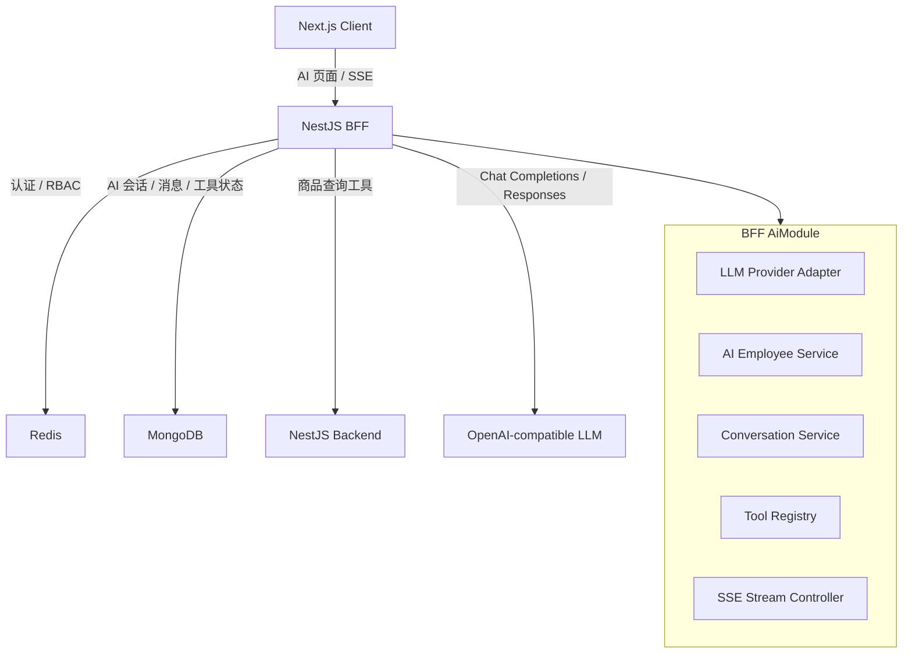
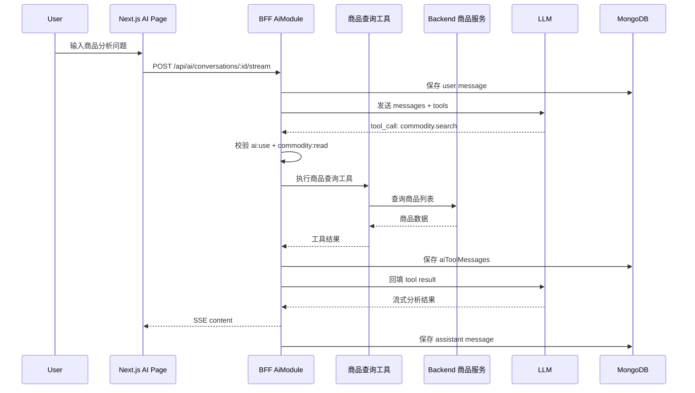
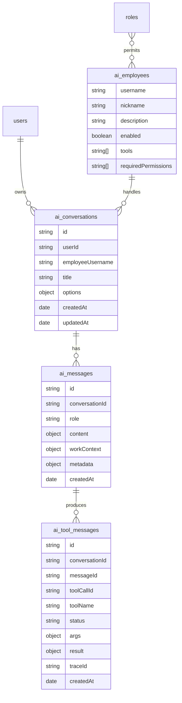
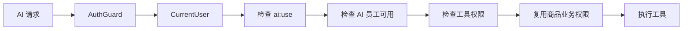

# NocoBase AI 能力迁移到 Next-BFF 升级方案

## 1. 背景与目标

当前 `next-bff` 已经具备真实后台系统的基础能力：

- Next.js client：后台页面、登录页、商品页面、权限管理页面。
- NestJS BFF：认证、Cookie session、RBAC、CSRF、商品接口、上传、审计、traceId。
- NestJS backend：模拟后端业务服务。
- MongoDB / Redis：持久化、会话和缓存基础能力。

NocoBase 的 AI 能力不是单纯“接一个聊天接口”，而是围绕：

```text
AI 员工
-> 会话
-> 消息
-> 工具调用
-> 权限边界
-> 工作上下文
-> 审计和恢复
```

形成一个业务系统内的 AI 运行时。

本次升级目标不是照搬 NocoBase 插件系统，而是把其中适合 `next-bff` 的 AI 能力重建成普通 NestJS 模块。

第一阶段目标：

```text
登录用户可以在后台使用 AI 助手，
AI 可以基于当前用户权限查询商品数据，
并通过 SSE 流式返回分析结果。
```

不在第一阶段做：

- NocoBase 插件系统。
- workflow / agent 编排。
- 多 AI 员工自动协作。
- 知识库向量检索。
- 文件解析和多模态。
- AI 自动写入商品数据。

这里的 workflow / agent 编排，指的不只是“多员工协作”，还包括业务事件触发 AI 节点、AI 调用子流程、多个工具按状态流转、失败后恢复或补偿等自动化链路。它适合放到 AI v1 跑通后再单独设计。

## 2. NocoBase AI 能力映射

NocoBase 中 AI 相关核心模块：

| NocoBase 能力 | 当前作用 | Next-BFF 迁移方式 |
| --- | --- | --- |
| `@nocobase/ai` | 工具注册、文档索引、AI 基础能力 | 不迁移包，保留工具注册思想 |
| `plugin-ai` | AI 员工、会话、SSE、LLM、工具状态 | 迁移为 `AiModule` |
| `aiEmployees` | AI 员工定义和权限绑定 | Mongo collection + RBAC |
| `llmServices` | 模型服务配置 | OpenAI-compatible provider 配置 |
| `aiConversations` | 会话 | Mongo collection |
| `aiMessages` | 用户和 assistant 消息 | Mongo collection |
| `aiToolMessages` | 工具调用状态 | Mongo collection |
| WorkContext | 页面、数据、区块上下文 | v1 只传商品页面上下文 |
| workflow caller | AI 调用工作流 | 后续阶段 |

核心取舍：

```text
保留：AI employee、conversation、message、tool、permission、SSE。
不保留：插件扫描、插件生命周期、动态安装、workflow 编排。
```

NocoBase 里 `plugin-ai` 的关键价值是把模型能力放进业务系统边界内，而不是让前端直接访问模型。迁移到 `next-bff` 时，也应保持这个原则：AI 的模型调用、工具调用、权限判断、消息落库都在 BFF 服务端完成。

## 3. 目标架构



第一阶段 AI 只放在 BFF：

- Client 不直接调用模型。
- Backend 不直接调用模型。
- BFF 负责认证、权限、工具白名单、审计和 traceId。
- 所有 AI 消息和工具调用状态必须落库。

这样设计的原因是当前项目的 BFF 已经承担了认证、CSRF、权限、统一响应、审计和 traceId 边界。如果 AI 绕过 BFF，会让模型获得一条不受当前权限系统约束的新通道。

## 4. AI v1 最小闭环

用户使用路径：

```text
用户登录
-> 打开后台 AI 页面
-> 选择“商品分析助手”
-> 输入问题：帮我分析低库存商品
-> BFF 创建或读取 conversation
-> BFF 调用 LLM
-> LLM 决定调用商品查询工具
-> BFF 校验用户权限
-> BFF 调用现有商品列表接口
-> 工具结果回填给 LLM
-> LLM 生成分析
-> BFF SSE 流式返回
-> 消息和工具状态落库
```



这个闭环的重点不是让 AI “能回答”，而是让 AI 在真实业务系统里按权限查询数据、留下调用记录，并且在失败时能通过 traceId 排查。

## 5. 后端模块设计

建议新增：

```text
apps/bff/src/ai
```

模块边界：

| 子模块 | 职责 |
| --- | --- |
| `AiModule` | 汇总 provider、controller、service、schemas |
| `AiController` | 暴露 AI API 和 SSE |
| `AiConversationService` | 创建会话、读取消息、保存消息 |
| `AiEmployeeService` | 返回当前用户可用 AI 员工 |
| `LlmProviderService` | OpenAI-compatible 模型调用 |
| `AiToolRegistry` | 注册和查找工具 |
| `CommodityAnalysisTool` | 商品查询分析工具 |
| `AiPermissionService` | AI 工具权限判断 |
| `AiAuditService` | 工具调用审计和 traceId 记录 |

第一阶段只实现一个内置员工：

```text
username: commodity-analyst
nickname: 商品分析助手
permissions: ai:use + commodity:read
tools:
  - commodity.search
  - commodity.detail
```

### 5.1 推荐目录

```text
apps/bff/src/ai
├── ai.controller.ts
├── ai.module.ts
├── ai.types.ts
├── conversation
│   ├── ai-conversation.service.ts
│   └── schemas
│       ├── ai-conversation.schema.ts
│       ├── ai-message.schema.ts
│       └── ai-tool-message.schema.ts
├── dto
│   ├── create-ai-conversation.dto.ts
│   ├── query-ai-messages.dto.ts
│   └── stream-ai-message.dto.ts
├── employees
│   ├── ai-employee.service.ts
│   └── built-in-ai-employees.ts
├── llm
│   ├── llm-provider.service.ts
│   └── openai-compatible.types.ts
├── permissions
│   └── ai-permission.service.ts
└── tools
    ├── ai-tool-registry.ts
    ├── ai-tool.types.ts
    └── commodity-analysis.tool.ts
```

目录不需要抽象成框架级插件。它只是 BFF 的一个业务模块，和现有 `auth`、`commodity`、`role`、`permission` 模块保持同级。

## 6. API 草案

### 6.1 模型服务

```http
GET /api/ai/models
```

返回当前启用模型：

```json
{
  "models": [
    {
      "provider": "openai-compatible",
      "model": "gpt-4.1-mini",
      "label": "默认模型"
    }
  ]
}
```

### 6.2 AI 员工

```http
GET /api/ai/employees
```

按当前用户权限返回可用员工。

示例：

```json
{
  "items": [
    {
      "username": "commodity-analyst",
      "nickname": "商品分析助手",
      "description": "分析商品库存、状态、价格和列表筛选结果。",
      "tools": ["commodity.search", "commodity.detail"]
    }
  ]
}
```

### 6.3 会话

```http
GET /api/ai/conversations
POST /api/ai/conversations
GET /api/ai/conversations/:id/messages
```

创建会话请求：

```json
{
  "employee": "commodity-analyst",
  "title": "低库存商品分析"
}
```

### 6.4 流式发送消息

```http
POST /api/ai/conversations/:id/stream
Accept: text/event-stream
```

请求：

```json
{
  "employee": "commodity-analyst",
  "model": "gpt-4.1-mini",
  "message": "帮我分析一下低库存商品",
  "workContext": {
    "page": "/present/commodity/list",
    "filters": {
      "status": "on_sale"
    }
  }
}
```

SSE 事件：

| event | 说明 |
| --- | --- |
| `stream_start` | 流开始 |
| `content` | 文本增量 |
| `tool_call` | 模型请求工具 |
| `tool_result` | 工具执行结果 |
| `error` | 错误 |
| `done` | 流结束 |

SSE 示例：

```text
event: stream_start
data: {"conversationId":"...","traceId":"..."}

event: content
data: {"delta":"我先查看当前低库存商品。"}

event: tool_call
data: {"toolName":"commodity.search","args":{"stockLessThan":10}}

event: tool_result
data: {"toolName":"commodity.search","status":"done","count":8}

event: content
data: {"delta":"当前低库存商品主要集中在..."}

event: done
data: {"messageId":"..."}
```

## 7. 数据模型草案



建议 Mongo collection：

| Collection | 作用 |
| --- | --- |
| `ai_llm_services` | 模型服务配置，v1 也可先用环境变量替代 |
| `ai_employees` | AI 员工定义 |
| `ai_conversations` | 用户会话 |
| `ai_messages` | 会话消息 |
| `ai_tool_messages` | 工具调用状态和结果 |

v1 可以先把 `ai_employees` 做成内置常量，等 Phase 3 再落库管理。

## 8. 权限与安全边界

新增权限建议：

| 权限码 | 作用 |
| --- | --- |
| `ai:use` | 使用 AI 助手 |
| `ai:manage` | 管理 AI 配置 |
| `ai:tool:commodity-read` | 允许 AI 调用商品只读工具 |

第一阶段规则：

- AI 工具不能绕过当前用户权限。
- 商品查询工具必须复用当前用户身份。
- 工具默认只读。
- 写操作工具不进入 v1。
- LLM API key 只放服务端环境变量或服务端配置，不下发前端。
- AI 输出不能直接作为可信业务结果，必须展示为建议或分析。

### 8.1 权限校验链路



如果用户没有 `commodity:read`，不能因为他能使用 AI，就让 AI 帮他查询商品列表。AI 是入口，不是越权通道。

## 9. 商品查询分析工具

第一阶段工具：

```text
commodity.search
```

输入：

```json
{
  "keyword": "string",
  "status": "pending | on_sale | offline",
  "stockLessThan": 10,
  "page": 1,
  "pageSize": 20
}
```

输出：

```json
{
  "items": [
    {
      "id": "10001",
      "name": "商品名",
      "status": "on_sale",
      "price": 99,
      "stock": 5
    }
  ],
  "total": 1
}
```

工具执行前检查：

```text
当前用户已登录
-> 有 ai:use
-> 有 commodity:read 或 ai:tool:commodity-read
-> 参数通过 DTO 校验
-> 调用现有商品查询链路
-> 记录 traceId 和 tool message
```

### 9.1 真实例子

用户问题：

```text
帮我找一下当前在售但库存小于 10 的商品，并总结补货优先级。
```

AI 不应该凭空回答，而应该生成工具调用：

```json
{
  "tool": "commodity.search",
  "args": {
    "status": "on_sale",
    "stockLessThan": 10,
    "page": 1,
    "pageSize": 20
  }
}
```

BFF 校验权限后查询商品数据，再把工具结果交给模型总结。这样得到的分析可以被当前系统验证：商品列表能看到同样数据，审计和 traceId 能查到工具调用。

## 10. 前端升级点

建议 v1 新增独立页面：

```text
/present/ai
```

后续再升级为全局右侧 AI 面板。

v1 页面需要：

- 会话列表。
- 当前 AI 员工选择。
- 模型选择。
- 消息列表。
- 输入框。
- 流式输出状态。
- 工具调用状态卡片。
- 错误展示。

第一阶段不要先做复杂浮层，以免和现有 AppShell、导航、RSC 数据流耦合过深。独立页面更容易测试，也更适合学习和复盘完整调用链。

## 11. 分阶段实施路线

### Phase 1：AI 基础闭环

- 新增 `AiModule`。
- 新增 LLM provider 配置读取。
- 新增 mock provider，用于无真实 key 时跑测试。
- 新增会话和消息 collection。
- 新增 `/api/ai/conversations` 和 `/stream`。
- 前端新增 `/present/ai` 页面。

验收：

```text
登录用户可以发送消息，并看到流式回复。
消息能落库。
未登录用户被拒绝。
```

### Phase 2：商品查询工具

- 新增 `AiToolRegistry`。
- 注册 `commodity.search`。
- 工具调用前做权限校验。
- 工具调用结果落 `ai_tool_messages`。
- 前端展示工具调用状态。

验收：

```text
有权限用户可以让 AI 查询商品并分析。
无 commodity:read 权限用户不能通过 AI 查询商品。
工具调用有 traceId。
```

### Phase 3：AI 员工与角色绑定

- 新增 `ai_employees` collection。
- 内置 `commodity-analyst`。
- 根据用户角色返回可用 AI 员工。
- 支持用户个人 prompt。

验收：

```text
不同角色看到不同 AI 员工。
禁用员工后前端不可选。
```

### Phase 4：后续增强

- workflow / agent 编排。
- 多员工协作。
- 审计日志问答。
- 商品创建草稿，但必须人工确认。
- 文件解析。
- 知识库检索。
- MCP 或外部 agent 接入。

## 12. 测试计划

后端单测：

```bash
pnpm test:bff
```

覆盖：

- LLM provider 配置解析。
- 会话创建。
- 消息保存。
- 商品工具参数校验。
- 工具权限拒绝。
- SSE 事件格式。

后端 e2e：

```bash
pnpm test:bff:e2e
```

覆盖：

- 未登录访问 AI API 返回 401。
- 无权限调用 AI 返回 403。
- 登录用户创建会话成功。
- 发送消息能收到 SSE。
- 商品查询工具调用后写入 `ai_tool_messages`。

前端验证：

```bash
pnpm lint:client
pnpm build:client
```

必要时增加 Playwright：

- 登录。
- 进入 `/present/ai`。
- 发送问题。
- 看到流式内容。
- 看到工具调用卡片。
- 刷新后历史消息仍存在。

## 13. 风险与取舍

### 13.1 LLM 输出不可信

AI 分析只能作为辅助建议，不能直接驱动商品上下架、删除、改价等操作。

### 13.2 工具权限必须服务端判断

前端隐藏按钮不是权限。AI 工具必须在 BFF 服务端校验当前用户权限。

### 13.3 tool call 状态必须落库

不能只存在前端内存里，否则 SSE 断开、刷新页面、重试消息时无法恢复。

### 13.4 v1 不做写操作

商品创建、修改、删除都属于高风险写操作。后续如果做，必须加入：

- 参数预览。
- 用户确认。
- DTO 校验。
- 审计日志。
- 回滚或补偿策略。

### 13.5 不迁移 NocoBase 插件系统

当前项目是明确的三层业务系统，不需要插件安装、启用、禁用、动态扫描和 preset 装配。迁移这些机制会显著增加复杂度，但不能直接提升 AI v1 的业务价值。

## 14. 最小验收标准

AI v1 完成时，至少满足：

```text
1. 管理员登录后能进入 AI 页面。
2. 可以创建 AI 会话。
3. 可以发送消息并收到 SSE 回复。
4. 消息保存到 MongoDB。
5. AI 可以调用商品只读查询工具。
6. 工具调用有权限校验。
7. 工具调用状态保存到 MongoDB。
8. 无权限用户不能通过 AI 绕过商品权限。
9. 错误响应带 traceId。
10. 有单元测试和 e2e 覆盖核心路径。
```

## 15. 推荐下一步

建议下一次实现从 Phase 1 开始，不要一口气把工具、员工配置、前端浮层和真实模型全部做完。

最小开发顺序：

```text
AiModule skeleton
-> mock LLM provider
-> conversation/message schema
-> stream API
-> /present/ai 页面
-> 单测和 e2e
```

等这个闭环稳定后，再接 `commodity.search` 工具。这样可以先确认 SSE、消息落库、错误处理和权限入口是可靠的，再处理模型工具调用的不确定性。
