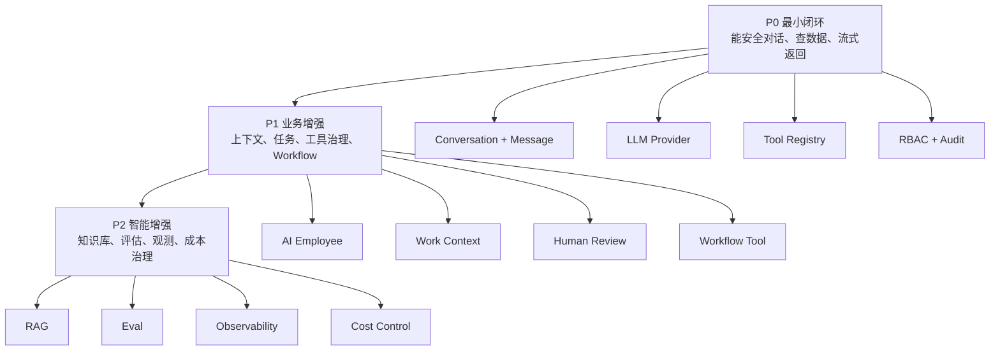
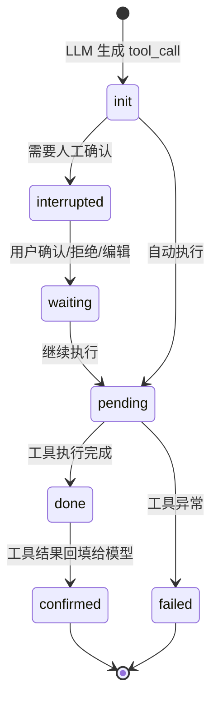

# NocoBase AI 能力升级 Checklist

## 1. 使用范围

本文基于 NocoBase 当前 AI 系统梳理和 `next-bff` 迁移方案，目标是把 AI 能力升级拆成可执行、可验收的清单。

这里的升级不是单纯替换更强模型，而是把下面这条链路做成业务系统里的受控 AI 运行时：

```text
AI 员工
-> 会话
-> 消息
-> 工具调用
-> 权限边界
-> 工作上下文
-> 审计与恢复
```

`next-bff` 不需要照搬 NocoBase 插件系统，但应保留 NocoBase AI 设计里最有价值的部分：

- AI 员工角色边界。
- LLM provider 管理。
- 会话和消息持久化。
- 工具注册与工具状态机。
- SSE 流式响应。
- 用户/角色权限。
- 工作上下文。
- 高风险工具人工确认。
- 审计、traceId 和可排障能力。

## 2. 总体升级路径



阶段判断：

- P0 完成后，登录用户可以让 AI 按权限查询商品数据，并通过 SSE 收到结果。
- P1 完成后，AI 能理解页面上下文、使用不同角色和任务，并受控调用更丰富的工具。
- P2 完成后，AI 能使用知识库、可评估、可监控、可追踪成本和质量。

## 3. P0 最小可用闭环

### 3.1 模块边界

- [ ] 新增 `apps/bff/src/ai`，作为 AI 能力唯一后端入口。
- [ ] 不让 Client 直接调用 LLM provider。
- [ ] 不让 Backend 直接调用 LLM provider。
- [ ] BFF 统一负责认证、RBAC、工具权限、审计、traceId 和 SSE。
- [ ] 第一阶段只实现一个内置员工：`commodity-analyst`。
- [ ] 第一阶段只开放只读商品工具，不开放 AI 写入商品数据。

### 3.2 数据模型

- [ ] 设计 `aiConversations`：`sessionId`、`userId`、`employee`、`title`、`options`、`createdAt`、`updatedAt`。
- [ ] 设计 `aiMessages`：`messageId`、`sessionId`、`role`、`content`、`attachments`、`workContext`、`metadata`。
- [ ] 设计 `aiToolMessages`：`sessionId`、`messageId`、`toolCallId`、`toolName`、`args`、`invokeStatus`、`status`、`result`、`error`。
- [ ] 所有会话读取必须按 `userId` 过滤。
- [ ] 所有消息读取必须先校验 conversation 归属。
- [ ] 工具调用参数和结果必须落库，敏感字段需要脱敏或截断。

### 3.3 LLM Provider

- [ ] 实现 OpenAI-compatible provider adapter。
- [ ] 支持从环境变量读取 `baseURL`、`apiKey`、默认模型。
- [ ] 支持普通文本对话。
- [ ] 支持 tool calling。
- [ ] 支持流式响应。
- [ ] 记录实际调用的 provider、model、耗时、错误码。
- [ ] provider 报错时返回可读错误，不把 API key、原始 token、内部地址暴露给前端。

### 3.4 会话 API

- [ ] `POST /api/ai/conversations` 创建会话。
- [ ] `GET /api/ai/conversations` 只列当前用户会话。
- [ ] `GET /api/ai/conversations/:sessionId/messages` 只读当前用户消息。
- [ ] `POST /api/ai/conversations/:sessionId/stream` 使用 SSE 返回 AI 回复。
- [ ] `POST /api/ai/conversations/:sessionId/abort` 支持中止当前请求。
- [ ] 请求必须带登录态，未登录返回 401。
- [ ] 无权限使用 AI 返回 403。

### 3.5 SSE 协议

- [ ] `stream_start`：服务端开始处理。
- [ ] `content`：assistant 文本增量。
- [ ] `tool_calls`：模型产生完整工具调用。
- [ ] `tool_call_status`：工具状态变化。
- [ ] `new_message`：assistant 消息落库完成。
- [ ] `error`：可恢复错误。
- [ ] `stream_end`：本轮响应结束。
- [ ] 前端流结束后重新拉取消息，确保 DB 状态和 UI 状态一致。

### 3.6 工具注册与商品查询

- [ ] 定义统一工具协议：`name`、`description`、`schema`、`execution`、`defaultPermission`、`invoke`。
- [ ] 实现 `AiToolRegistry`，支持注册、列表、按名称查找。
- [ ] 实现 `commodity.search` 只读工具。
- [ ] 实现 `commodity.detail` 只读工具。
- [ ] 工具执行前校验 `ai:use` 和 `commodity:read`。
- [ ] 工具参数必须通过 DTO/schema 校验。
- [ ] 工具必须限制 `limit`、`offset`、排序字段、返回字段。
- [ ] 工具调用失败时写入 `aiToolMessages.status = error`。

### 3.7 权限与审计

- [ ] 增加 AI 基础权限，例如 `ai:use`。
- [ ] 商品查询工具复用现有 `commodity:read` 权限。
- [ ] 工具执行时使用当前用户身份，不使用超级权限绕过。
- [ ] 每次 AI 请求记录 `traceId`。
- [ ] 每次工具调用记录 user、sessionId、toolName、args 摘要、status、duration。
- [ ] 审计日志不记录 API key、cookie、真实 token。

## 4. P1 业务能力增强

### 4.1 AI 员工

- [ ] 把 AI 员工定义成配置对象，而不是写死在 controller 里。
- [ ] 每个员工包含：`username`、`nickname`、`about`、`greeting`、`systemPrompt`、`skills`、`modelSettings`、`enabled`。
- [ ] `commodity-analyst` 明确只做商品分析，不做数据写入。
- [ ] 增加员工和角色绑定关系。
- [ ] 当前用户只能看到自己角色可用的 AI 员工。
- [ ] 支持用户级个人 prompt，但不能覆盖系统安全边界。
- [ ] Builder/Admin 类员工默认只给 admin。

### 4.2 角色契约

AI 员工不是头像或文案，而是 agent workflow contract。

- [ ] 每个员工明确任务目标。
- [ ] 每个员工明确能解释哪些输入。
- [ ] 每个员工明确默认可用工具。
- [ ] 每个员工明确输出格式。
- [ ] 每个员工明确风险边界。

示例：

```text
commodity-analyst =
商品经营分析目标
+ 商品页面/商品列表上下文
+ commodity.search / commodity.detail
+ 指标摘要、异常点、建议
+ 只读，不自动修改库存、价格、状态
```

### 4.3 工作上下文

- [ ] 定义 `ContextItem`：`type`、`uid`、`title`、`content`、`metadata`。
- [ ] 商品列表页可以把当前筛选条件、排序、分页、字段传入 AI。
- [ ] 商品详情页可以把当前商品 ID 和核心字段传入 AI。
- [ ] 服务端对 workContext 做二次解析和校验，不直接信任前端文本。
- [ ] Prompt 注入固定标签，例如 `<work_context>` 和 `<user_query>`。
- [ ] 大上下文必须裁剪，避免整页数据无控制进入模型。
- [ ] 工作上下文必须记录到 `aiMessages.workContext`，方便复盘。

### 4.4 工具状态机



- [ ] `ALLOW` 工具可以自动执行。
- [ ] `ASK` 工具必须中断等待用户确认。
- [ ] 前端 ToolCard 支持确认、拒绝、编辑参数。
- [ ] 服务端支持 `resumeToolCall`。
- [ ] 用户修改后的参数必须重新校验。
- [ ] 用户拒绝工具调用时，模型应收到拒绝结果并继续生成可解释回复。

### 4.5 前端交互

- [ ] 新增 AI 对话入口页面或后台侧边面板。
- [ ] 支持员工切换。
- [ ] 支持模型展示。
- [ ] 支持历史会话列表。
- [ ] 支持消息流式渲染。
- [ ] 支持工具调用卡片。
- [ ] 支持错误状态和重试。
- [ ] 支持中止生成。
- [ ] 支持刷新后恢复会话。

### 4.6 Workflow 工具

第一阶段不做 workflow，P1 可以开始引入。

- [ ] 定义哪些 workflow 可以暴露给 AI。
- [ ] 暴露给 AI 的 workflow 必须有稳定参数 schema。
- [ ] 动态工具名使用固定前缀，例如 `workflowCaller-<key>`。
- [ ] workflow 工具必须写入工具调用审计。
- [ ] workflow 内部自行校验业务权限。
- [ ] 高风险 workflow 默认 `ASK`。
- [ ] workflow 输出必须结构化，便于模型继续使用。

## 5. P2 智能增强

### 5.1 知识库与 RAG

- [ ] 定义知识库 feature 接口，不和具体向量库强绑定。
- [ ] 支持 embedding provider 配置。
- [ ] 支持文档切片、索引、更新和删除。
- [ ] 检索结果包含 source、chunk、score。
- [ ] 检索结果进入 prompt 前做 token 裁剪。
- [ ] 知识库检索必须按用户权限过滤。
- [ ] AI 回复需要能展示引用来源。

### 5.2 文件和附件

- [ ] AI 附件复用现有上传和存储能力。
- [ ] 限制附件大小、类型、页数和解析耗时。
- [ ] 图片/PDF 在模型支持时走多模态输入。
- [ ] docx、xlsx、txt 等文档转文本后进入上下文。
- [ ] 不支持的文件类型返回明确提示。
- [ ] 附件解析结果不能绕过当前用户权限。

### 5.3 评估集

- [ ] 建立商品分析基础 eval。
- [ ] 建立权限拒绝 eval。
- [ ] 建立工具参数错误 eval。
- [ ] 建立 SSE 中断和恢复 eval。
- [ ] 建立 prompt injection eval。
- [ ] 建立 RAG 来源准确性 eval。
- [ ] 每次升级 provider、prompt、工具 schema 后运行相关 eval。

### 5.4 可观测性

- [ ] 记录请求耗时。
- [ ] 记录首 token 时间。
- [ ] 记录模型总耗时。
- [ ] 记录工具执行耗时。
- [ ] 记录 token 用量和估算成本。
- [ ] 记录 provider 错误率。
- [ ] 记录工具失败率。
- [ ] 记录用户中止率。
- [ ] 记录人工确认拒绝率。

### 5.5 成本治理

- [ ] 默认限制单次上下文 token 预算。
- [ ] 默认限制单次工具返回数据量。
- [ ] 支持按模型配置最大输出 token。
- [ ] 支持按用户或角色设置调用频率。
- [ ] 支持 provider 超时。
- [ ] 支持模型降级或禁用高成本模型。

## 6. 安全 Checklist

### 6.1 数据边界

- [ ] AI 不能读取当前用户无权访问的商品数据。
- [ ] AI 不能通过工具绕过 BFF 权限。
- [ ] AI 不能通过 workflow 绕过业务权限。
- [ ] AI 不能把隐藏字段、token、cookie、内部配置输出给用户。
- [ ] 工具结果返回前做字段白名单过滤。

### 6.2 Prompt Injection

- [ ] 用户输入不能覆盖系统 prompt。
- [ ] workContext 使用明确标签包裹。
- [ ] 工具说明明确模型不能伪造工具结果。
- [ ] RAG 文档内容不能要求模型泄露系统提示词。
- [ ] 附件内容不能直接当成系统指令。

### 6.3 高风险工具

- [ ] 写操作工具默认 `ASK`。
- [ ] 执行 SQL 的工具默认只允许 `SELECT`。
- [ ] 工作流工具默认检查角色和业务条件。
- [ ] 邮件发送、数据删除、价格修改、库存修改不允许自动执行。
- [ ] 高风险工具必须记录用户确认动作。

## 7. 验收场景

### 7.1 P0 验收

- [ ] 登录用户打开 AI 页面。
- [ ] 用户创建一条会话。
- [ ] 用户发送“帮我分析低库存商品”。
- [ ] BFF 保存 user message。
- [ ] LLM 生成 `commodity.search` tool call。
- [ ] BFF 校验 `ai:use` 和 `commodity:read`。
- [ ] 工具返回商品列表摘要。
- [ ] BFF 保存 `aiToolMessages`。
- [ ] LLM 生成分析结论。
- [ ] 前端通过 SSE 流式展示回复。
- [ ] 刷新页面后可以恢复历史消息。
- [ ] 无 `commodity:read` 权限的用户无法获得商品数据。

### 7.2 P1 验收

- [ ] 当前用户只能看到授权 AI 员工。
- [ ] 商品列表筛选条件能进入 workContext。
- [ ] 模型回答能引用当前筛选条件。
- [ ] 高风险工具会显示确认卡片。
- [ ] 用户拒绝工具后，AI 能继续给出解释。
- [ ] workflow 工具能被 AI 调用并记录状态。

### 7.3 P2 验收

- [ ] AI 能从知识库检索相关内容。
- [ ] 回复能展示引用来源。
- [ ] prompt injection 样例不能突破权限。
- [ ] eval 能覆盖核心商品分析和权限拒绝场景。
- [ ] 监控里能看到 provider、model、token、latency、tool failure。

## 8. 最小完成标准

一次 AI 能力升级至少满足：

- [ ] 用户能选择一个 AI 员工。
- [ ] 用户能发送问题并收到流式回复。
- [ ] 会话和消息能落库并恢复。
- [ ] 至少一个页面上下文能被模型读取。
- [ ] 至少一个只读工具能按当前用户权限调用。
- [ ] 工具调用状态能展示在前端。
- [ ] 高风险工具不会自动执行。
- [ ] 无权限用户无法访问员工、会话、数据和工具结果。
- [ ] 关键请求都有 traceId 和审计记录。

## 9. 推荐实施顺序

```text
1. 数据模型和 Mongo schema
2. LLM provider adapter
3. conversation API
4. SSE 流式响应
5. Tool Registry
6. commodity.search 只读工具
7. RBAC 和审计
8. 前端 AI 页面
9. workContext
10. 工具确认状态机
11. 多员工和任务
12. workflow 工具
13. RAG
14. eval 和可观测性
```

不要先做复杂 Agent 编排。先把“登录用户按权限查询业务数据，并且消息、工具、审计都可追踪”这个闭环跑通，再逐步扩展。
