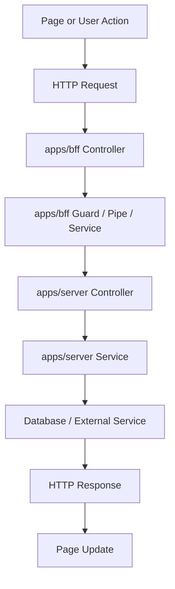
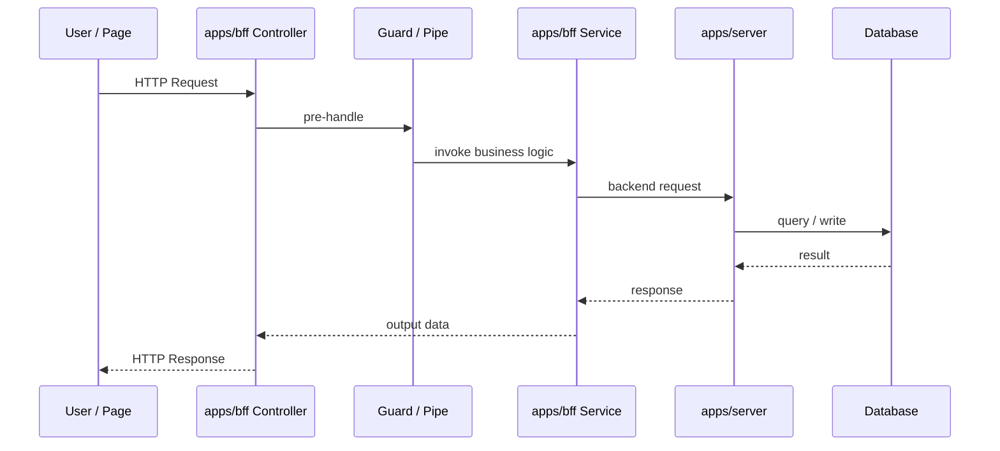
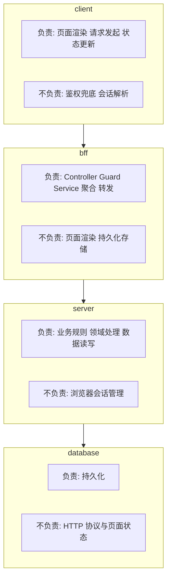
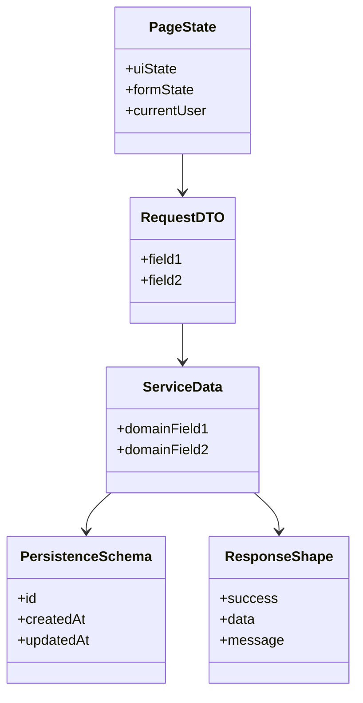
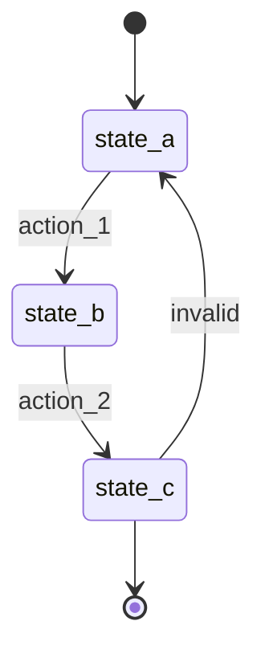
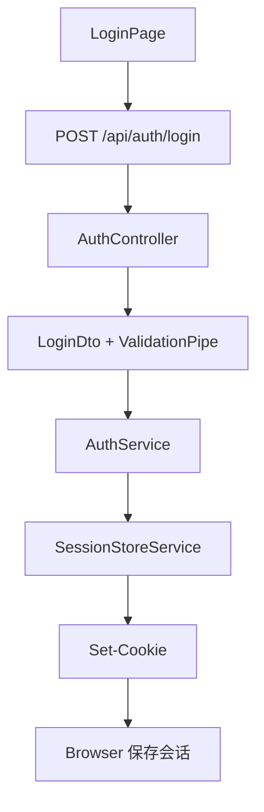

# F1002 Scenario Documentation Checklist

目标：以后每新增一个场景，都按这份 checklist 生成文档。  
重点不是背 API，而是把场景的数据流、系统边界、状态变化、规则兜底梳理清楚。

---

## 1. 每个场景文档必须回答的 8 个问题

- [ ] 这个场景的目标是什么
- [ ] 这个场景的输入数据是什么
- [ ] 这个场景的输出数据是什么
- [ ] 数据经过了哪些层
- [ ] 每一层负责什么，不负责什么
- [ ] 这个场景有哪些状态变化
- [ ] 哪些规则必须由后端兜底
- [ ] 这里实际用到了哪些 NestJS 能力，它们各自解决什么问题

如果这 8 个问题答不完整，这个场景就还没真正梳理清楚。

---

## 2. 每个场景文档必须包含的 4 张图

不是所有图都该用纯 text。  
后续文档里，优先按下面这张对应表选图法：

| 图的类型   | 推荐图法         | 主要用途                                              |
| ---------- | ---------------- | ----------------------------------------------------- |
| 请求流转图 | 流程图 + 时序图  | 流程图看整体路径，时序图看调用先后和参与方交互        |
| 系统分层图 | 流程图或分层框图 | 表达 client / bff / server / database 的边界与职责    |
| 数据结构图 | 类图或 ER 图     | 表达 Page State、DTO、Schema、Response 之间的结构关系 |
| 状态变化图 | 状态图           | 表达可达状态、不可达状态、非法回退                    |

如果一个场景只画了 text 版“箭头串”，通常只够做草稿，不够做正式文档。

### 2.1 请求流转图

必须有。

用途：

- 流程图：看清一次请求从页面到 BFF 再到 backend 的整体路径
- 时序图：看清调用顺序、参与方、返回值和异常出口

推荐做法：

- 至少给 1 张流程图
- 交互明显的场景，再补 1 张时序图

流程图模板：



时序图模板：



### 2.2 系统分层图

必须有。

用途：看清这个场景里 client、bff、server、database 各自负责什么，不负责什么。

推荐做法：

- 如果要强调“边界”和“职责归属”，优先画分层框图
- 如果要强调“跨层数据怎么流”，可以补一张简化流程图

分层框图模板：



### 2.3 数据结构图

必须有。

用途：看清不同层的数据结构有没有混掉。

推荐做法：

- 如果主要是“对象之间的字段关系”，优先用类图
- 如果主要是“表与表之间的关系”，优先用 ER 图

类图模板：



### 2.4 状态变化图

只要场景里有状态变化，就必须有。

用途：看清哪些状态能变，哪些不能变。

推荐做法：

- 用状态图表达合法流转
- 明确标出非法回退、不可达状态和失败出口

模板：



---

## 3. 每个场景文档的固定结构

后续新文档统一按这个顺序写。

### 3.1 场景目标

- [ ] 用户在做什么
- [ ] 系统要完成什么

### 3.2 输入

- [ ] 页面输入数据
- [ ] HTTP 请求结构
- [ ] DTO 结构

### 3.3 输出

- [ ] 成功响应结构
- [ ] 失败响应结构
- [ ] 页面最终状态变化

### 3.4 请求链路

- [ ] 页面到 BFF
- [ ] BFF 到 backend
- [ ] backend 到数据库
- [ ] 响应回到页面

### 3.5 分层职责

- [ ] client 做什么
- [ ] bff 做什么
- [ ] server 做什么
- [ ] database 做什么

### 3.6 数据结构

- [ ] 页面状态结构
- [ ] DTO 结构
- [ ] 业务流转结构
- [ ] 持久化结构
- [ ] 响应结构

### 3.7 状态变化

- [ ] 初始状态
- [ ] 成功状态
- [ ] 失败状态
- [ ] 非法状态变化

### 3.8 规则兜底

- [ ] 参数校验在哪层
- [ ] 权限校验在哪层
- [ ] 业务规则在哪层
- [ ] 错误处理在哪层
- [ ] 审计记录在哪层

### 3.9 NestJS 能力映射

- [ ] Controller 解决什么问题
- [ ] DTO / Pipe 解决什么问题
- [ ] Guard 解决什么问题
- [ ] Service 解决什么问题
- [ ] Interceptor / Filter 解决什么问题
- [ ] Provider / Module 解决什么问题

---

## 4. 你在写场景文档时，优先看的不是 API，而是这 5 个核心面

- [ ] 数据流
- [ ] 分层边界
- [ ] 数据结构
- [ ] 状态变化
- [ ] 规则兜底

如果这 5 个面写清楚了，NestJS 的 API 细节可以随时查；如果这 5 个面没写清楚，代码再多也只是“能跑”，不是“掌握”。

---

## 5. 场景文档的最小模板

以后新增文档，最少包含下面这些块：

```md
# Fxxxx Scene Name

## 1. 场景目标

## 2. 请求流转图

## 3. 系统分层图

## 4. 输入 / 输出

## 5. 数据结构图

## 6. 状态变化图

## 7. 规则兜底

## 8. NestJS 能力映射
```

---

## 6. 登录场景最小示例



这个场景至少要写清楚：

- [ ] 输入：`username`、`password`
- [ ] 输出：成功 user 信息，失败错误结构
- [ ] 分层：页面收集输入，BFF 处理 session，server 未来处理真实认证
- [ ] 状态：未登录 -> 已登录 -> 退出后未登录
- [ ] 规则：参数校验、账号密码校验、错误处理
- [ ] NestJS：Controller、DTO、ValidationPipe、Service、Provider、ExceptionFilter

---

## 7. 后续规范

从现在开始，所有新增场景文档都要遵守这份规范：

- [ ] 有固定结构
- [ ] 有请求流转图
- [ ] 有系统分层图
- [ ] 有数据结构图
- [ ] 有状态变化图
- [ ] 图法要匹配问题，不默认退回成纯 text
- [ ] 不只写 API 名字，要写“这个能力解决什么问题”

---

## 8. 一句话总结

以后你不是在“记场景用了哪些 NestJS API”，而是在“按统一模板拆清一个场景的数据、边界、状态、规则，再把 NestJS 能力映射上去”。
